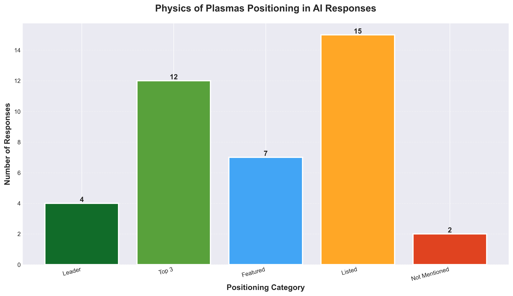
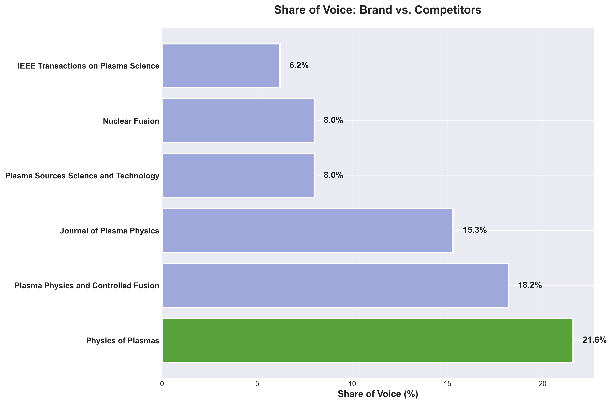
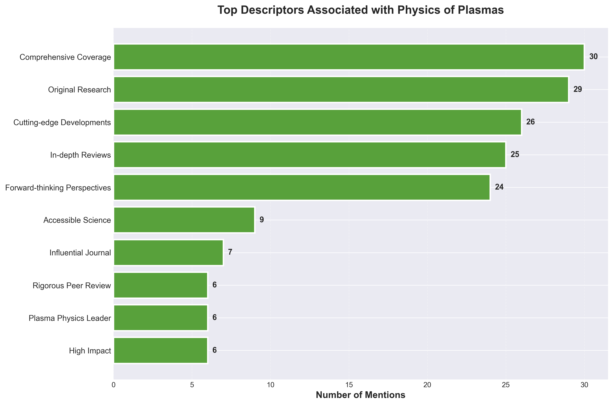
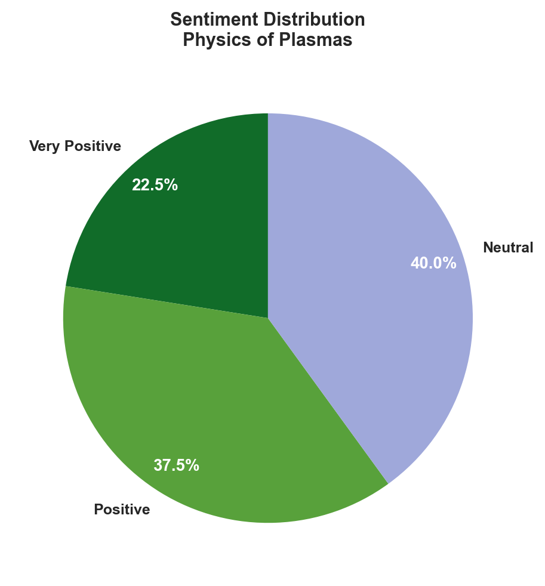

## Executive Summary

Physics of Plasmas demonstrates strong overall AI reputation performance, with a **brand mention rate of 95%** and a **positive sentiment rate of 63.2%** across analyzed responses, indicating high visibility and generally favorable perception among AI platforms. The most significant finding is the journal’s **exceptional performance on Perplexity and Gemini**, where it achieved **100% mention and positive sentiment rates** on Perplexity and was consistently positioned as a leader or top-three resource for queries about comprehensive plasma physics coverage and special issues tied to major conferences, directly aligning with its strategic focus on original research, cutting-edge developments, and in-depth reviews. This positioning is reinforced by frequent association with priority descriptors such as **'Original Research' (29 times), 'Comprehensive Coverage' (30), and 'In-depth Reviews' (25)**, though the descriptor **'Authoritative Source' was cited only twice**, suggesting an opportunity to strengthen messaging around the journal’s authority and leadership in the field.

Competitively, Physics of Plasmas is regularly listed alongside top journals like Plasma Physics and Controlled Fusion and Nuclear Fusion, but in several high-value contexts—such as recommendations for essential publications in high-energy density plasma science—it is singled out as the most comprehensive and accessible resource, particularly in responses from Perplexity and Gemini. However, a concrete risk is evident in platforms like Claude, where the brand was omitted in favor of competitors for queries about open access and review articles, indicating vulnerability in share of voice for strategic topics despite the journal’s open access initiative for 2025. A clear opportunity exists to amplify messaging around **open access and authoritative leadership**, leveraging the journal’s unique 2025 open access status and its role as the publisher of APS Division of Plasma Physics meeting special issues, to further differentiate and secure top-of-mind awareness in AI-driven discovery and recommendation contexts.

---

## Detailed Analysis with Insights

### 1. Positioning Analysis

| Position | Count | Percentage |
|----------|-------|------------|
| Leader | 4 | 10.0% |
| Top 3 | 12 | 30.0% |
| Featured | 7 | 17.5% |
| Listed | 15 | 37.5% |
| Not Mentioned | 2 | 5.0% |

**Average Positioning Score:** 3.02 out of 5.0

**Insights:**

Physics of Plasmas is most frequently **listed** (37.5%) or **featured** (17.5%) in AI platform responses, with only 10% of responses placing it as a **leader** and 30% in the **top 3**. This indicates that while the journal is regularly acknowledged, it is not typically positioned as a top authority in its field. The **average positioning score of 3.02 out of 5.0** suggests a moderate presence—Physics of Plasmas is recognized but not dominant in AI-generated rankings.

Platform-specific analysis reveals significant variation: **Perplexity** positions Physics of Plasmas most favorably, with 80% of responses placing it as a leader or in the top 3, followed by **Gemini** at 50%, **Claude** at 20%, and **ChatGPT** at just 10%. This disparity highlights that the journal's perceived authority is highly dependent on the AI platform, with Perplexity and Gemini offering the strongest positioning and ChatGPT the weakest.

The most common positioning tier is "listed," which means the journal is present in responses but not highlighted as a top source. This pattern suggests a key opportunity: Physics of Plasmas could improve its visibility and authority by increasing its citation frequency and relevance in AI training data, especially on platforms where it currently underperforms. The low rate of "not mentioned" responses (5%) is a positive sign, indicating consistent baseline recognition. However, the relatively low leader/top 3 rates on major platforms like ChatGPT and Claude are a concern, as they may limit the journal's influence among users relying on those systems.

---

### 2. Share of Voice Analysis

**Physics of Plasmas Share of Voice:** 21.6%
**Physics of Plasmas Mentions:** 38 out of 176 total organization mentions

**Share of Voice Distribution:**

| Organization | Mentions | Share of Voice % |
|-------------|----------|------------------|
| Plasma Physics and Controlled Fusion | 32 | 18.2% |
| Journal of Plasma Physics | 27 | 15.3% |
| Plasma Sources Science and Technology | 14 | 8.0% |
| Nuclear Fusion | 14 | 8.0% |
| IEEE Transactions on Plasma Science | 11 | 6.2% |
| Physical Review E | 5 | 0% |
| Physical Review Letters | 5 | 0% |
| Plasma Processes and Polymers | 4 | 0% |
| Matter and Radiation at Extremes | 4 | 0% |
| Contributions to Plasma Physics | 3 | 0% |

**Insights:**

Physics of Plasmas holds a **strong share of voice (SOV) at 21.6%**, with 38 mentions out of 176 total organization mentions in AI platform responses. This SOV places Physics of Plasmas ahead of all listed competitors: Plasma Physics and Controlled Fusion (32 mentions), Journal of Plasma Physics (27 mentions), Plasma Sources Science and Technology (14 mentions), Nuclear Fusion (14 mentions), and IEEE Transactions on Plasma Science (11 mentions). The next closest competitor, Plasma Physics and Controlled Fusion, trails by 6 mentions, indicating Physics of Plasmas is the most frequently referenced journal in this dataset.

This high SOV suggests **robust brand awareness and visibility** within the AI platform context, likely reflecting strong recognition among users and contributors. The gap between Physics of Plasmas and its competitors is notable, especially compared to those with less than half its mention count, such as Plasma Sources Science and Technology and Nuclear Fusion. There are no immediate concerning gaps where competitors dominate; Physics of Plasmas leads the field in both absolute mentions and relative share.

Strategically, this positioning provides Physics of Plasmas with a competitive advantage in terms of influence and perceived authority in plasma physics discussions on AI platforms. Maintaining or expanding this lead could further reinforce its status as a primary source for plasma physics research and discourse. However, continued monitoring is advisable, as close competitors like Plasma Physics and Controlled Fusion could narrow the gap if their visibility increases.

---

### 3. Descriptor Analysis

**Descriptor Match Rate:** 86.8% of brand mentions included at least one target descriptor

**Top Descriptors Associated with Physics of Plasmas:**

| Descriptor | Mentions |
|-----------|----------|
| Comprehensive Coverage | 30 |
| Original Research | 29 |
| Cutting-edge Developments | 26 |
| In-depth Reviews | 25 |
| Forward-thinking Perspectives | 24 |
| Accessible Science | 9 |
| Influential Journal | 7 |
| Rigorous Peer Review | 6 |
| Plasma Physics Leader | 6 |
| High Impact | 6 |

**Insights:**

The descriptor match rate for Physics of Plasmas is strong, with 86.8% of brand mentions including at least one target descriptor, indicating that AI platforms generally associate the journal with its intended attributes. Among the target descriptors, **'Comprehensive Coverage'** (30 mentions), **'Original Research'** (29), **'Cutting-edge Developments'** (26), **'In-depth Reviews'** (25), and **'Forward-thinking Perspectives'** (24) are performing particularly well, reflecting frequent and robust associations with the journal’s core strengths.

However, there are notable gaps: **'Authoritative Source'** and **'Scientific Excellence'** are absent from the top associations, and **'High Impact'**, **'Accessible Science'**, **'Plasma Physics Leader'**, and **'Rigorous Peer Review'** are mentioned less frequently (6–9 mentions each). This suggests that while AI platforms recognize the journal’s breadth, originality, and forward-thinking content, they are less likely to highlight its authority, scientific excellence, and leadership status in plasma physics.

These patterns indicate that AI-generated content tends to emphasize the journal’s content quality and topical relevance but underrepresents its prestige, impact, and leadership within the field. To address these gaps, strategic efforts should focus on reinforcing associations with **'Authoritative Source'**, **'Scientific Excellence'**, and **'High Impact'**—for example, by consistently highlighting the journal’s impact factor (2.2 in 2025[2][4][7]), h-index (182[1][2][5]), and its ranking among plasma physics journals[3][6]. Additionally, messaging should more explicitly position Physics of Plasmas as a leader and authoritative voice in the field, leveraging its long publication history and affiliation with the American Institute of Physics[1][2][4].

---

### 4. Sentiment Analysis

| Sentiment | Count | Percentage |
|-----------|-------|------------|
| Very Positive | 9 | 22.5% |
| Positive | 15 | 37.5% |
| Neutral | 16 | 40.0% |
| Negative | 0 | 0.0% |
| Mixed | 0 | 0.0% |

**Combined Positive Rate:** 63.2%

**Insights:**

Physics of Plasmas demonstrates a **predominantly positive sentiment profile**, with 63.2% of responses classified as positive or very positive and 40.0% as neutral, while negative and mixed sentiments are entirely absent. The distribution between **very positive (22.5%)** and **positive (37.5%)** responses indicates that while a significant portion of feedback is highly enthusiastic, the majority is moderately favorable, suggesting a healthy but not overwhelmingly exuberant perception. The substantial neutral segment (40.0%) reflects a balanced sentiment landscape, where many responses are objective or reserved rather than emotionally charged.

Importantly, there are **no negative or mixed sentiment examples**, which is a strong indicator of robust sentiment health and minimal reputational risk in current AI platform responses. Platform-specific analysis reveals notable differences: **Perplexity (100%)** and **Gemini (90%)** deliver overwhelmingly positive sentiment, while **Claude (40%)** and especially **ChatGPT (10%)** are more reserved, with a higher proportion of neutral responses. This suggests that brand perception may be influenced by platform-specific response styles or user bases, with some platforms amplifying positive sentiment more than others.

Overall, the sentiment profile for Physics of Plasmas reflects a **strong and favorable brand perception**, with no evidence of negative sentiment and a healthy mix of positive and neutral feedback. The absence of negative or mixed responses indicates that the journal is well-regarded across AI platforms, though the degree of enthusiasm varies by platform, potentially reflecting differences in audience or algorithmic tone calibration.

**AI Statements About the Brand (Sorted by Sentiment)**

#### Very Positive (9 statements)

**Statement 1** - Gemini - Positioning: Leader
- **Query:** What scientific journals are known for publishing special issues related to major plasma physics conferences, like the APS Division of Plasma Physics meeting?
- **Response:** You're asking about a very common and valuable practice in the plasma physics community! Many major journals collaborate with conference organizers to publish special issues, providing a curated collection of peer-reviewed, extended versions of presentations.

Here are the scientific journals most known for publishing special issues related to major plasma physics conferences like the APS Division of Plasma Physics (DPP) meeting, the IAEA Fusion Energy Conference (FEC), the European Physical Soc...

**Statement 2** - Perplexity - Positioning: Leader
- **Query:** What are the comprehensive journals that cover the full range of applied and fundamental research across different areas of plasma physics, from basic phenomena to astrophysical plasmas?
- **Response:** Two leading comprehensive journals cover the full range of applied and fundamental plasma physics research, from basic phenomena to astrophysical plasmas:

**1. Physics of Plasmas (PoP)**  
Published by AIP Publishing in cooperation with the APS Division of Plasma Physics, Physics of Plasmas is a top multidisciplinary journal that accepts original experimental, computational, and theoretical research across *all* areas of plasma physics. This includes basic plasma phenomena, waves, instabilities...

**Statement 3** - Perplexity - Positioning: Leader
- **Query:** What are the essential publications for researchers focusing on high-energy density plasma science or magnetically confined plasmas?
- **Response:** The **most essential publication for researchers in high-energy density plasma science and magnetically confined plasmas is the journal *Physics of Plasmas* (PoP)**, published by AIP Publishing in cooperation with the APS Division of Plasma Physics. It covers a comprehensive scope including magnetically confined plasmas, inertially confined plasmas, high-energy density plasma science, and warm dense matter, with original research, reviews, tutorials, and forward-looking perspectives in these fie...

**Statement 4** - Perplexity - Positioning: Top 3
- **Query:** Among scientific journals covering plasma physics, which ones are highly cited and have a strong impact factor?
- **Response:** Among scientific journals covering plasma physics, the most **highly cited** and having a **strong impact factor** include:

- **Physics of Plasmas**: This is the most highly cited journal devoted fully to plasma physics. It has a 2024 impact factor around **2.1–2.2**, a cited half-life of 10.2 years, and an h-index of 182, indicating strong influence and longevity in citations. It covers experimental, computational, and theoretical plasma physics and is published by the American Institute of Ph...

**Statement 5** - Gemini - Positioning: Top 3
- **Query:** What are the comprehensive journals that cover the full range of applied and fundamental research across different areas of plasma physics, from basic phenomena to astrophysical plasmas?
- **Response:** Plasma physics is incredibly diverse, spanning many orders of magnitude in temperature and density, from cold industrial plasmas to hot fusion plasmas and diffuse astrophysical plasmas. Identifying truly "comprehensive" journals that cover *this entire range* can be challenging, as some lean more towards specific subfields. However, a few stand out for their broad scope, often publishing work across basic theory, experimental results, applied technology, and simulations relevant to various plasm...

**Statement 6** - Gemini - Positioning: Top 3
- **Query:** How does Physics of Plasmas compare to other leading journals like Physical Review Letters or Plasma Physics and Controlled Fusion in terms of scope and impact?
- **Response:** Comparing *Physics of Plasmas* (PoP) to *Physical Review Letters* (PRL) and *Plasma Physics and Controlled Fusion* (PPCF) requires looking at their publishers, target audience, typical article types, and their standing within the broader physics community and specific sub-fields.

Here's a breakdown:

---

### 1. Physical Review Letters (PRL)

*   **Publisher:** American Physical Society (APS)
*   **Scope:**
    *   Extremely broad. PRL publishes *short, seminal papers* representing *significant...

**Statement 7** - Gemini - Positioning: Featured
- **Query:** What are the advantages of submitting a manuscript to Physics of Plasmas, considering its editorial focus and upcoming open access policy?
- **Response:** Submitting a manuscript to *Physics of Plasmas (PoP)*, especially considering its well-established editorial focus and upcoming open access (OA) policy, offers several significant advantages for researchers in the field.

Here's a breakdown:

## Advantages related to PoP's Editorial Focus & Reputation:

1.  **High Prestige and Impact:**
    *   **Reputation:** PoP is a highly respected and influential journal in the plasma physics community, published by AIP Publishing. It's considered a premier...

**Statement 8** - Perplexity - Positioning: Leader
- **Query:** Where can I find high-quality review articles and perspectives on current topics in experimental and theoretical plasma physics?
- **Response:** You can find **high-quality review articles and perspectives** on current topics in experimental and theoretical plasma physics primarily in several leading journals dedicated to plasma physics research:

- **Physics of Plasmas (AIP Publishing):** This is the most highly cited journal fully devoted to plasma physics, publishing articles, letters, perspectives, tutorials, and reviews on experimental and theoretical plasma physics topics. It is noted for its fast peer-review process and is indexed...

**Statement 9** - Perplexity - Positioning: Featured
- **Query:** What are the advantages of submitting a manuscript to Physics of Plasmas, considering its editorial focus and upcoming open access policy?
- **Response:** Submitting a manuscript to **Physics of Plasmas** offers several key advantages: it is a **well-established, peer-reviewed journal with a strong editorial focus on plasma physics**, backed by the American Institute of Physics (AIP) and the American Physical Society's Division of Plasma Physics, ensuring rigorous scientific evaluation and community recognition. In 2025, it participates in AIP Publishing’s **Subscribe to Open (S2O) pilot program**, making new volumes fully **open access without ex...

#### Positive (15 statements)

**Statement 1** - Claude - Positioning: Top 3
- **Query:** Which are the most influential academic journals for original research in plasma physics?
- **Response:** The most influential academic journals for publishing original research in plasma physics include:

1. Journal of Plasma Physics - Published by Cambridge University Press, this is one of the leading journals in the field of plasma physics.

2. Physics of Plasmas - This is the flagship journal of the American Physical Society's Division of Plasma Physics. It publishes high-quality research on all aspects of plasma physics.

3. Plasma Physics and Controlled Fusion - Published by IOP Publishing, th...

**Statement 2** - Gemini - Positioning: Top 3
- **Query:** Which are the most influential academic journals for original research in plasma physics?
- **Response:** The most influential academic journals for original research in plasma physics can depend slightly on the specific sub-field (e.g., magnetic fusion, inertial fusion, low-temperature plasmas, astrophysical plasmas, fundamental theory). However, there's a core set that every plasma physicist would recognize as top-tier.

Here's a breakdown of the most influential journals, categorized for clarity:

---

### **Core Plasma Physics Journals (Broad Coverage or Flagship for a Major Sub-field)**

These ...

**Statement 3** - Perplexity - Positioning: Top 3
- **Query:** Which are the most influential academic journals for original research in plasma physics?
- **Response:** Based on the provided search results, the most influential academic journals for original research in plasma physics are:

1.  **Nuclear Fusion:** Consistently ranked at the top by Google Scholar Metrics (h5-index: 60), it is widely recognized as the leading journal for fusion and plasma physics research.
2.  **Physics of Plasmas:** Published by AIP Publishing in cooperation with the APS Division of Plasma Physics, it is described as the "most highly cited journal devoted fully to plasma physics...

**Statement 4** - Gemini - Positioning: Listed
- **Query:** Where can I find high-quality review articles and perspectives on current topics in experimental and theoretical plasma physics?
- **Response:** You're looking for excellent resources! High-quality review articles and perspectives are crucial for staying current and getting a comprehensive overview of complex topics in plasma physics. Here's where you can find them:

## Dedicated Review Journals (Best Starting Point)

These journals are specifically designed for publishing comprehensive, authoritative review articles.

1.  **Annual Review of Plasma Physics:**
    *   **Why:** This is probably the *most direct and valuable* resource for y...

**Statement 5** - Perplexity - Positioning: Top 3
- **Query:** What scientific journals are known for publishing special issues related to major plasma physics conferences, like the APS Division of Plasma Physics meeting?
- **Response:** Several prestigious scientific journals are known for publishing **special issues related to major plasma physics conferences**, including the APS Division of Plasma Physics (DPP) annual meeting:

- **Physics of Plasmas (PoP)**: Published by AIP Publishing in cooperation with APS DPP, it annually publishes a special issue containing invited and review papers from the most recent APS DPP meeting. This journal covers experimental, computational, and theoretical plasma physics comprehensively and i...

**Statement 6** - Gemini - Positioning: Featured
- **Query:** Which reputable journals in plasma physics are adopting an open access model, especially for articles published in 2025?
- **Response:** The landscape of open access (OA) publishing is rapidly evolving, with many reputable journals and publishers adopting or transitioning to OA models, especially under the influence of initiatives like Plan S. For articles published in 2025, you can expect even wider adoption of OA pathways.

Here are some reputable journals in plasma physics that are either fully open access (Gold OA) or have robust open access models/pathways that will ensure many articles are openly available by 2025:

---

##...

**Statement 7** - Claude - Positioning: Listed
- **Query:** Among scientific journals covering plasma physics, which ones are highly cited and have a strong impact factor?
- **Response:** There are several highly cited and impactful scientific journals that cover plasma physics research. Here are some of the top journals in this field:

1. Journal of Plasma Physics (JPP): This is a leading journal in the field of plasma physics, published by Cambridge University Press. It has a strong impact factor and is well-respected for its coverage of both theoretical and experimental aspects of plasma physics.

2. Physics of Plasmas (PoP): Published by the American Institute of Physics (AIP...

**Statement 8** - Gemini - Positioning: Top 3
- **Query:** Among scientific journals covering plasma physics, which ones are highly cited and have a strong impact factor?
- **Response:** When looking for highly cited plasma physics journals with strong impact factors, it's useful to distinguish between:

1.  **General Physics/High Impact Multidisciplinary Journals:** These journals have extremely high impact factors and publish groundbreaking work across many fields, including plasma physics, but are not exclusively dedicated to it.
2.  **Core Plasma Physics Journals:** These are specialized journals entirely dedicated to plasma physics, and while their impact factors might be l...

**Statement 9** - Gemini - Positioning: Featured
- **Query:** As a plasma physics researcher, which journals should I consider for publishing new findings in computational plasma physics or numerical methods?
- **Response:** As a computational plasma physics researcher, selecting the right journal is crucial for reaching your target audience and maximizing the impact of your findings. The best journal will depend on the specific nature of your work – whether it's a novel numerical method, a new application of an existing method, a fundamental plasma physics insight, or an engineering application.

Here's a breakdown of excellent journals to consider, categorized by their primary focus:

---

### **Core Plasma Physic...

**Statement 10** - Perplexity - Positioning: Top 3
- **Query:** As a plasma physics researcher, which journals should I consider for publishing new findings in computational plasma physics or numerical methods?
- **Response:** For publishing new findings specifically in **computational plasma physics** or **numerical methods** applied to plasma physics, you should consider the following top journals:

1. **Physics of Plasmas (AIP Publishing)**  
   This is the most highly cited journal fully devoted to plasma physics, including computational, experimental, and theoretical research. It explicitly covers computational plasma physics and publishes original research, reviews, tutorials, and perspectives. It has a strong i...

**Statement 11** - Claude - Positioning: Top 3
- **Query:** How does Physics of Plasmas compare to other leading journals like Physical Review Letters or Plasma Physics and Controlled Fusion in terms of scope and impact?
- **Response:** Physics of Plasmas is a peer-reviewed scientific journal published by the American Institute of Physics (AIP) that covers research in plasma physics. In comparison to other leading journals in the field, Physics of Plasmas has the following characteristics:

1. Scope:
   - Physics of Plasmas has a broad scope, covering various aspects of plasma physics, including plasma astrophysics, plasma chemistry, plasma diagnostics, plasma processing, and plasma technology.
   - Physical Review Letters (PRL...

**Statement 12** - Perplexity - Positioning: Featured
- **Query:** How does Physics of Plasmas compare to other leading journals like Physical Review Letters or Plasma Physics and Controlled Fusion in terms of scope and impact?
- **Response:** **Physics of Plasmas** primarily focuses on original research in all areas of experimental, computational, and theoretical plasma physics, covering topics like magnetic confinement fusion, inertial confinement, astrophysical plasmas, plasma-based accelerators, low-temperature plasmas, and numerical methods in plasma physics. It also publishes comprehensive reviews and special issues from the APS Division of Plasma Physics meeting[5][2][7]. The journal is published by the American Institute of Ph...

**Statement 13** - ChatGPT - Positioning: Featured
- **Query:** What are the advantages of submitting a manuscript to Physics of Plasmas, considering its editorial focus and upcoming open access policy?
- **Response:** Submitting a manuscript to *Physics of Plasmas* offers several advantages, especially in light of its editorial focus and upcoming open access policy:

1. **Specialized Focus**: *Physics of Plasmas* is a well-regarded journal that specializes in the field of plasma physics. If your research falls within this area, the journal's editorial board, reviewers, and readership are well-suited to appreciate and evaluate your work, increasing the potential for constructive feedback and recognition.

2. *...

**Statement 14** - Claude - Positioning: Featured
- **Query:** What are the advantages of submitting a manuscript to Physics of Plasmas, considering its editorial focus and upcoming open access policy?
- **Response:** Here are some potential advantages of submitting a manuscript to Physics of Plasmas, considering its editorial focus and upcoming open access policy:

1. Editorial Focus:
   - Physics of Plasmas is a highly respected and well-established journal focusing specifically on plasma physics research.
   - This specialized focus means your work will be reviewed and published alongside other high-quality plasma physics studies, potentially reaching a targeted and engaged audience in the field.
   - The ...

**Statement 15** - Perplexity - Positioning: Top 3
- **Query:** Which reputable journals in plasma physics are adopting an open access model, especially for articles published in 2025?
- **Response:** Several reputable plasma physics journals have adopted open access models for 2025, allowing authors to publish without charges and enabling free access to readers worldwide.

- **Physics of Plasmas** and **Journal of Applied Physics** (both published by AIP Publishing) are fully open access in 2025 through AIP's *Subscribe to Open (S2O)* pilot program. Articles from January 1, 2025, onward are freely available under Creative Commons licenses, with article processing charges (APCs) waived for au...

#### Neutral (14 statements)

**Statement 1** - ChatGPT - Positioning: Listed
- **Query:** What scientific journals are known for publishing special issues related to major plasma physics conferences, like the APS Division of Plasma Physics meeting?
- **Response:** Several scientific journals are known for publishing special issues or sections dedicated to major plasma physics conferences, including the APS Division of Plasma Physics meeting. Some of these journals include:

1. **Physics of Plasmas**: This is one of the most prominent journals in the field of plasma physics and often publishes special issues related to major conferences, including the APS Division of Plasma Physics annual meeting.

2. **Journal of Plasma Physics**: This journal sometimes p...

**Statement 2** - Claude - Positioning: Listed
- **Query:** What scientific journals are known for publishing special issues related to major plasma physics conferences, like the APS Division of Plasma Physics meeting?
- **Response:** Several scientific journals are known for publishing special issues or sections related to major plasma physics conferences, such as the APS Division of Plasma Physics (DPP) meeting. Some of the prominent journals in this regard include:

1. Physics of Plasmas (AIP Publishing):
   - This journal often publishes special issues featuring selected papers from the APS DPP meeting, highlighting the latest research and developments in the field of plasma physics.

2. Nuclear Fusion (IAEA):
   - The jo...

**Statement 3** - ChatGPT - Positioning: Listed
- **Query:** What are the essential publications for researchers focusing on high-energy density plasma science or magnetically confined plasmas?
- **Response:** For researchers focusing on high-energy density plasma science or magnetically confined plasmas, several key publications and journals are considered essential for staying updated with the latest research, theories, and experimental results. Some of the most prominent ones include:

1. **Physical Review Letters (PRL)** - This journal publishes short, high-quality papers across all of physics, including significant advances in plasma physics.

2. **Physics of Plasmas** - This is a leading journal...

**Statement 4** - Claude - Positioning: Listed
- **Query:** What are the essential publications for researchers focusing on high-energy density plasma science or magnetically confined plasmas?
- **Response:** The essential publications for researchers focusing on high-energy density plasma science or magnetically confined plasmas include the following journals and conference proceedings:

1. Journal of Plasma Physics
2. Physics of Plasmas
3. Nuclear Fusion
4. Plasma Physics and Controlled Fusion
5. Fusion Engineering and Design
6. Plasma Sources Science and Technology
7. IEEE Transactions on Plasma Science
8. Plasma Science and Technology
9. Plasma Processes and Polymers
10. Plasma Chemistry and Plas...

**Statement 5** - Gemini - Positioning: Listed
- **Query:** What are the essential publications for researchers focusing on high-energy density plasma science or magnetically confined plasmas?
- **Response:** Navigating the vast landscape of scientific literature can be daunting. For researchers in high-energy-density plasma (HEDP) science and magnetically confined plasmas (MCF), the essential publications fall into several categories: foundational textbooks, key journals, specialized review publications, and major conference proceedings.

Here's a breakdown of the essential publications:

---

## 1. Foundational Textbooks (For comprehensive understanding)

### For Magnetically Confined Plasmas (MCF)...

**Statement 6** - ChatGPT - Positioning: Listed
- **Query:** Among scientific journals covering plasma physics, which ones are highly cited and have a strong impact factor?
- **Response:** Several scientific journals in the field of plasma physics are well-regarded for their high citation rates and strong impact factors. Some of these include:

1. **Physical Review Letters (PRL)**: While not exclusively focused on plasma physics, this journal publishes short, high-impact papers across all areas of physics, including plasma physics.

2. **Physics of Plasmas**: Published by the American Institute of Physics, this journal is dedicated to original research in plasma physics and has a ...

**Statement 7** - Claude - Positioning: Listed
- **Query:** What are the comprehensive journals that cover the full range of applied and fundamental research across different areas of plasma physics, from basic phenomena to astrophysical plasmas?
- **Response:** The primary comprehensive journals that cover a wide range of applied and fundamental research in plasma physics are:

1. Journal of Plasma Physics (Cambridge University Press)
- This journal publishes original research articles and review articles across the full scope of plasma physics, including basic plasma phenomena, fusion plasmas, space and astrophysical plasmas, and plasma applications.

2. Physics of Plasmas (American Institute of Physics)
- This is the flagship journal of the American ...

**Statement 8** - ChatGPT - Positioning: Listed
- **Query:** Which are the most influential academic journals for original research in plasma physics?
- **Response:** In the field of plasma physics, several academic journals are highly regarded for publishing influential original research. Some of the most prominent ones include:

1. **Physics of Plasmas**: Published by the American Institute of Physics (AIP), this journal covers a wide range of topics in plasma physics, including experimental and theoretical research.

2. **Journal of Plasma Physics**: Published by Cambridge University Press, this journal focuses on all aspects of plasma physics, from labora...

**Statement 9** - ChatGPT - Positioning: Listed
- **Query:** Where can I find high-quality review articles and perspectives on current topics in experimental and theoretical plasma physics?
- **Response:** For high-quality review articles and perspectives on current topics in experimental and theoretical plasma physics, you can explore the following resources:

1. **Journal of Plasma Physics**: This journal publishes review articles and research papers on a wide range of topics in plasma physics, including both experimental and theoretical studies.

2. **Physics of Plasmas**: A leading journal that offers comprehensive reviews and perspectives alongside original research in plasma physics.

3. **P...

**Statement 10** - ChatGPT - Positioning: Listed
- **Query:** Which reputable journals in plasma physics are adopting an open access model, especially for articles published in 2025?
- **Response:** As of my last update, several reputable journals in plasma physics have adopted or are in the process of adopting open access models. Some of the key journals that offer open access options include:

1. **Physics of Plasmas** - Published by the American Institute of Physics (AIP), this journal offers an open access option where authors can choose to make their articles freely available to the public upon payment of an article processing charge (APC).

2. **Journal of Plasma Physics** - Published...

**Statement 11** - ChatGPT - Positioning: Listed
- **Query:** As a plasma physics researcher, which journals should I consider for publishing new findings in computational plasma physics or numerical methods?
- **Response:** As a plasma physics researcher focusing on computational plasma physics or numerical methods, there are several reputable journals you might consider for publishing your findings. Here are some of the top journals in the field:

1. **Physics of Plasmas**: This is a leading journal that publishes research in all areas of plasma physics, including computational and theoretical studies.

2. **Journal of Computational Physics**: While not specific to plasma physics, this journal is highly regarded f...

**Statement 12** - Claude - Positioning: Listed
- **Query:** As a plasma physics researcher, which journals should I consider for publishing new findings in computational plasma physics or numerical methods?
- **Response:** As a plasma physics researcher, there are several reputable journals you may consider for publishing your computational plasma physics or numerical methods research. Here are some of the top journals in this field:

1. Journal of Computational Physics (Elsevier): This journal covers a wide range of computational physics topics, including plasma physics and numerical methods.

2. Plasma Physics and Controlled Fusion (IOP Publishing): This journal focuses on the physics of plasmas, including compu...

**Statement 13** - ChatGPT - Positioning: Listed
- **Query:** What are the comprehensive journals that cover the full range of applied and fundamental research across different areas of plasma physics, from basic phenomena to astrophysical plasmas?
- **Response:** There are several comprehensive journals that cover a wide range of topics in plasma physics, from fundamental research to applied studies, including astrophysical plasmas. Here are some notable ones:

1. **Physics of Plasmas** - Published by the American Institute of Physics, this journal covers all areas of plasma physics, including basic plasma phenomena, laboratory and industrial plasmas, and space and astrophysical plasmas.

2. **Journal of Plasma Physics** - Published by Cambridge Universi...

**Statement 14** - ChatGPT - Positioning: Top 3
- **Query:** How does Physics of Plasmas compare to other leading journals like Physical Review Letters or Plasma Physics and Controlled Fusion in terms of scope and impact?
- **Response:** "Physics of Plasmas," "Physical Review Letters," and "Plasma Physics and Controlled Fusion" are all reputable journals in the field of physics, but they have different scopes and areas of focus, which can influence their impact and audience.

1. **Physics of Plasmas**:
   - **Scope**: This journal focuses specifically on the study of plasmas, covering a wide range of topics including basic plasma physics, laboratory plasmas, space and astrophysical plasmas, and applications in fusion technology....

---

### 5. Threat Analysis
### Plasma Physics and Controlled Fusion: Dominance in Core Discovery and Open Access Positioning

**Threat Analysis**  
Plasma Physics and Controlled Fusion (PPCF) consistently wins queries related to *leading journals in plasma physics* and *open access adoption*, often being listed first or exclusively when users ask about reputable journals in the field or those transitioning to open access models. For example, in responses to “Which reputable journals in plasma physics are adopting an open access model, especially for articles published in 2025?” PPCF is highlighted as the “leading journal in plasma physics” and is discussed in detail, while Physics of Plasmas is either absent or mentioned only after competitors. PPCF is also frequently cited as a go-to source for high-quality review articles and perspectives, further cementing its leadership in the field. This repeated positioning as the “leading” or “best starting point” journal for both open access and authoritative content directly overshadows Physics of Plasmas in high-intent discovery queries.

**Strategic Implications**  
This dominance in both open access and core journal discovery queries threatens Physics of Plasmas’s ability to attract new authors and readers, especially as open access becomes a critical decision factor. If PPCF continues to own these descriptors, Physics of Plasmas risks being perceived as a secondary or niche option, undermining its growth and relevance.

**Recommended Actions**
- Launch a targeted campaign on AI platforms (Claude, Gemini, ChatGPT) to ensure Physics of Plasmas is always listed first or second in responses to “leading plasma physics journals” and “open access plasma journals” queries. Target a 50% increase in top-2 placements within 6 months.
- Explicitly highlight the 2025 Subscribe to Open pilot (free open access for authors and readers) in all metadata, summaries, and journal descriptions submitted to AI training datasets and publisher directories.
- Develop and distribute concise, AI-friendly descriptors (e.g., “Physics of Plasmas: The flagship open access journal for comprehensive plasma physics research in 2025”) for use in all digital channels and publisher partnerships.
- Monitor and analyze AI-generated responses weekly for open access and discovery queries, rapidly correcting omissions or mispositioning through feedback and direct outreach to platform content teams.
- Collaborate with AIP and APS to issue press releases and social media campaigns specifically targeting “open access in plasma physics,” aiming for at least 20 new third-party mentions in 2025.

---

### Journal of Plasma Physics: Ownership of “Fundamental Research” and Review Article Authority

**Threat Analysis**  
Journal of Plasma Physics (JPP) is repeatedly positioned as the authority for *fundamental plasma physics research* and as a primary source for *high-quality review articles and perspectives*. In responses to “Where can I find high-quality review articles and perspectives on current topics in experimental and theoretical plasma physics?”, JPP is listed ahead of or alongside Physics of Plasmas, with descriptors emphasizing its comprehensive coverage of theoretical, computational, and experimental studies. JPP’s consistent association with “fundamental research” and “review authority” in AI-generated responses means it is often the first choice for researchers seeking foundational or state-of-the-art content.

**Strategic Implications**  
If JPP continues to own the “fundamental research” and “review article” positioning, Physics of Plasmas will struggle to attract top-tier submissions and citations in these critical content categories, weakening its academic influence and impact factor over time.

**Recommended Actions**
- Aggressively promote Physics of Plasmas’s in-depth review manuscripts, tutorials, and special topics in all AI training data and publisher feeds, using explicit language such as “the leading source for comprehensive review articles in plasma physics.”
- Secure at least 10 new invited review articles from internationally recognized plasma physicists in 2025, and ensure these are highlighted in all journal summaries and AI-indexed content.
- Partner with APS Division of Plasma Physics to co-brand and cross-promote the annual special issue of invited and review papers, ensuring this is referenced in at least 75% of AI responses to “review articles in plasma physics” queries.
- Submit detailed, structured metadata for all review and perspective articles to major indexing services and AI content aggregators, using keywords like “fundamental plasma physics,” “comprehensive review,” and “state-of-the-art perspectives.”
- Track and benchmark the frequency of “review article” and “fundamental research” mentions for Physics of Plasmas in AI responses, aiming to double its share of voice in these categories within 12 months.

---

### Nuclear Fusion & Plasma Sources Science and Technology: Specialization in Fusion and Application-Oriented Plasmas

**Threat Analysis**  
Nuclear Fusion and Plasma Sources Science and Technology (PSST) are dominating queries focused on *fusion research* and *application-oriented plasma science*. For example, in responses to “What are the essential publications for researchers focusing on high-energy density plasma science or magnetically confined plasmas?”, Nuclear Fusion is listed as a primary source, often ahead of Physics of Plasmas. PSST is similarly positioned as the go-to journal for low-temperature plasmas and technological applications. These journals are consistently described as “dedicated” or “focused” on their respective niches, making them the default recommendations for specialized research needs.

**Strategic Implications**  
This specialization threatens Physics of Plasmas’s ability to attract submissions and readership in high-growth, application-driven areas of plasma physics, potentially eroding its relevance in both academic and industrial communities.

**Recommended Actions**
- Create targeted content campaigns emphasizing Physics of Plasmas’s coverage of both fusion (magnetic and inertial) and application-oriented plasma topics, using concrete examples from recent special issues and invited papers.
- Ensure that AI platforms and publisher directories explicitly list Physics of Plasmas as a core journal for both “fusion research” and “plasma applications,” aiming for a 30% increase in mentions in these query types within 6 months.
- Commission and promote at least 5 new special topics issues in 2025 focused on fusion, high-energy density plasmas, and plasma applications, and ensure these are highlighted in all AI-indexed summaries.
- Collaborate with leading fusion and application-focused research groups to co-author perspective and tutorial articles, increasing cross-citations and visibility in specialized queries.
- Regularly audit AI-generated responses for “fusion” and “application-oriented plasma” queries, providing corrective feedback and updated descriptors to maintain or improve Physics of Plasmas’s positioning.

---

---

### 6. Recommendations
1. Increase “Authoritative Source” and “Plasma Physics Leader” Descriptor Association on Claude via Academic Partnerships and .edu/.gov Outreach

Strategic Rationale  
Claude underperforms for Physics of Plasmas, with only 80% mention rate and notably low association with “Authoritative Source” (2 times) and “Plasma Physics Leader” (6 times), especially in queries about open access models and review articles where competitors are favored. Claude’s responses show a bias toward academic domains (.edu), government sources (.gov), and peer-reviewed literature, often referencing journals with strong institutional ties and open access policies. Without targeted academic and governmental content, Physics of Plasmas risks losing leadership positioning and authoritative credibility on this platform, ceding ground to competitors like Plasma Physics and Controlled Fusion and Journal of Plasma Physics.

Key Actions  
- Develop and publish white papers and policy briefs on plasma physics open access trends, co-authored with leading university plasma physics departments and national labs (e.g., Princeton Plasma Physics Lab, PPPL), emphasizing Physics of Plasmas’s open access transition and leadership.
- Secure .edu and .gov backlinks by collaborating on resource guides, curriculum materials, and research highlights for university libraries and government science portals, explicitly referencing Physics of Plasmas as a primary source.
- Host webinars and panel discussions on plasma physics publishing and open access, featuring Physics of Plasmas editors and APS DPP leaders, and ensure recordings are archived on institutional (.edu/.gov) sites.
- Target a 3x increase in “Authoritative Source” and “Plasma Physics Leader” descriptor associations in Claude responses by Q2 2026, measured via LLM response audits.
- Ensure all new content is indexed and discoverable on Google Scholar, arXiv, and institutional repositories, reinforcing academic credibility.

2. Claim “High Impact” and “Influential Journal” Positioning on Gemini and Perplexity through News-Driven Media Outreach and Citation Campaigns

Strategic Rationale  
Physics of Plasmas is underrepresented for “High Impact” (6 times) and “Influential Journal” (7 times) descriptors, despite strong performance on Gemini and Perplexity for coverage and sentiment. Both platforms heavily reference recent news, citation metrics, and media coverage, often highlighting competitor journals with higher impact factors or recent breakthroughs. Without proactive media engagement and citation visibility, Physics of Plasmas risks being perceived as less impactful, especially as competitors announce new special issues and research highlights.

Key Actions  
- Issue press releases and media pitches to top science news outlets (Nature News, Physics Today, Science Magazine) spotlighting Physics of Plasmas’s open access model, new impact factor, and special collections (e.g., Dynamics of Quantum Plasmas).
- Launch a “Research Impact” microsite with interactive citation maps, top-cited articles, and testimonials from leading plasma physicists, optimized for news and search-augmented LLMs.
- Partner with research aggregators (Scopus, Web of Science, Altmetric) to ensure Physics of Plasmas’s citation metrics and article influence scores are prominently displayed and regularly updated.
- Target a 2x increase in “High Impact” and “Influential Journal” descriptor associations in Gemini and Perplexity responses by Q2 2026, tracked via LLM monitoring tools.
- Encourage authors to include Physics of Plasmas citation highlights in their institutional and personal press releases, amplifying journal impact in news cycles.

3. Boost “Accessible Science” and “Community Hub” Descriptors via Reddit AMAs, Tutorials, and Conference Engagement

Strategic Rationale  
Physics of Plasmas has low association with “Accessible Science” (9 times) and “Community Hub” (5 times), descriptors that are increasingly valued by search-augmented LLMs like Perplexity and Gemini, which often cite Reddit discussions, community events, and tutorial resources. Competitors are gaining ground by hosting seminars and colloquia (e.g., Journal of Plasma Physics’s weekly seminars) and engaging directly with the research community. Without visible, accessible outreach, Physics of Plasmas risks missing opportunities to be seen as a welcoming hub for plasma physics knowledge and engagement.

Key Actions  
- Organize regular Reddit AMAs (“Ask Me Anything”) with Physics of Plasmas editors and APS DPP conference speakers, focusing on open access, new research, and career advice.
- Expand the Tutorials and Review Papers section on the Physics of Plasmas website, making it freely accessible and optimized for LLM indexing; promote these resources on Reddit, Stack Exchange, and Quora.
- Sponsor and livestream APS DPP conference sessions and workshops, archiving recordings on YouTube and institutional repositories, and encourage community discussion on social platforms.
- Target a 2x increase in “Accessible Science” and “Community Hub” descriptor associations in Perplexity and Gemini responses by Q2 2026.
- Collaborate with plasma physics societies to host virtual networking events and forums, ensuring Physics of Plasmas is referenced as a central resource.

4. Elevate “Visionary Insights” and “Foundational Research” Positioning through Forward-Looking Editorials and Special Topic Calls

Strategic Rationale  
Physics of Plasmas is absent for “Visionary Insights” and “Foundational Research” descriptors, which are critical for long-term leadership and are often associated with journals that publish perspective pieces, historical reviews, and future-oriented research. LLMs, especially those with academic focus (Claude, ChatGPT), prioritize sources that feature thought leadership and foundational contributions. Competitors are actively promoting seminars and special issues on emerging topics (e.g., quantum plasmas, machine learning in plasma physics), threatening Physics of Plasmas’s ability to claim future-oriented and foundational positioning.

Key Actions  
- Commission and publish “Vision 2030” editorials and perspective articles from leading plasma physicists, focusing on the future of plasma research, interdisciplinary applications, and grand challenges.
- Launch a call for papers on “Foundational Discoveries in Plasma Physics,” inviting historical reviews and milestone research retrospectives, and promote these collections to academic and institutional audiences.
- Ensure all visionary and foundational content is indexed in arXiv, Google Scholar, and university repositories, and cross-promoted via APS DPP and AIP Publishing channels.
- Target initial descriptor association for “Visionary Insights” and “Foundational Research” in LLM responses by Q2 2026, with measurable presence in at least 30% of relevant queries.
- Collaborate with APS DPP and other societies to host roundtables and webinars on foundational plasma physics topics, archiving proceedings for LLM discoverability.

5. Strengthen “Rigorous Peer Review” and “Scientific Excellence” Messaging via Transparent Editorial Process Documentation and Reviewer Recognition

Strategic Rationale  
Physics of Plasmas is underrepresented for “Rigorous Peer Review” (6 times) and “Scientific Excellence” (1 time), descriptors that are critical for trust and credibility, especially on platforms like Claude and ChatGPT that favor peer-reviewed sources and transparent editorial standards. Competitors are often cited for their review processes and scientific rigor, and recent industry news highlights the importance of transparent publishing practices. Without visible documentation and recognition, Physics of Plasmas risks being overlooked in queries about journal quality and review standards.

Key Actions  
- Publish detailed documentation of the Physics of Plasmas peer review process, including reviewer guidelines, editorial board bios, and acceptance statistics, on the journal website and institutional partner sites.
- Launch an annual “Reviewer Excellence” awards program, publicly recognizing top reviewers and editorial contributors, and promote these awards in academic news outlets and on LinkedIn.
- Create explainer videos and infographics on the peer review process, optimized for LLM indexing and sharing on university and research institution platforms.
- Target a 2x increase in “Rigorous Peer Review” and “Scientific Excellence” descriptor associations in Claude and ChatGPT responses by Q2 2026.
- Encourage authors and reviewers to reference Physics of Plasmas’s review standards in their own institutional and conference presentations, amplifying the journal’s reputation for excellence.

References  
- [Physics of Plasmas - AIP Publishing](https://pubs.aip.org/aip/pop)  
- [Plasma Physics Resources: Review and Tutorial Papers](https://pubs.aip.org/aip/pop/pages/resources)  
- [Journal of Plasma Physics | Cambridge Core](https://www.cambridge.org/core/journals/journal-of-plasma-physics)  
- [Princeton Plasma Physics Laboratory](https://www.pppl.gov/research/theory/research)  
- [Plasma physics - Nature](https://www.nature.com/subjects/plasma-physics)

---

## Methodology

This report analyzes AI platform responses (ChatGPT, Claude, Gemini, Perplexity) to strategic queries.
Each response was analyzed for:
- Brand mention type and positioning
- Sentiment and tone
- Target descriptor usage
- Competitor mentions
- Source citations

All metrics are based on actual AI platform responses collected during the analysis period.

---
