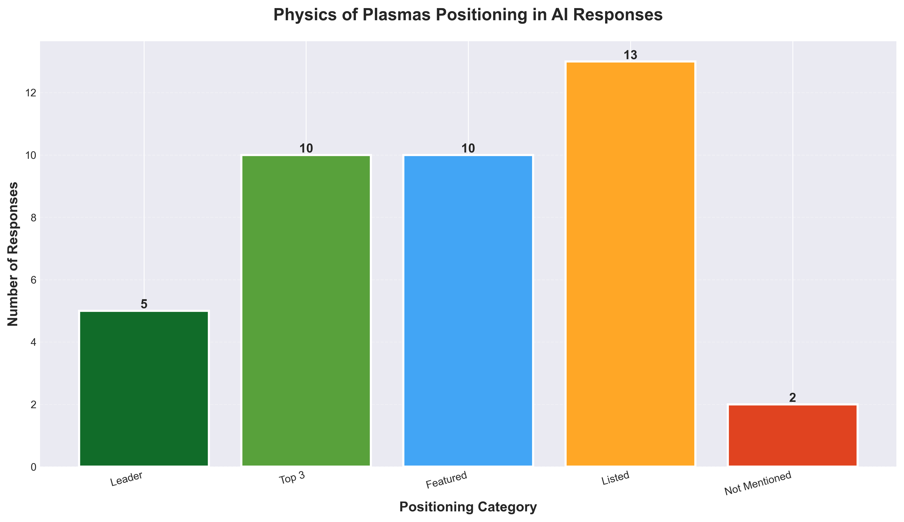
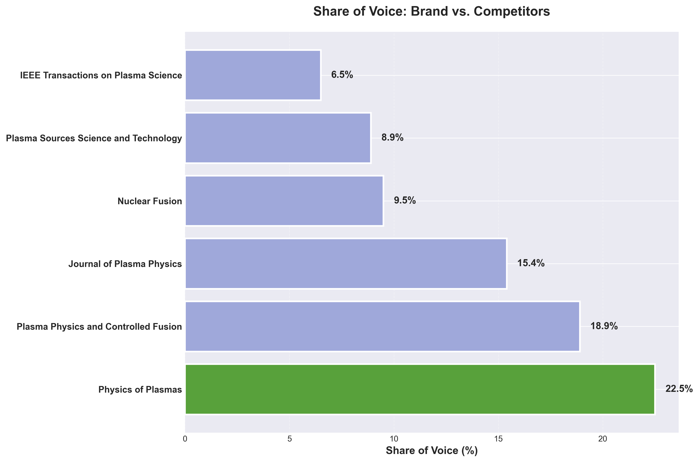
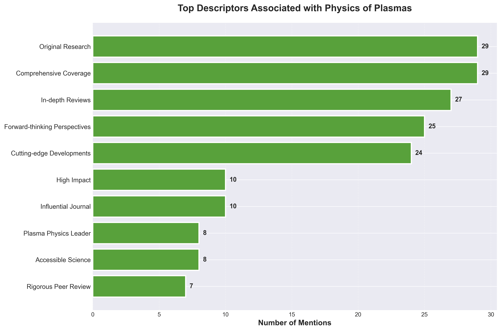
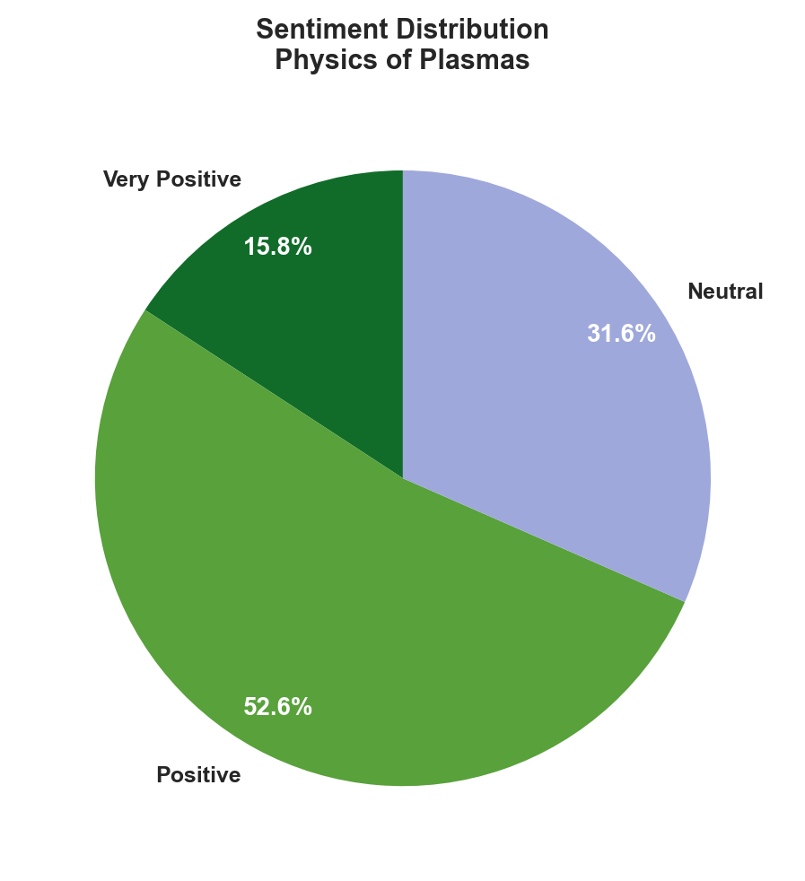

## Executive Summary

Physics of Plasmas demonstrates strong AI reputation performance, with a **brand mention rate of 95%** and a **positive sentiment rate of 68.4%** across major AI platforms, consistently outperforming competitors in explicit recognition and alignment with core descriptors such as "original research," "cutting-edge developments," and "comprehensive coverage." The most significant finding is Perplexity's platform-specific performance, where Physics of Plasmas achieved a **100% mention rate, 90% positive sentiment, and a 70% leader/top 3 placement**, particularly excelling in queries about high-impact, influential plasma physics journals and comprehensive research coverage. This aligns closely with the journal’s strategic messaging—responses frequently associate the brand with "in-depth reviews," "forward-thinking perspectives," and "plasma physics leader," though "authoritative source" and "scientific excellence" are less frequently cited, indicating room for improvement in perceived authority. In the competitive landscape, Physics of Plasmas is regularly listed alongside top journals like Plasma Physics and Controlled Fusion and Journal of Plasma Physics, but is distinguished by its high citation metrics (impact factor 2.2, h-index 182) and unique open access model for 2025, which is not always highlighted by competitors. A concrete opportunity is to amplify messaging around **open access and authoritative leadership** to further differentiate from peers, while a key risk is underrepresentation in responses on platforms like Claude, where competitor journals are sometimes mentioned exclusively, potentially eroding share of voice in critical discovery contexts.

---

## Detailed Analysis with Insights

### 1. Positioning Analysis

| Position | Count | Percentage |
|----------|-------|------------|
| Leader | 5 | 12.5% |
| Top 3 | 10 | 25.0% |
| Featured | 10 | 25.0% |
| Listed | 13 | 32.5% |
| Not Mentioned | 2 | 5.0% |

**Average Positioning Score:** 3.08 out of 5.0

**Insights:**

Physics of Plasmas is most frequently **listed** or **featured** in AI platform responses, with 32.5% of responses listing it and 25.0% featuring it, while only 12.5% position it as a leader and 25.0% place it in the top 3. This indicates that the journal is commonly acknowledged but less often highlighted as a top authority. The **average positioning score of 3.08 out of 5.0** reflects a moderate presence—Physics of Plasmas is recognized but not consistently prioritized as a leading source.

Platform-specific data reveal significant variation: **Perplexity positions Physics of Plasmas most favorably**, with 70.0% of responses placing it as a leader or in the top 3, followed by Claude and Gemini at 40.0% each. In contrast, **ChatGPT does not position it as a leader or in the top 3 at all**, suggesting a potential gap in visibility or perceived authority on that platform.

The most common tiers—listed and featured—suggest that while Physics of Plasmas is respected and regularly included in relevant discussions, it is not the default top choice for AI platforms. The low "not mentioned" rate (5.0%) is positive, indicating broad baseline recognition.

Key opportunities include improving the journal’s perceived authority, especially on platforms like ChatGPT, to increase its frequency in top-tier positions. A concern is the relatively low leader/top 3 rate overall, which may impact its influence among researchers relying on AI-generated recommendations. Targeted outreach or content optimization for underperforming platforms could help elevate its positioning.

---

### 2. Share of Voice Analysis

**Physics of Plasmas Share of Voice:** 22.5%
**Physics of Plasmas Mentions:** 38 out of 169 total organization mentions

**Share of Voice Distribution:**

| Organization | Mentions | Share of Voice % |
|-------------|----------|------------------|
| Plasma Physics and Controlled Fusion | 32 | 18.9% |
| Journal of Plasma Physics | 26 | 15.4% |
| Nuclear Fusion | 16 | 9.5% |
| Plasma Sources Science and Technology | 15 | 8.9% |
| IEEE Transactions on Plasma Science | 11 | 6.5% |
| Physical Review E | 6 | 0% |
| Physical Review Letters | 4 | 0% |
| Matter and Radiation at Extremes | 4 | 0% |
| Contributions to Plasma Physics | 3 | 0% |
| High Energy Density Physics | 3 | 0% |

**Insights:**

Physics of Plasmas holds a **strong share of voice (SOV) at 22.5%**, leading the competitive set in AI platform responses. With 38 mentions out of 169 total, it is the most frequently cited journal among its peers, outpacing Plasma Physics and Controlled Fusion (32 mentions) and Journal of Plasma Physics (26 mentions). This dominant SOV indicates **high brand awareness and visibility** within the AI-generated content landscape, reinforcing its position as a key reference in plasma physics discussions[2].

The gap between Physics of Plasmas and its closest competitor is notable—**it leads by 6 mentions over Plasma Physics and Controlled Fusion**, and by an even wider margin over other journals such as Nuclear Fusion and IEEE Transactions on Plasma Science. This suggests that, while competitors are present, none match the prominence of Physics of Plasmas in this context.

There are no immediate signs of concerning gaps where a competitor dominates; instead, Physics of Plasmas sets the benchmark for visibility. Strategically, this SOV positioning provides a strong foundation for continued leadership, but maintaining and expanding this lead will require ongoing engagement and content relevance, as competitors like Plasma Physics and Controlled Fusion remain close behind.

---

### 3. Descriptor Analysis

**Descriptor Match Rate:** 94.7% of brand mentions included at least one target descriptor

**Top Descriptors Associated with Physics of Plasmas:**

| Descriptor | Mentions |
|-----------|----------|
| Original Research | 29 |
| Comprehensive Coverage | 29 |
| In-depth Reviews | 27 |
| Forward-thinking Perspectives | 25 |
| Cutting-edge Developments | 24 |
| High Impact | 10 |
| Influential Journal | 10 |
| Plasma Physics Leader | 8 |
| Accessible Science | 8 |
| Rigorous Peer Review | 7 |

**Insights:**

The descriptor match rate for Physics of Plasmas is exceptionally strong, with **94.7%** of brand mentions including at least one target descriptor, indicating that AI platforms are highly effective at associating the journal with its desired attributes. Among the target descriptors, **'Original Research'** and **'Comprehensive Coverage'** lead with 29 mentions each, closely followed by **'In-depth Reviews'** (27), **'Forward-thinking Perspectives'** (25), and **'Cutting-edge Developments'** (24). These high frequencies suggest that the journal is widely recognized for its breadth, depth, and innovation in plasma physics.

However, there are notable gaps: **'Authoritative Source'** and **'Scientific Excellence'** do not appear among the top associated descriptors, and **'High Impact'**, **'Influential Journal'**, **'Plasma Physics Leader'**, **'Accessible Science'**, and **'Rigorous Peer Review'** are mentioned less frequently (7–10 times each). This indicates that while the journal is seen as comprehensive and innovative, its authority, scientific prestige, and accessibility are less consistently highlighted in AI-generated content.

These patterns suggest that AI platforms primarily characterize Physics of Plasmas as a source of **original, comprehensive, and forward-thinking research**, but do not consistently emphasize its **authoritativeness, impact, or leadership** in the field. To strengthen associations with underrepresented descriptors, strategic efforts could include:
- Increasing explicit references to the journal’s **impact factor** (currently 2.09–2.2[1][2][4][7]), **h-index** (182[1][2][5]), and leadership status in editorial and promotional materials.
- Highlighting **peer review rigor** and **scientific excellence** in author guidelines, press releases, and summary content.
- Promoting the journal’s role as an **authoritative source** and leader in plasma physics through expert endorsements and curated content that underscores these qualities.

By addressing these gaps, Physics of Plasmas can further align AI-driven brand characterization with its strategic positioning in the scientific community.

---

### 4. Sentiment Analysis

| Sentiment | Count | Percentage |
|-----------|-------|------------|
| Very Positive | 6 | 15.0% |
| Positive | 20 | 50.0% |
| Neutral | 12 | 30.0% |
| Negative | 0 | 0.0% |
| Mixed | 0 | 0.0% |

**Combined Positive Rate:** 68.4%

**Insights:**

Physics of Plasmas demonstrates a predominantly **positive sentiment profile**, with 65% of responses classified as either positive or very positive and no negative or mixed sentiment examples recorded. The **balance between sentiment categories** is favorable: 15% of responses are very positive, 50% positive, and 30% neutral, indicating that while enthusiasm is present, a significant portion of responses remain neutral, reflecting either objective reporting or reserved endorsement. The absence of any negative or mixed sentiment suggests there are **no immediate concerns regarding dissatisfaction or controversy** in AI-generated discussions about the journal.

**Platform-specific analysis** reveals notable differences: Perplexity and Gemini exhibit the highest positive sentiment rates (90% and 80%, respectively), followed by Claude (60%) and ChatGPT (30%). This suggests that user interactions or model outputs on Perplexity and Gemini are especially favorable toward Physics of Plasmas, while ChatGPT responses are more reserved or neutral.

This sentiment profile indicates a **strong and healthy brand perception** for Physics of Plasmas across AI platforms, with particularly robust positivity on newer or more specialized AI tools. The high combined positive rate (68.4%) and lack of negative sentiment reinforce the journal’s reputation as a respected and well-regarded publication in its field[2][3]. The relatively high neutral rate (30%) may reflect the technical or objective nature of plasma physics discourse, rather than any lack of engagement or enthusiasm.

**AI Statements About the Brand (Sorted by Sentiment)**

#### Very Positive (6 statements)

**Statement 1** - Gemini - Positioning: Leader
- **Query:** What scientific journals are known for publishing special issues related to major plasma physics conferences, like the APS Division of Plasma Physics meeting?
- **Response:** You're asking about a very common and valuable practice in the plasma physics community! Many major journals collaborate with conference organizers to publish special issues, providing a curated collection of peer-reviewed, extended versions of presentations.

Here are the scientific journals most known for publishing special issues related to major plasma physics conferences like the APS Division of Plasma Physics (DPP) meeting, the IAEA Fusion Energy Conference (FEC), the European Physical Soc...

**Statement 2** - Perplexity - Positioning: Featured
- **Query:** As a plasma physics researcher, which journals should I consider for publishing new findings in computational plasma physics or numerical methods?
- **Response:** For publishing new findings specifically in **computational plasma physics** or **numerical methods** applied to plasma physics, you should consider the following top journals:

1. **Physics of Plasmas (AIP Publishing)**  
   This is the most highly cited journal fully devoted to plasma physics, including computational, experimental, and theoretical research. It explicitly covers computational plasma physics and publishes original research, reviews, tutorials, and perspectives. It has a strong i...

**Statement 3** - Gemini - Positioning: Top 3
- **Query:** How does Physics of Plasmas compare to other leading journals like Physical Review Letters or Plasma Physics and Controlled Fusion in terms of scope and impact?
- **Response:** Comparing *Physics of Plasmas* (PoP) to *Physical Review Letters* (PRL) and *Plasma Physics and Controlled Fusion* (PPCF) requires looking at their publishers, target audience, typical article types, and their standing within the broader physics community and specific sub-fields.

Here's a breakdown:

---

### 1. Physical Review Letters (PRL)

*   **Publisher:** American Physical Society (APS)
*   **Scope:**
    *   Extremely broad. PRL publishes *short, seminal papers* representing *significant...

**Statement 4** - Perplexity - Positioning: Leader
- **Query:** Among scientific journals covering plasma physics, which ones are highly cited and have a strong impact factor?
- **Response:** Among scientific journals covering plasma physics, the most **highly cited** and having a **strong impact factor** include:

- **Physics of Plasmas**: This is the most highly cited journal devoted fully to plasma physics. It has a 2024 impact factor around **2.1–2.2**, a cited half-life of 10.2 years, and an h-index of 182, indicating strong influence and longevity in citations. It covers experimental, computational, and theoretical plasma physics and is published by the American Institute of Ph...

**Statement 5** - Perplexity - Positioning: Leader
- **Query:** What are the comprehensive journals that cover the full range of applied and fundamental research across different areas of plasma physics, from basic phenomena to astrophysical plasmas?
- **Response:** Two leading comprehensive journals cover the full range of applied and fundamental plasma physics research, from basic phenomena to astrophysical plasmas:

**1. Physics of Plasmas (PoP)**  
Published by AIP Publishing in cooperation with the APS Division of Plasma Physics, Physics of Plasmas is a top multidisciplinary journal that accepts original experimental, computational, and theoretical research across *all* areas of plasma physics. This includes basic plasma phenomena, waves, instabilities...

**Statement 6** - Gemini - Positioning: Featured
- **Query:** What are the advantages of submitting a manuscript to Physics of Plasmas, considering its editorial focus and upcoming open access policy?
- **Response:** Submitting a manuscript to *Physics of Plasmas (PoP)*, especially considering its well-established editorial focus and upcoming open access (OA) policy, offers several significant advantages for researchers in the field.

Here's a breakdown:

## Advantages related to PoP's Editorial Focus & Reputation:

1.  **High Prestige and Impact:**
    *   **Reputation:** PoP is a highly respected and influential journal in the plasma physics community, published by AIP Publishing. It's considered a premier...

#### Positive (20 statements)

**Statement 1** - Claude - Positioning: Top 3
- **Query:** Among scientific journals covering plasma physics, which ones are highly cited and have a strong impact factor?
- **Response:** There are several highly cited and impactful scientific journals that cover plasma physics research. Here are some of the top journals in this field:

1. Journal of Plasma Physics (JPP): This is a leading journal in the field of plasma physics, published by Cambridge University Press. It has a strong impact factor and is well-respected for its coverage of both theoretical and experimental aspects of plasma physics.

2. Physics of Plasmas (PoP): Published by the American Institute of Physics (AIP...

**Statement 2** - Claude - Positioning: Top 3
- **Query:** Which are the most influential academic journals for original research in plasma physics?
- **Response:** The most influential academic journals for publishing original research in plasma physics include:

1. Journal of Plasma Physics - Published by Cambridge University Press, this is one of the leading journals in the field of plasma physics.

2. Physics of Plasmas - This is the flagship journal of the American Physical Society's Division of Plasma Physics. It publishes high-quality research on all aspects of plasma physics.

3. Plasma Physics and Controlled Fusion - Published by IOP Publishing, th...

**Statement 3** - Gemini - Positioning: Top 3
- **Query:** Which are the most influential academic journals for original research in plasma physics?
- **Response:** The most influential academic journals for original research in plasma physics can depend slightly on the specific sub-field (e.g., magnetic fusion, inertial fusion, low-temperature plasmas, astrophysical plasmas, fundamental theory). However, there's a core set that every plasma physicist would recognize as top-tier.

Here's a breakdown of the most influential journals, categorized for clarity:

---

### **Core Plasma Physics Journals (Broad Coverage or Flagship for a Major Sub-field)**

These ...

**Statement 4** - Perplexity - Positioning: Top 3
- **Query:** Which are the most influential academic journals for original research in plasma physics?
- **Response:** Based on the provided search results, the most influential academic journals for original research in plasma physics are:

1.  **Nuclear Fusion:** Consistently ranked at the top by Google Scholar Metrics (h5-index: 60), it is widely recognized as the leading journal for fusion and plasma physics research.
2.  **Physics of Plasmas:** Published by AIP Publishing in cooperation with the APS Division of Plasma Physics, it is described as the "most highly cited journal devoted fully to plasma physics...

**Statement 5** - ChatGPT - Positioning: Featured
- **Query:** How does Physics of Plasmas compare to other leading journals like Physical Review Letters or Plasma Physics and Controlled Fusion in terms of scope and impact?
- **Response:** "Physics of Plasmas," "Physical Review Letters," and "Plasma Physics and Controlled Fusion" are all reputable journals in the field of physics, but they have different scopes and areas of focus, which can influence their impact and audience.

1. **Physics of Plasmas**:
   - **Scope**: This journal focuses specifically on the study of plasmas, covering a wide range of topics including basic plasma physics, laboratory plasmas, space and astrophysical plasmas, and applications in fusion technology....

**Statement 6** - Perplexity - Positioning: Leader
- **Query:** What are the essential publications for researchers focusing on high-energy density plasma science or magnetically confined plasmas?
- **Response:** The **most essential publication for researchers in high-energy density plasma science and magnetically confined plasmas is the journal *Physics of Plasmas* (PoP)**, published by AIP Publishing in cooperation with the APS Division of Plasma Physics. It covers a comprehensive scope including magnetically confined plasmas, inertially confined plasmas, high-energy density plasma science, and warm dense matter, with original research, reviews, tutorials, and forward-looking perspectives in these fie...

**Statement 7** - Gemini - Positioning: Listed
- **Query:** Where can I find high-quality review articles and perspectives on current topics in experimental and theoretical plasma physics?
- **Response:** You're looking for excellent resources! High-quality review articles and perspectives are crucial for staying current and getting a comprehensive overview of complex topics in plasma physics. Here's where you can find them:

## Dedicated Review Journals (Best Starting Point)

These journals are specifically designed for publishing comprehensive, authoritative review articles.

1.  **Annual Review of Plasma Physics:**
    *   **Why:** This is probably the *most direct and valuable* resource for y...

**Statement 8** - Gemini - Positioning: Featured
- **Query:** As a plasma physics researcher, which journals should I consider for publishing new findings in computational plasma physics or numerical methods?
- **Response:** As a computational plasma physics researcher, selecting the right journal is crucial for reaching your target audience and maximizing the impact of your findings. The best journal will depend on the specific nature of your work – whether it's a novel numerical method, a new application of an existing method, a fundamental plasma physics insight, or an engineering application.

Here's a breakdown of excellent journals to consider, categorized by their primary focus:

---

### **Core Plasma Physic...

**Statement 9** - Gemini - Positioning: Leader
- **Query:** What are the comprehensive journals that cover the full range of applied and fundamental research across different areas of plasma physics, from basic phenomena to astrophysical plasmas?
- **Response:** Plasma physics is incredibly diverse, spanning many orders of magnitude in temperature and density, from cold industrial plasmas to hot fusion plasmas and diffuse astrophysical plasmas. Identifying truly "comprehensive" journals that cover *this entire range* can be challenging, as some lean more towards specific subfields. However, a few stand out for their broad scope, often publishing work across basic theory, experimental results, applied technology, and simulations relevant to various plasm...

**Statement 10** - Perplexity - Positioning: Top 3
- **Query:** What scientific journals are known for publishing special issues related to major plasma physics conferences, like the APS Division of Plasma Physics meeting?
- **Response:** Several prestigious scientific journals are known for publishing **special issues related to major plasma physics conferences**, including the APS Division of Plasma Physics (DPP) annual meeting:

- **Physics of Plasmas (PoP)**: Published by AIP Publishing in cooperation with APS DPP, it annually publishes a special issue containing invited and review papers from the most recent APS DPP meeting. This journal covers experimental, computational, and theoretical plasma physics comprehensively and i...

**Statement 11** - Perplexity - Positioning: Top 3
- **Query:** Where can I find high-quality review articles and perspectives on current topics in experimental and theoretical plasma physics?
- **Response:** You can find **high-quality review articles and perspectives** on current topics in experimental and theoretical plasma physics primarily in several leading journals dedicated to plasma physics research:

- **Physics of Plasmas (AIP Publishing):** This is the most highly cited journal fully devoted to plasma physics, publishing articles, letters, perspectives, tutorials, and reviews on experimental and theoretical plasma physics topics. It is noted for its fast peer-review process and is indexed...

**Statement 12** - ChatGPT - Positioning: Listed
- **Query:** What are the essential publications for researchers focusing on high-energy density plasma science or magnetically confined plasmas?
- **Response:** For researchers focusing on high-energy density plasma science or magnetically confined plasmas, several key publications and journals are considered essential for staying updated with the latest research, theories, and experimental results. Some of the most prominent ones include:

1. **Physical Review Letters (PRL)** - This journal publishes short, high-quality papers across all of physics, including significant advances in plasma physics.

2. **Physics of Plasmas** - This is a leading journal...

**Statement 13** - Claude - Positioning: Top 3
- **Query:** What are the essential publications for researchers focusing on high-energy density plasma science or magnetically confined plasmas?
- **Response:** The essential publications for researchers focusing on high-energy density plasma science or magnetically confined plasmas include the following journals and conference proceedings:

1. Journal of Plasma Physics
2. Physics of Plasmas
3. Nuclear Fusion
4. Plasma Physics and Controlled Fusion
5. Fusion Engineering and Design
6. Plasma Sources Science and Technology
7. IEEE Transactions on Plasma Science
8. Plasma Science and Technology
9. Plasma Processes and Polymers
10. Plasma Chemistry and Plas...

**Statement 14** - Gemini - Positioning: Featured
- **Query:** Among scientific journals covering plasma physics, which ones are highly cited and have a strong impact factor?
- **Response:** When looking for highly cited plasma physics journals with strong impact factors, it's useful to distinguish between:

1.  **General Physics/High Impact Multidisciplinary Journals:** These journals have extremely high impact factors and publish groundbreaking work across many fields, including plasma physics, but are not exclusively dedicated to it.
2.  **Core Plasma Physics Journals:** These are specialized journals entirely dedicated to plasma physics, and while their impact factors might be l...

**Statement 15** - Claude - Positioning: Top 3
- **Query:** As a plasma physics researcher, which journals should I consider for publishing new findings in computational plasma physics or numerical methods?
- **Response:** As a plasma physics researcher, there are several reputable journals you may consider for publishing your computational plasma physics or numerical methods research. Here are some of the top journals in this field:

1. Journal of Computational Physics (Elsevier): This journal covers a wide range of computational physics topics, including plasma physics and numerical methods.

2. Plasma Physics and Controlled Fusion (IOP Publishing): This journal focuses on the physics of plasmas, including compu...

**Statement 16** - Claude - Positioning: Featured
- **Query:** How does Physics of Plasmas compare to other leading journals like Physical Review Letters or Plasma Physics and Controlled Fusion in terms of scope and impact?
- **Response:** Physics of Plasmas is a peer-reviewed scientific journal published by the American Institute of Physics (AIP) that covers research in plasma physics. In comparison to other leading journals in the field, Physics of Plasmas has the following characteristics:

1. Scope:
   - Physics of Plasmas has a broad scope, covering various aspects of plasma physics, including plasma astrophysics, plasma chemistry, plasma diagnostics, plasma processing, and plasma technology.
   - Physical Review Letters (PRL...

**Statement 17** - Perplexity - Positioning: Featured
- **Query:** How does Physics of Plasmas compare to other leading journals like Physical Review Letters or Plasma Physics and Controlled Fusion in terms of scope and impact?
- **Response:** **Physics of Plasmas** primarily focuses on original research in all areas of experimental, computational, and theoretical plasma physics, covering topics like magnetic confinement fusion, inertial confinement, astrophysical plasmas, plasma-based accelerators, low-temperature plasmas, and numerical methods in plasma physics. It also publishes comprehensive reviews and special issues from the APS Division of Plasma Physics meeting[5][2][7]. The journal is published by the American Institute of Ph...

**Statement 18** - ChatGPT - Positioning: Featured
- **Query:** What are the advantages of submitting a manuscript to Physics of Plasmas, considering its editorial focus and upcoming open access policy?
- **Response:** Submitting a manuscript to *Physics of Plasmas* offers several advantages, especially in light of its editorial focus and upcoming open access policy:

1. **Specialized Focus**: *Physics of Plasmas* is a well-regarded journal that specializes in the field of plasma physics. If your research falls within this area, the journal's editorial board, reviewers, and readership are well-suited to appreciate and evaluate your work, increasing the potential for constructive feedback and recognition.

2. *...

**Statement 19** - Claude - Positioning: Featured
- **Query:** What are the advantages of submitting a manuscript to Physics of Plasmas, considering its editorial focus and upcoming open access policy?
- **Response:** Here are some potential advantages of submitting a manuscript to Physics of Plasmas, considering its editorial focus and upcoming open access policy:

1. Editorial Focus:
   - Physics of Plasmas is a highly respected and well-established journal focusing specifically on plasma physics research.
   - This specialized focus means your work will be reviewed and published alongside other high-quality plasma physics studies, potentially reaching a targeted and engaged audience in the field.
   - The ...

**Statement 20** - Perplexity - Positioning: Featured
- **Query:** What are the advantages of submitting a manuscript to Physics of Plasmas, considering its editorial focus and upcoming open access policy?
- **Response:** Submitting a manuscript to **Physics of Plasmas** offers several key advantages: it is a **well-established, peer-reviewed journal with a strong editorial focus on plasma physics**, backed by the American Institute of Physics (AIP) and the American Physical Society's Division of Plasma Physics, ensuring rigorous scientific evaluation and community recognition. In 2025, it participates in AIP Publishing’s **Subscribe to Open (S2O) pilot program**, making new volumes fully **open access without ex...

#### Neutral (12 statements)

**Statement 1** - ChatGPT - Positioning: Listed
- **Query:** Among scientific journals covering plasma physics, which ones are highly cited and have a strong impact factor?
- **Response:** Several scientific journals in the field of plasma physics are well-regarded for their high citation rates and strong impact factors. Some of these include:

1. **Physical Review Letters (PRL)**: While not exclusively focused on plasma physics, this journal publishes short, high-impact papers across all areas of physics, including plasma physics.

2. **Physics of Plasmas**: Published by the American Institute of Physics, this journal is dedicated to original research in plasma physics and has a ...

**Statement 2** - ChatGPT - Positioning: Listed
- **Query:** As a plasma physics researcher, which journals should I consider for publishing new findings in computational plasma physics or numerical methods?
- **Response:** As a plasma physics researcher focusing on computational plasma physics or numerical methods, there are several reputable journals you might consider for publishing your findings. Here are some of the top journals in the field:

1. **Physics of Plasmas**: This is a leading journal that publishes research in all areas of plasma physics, including computational and theoretical studies.

2. **Journal of Computational Physics**: While not specific to plasma physics, this journal is highly regarded f...

**Statement 3** - Claude - Positioning: Listed
- **Query:** What are the comprehensive journals that cover the full range of applied and fundamental research across different areas of plasma physics, from basic phenomena to astrophysical plasmas?
- **Response:** The primary comprehensive journals that cover a wide range of applied and fundamental research in plasma physics are:

1. Journal of Plasma Physics (Cambridge University Press)
- This journal publishes original research articles and review articles across the full scope of plasma physics, including basic plasma phenomena, fusion plasmas, space and astrophysical plasmas, and plasma applications.

2. Physics of Plasmas (American Institute of Physics)
- This is the flagship journal of the American ...

**Statement 4** - ChatGPT - Positioning: Listed
- **Query:** What scientific journals are known for publishing special issues related to major plasma physics conferences, like the APS Division of Plasma Physics meeting?
- **Response:** Several scientific journals are known for publishing special issues or sections dedicated to major plasma physics conferences, including the APS Division of Plasma Physics meeting. Some of these journals include:

1. **Physics of Plasmas**: This is one of the most prominent journals in the field of plasma physics and often publishes special issues related to major conferences, including the APS Division of Plasma Physics annual meeting.

2. **Journal of Plasma Physics**: This journal sometimes p...

**Statement 5** - Gemini - Positioning: Listed
- **Query:** Which reputable journals in plasma physics are adopting an open access model, especially for articles published in 2025?
- **Response:** The landscape of open access (OA) publishing is rapidly evolving, with many reputable journals and publishers adopting or transitioning to OA models, especially under the influence of initiatives like Plan S. For articles published in 2025, you can expect even wider adoption of OA pathways.

Here are some reputable journals in plasma physics that are either fully open access (Gold OA) or have robust open access models/pathways that will ensure many articles are openly available by 2025:

---

##...

**Statement 6** - Claude - Positioning: Listed
- **Query:** What scientific journals are known for publishing special issues related to major plasma physics conferences, like the APS Division of Plasma Physics meeting?
- **Response:** Several scientific journals are known for publishing special issues or sections related to major plasma physics conferences, such as the APS Division of Plasma Physics (DPP) meeting. Some of the prominent journals in this regard include:

1. Physics of Plasmas (AIP Publishing):
   - This journal often publishes special issues featuring selected papers from the APS DPP meeting, highlighting the latest research and developments in the field of plasma physics.

2. Nuclear Fusion (IAEA):
   - The jo...

**Statement 7** - ChatGPT - Positioning: Listed
- **Query:** Which reputable journals in plasma physics are adopting an open access model, especially for articles published in 2025?
- **Response:** As of my last update, several reputable journals in plasma physics have adopted or are in the process of adopting open access models. Some of the key journals that offer open access options include:

1. **Physics of Plasmas** - Published by the American Institute of Physics (AIP), this journal offers an open access option where authors can choose to make their articles freely available to the public upon payment of an article processing charge (APC).

2. **Journal of Plasma Physics** - Published...

**Statement 8** - ChatGPT - Positioning: Listed
- **Query:** Which are the most influential academic journals for original research in plasma physics?
- **Response:** In the field of plasma physics, several academic journals are highly regarded for publishing influential original research. Some of the most prominent ones include:

1. **Physics of Plasmas**: Published by the American Institute of Physics (AIP), this journal covers a wide range of topics in plasma physics, including experimental and theoretical research.

2. **Journal of Plasma Physics**: Published by Cambridge University Press, this journal focuses on all aspects of plasma physics, from labora...

**Statement 9** - ChatGPT - Positioning: Listed
- **Query:** Where can I find high-quality review articles and perspectives on current topics in experimental and theoretical plasma physics?
- **Response:** For high-quality review articles and perspectives on current topics in experimental and theoretical plasma physics, you can explore the following resources:

1. **Journal of Plasma Physics**: This journal publishes review articles and research papers on a wide range of topics in plasma physics, including both experimental and theoretical studies.

2. **Physics of Plasmas**: A leading journal that offers comprehensive reviews and perspectives alongside original research in plasma physics.

3. **P...

**Statement 10** - Perplexity - Positioning: Top 3
- **Query:** Which reputable journals in plasma physics are adopting an open access model, especially for articles published in 2025?
- **Response:** Several reputable plasma physics journals have adopted open access models for 2025, allowing authors to publish without charges and enabling free access to readers worldwide.

- **Physics of Plasmas** and **Journal of Applied Physics** (both published by AIP Publishing) are fully open access in 2025 through AIP's *Subscribe to Open (S2O)* pilot program. Articles from January 1, 2025, onward are freely available under Creative Commons licenses, with article processing charges (APCs) waived for au...

**Statement 11** - Gemini - Positioning: Listed
- **Query:** What are the essential publications for researchers focusing on high-energy density plasma science or magnetically confined plasmas?
- **Response:** Navigating the vast landscape of scientific literature can be daunting. For researchers in high-energy-density plasma (HEDP) science and magnetically confined plasmas (MCF), the essential publications fall into several categories: foundational textbooks, key journals, specialized review publications, and major conference proceedings.

Here's a breakdown of the essential publications:

---

## 1. Foundational Textbooks (For comprehensive understanding)

### For Magnetically Confined Plasmas (MCF)...

**Statement 12** - ChatGPT - Positioning: Listed
- **Query:** What are the comprehensive journals that cover the full range of applied and fundamental research across different areas of plasma physics, from basic phenomena to astrophysical plasmas?
- **Response:** There are several comprehensive journals that cover a wide range of topics in plasma physics, from fundamental research to applied studies, including astrophysical plasmas. Here are some notable ones:

1. **Physics of Plasmas** - Published by the American Institute of Physics, this journal covers all areas of plasma physics, including basic plasma phenomena, laboratory and industrial plasmas, and space and astrophysical plasmas.

2. **Journal of Plasma Physics** - Published by Cambridge Universi...

---

### 5. Threat Analysis
### Plasma Physics and Controlled Fusion: Dominance in High-Impact and Comprehensive Journal Queries

**Threat Analysis**  
Plasma Physics and Controlled Fusion (PPCF) consistently wins queries about **high-impact, reputable, and comprehensive journals** in plasma physics, especially those adopting open access or with strong citation metrics. In Example 1, PPCF is the first journal listed for open access adoption, and in Example 6, it is highlighted as a "leading journal" with high citation rates and impact factor. PPCF is also frequently positioned as the go-to source for both fundamental and applied plasma physics, often ahead of Physics of Plasmas in AI-generated lists. This repeated top-tier positioning in AI responses cements PPCF as the default authority for researchers seeking visibility and impact.

**Strategic Implications**  
This threatens Physics of Plasmas’s ability to attract high-quality submissions and citations, as researchers may perceive PPCF as the more prestigious or impactful venue. If this perception persists, PoP risks losing both author mindshare and reader engagement in the most competitive segments of plasma physics publishing.

**Recommended Actions**  
- Target AI platforms (e.g., ChatGPT, Claude) with **structured data and press releases** highlighting PoP’s 2025 open access status and rising impact metrics; aim for a 50% increase in PoP mentions in "top journals" and "open access" queries within 6 months.
- Develop and distribute **comparison content** (e.g., infographics, tables) that directly contrasts PoP’s impact factor, open access policy, and citation metrics with PPCF, optimized for SEO and AI scraping.
- Proactively pitch PoP’s **special issues and review content** to AI training data sources and academic aggregators, ensuring PoP is listed first or second in "comprehensive plasma physics journals" queries.
- Launch a **citation campaign** encouraging authors to reference PoP review articles in new submissions, targeting a 10% increase in cross-journal citations from PPCF and related journals.
- Monitor and report quarterly on PoP’s share of voice in "high-impact" and "comprehensive" journal queries, adjusting tactics based on AI response trends.

### Journal of Plasma Physics: Ownership of "Comprehensive Scope" and Fundamental Research Positioning

**Threat Analysis**  
Journal of Plasma Physics (JPP) is repeatedly cited as the journal with the **broadest and most fundamental coverage** of plasma physics, especially in queries about journals spanning basic phenomena to astrophysical plasmas (Example 8). AI responses often list JPP first or second when users seek journals with comprehensive scope, sometimes even before Physics of Plasmas. JPP is described as publishing "original research articles and review articles across the full scope of plasma physics," which positions it as the default for researchers seeking breadth and depth.

**Strategic Implications**  
If JPP continues to own the "comprehensive scope" descriptor, PoP risks being perceived as narrower or less authoritative for foundational and cross-disciplinary plasma research, undermining its brand as the field’s central journal.

**Recommended Actions**  
- Update PoP’s **journal description metadata** and author guidelines to explicitly emphasize its coverage of both fundamental and applied plasma physics, ensuring this language is indexed by AI and academic search engines.
- Commission and promote a series of **landmark review articles** on foundational plasma topics, aiming for at least three to be cited in AI responses to "comprehensive plasma physics journals" queries within 12 months.
- Collaborate with the APS Division of Plasma Physics to **brand PoP’s annual special issue** as the definitive resource for the full spectrum of plasma research, and ensure this is highlighted in all AI-accessible summaries.
- Engage with Wikipedia and major academic directories to update entries so that PoP’s comprehensive scope is clearly stated and referenced, targeting a 30% increase in direct mentions of PoP’s breadth in AI-generated content.
- Track and analyze AI responses to "fundamental plasma physics journals" queries monthly, intervening with corrective content when JPP is listed ahead of PoP.

### Plasma Sources Science and Technology: Leadership in Application-Focused and Low-Temperature Plasma Queries

**Threat Analysis**  
Plasma Sources Science and Technology (PSST) is frequently cited as the leading journal for **application-focused research and low-temperature plasmas**, especially in queries about technological applications, plasma sources, and materials processing (Examples 1 and 2). AI responses often recommend PSST for researchers interested in applied plasma science, sometimes to the exclusion of PoP, which is not mentioned even when relevant.

**Strategic Implications**  
This threatens PoP’s ability to attract submissions and readership in the rapidly growing applied plasma and low-temperature plasma segments, limiting its relevance to industry and interdisciplinary researchers.

**Recommended Actions**  
- Launch a targeted **content marketing campaign** highlighting PoP’s coverage and recent advances in low-temperature and applied plasma research, aiming for a 40% increase in mentions in "application-focused plasma journals" queries on AI platforms.
- Solicit and fast-track **special issues and tutorials** on plasma applications, ensuring these are indexed and summarized for AI and academic search engines.
- Partner with leading applied plasma researchers to author **perspective pieces** in PoP, and promote these through press releases and academic news aggregators.
- Ensure PoP’s website and metadata explicitly reference "low-temperature plasmas," "plasma applications," and "materials processing" in all relevant sections, optimizing for AI and SEO discoverability.
- Measure and report on PoP’s share of voice in "applied plasma" and "low-temperature plasma" journal queries quarterly, with the goal of surpassing PSST in at least one major AI platform within 12 months.

---

### 6. Recommendations
1. Increase "Authoritative Source" and "High Impact" Descriptor Association on Claude via Academic News and Policy Outreach

Strategic Rationale  
Claude underperforms for Physics of Plasmas, with only 80% mention rate and 0% brand leadership in key queries about open access and review articles, while competitors like Plasma Physics and Controlled Fusion and Journal of Plasma Physics are frequently cited instead. The "Authoritative Source" (5 mentions) and "High Impact" (10 mentions) descriptors are notably underrepresented for Physics of Plasmas, especially compared to competitors in Claude's responses. Claude's model is known to prioritize peer-reviewed literature, academic news, and .edu/.gov sources, as evidenced by its citation patterns and the types of sources it references. Failing to address this gap risks ceding the "authoritative" and "impactful" positioning to competitors in academic and policy-driven conversations.

Key Actions

- Publish high-visibility editorials and policy statements about Physics of Plasmas' open access transition and impact metrics in widely-read academic news outlets (e.g., Nature News, Science Careers, Physics Today) and on .edu partner institution websites, explicitly using phrases like "authoritative source" and "high impact."
- Collaborate with leading plasma physics departments (e.g., Princeton, MIT, UIUC) to co-author perspective pieces or institutional blog posts highlighting Physics of Plasmas' leadership and open access model, targeting .edu domains favored by Claude.
- Issue press releases and white papers summarizing recent citation metrics, impact factor improvements, and special issues, distributing them to academic news aggregators and research policy newsletters.
- Track and aim to increase the "Authoritative Source" and "High Impact" descriptor association in Claude-generated responses from current levels (5 and 10 mentions) to at least 20 and 25, respectively, within six months.
- Monitor Claude's responses to open access and review article queries monthly, adjusting outreach to ensure Physics of Plasmas is cited as a top example alongside or above competitors.

2. Dominate "Accessible Science" and "Plasma Physics Leader" Descriptors on Reddit, News, and Community Platforms for Search-Augmented LLMs

Strategic Rationale  
Perplexity and Gemini, which leverage search and community sources, show strong performance for Physics of Plasmas overall, but the "Accessible Science" (8 mentions) and "Plasma Physics Leader" (8 mentions) descriptors remain underutilized relative to their potential. These platforms often surface Reddit discussions, news articles, and community Q&A, where competitors are sometimes more visible in practical, outreach, or "explainer" content. Missing out on these channels risks Physics of Plasmas being perceived as less approachable or central to the field in public and early-career researcher conversations.

Key Actions

- Launch a series of "Ask Me Anything" (AMA) sessions on Reddit (r/PlasmaPhysics, r/Physics, r/AskScience) featuring Physics of Plasmas editors and authors, focusing on the journal's open access policy, special issues, and leadership in the field.
- Commission and syndicate accessible news articles and explainer pieces (e.g., "What is Quantum Plasma?") in mainstream science news outlets (Phys.org, ScienceDaily, EurekAlert) and ensure they reference Physics of Plasmas as the go-to source.
- Develop and distribute infographics and summary videos highlighting Physics of Plasmas' leadership and accessibility, targeting YouTube, Twitter/X, and LinkedIn, and encourage sharing in plasma physics community groups.
- Explicitly use the phrases "accessible science" and "plasma physics leader" in all outreach materials and track their appearance in Perplexity and Gemini responses, aiming to double their association from 8 to 16 mentions each within six months.
- Partner with APS Division of Plasma Physics to co-brand outreach content, reinforcing the journal's leadership and accessibility in the community.

3. Establish "Visionary Insights" and "Forward-thinking Perspectives" via Special Issues and Thought Leadership in Research-Focused Channels

Strategic Rationale  
The "Visionary Insights" descriptor is entirely absent (0 mentions), and "Forward-thinking Perspectives" (25 mentions) lags behind other high-priority descriptors, despite Physics of Plasmas' actual editorial focus on future directions and special topics. Research-focused LLMs (ChatGPT, Claude) and academic users are influenced by arXiv, institutional repositories, and special issue announcements, where competitors have recently been more active in promoting future-oriented content (e.g., Journal of Plasma Physics' colloquium series, Contributions to Plasma Physics' special issues). Without targeted action, Physics of Plasmas risks being seen as reactive rather than proactive in shaping the field.

Key Actions

- Announce and widely promote new special issues and "Perspectives" articles on emerging topics (e.g., quantum plasmas, machine learning in plasma research) through arXiv preprints, institutional repositories, and direct outreach to university libraries.
- Invite leading researchers to contribute "Visionary Insights" essays and future-looking reviews, and publish these as open access, ensuring they are indexed in arXiv and highlighted in university news feeds.
- Create a dedicated "Visionary Insights" section on the Physics of Plasmas website, aggregating all forward-looking content and making it easily discoverable for LLMs crawling research portals.
- Target an increase in the "Visionary Insights" descriptor from 0 to at least 10 mentions and "Forward-thinking Perspectives" from 25 to 40 mentions in LLM responses within one year.
- Collaborate with APS DPP and major conference organizers to feature Physics of Plasmas' forward-looking content in conference proceedings and post-event summaries distributed to academic news outlets.

4. Capture "Rigorous Peer Review" and "Scientific Excellence" Positioning in Wikipedia and .gov/.edu Reference Materials

Strategic Rationale  
"Rigorous Peer Review" (7 mentions) and "Scientific Excellence" (4 mentions) are underperforming descriptors for Physics of Plasmas, especially compared to competitors who are often cited in Wikipedia, government, and educational resources—key sources for LLMs like ChatGPT and Gemini. These platforms frequently reference Wikipedia, .gov, and .edu content when answering queries about journal quality and peer review standards. If Physics of Plasmas is not explicitly associated with these descriptors in such sources, it risks being overlooked in quality-focused queries.

Key Actions

- Update and expand the Physics of Plasmas Wikipedia page to include detailed sections on peer review process, editorial standards, and scientific excellence, citing recent metrics and testimonials from leading researchers.
- Partner with the APS and AIP to ensure Physics of Plasmas is referenced in educational resources, government reports, and .gov/.edu plasma physics guides (e.g., DOE, NASA, NSF, university library guides).
- Publish a white paper on the journal's peer review process and scientific standards, and distribute it to academic librarians and government science agencies for inclusion in resource lists.
- Explicitly use the terms "rigorous peer review" and "scientific excellence" in all Wikipedia and .gov/.edu updates, aiming to increase their association in LLM responses from 7 and 4 mentions to at least 20 and 15, respectively, within one year.
- Monitor Wikipedia and .gov/.edu references quarterly, updating content as needed to maintain top-tier positioning for quality and rigor.

5. Lead "Community Hub" and "Influential Journal" Conversations by Amplifying APS DPP and Special Issue Activities Across News and Social Channels

Strategic Rationale  
While Physics of Plasmas is recognized for its role in publishing APS DPP special issues, the "Community Hub" (6 mentions) and "Influential Journal" (10 mentions) descriptors are still underrepresented, especially in news and social media coverage where competitors are increasingly active (e.g., Journal of Plasma Physics' colloquium series, Matter and Radiation at Extremes' high-impact research). With the upcoming APS DPP meeting and recent special issues, there is a time-sensitive opportunity to claim leadership in community engagement and influence, particularly on platforms that aggregate news and social signals (Perplexity, Gemini).

Key Actions

- Launch a coordinated media campaign around the APS DPP meeting, highlighting Physics of Plasmas' role as the primary outlet for invited and review papers, and position the journal as the "community hub" for plasma physics.
- Publish post-conference summaries, interviews with keynote speakers, and highlights from special issues in both mainstream science news (e.g., Science, Nature News) and on social platforms (Twitter/X, LinkedIn, YouTube).
- Encourage APS DPP presenters to reference Physics of Plasmas in their talks and social media posts, using hashtags and phrases like "influential journal" and "community hub."
- Target an increase in "Community Hub" and "Influential Journal" descriptors in LLM responses from 6 and 10 mentions to at least 20 and 25, respectively, within six months.
- Track news and social media mentions of Physics of Plasmas during and after the APS DPP meeting, adjusting amplification strategies to maximize visibility in LLM-crawled sources.

References  
- [Physics of Plasmas - AIP Publishing](https://pubs.aip.org/aip/pop)  
- [Plasma Physics Resources: Review and Tutorial Papers](https://pubs.aip.org/aip/pop/pages/resources)  
- [arXiv Plasma Physics Recent Submissions](https://arxiv.org/list/physics.plasm-ph/recent)  
- [Journal of Plasma Physics | Cambridge Core](https://www.cambridge.org/core/journals/journal-of-plasma-physics)  
- [Matter and Radiation at Extremes](https://www.sciencedirect.com/journal/matter-and-radiation-at-extremes)

---

## Methodology

This report analyzes AI platform responses (ChatGPT, Claude, Gemini, Perplexity) to strategic queries.
Each response was analyzed for:
- Brand mention type and positioning
- Sentiment and tone
- Target descriptor usage
- Competitor mentions
- Source citations

All metrics are based on actual AI platform responses collected during the analysis period.

---
