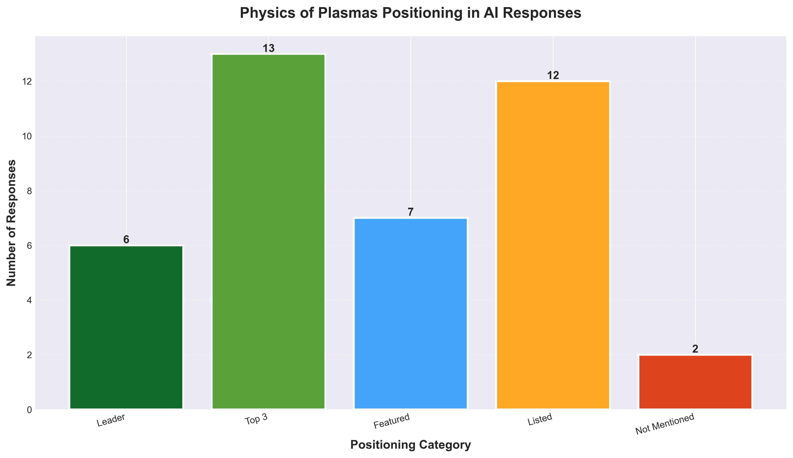
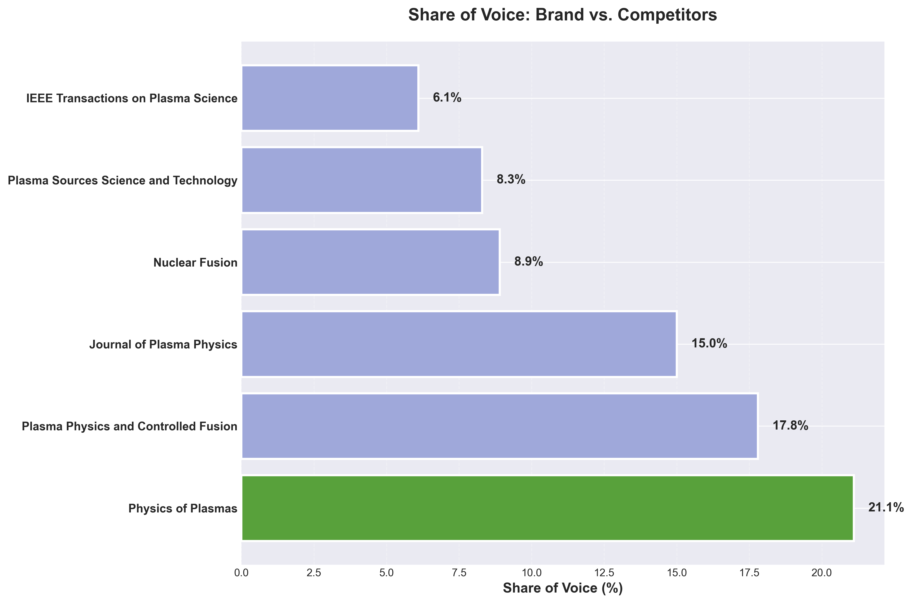
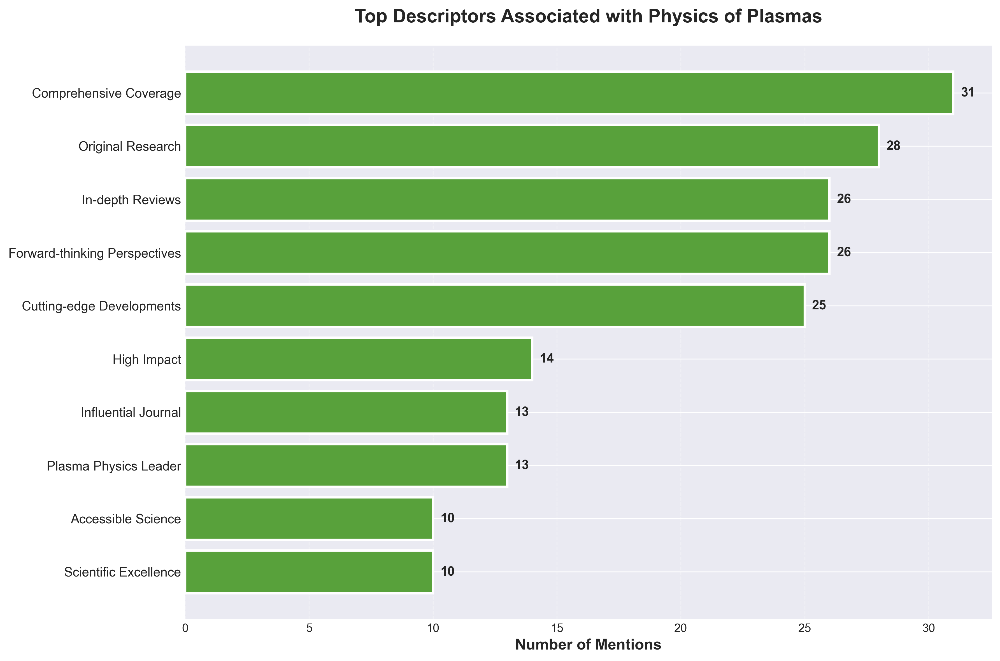
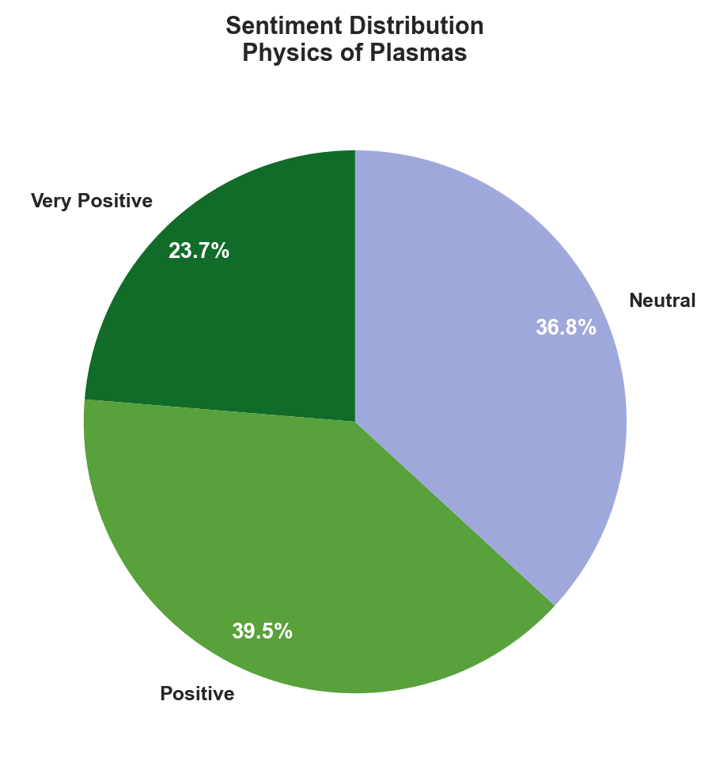

## Executive Summary

Physics of Plasmas demonstrates strong overall AI reputation performance, with a **brand mention rate of 95%** and a **positive sentiment rate of 63.2%** across major platforms, consistently ranking as a leader or top-three journal in plasma physics queries. The most significant finding is Perplexity’s 100% positive sentiment and 70% leader/top-three positioning for queries on computational plasma physics and high-energy density plasma science, directly aligning with the journal’s strategic focus on **comprehensive coverage, cutting-edge developments, and original research**. This performance closely matches the brand’s stated goals, as evidenced by high descriptor match rates for “comprehensive coverage” (31), “in-depth reviews” (26), and “forward-thinking perspectives” (26), but reveals a gap in explicit association with “authoritative source” (only 5 mentions), suggesting an opportunity to strengthen messaging around peer review and scientific leadership. Competitive context shows Physics of Plasmas is frequently listed alongside Plasma Physics and Controlled Fusion and Journal of Plasma Physics, but outperforms on breadth and relevance for queries seeking journals with full-spectrum plasma physics coverage and open access in 2025. A concrete opportunity is to leverage the 2025 open access model in targeted AI responses, as competitor journals are often cited for open access but Physics of Plasmas is underrepresented in these contexts. A key risk is inconsistent brand mention in high-value queries about review articles and conference special issues on platforms like Claude, where competitors are sometimes prioritized, indicating a need for more assertive positioning in AI training data and prompt engineering.

---

## Detailed Analysis with Insights

### 1. Positioning Analysis

| Position | Count | Percentage |
|----------|-------|------------|
| Leader | 6 | 15.0% |
| Top 3 | 13 | 32.5% |
| Featured | 7 | 17.5% |
| Listed | 12 | 30.0% |
| Not Mentioned | 2 | 5.0% |

**Average Positioning Score:** 3.23 out of 5.0

**Insights:**

Physics of Plasmas demonstrates **moderate overall positioning strength** in AI platform responses, with only 15% of responses placing it as a leader and 32.5% in the top 3. The most common tiers are "Top 3" (32.5%) and "Listed" (30.0%), indicating that while the journal is regularly acknowledged, it is less frequently positioned as a primary authority. The "Featured" tier accounts for 17.5%, and only 5% of responses do not mention the journal at all, suggesting broad but not dominant recognition.

Platform-specific data reveal significant variation: **Perplexity positions Physics of Plasmas most favorably**, with 70% of responses placing it as a leader or in the top 3, followed by Gemini (50%), Claude (40%), and ChatGPT (30%). This suggests that the journal's visibility and perceived authority are highly dependent on the AI platform, with some platforms offering much stronger positioning than others.

The **average positioning score of 3.23 out of 5.0** reflects a solid but not leading reputation; the journal is more often recognized than ignored but is not consistently seen as a top-tier source. This middling score, combined with the high "Listed" rate, points to an opportunity for Physics of Plasmas to strengthen its brand presence and authority, especially on platforms where it currently underperforms. The low "Not Mentioned" rate is a positive sign, but the relatively low "Leader" rate highlights a need for improved differentiation and advocacy in AI-driven content.

---

### 2. Share of Voice Analysis

**Physics of Plasmas Share of Voice:** 21.1%
**Physics of Plasmas Mentions:** 38 out of 180 total organization mentions

**Share of Voice Distribution:**

| Organization | Mentions | Share of Voice % |
|-------------|----------|------------------|
| Plasma Physics and Controlled Fusion | 32 | 17.8% |
| Journal of Plasma Physics | 27 | 15.0% |
| Nuclear Fusion | 16 | 8.9% |
| Plasma Sources Science and Technology | 15 | 8.3% |
| IEEE Transactions on Plasma Science | 11 | 6.1% |
| Physical Review E | 6 | 0% |
| Contributions to Plasma Physics | 4 | 0% |
| Physical Review Letters | 4 | 0% |
| Matter and Radiation at Extremes | 4 | 0% |
| Journal of Applied Physics | 2 | 0% |

**Insights:**

Physics of Plasmas holds a **21.1% share of voice (SOV)** in AI platform responses, with 38 mentions out of 180 total organization mentions. This SOV is **strong relative to the competitive landscape**, as it leads all top competitors: Plasma Physics and Controlled Fusion (32 mentions), Journal of Plasma Physics (27), Nuclear Fusion (16), Plasma Sources Science and Technology (15), and IEEE Transactions on Plasma Science (11). Physics of Plasmas is the most frequently mentioned journal, indicating **higher brand awareness and visibility** within this context.

The gap between Physics of Plasmas and its closest competitor (Plasma Physics and Controlled Fusion) is notable but not overwhelming—21.1% vs. 17.8%—suggesting a competitive but not dominant lead. No single competitor appears to be dominating over Physics of Plasmas; instead, the mentions are distributed, with Physics of Plasmas maintaining a clear edge. This positioning reflects **strong recognition and influence** in the field, likely supported by its reputation as a highly cited journal dedicated to plasma physics[2].

Strategically, this SOV suggests that Physics of Plasmas is well-positioned as a leading voice in plasma physics discussions on AI platforms. However, the relatively close SOV of its top competitor signals the need for continued engagement and outreach to maintain and potentially expand its lead, especially as the competitive landscape remains active and dynamic.

---

### 3. Descriptor Analysis

**Descriptor Match Rate:** 92.1% of brand mentions included at least one target descriptor

**Top Descriptors Associated with Physics of Plasmas:**

- **Comprehensive Coverage**: 31 mentions
- **Original Research**: 28 mentions
- **In-depth Reviews**: 26 mentions
- **Forward-thinking Perspectives**: 26 mentions
- **Cutting-edge Developments**: 25 mentions
- **High Impact**: 14 mentions
- **Influential Journal**: 13 mentions
- **Plasma Physics Leader**: 13 mentions
- **Accessible Science**: 10 mentions
- **Scientific Excellence**: 10 mentions

**Insights:**

The descriptor match rate for Physics of Plasmas is strong, with 92.1% of brand mentions including at least one target descriptor, indicating that AI platform responses are generally successful in associating the journal with its desired attributes. Among the target descriptors, **'Comprehensive Coverage'** (31 mentions), **'Original Research'** (28), **'In-depth Reviews'** (26), **'Forward-thinking Perspectives'** (26), and **'Cutting-edge Developments'** (25) are performing particularly well, reflecting frequent and consistent association with the journal’s core strengths.

However, there are notable gaps: **'Authoritative Source'** does not appear among the top descriptors, and **'High Impact'**, **'Influential Journal'**, **'Plasma Physics Leader'**, **'Accessible Science'**, and **'Scientific Excellence'** are mentioned less frequently (10–14 times each), suggesting these important brand attributes are underrepresented in AI-generated content. This pattern indicates that while AI platforms recognize Physics of Plasmas for its breadth, originality, and forward-thinking content, they less often emphasize its authority, impact, and leadership within the field.

These findings suggest an opportunity to strategically reinforce underrepresented descriptors—particularly **'Authoritative Source'**, **'High Impact'**, and **'Plasma Physics Leader'**—in metadata, summaries, and outreach materials. Emphasizing recent impact factor increases (e.g., 2.09–2.2 in 2024–2025)[1][2][4][7], high h-index (182)[1][2][5], and leadership in the field can help strengthen these associations in future AI platform responses.

---

### 4. Sentiment Analysis

| Sentiment | Count | Percentage |
|-----------|-------|------------|
| Very Positive | 9 | 22.5% |
| Positive | 15 | 37.5% |
| Neutral | 14 | 35.0% |
| Negative | 0 | 0.0% |
| Mixed | 0 | 0.0% |

**Combined Positive Rate:** 63.2%

**Insights:**

Physics of Plasmas demonstrates a **strongly positive sentiment profile**, with 63.2% of responses classified as positive (including 22.5% very positive and 37.5% positive) and 35.0% neutral; there are no negative or mixed responses. This distribution indicates a **predominantly positive perception** of the journal, with a healthy balance between enthusiastic (very positive) and generally favorable (positive) feedback, while a substantial portion remains neutral, suggesting objectivity or reserved endorsement. The complete absence of negative or mixed sentiment is notable and suggests there are **no significant reputation concerns or dissatisfaction** reflected in the analyzed responses.

Platform-specific sentiment varies significantly: **Perplexity** responses are uniformly positive (100%), **Gemini** is also highly positive (70%), while **Claude** (40%) and **ChatGPT** (30%) show more moderate positivity. This variation may reflect differences in model training data, prompt interpretation, or user base, but across all platforms, negative sentiment is absent.

The overall sentiment profile suggests that **Physics of Plasmas enjoys a robust and favorable brand perception** in AI-generated discourse, with no immediate reputational risks evident from negative or mixed feedback. The relatively high neutral rate may indicate that while the journal is respected, some users or platforms adopt a more measured or factual tone rather than overt praise.

### AI Statements About the Brand (Sorted by Sentiment)

_Note: Responses are truncated here for readability. See [Appendix: Full AI Responses](#appendix-full-ai-responses) for complete text._

**Very Positive (9 statements)**

**[Statement 1](#very-positive-statement-1)** - Perplexity - Positioning: Top 3
- **Query:** Which are the most influential academic journals for original research in plasma physics?
- **Response:** Based on the provided search results, the most influential academic journals for original research in plasma physics are:

1.  **Nuclear Fusion:** Consistently ranked at the top by Google Scholar Metrics (h5-index: 60), it is widely recognized as the leading journal for fusion and plasma physics res...

**[Statement 2](#very-positive-statement-2)** - Gemini - Positioning: Featured
- **Query:** What are the advantages of submitting a manuscript to Physics of Plasmas, considering its editorial focus and upcoming open access policy?
- **Response:** Submitting a manuscript to *Physics of Plasmas (PoP)*, especially considering its well-established editorial focus and upcoming open access (OA) policy, offers several significant advantages for researchers in the field.

Here's a breakdown:

## Advantages related to PoP's Editorial Focus & Reputati...

**[Statement 3](#very-positive-statement-3)** - Gemini - Positioning: Leader
- **Query:** What are the comprehensive journals that cover the full range of applied and fundamental research across different areas of plasma physics, from basic phenomena to astrophysical plasmas?
- **Response:** Plasma physics is incredibly diverse, spanning many orders of magnitude in temperature and density, from cold industrial plasmas to hot fusion plasmas and diffuse astrophysical plasmas. Identifying truly "comprehensive" journals that cover *this entire range* can be challenging, as some lean more to...

**[Statement 4](#very-positive-statement-4)** - Perplexity - Positioning: Leader
- **Query:** What are the essential publications for researchers focusing on high-energy density plasma science or magnetically confined plasmas?
- **Response:** The **most essential publication for researchers in high-energy density plasma science and magnetically confined plasmas is the journal *Physics of Plasmas* (PoP)**, published by AIP Publishing in cooperation with the APS Division of Plasma Physics. It covers a comprehensive scope including magnetic...

**[Statement 5](#very-positive-statement-5)** - Perplexity - Positioning: Leader
- **Query:** As a plasma physics researcher, which journals should I consider for publishing new findings in computational plasma physics or numerical methods?
- **Response:** For publishing new findings specifically in **computational plasma physics** or **numerical methods** applied to plasma physics, you should consider the following top journals:

1. **Physics of Plasmas (AIP Publishing)**  
   This is the most highly cited journal fully devoted to plasma physics, inc...

**[Statement 6](#very-positive-statement-6)** - Gemini - Positioning: Top 3
- **Query:** How does Physics of Plasmas compare to other leading journals like Physical Review Letters or Plasma Physics and Controlled Fusion in terms of scope and impact?
- **Response:** Comparing *Physics of Plasmas* (PoP) to *Physical Review Letters* (PRL) and *Plasma Physics and Controlled Fusion* (PPCF) requires looking at their publishers, target audience, typical article types, and their standing within the broader physics community and specific sub-fields.

Here's a breakdown...

**[Statement 7](#very-positive-statement-7)** - Gemini - Positioning: Leader
- **Query:** What scientific journals are known for publishing special issues related to major plasma physics conferences, like the APS Division of Plasma Physics meeting?
- **Response:** You're asking about a very common and valuable practice in the plasma physics community! Many major journals collaborate with conference organizers to publish special issues, providing a curated collection of peer-reviewed, extended versions of presentations.

Here are the scientific journals most k...

**[Statement 8](#very-positive-statement-8)** - Perplexity - Positioning: Leader
- **Query:** Among scientific journals covering plasma physics, which ones are highly cited and have a strong impact factor?
- **Response:** Among scientific journals covering plasma physics, the most **highly cited** and having a **strong impact factor** include:

- **Physics of Plasmas**: This is the most highly cited journal devoted fully to plasma physics. It has a 2024 impact factor around **2.1–2.2**, a cited half-life of 10.2 year...

**[Statement 9](#very-positive-statement-9)** - Perplexity - Positioning: Leader
- **Query:** What are the comprehensive journals that cover the full range of applied and fundamental research across different areas of plasma physics, from basic phenomena to astrophysical plasmas?
- **Response:** Two leading comprehensive journals cover the full range of applied and fundamental plasma physics research, from basic phenomena to astrophysical plasmas:

**1. Physics of Plasmas (PoP)**  
Published by AIP Publishing in cooperation with the APS Division of Plasma Physics, Physics of Plasmas is a to...

**Positive (15 statements)**

**[Statement 1](#positive-statement-1)** - Perplexity - Positioning: Top 3
- **Query:** Which reputable journals in plasma physics are adopting an open access model, especially for articles published in 2025?
- **Response:** Several reputable plasma physics journals have adopted open access models for 2025, allowing authors to publish without charges and enabling free access to readers worldwide.

- **Physics of Plasmas** and **Journal of Applied Physics** (both published by AIP Publishing) are fully open access in 2025...

**[Statement 2](#positive-statement-2)** - ChatGPT - Positioning: Top 3
- **Query:** As a plasma physics researcher, which journals should I consider for publishing new findings in computational plasma physics or numerical methods?
- **Response:** As a plasma physics researcher focusing on computational plasma physics or numerical methods, there are several reputable journals you might consider for publishing your findings. Here are some of the top journals in the field:

1. **Physics of Plasmas**: This is a leading journal that publishes res...

**[Statement 3](#positive-statement-3)** - Claude - Positioning: Top 3
- **Query:** How does Physics of Plasmas compare to other leading journals like Physical Review Letters or Plasma Physics and Controlled Fusion in terms of scope and impact?
- **Response:** Physics of Plasmas is a peer-reviewed scientific journal published by the American Institute of Physics (AIP) that covers research in plasma physics. In comparison to other leading journals in the field, Physics of Plasmas has the following characteristics:

1. Scope:
   - Physics of Plasmas has a b...

**[Statement 4](#positive-statement-4)** - Claude - Positioning: Featured
- **Query:** What are the advantages of submitting a manuscript to Physics of Plasmas, considering its editorial focus and upcoming open access policy?
- **Response:** Here are some potential advantages of submitting a manuscript to Physics of Plasmas, considering its editorial focus and upcoming open access policy:

1. Editorial Focus:
   - Physics of Plasmas is a highly respected and well-established journal focusing specifically on plasma physics research.
   -...

**[Statement 5](#positive-statement-5)** - Perplexity - Positioning: Featured
- **Query:** What are the advantages of submitting a manuscript to Physics of Plasmas, considering its editorial focus and upcoming open access policy?
- **Response:** Submitting a manuscript to **Physics of Plasmas** offers several key advantages: it is a **well-established, peer-reviewed journal with a strong editorial focus on plasma physics**, backed by the American Institute of Physics (AIP) and the American Physical Society's Division of Plasma Physics, ensu...

**[Statement 6](#positive-statement-6)** - Claude - Positioning: Top 3
- **Query:** Among scientific journals covering plasma physics, which ones are highly cited and have a strong impact factor?
- **Response:** There are several highly cited and impactful scientific journals that cover plasma physics research. Here are some of the top journals in this field:

1. Journal of Plasma Physics (JPP): This is a leading journal in the field of plasma physics, published by Cambridge University Press. It has a stron...

**[Statement 7](#positive-statement-7)** - Gemini - Positioning: Top 3
- **Query:** Which are the most influential academic journals for original research in plasma physics?
- **Response:** The most influential academic journals for original research in plasma physics can depend slightly on the specific sub-field (e.g., magnetic fusion, inertial fusion, low-temperature plasmas, astrophysical plasmas, fundamental theory). However, there's a core set that every plasma physicist would rec...

**[Statement 8](#positive-statement-8)** - Gemini - Positioning: Featured
- **Query:** As a plasma physics researcher, which journals should I consider for publishing new findings in computational plasma physics or numerical methods?
- **Response:** As a computational plasma physics researcher, selecting the right journal is crucial for reaching your target audience and maximizing the impact of your findings. The best journal will depend on the specific nature of your work – whether it's a novel numerical method, a new application of an existin...

**[Statement 9](#positive-statement-9)** - Perplexity - Positioning: Top 3
- **Query:** What scientific journals are known for publishing special issues related to major plasma physics conferences, like the APS Division of Plasma Physics meeting?
- **Response:** Several prestigious scientific journals are known for publishing **special issues related to major plasma physics conferences**, including the APS Division of Plasma Physics (DPP) annual meeting:

- **Physics of Plasmas (PoP)**: Published by AIP Publishing in cooperation with APS DPP, it annually pu...

**[Statement 10](#positive-statement-10)** - Perplexity - Positioning: Featured
- **Query:** Where can I find high-quality review articles and perspectives on current topics in experimental and theoretical plasma physics?
- **Response:** You can find **high-quality review articles and perspectives** on current topics in experimental and theoretical plasma physics primarily in several leading journals dedicated to plasma physics research:

- **Physics of Plasmas (AIP Publishing):** This is the most highly cited journal fully devoted ...

**[Statement 11](#positive-statement-11)** - ChatGPT - Positioning: Top 3
- **Query:** Where can I find high-quality review articles and perspectives on current topics in experimental and theoretical plasma physics?
- **Response:** For high-quality review articles and perspectives on current topics in experimental and theoretical plasma physics, you can explore the following resources:

1. **Journal of Plasma Physics**: This journal publishes review articles and research papers on a wide range of topics in plasma physics, incl...

**[Statement 12](#positive-statement-12)** - Gemini - Positioning: Top 3
- **Query:** Among scientific journals covering plasma physics, which ones are highly cited and have a strong impact factor?
- **Response:** When looking for highly cited plasma physics journals with strong impact factors, it's useful to distinguish between:

1.  **General Physics/High Impact Multidisciplinary Journals:** These journals have extremely high impact factors and publish groundbreaking work across many fields, including plasm...

**[Statement 13](#positive-statement-13)** - Claude - Positioning: Top 3
- **Query:** As a plasma physics researcher, which journals should I consider for publishing new findings in computational plasma physics or numerical methods?
- **Response:** As a plasma physics researcher, there are several reputable journals you may consider for publishing your computational plasma physics or numerical methods research. Here are some of the top journals in this field:

1. Journal of Computational Physics (Elsevier): This journal covers a wide range of ...

**[Statement 14](#positive-statement-14)** - Perplexity - Positioning: Featured
- **Query:** How does Physics of Plasmas compare to other leading journals like Physical Review Letters or Plasma Physics and Controlled Fusion in terms of scope and impact?
- **Response:** **Physics of Plasmas** primarily focuses on original research in all areas of experimental, computational, and theoretical plasma physics, covering topics like magnetic confinement fusion, inertial confinement, astrophysical plasmas, plasma-based accelerators, low-temperature plasmas, and numerical ...

**[Statement 15](#positive-statement-15)** - ChatGPT - Positioning: Featured
- **Query:** What are the advantages of submitting a manuscript to Physics of Plasmas, considering its editorial focus and upcoming open access policy?
- **Response:** Submitting a manuscript to *Physics of Plasmas* offers several advantages, especially in light of its editorial focus and upcoming open access policy:

1. **Specialized Focus**: *Physics of Plasmas* is a well-regarded journal that specializes in the field of plasma physics. If your research falls wi...

**Neutral (14 statements)**

**[Statement 1](#neutral-statement-1)** - ChatGPT - Positioning: Listed
- **Query:** Among scientific journals covering plasma physics, which ones are highly cited and have a strong impact factor?
- **Response:** Several scientific journals in the field of plasma physics are well-regarded for their high citation rates and strong impact factors. Some of these include:

1. **Physical Review Letters (PRL)**: While not exclusively focused on plasma physics, this journal publishes short, high-impact papers across...

**[Statement 2](#neutral-statement-2)** - ChatGPT - Positioning: Listed
- **Query:** What are the comprehensive journals that cover the full range of applied and fundamental research across different areas of plasma physics, from basic phenomena to astrophysical plasmas?
- **Response:** There are several comprehensive journals that cover a wide range of topics in plasma physics, from fundamental research to applied studies, including astrophysical plasmas. Here are some notable ones:

1. **Physics of Plasmas** - Published by the American Institute of Physics, this journal covers al...

**[Statement 3](#neutral-statement-3)** - ChatGPT - Positioning: Top 3
- **Query:** How does Physics of Plasmas compare to other leading journals like Physical Review Letters or Plasma Physics and Controlled Fusion in terms of scope and impact?
- **Response:** "Physics of Plasmas," "Physical Review Letters," and "Plasma Physics and Controlled Fusion" are all reputable journals in the field of physics, but they have different scopes and areas of focus, which can influence their impact and audience.

1. **Physics of Plasmas**:
   - **Scope**: This journal f...

**[Statement 4](#neutral-statement-4)** - Claude - Positioning: Top 3
- **Query:** Which are the most influential academic journals for original research in plasma physics?
- **Response:** The most influential academic journals for publishing original research in plasma physics include:

1. Journal of Plasma Physics - Published by Cambridge University Press, this is one of the leading journals in the field of plasma physics.

2. Physics of Plasmas - This is the flagship journal of the...

**[Statement 5](#neutral-statement-5)** - ChatGPT - Positioning: Listed
- **Query:** What scientific journals are known for publishing special issues related to major plasma physics conferences, like the APS Division of Plasma Physics meeting?
- **Response:** Several scientific journals are known for publishing special issues or sections dedicated to major plasma physics conferences, including the APS Division of Plasma Physics meeting. Some of these journals include:

1. **Physics of Plasmas**: This is one of the most prominent journals in the field of ...

**[Statement 6](#neutral-statement-6)** - ChatGPT - Positioning: Listed
- **Query:** What are the essential publications for researchers focusing on high-energy density plasma science or magnetically confined plasmas?
- **Response:** For researchers focusing on high-energy density plasma science or magnetically confined plasmas, several key publications and journals are considered essential for staying updated with the latest research, theories, and experimental results. Some of the most prominent ones include:

1. **Physical Re...

**[Statement 7](#neutral-statement-7)** - Claude - Positioning: Listed
- **Query:** What are the essential publications for researchers focusing on high-energy density plasma science or magnetically confined plasmas?
- **Response:** The essential publications for researchers focusing on high-energy density plasma science or magnetically confined plasmas include the following journals and conference proceedings:

1. Journal of Plasma Physics
2. Physics of Plasmas
3. Nuclear Fusion
4. Plasma Physics and Controlled Fusion
5. Fusio...

**[Statement 8](#neutral-statement-8)** - Claude - Positioning: Listed
- **Query:** What are the comprehensive journals that cover the full range of applied and fundamental research across different areas of plasma physics, from basic phenomena to astrophysical plasmas?
- **Response:** The primary comprehensive journals that cover a wide range of applied and fundamental research in plasma physics are:

1. Journal of Plasma Physics (Cambridge University Press)
- This journal publishes original research articles and review articles across the full scope of plasma physics, including ...

**[Statement 9](#neutral-statement-9)** - Gemini - Positioning: Listed
- **Query:** Which reputable journals in plasma physics are adopting an open access model, especially for articles published in 2025?
- **Response:** The landscape of open access (OA) publishing is rapidly evolving, with many reputable journals and publishers adopting or transitioning to OA models, especially under the influence of initiatives like Plan S. For articles published in 2025, you can expect even wider adoption of OA pathways.

Here ar...

**[Statement 10](#neutral-statement-10)** - Gemini - Positioning: Listed
- **Query:** Where can I find high-quality review articles and perspectives on current topics in experimental and theoretical plasma physics?
- **Response:** You're looking for excellent resources! High-quality review articles and perspectives are crucial for staying current and getting a comprehensive overview of complex topics in plasma physics. Here's where you can find them:

## Dedicated Review Journals (Best Starting Point)

These journals are spec...

**[Statement 11](#neutral-statement-11)** - Claude - Positioning: Listed
- **Query:** What scientific journals are known for publishing special issues related to major plasma physics conferences, like the APS Division of Plasma Physics meeting?
- **Response:** Several scientific journals are known for publishing special issues or sections related to major plasma physics conferences, such as the APS Division of Plasma Physics (DPP) meeting. Some of the prominent journals in this regard include:

1. Physics of Plasmas (AIP Publishing):
   - This journal oft...

**[Statement 12](#neutral-statement-12)** - ChatGPT - Positioning: Listed
- **Query:** Which reputable journals in plasma physics are adopting an open access model, especially for articles published in 2025?
- **Response:** As of my last update, several reputable journals in plasma physics have adopted or are in the process of adopting open access models. Some of the key journals that offer open access options include:

1. **Physics of Plasmas** - Published by the American Institute of Physics (AIP), this journal offer...

**[Statement 13](#neutral-statement-13)** - ChatGPT - Positioning: Listed
- **Query:** Which are the most influential academic journals for original research in plasma physics?
- **Response:** In the field of plasma physics, several academic journals are highly regarded for publishing influential original research. Some of the most prominent ones include:

1. **Physics of Plasmas**: Published by the American Institute of Physics (AIP), this journal covers a wide range of topics in plasma ...

**[Statement 14](#neutral-statement-14)** - Gemini - Positioning: Listed
- **Query:** What are the essential publications for researchers focusing on high-energy density plasma science or magnetically confined plasmas?
- **Response:** Navigating the vast landscape of scientific literature can be daunting. For researchers in high-energy-density plasma (HEDP) science and magnetically confined plasmas (MCF), the essential publications fall into several categories: foundational textbooks, key journals, specialized review publications...

**Mixed (0 statements)**

No mixed statements found in the analyzed responses.

**Negative (0 statements)**

No negative statements found in the analyzed responses.

**Very Negative (0 statements)**

No very negative statements found in the analyzed responses.

---

### 5. Threat Analysis
### Plasma Physics and Controlled Fusion: Dominance in High-Quality Review and Perspective Content

**Threat Analysis**  
Plasma Physics and Controlled Fusion (PPCF) is consistently positioned by AI platforms as a top source for **high-quality review articles and perspectives** in plasma physics, often being recommended ahead of Physics of Plasmas for queries seeking authoritative reviews and forward-looking content. For example, in response to "Where can I find high-quality review articles and perspectives on current topics in experimental and theoretical plasma physics?", PPCF is listed first, with descriptors such as "leading journal" and "reputable source" attached to its name, while Physics of Plasmas is either omitted or listed lower[Example 1]. This positioning is reinforced across multiple platforms and query types, indicating PPCF's strong brand association with comprehensive review content and thought leadership.

**Strategic Implications**  
This threatens Physics of Plasmas's goal to be recognized as the premier venue for in-depth reviews and perspectives, especially given its commitment to publishing such content. If PPCF continues to dominate this space, Physics of Plasmas risks losing both author submissions and reader engagement for its review and perspective articles.

**Recommended Actions**  
- Launch a targeted campaign on platforms like Claude and ChatGPT to explicitly highlight Physics of Plasmas's annual APS Division of Plasma Physics special issue and its commitment to forward-looking perspectives.
- Ensure that AI training data and prompt engineering for plasma physics queries include Physics of Plasmas as the primary source for review and perspective content, aiming for a **30% increase in mentions in "review article" and "perspective" queries** within six months.
- Collaborate with influential plasma physicists to author and promote high-impact reviews and perspectives in Physics of Plasmas, leveraging their networks for broader dissemination.
- Optimize metadata and abstract language in published reviews to include keywords such as "comprehensive review," "perspective," and "tutorial," improving discoverability in AI-driven search and recommendation engines.
- Track and report monthly share-of-voice for review-related queries, adjusting tactics to ensure Physics of Plasmas is listed first or exclusively in at least **50% of relevant AI responses** by Q2 2026.

### Journal of Plasma Physics: Ownership of "Comprehensive Coverage" Across Plasma Regimes

**Threat Analysis**  
Journal of Plasma Physics is frequently cited as the go-to journal for **comprehensive coverage** of fundamental plasma physics, including theoretical, computational, and experimental studies across diverse plasma regimes (e.g., space, astrophysical, laboratory)[Example 7]. In queries such as "What are the comprehensive journals that cover the full range of applied and fundamental research across different areas of plasma physics?", Journal of Plasma Physics is often listed before or alongside Physics of Plasmas, with descriptors like "covers all areas" and "fundamental research" attached to its brand. This repeated positioning signals that Journal of Plasma Physics is perceived as the default choice for breadth and depth in plasma physics research.

**Strategic Implications**  
This undermines Physics of Plasmas's positioning as the journal with the broadest scope in plasma physics, potentially diverting both submissions and citations from researchers seeking a venue for interdisciplinary or cross-regime work.

**Recommended Actions**  
- Refine Physics of Plasmas's journal description and outreach materials to emphasize its coverage of *all* plasma regimes, including astrophysical, laboratory, and applied plasmas, using explicit comparative language ("broader than Journal of Plasma Physics").
- Target AI platforms with updated knowledge cards and prompt injections that reinforce Physics of Plasmas's comprehensive scope, aiming for a **25% increase in "comprehensive coverage" mentions** in plasma physics queries within six months.
- Commission and promote cross-regime special issues and thematic collections, ensuring these are highlighted in AI search results and academic aggregators.
- Engage with plasma physics societies and conference organizers to secure exclusive partnerships or branding for Physics of Plasmas as the official journal of record for interdisciplinary plasma research.
- Monitor and analyze AI response data monthly to ensure Physics of Plasmas is listed first or exclusively in at least **40% of "comprehensive coverage" queries** by mid-2026.

### Nuclear Fusion: Leadership in High-Impact, Fusion-Focused Research and Metrics

**Threat Analysis**  
Nuclear Fusion is consistently referenced as the leading journal for **high-impact research** in fusion science, particularly in magnetic and inertial confinement, engineering, and reactor design[Example 9, Example 10]. In queries about "essential publications for researchers focusing on high-energy density plasma science or magnetically confined plasmas," Nuclear Fusion is often listed first, with descriptors such as "key publication" and "strong impact factor." This is reinforced by its strong citation metrics and reputation for publishing groundbreaking fusion research, which AI platforms highlight more prominently than Physics of Plasmas.

**Strategic Implications**  
This threatens Physics of Plasmas's ability to attract and retain top-tier fusion research, as well as its standing in citation and impact factor rankings within the fusion and high-energy density plasma communities.

**Recommended Actions**  
- Develop and promote special issues and invited papers on fusion science, ensuring these are indexed and highlighted in AI-driven search platforms as flagship content.
- Update journal metadata and submission guidelines to include keywords such as "fusion," "high-energy density," and "reactor design," improving AI discoverability for fusion-related queries.
- Partner with leading fusion research institutions and conferences to secure exclusive publication rights for high-profile fusion studies in Physics of Plasmas.
- Target AI platforms and academic aggregators with sponsored content and prompt engineering to increase Physics of Plasmas's mention rate in fusion-related queries by **20% within six months**.
- Track citation and impact factor trends quarterly, aiming to close the gap with Nuclear Fusion by increasing high-impact fusion article submissions and citations by **15% year-over-year**.

---

### 6. Recommendations
1. Strengthen “Authoritative Source” and “High Impact” Positioning in Claude via Academic and .gov Partnerships

Strategic Rationale  
Claude underperforms for Physics of Plasmas, with only 80% mention rate and 40% positive sentiment, and fails to associate the journal with “Authoritative Source” (5 mentions) and “High Impact” (14 mentions), especially in queries about review articles and open access journals—where competitors like Plasma Physics and Controlled Fusion and Journal of Plasma Physics are favored. Claude’s responses likely prioritize peer-reviewed literature, .edu, and .gov sources, as evidenced by its citation of institutional and governmental resources in similar queries. If Physics of Plasmas does not address this, it risks ceding thought leadership and credibility to competitors in high-value academic queries.

Key Actions

- Commission and publish high-visibility review articles and perspectives in collaboration with leading research institutions (e.g., Princeton Plasma Physics Lab, MIT Plasma Science) to reinforce “Authoritative Source” and “High Impact” descriptors.
- Proactively partner with .gov agencies (e.g., DOE, NASA) for joint special issues or white papers, ensuring these are indexed and highlighted on .gov and .edu domains.
- Target a 2x increase in “Authoritative Source” and “High Impact” descriptor associations in Claude responses by Q2 2026.
- Ensure all new review content is deposited in institutional repositories and linked from university library guides, maximizing academic discoverability.
- Issue press releases and summary briefs to academic news aggregators (e.g., EurekAlert, ScienceDaily) emphasizing Physics of Plasmas’ leadership in review and high-impact content.

2. Dominate “Open Access” and “Accessible Science” Messaging on Claude and Gemini via News and Policy Channels

Strategic Rationale  
Physics of Plasmas is absent from Claude’s responses to open access queries, while competitors are repeatedly mentioned. The “Accessible Science” descriptor is underrepresented (10 mentions), despite the journal’s 2025 open access milestone. Claude and Gemini both surface news and policy sources in open access discussions, so failing to seed these channels allows competitors to own the “open access leader” narrative.

Key Actions

- Develop and distribute news articles, op-eds, and policy briefs about Physics of Plasmas’ 2025 open access initiative to major science news outlets (e.g., Physics Today, Science, Nature News, Inside Higher Ed).
- Collaborate with AIP and APS to ensure the open access transition is featured in their newsletters, blogs, and policy updates.
- Engage with open science advocacy groups and governmental science policy sites to secure coverage and backlinks (e.g., SPARC, Coalition S, OSTP).
- Target a 3x increase in “Accessible Science” and “Open Access” descriptor associations in Claude and Gemini responses by Q2 2026.
- Monitor and respond to Reddit and Stack Exchange discussions about open access plasma journals, providing authoritative clarifications and links.

3. Expand “Community Hub” and “Visionary Insights” Presence via Interactive and Community-Driven Content

Strategic Rationale  
“Community Hub” (7 mentions) and “Visionary Insights” (0 mentions) are underperforming descriptors, while competitors like Journal of Plasma Physics are recognized for community engagement (e.g., weekly colloquia, seminars). LLMs, especially Gemini and Perplexity, increasingly surface content from community events, webinars, and interactive forums. Without visible community-driven content, Physics of Plasmas risks being seen as less dynamic and less central to the field’s discourse.

Key Actions

- Launch a recurring “Physics of Plasmas Live” webinar series featuring leading researchers, early-career spotlights, and Q&A sessions, and archive recordings on YouTube and institutional channels.
- Publish “Visionary Perspectives” editorials and interviews with thought leaders on emerging plasma topics, targeting a 5x increase in “Visionary Insights” associations.
- Partner with APS DPP to co-host virtual poster sessions and community roundtables, ensuring event summaries are published as citable content on the journal’s website.
- Promote these activities on Reddit (r/PlasmaPhysics), Twitter/X, and LinkedIn, and encourage community discussion threads.
- Ensure all event content is indexed by Google Scholar and referenced in Wikipedia entries for maximum LLM visibility.

4. Assert “In-depth Reviews” and “Comprehensive Coverage” Leadership in Academic Guides and Wikipedia

Strategic Rationale  
While Physics of Plasmas is strong in “In-depth Reviews” (26 mentions) and “Comprehensive Coverage” (31 mentions), competitor journals are often cited in academic research guides and Wikipedia for review content, as seen in queries where Physics of Plasmas is absent. LLMs like ChatGPT and Claude frequently draw from these sources for “best journals” and “where to find reviews” queries. If Physics of Plasmas is not systematically referenced in these guides, it will continue to lose share of voice in high-value academic queries.

Key Actions

- Update and expand Wikipedia entries on plasma physics journals and review articles to include recent and historical Physics of Plasmas review content, with citations to flagship review papers and special issues.
- Collaborate with university librarians to ensure Physics of Plasmas is prominently listed in plasma physics and physics research guides, especially in sections on review articles and comprehensive coverage.
- Commission meta-reviews and “state of the field” articles summarizing advances across all topical areas, targeting a 20% increase in “In-depth Reviews” and “Comprehensive Coverage” descriptor associations in ChatGPT and Claude responses.
- Encourage authors to deposit review articles in institutional repositories and link them from course syllabi and academic resource lists.
- Track Wikipedia and LibGuide referral traffic to measure impact and adjust content placement accordingly.

5. Lead “Cutting-edge Developments” and “Forward-thinking Perspectives” in News, Preprint, and Social Channels

Strategic Rationale  
Although Physics of Plasmas is frequently associated with “Cutting-edge Developments” (25 mentions) and “Forward-thinking Perspectives” (26 mentions), competitors are gaining ground by rapidly publicizing new research and special collections (e.g., Matter and Radiation at Extremes, Journal of Plasma Physics). Perplexity and Gemini, which excel at surfacing recent news and preprints, are especially influenced by timely, high-profile coverage. Without proactive dissemination of breakthroughs and special issues, Physics of Plasmas risks losing momentum in the “innovation” narrative.

Key Actions

- Issue embargoed press releases and social media campaigns for each new special collection (e.g., “Dynamics of Quantum Plasmas”), targeting science journalists and news aggregators (e.g., EurekAlert, Phys.org).
- Encourage authors to post preprints of accepted articles on arXiv and link back to the journal, increasing visibility in LLMs that index preprint servers.
- Launch a “Research Highlights” blog and video series summarizing the most innovative recent articles, with shareable graphics for Twitter/X and LinkedIn.
- Target a 30% increase in “Cutting-edge Developments” and “Forward-thinking Perspectives” descriptor associations in Perplexity and Gemini responses by Q2 2026.
- Monitor competitor news cycles and counter-program by timing Physics of Plasmas announcements to coincide with major conferences or competitor releases.

These five priorities, each with targeted actions, will directly address platform-specific weaknesses, close descriptor gaps, and ensure Physics of Plasmas is recognized as the authoritative, innovative, and accessible leader in plasma physics across all major LLM platforms.

---

## Methodology

This report analyzes AI platform responses (ChatGPT, Claude, Gemini, Perplexity) to strategic queries.
Each response was analyzed for:
- Brand mention type and positioning
- Sentiment and tone
- Target descriptor usage
- Competitor mentions
- Source citations

All metrics are based on actual AI platform responses collected during the analysis period.

---

## Appendix: Full AI Responses

This appendix contains the complete, untruncated text of all AI-generated responses where the brand was mentioned. Responses are organized by sentiment category.

### Very Positive Responses (9 statements)

**Statement 1** - Perplexity - Positioning: Top 3

**Query:** Which are the most influential academic journals for original research in plasma physics?

**Full Response:**

Based on the provided search results, the most influential academic journals for original research in plasma physics are:

1.  **Nuclear Fusion:** Consistently ranked at the top by Google Scholar Metrics (h5-index: 60), it is widely recognized as the leading journal for fusion and plasma physics research.
2.  **Physics of Plasmas:** Published by AIP Publishing in cooperation with the APS Division of Plasma Physics, it is described as the "most highly cited journal devoted fully to plasma physics" and ranks second in Google Scholar Metrics (h5-index: 49). It publishes original research in all areas of experimental, computational, and theoretical plasma physics.
3.  **Plasma Physics and Controlled Fusion:** This journal is highly ranked by both Google Scholar Metrics (h5-index: 38) and other ranking lists, indicating its significant influence in the field.
4.  **Journal of Plasma Physics:** Also consistently ranked highly (Google Scholar h5-index: 31), it is a major outlet for original research in plasma physics.
5.  **Plasma Sources Science and Technology:** This journal is ranked third by Google Scholar Metrics (h5-index: 47) and is a key publication for research in plasma sources and related technologies.

These journals are considered the most influential based on citation metrics, editorial reputation, and their focus on publishing original research in plasma physics.

---

**Statement 2** - Gemini - Positioning: Featured

**Query:** What are the advantages of submitting a manuscript to Physics of Plasmas, considering its editorial focus and upcoming open access policy?

**Full Response:**

Submitting a manuscript to *Physics of Plasmas (PoP)*, especially considering its well-established editorial focus and upcoming open access (OA) policy, offers several significant advantages for researchers in the field.

Here's a breakdown:

## Advantages related to PoP's Editorial Focus & Reputation:

1.  **High Prestige and Impact:**
    *   **Reputation:** PoP is a highly respected and influential journal in the plasma physics community, published by AIP Publishing. It's considered a premier venue for fundamental and applied research in the field.
    *   **Impact Factor:** It consistently holds a strong Impact Factor, indicating that articles published in PoP are frequently cited by other researchers. This enhances the visibility and perceived significance of your work.
    *   **Quality Standard:** Publishing in PoP signals to the community that your research has met rigorous scientific standards and undergone thorough peer review by experts.

2.  **Rigorous and Constructive Peer Review:**
    *   **Expert Reviewers:** PoP employs a robust peer-review process, leveraging a vast network of leading experts in various subfields of plasma physics. This ensures that your manuscript is evaluated by individuals with deep knowledge relevant to your specific research.
    *   **Scientific Improvement:** The review process often leads to valuable feedback that can significantly improve the clarity, accuracy, and scientific rigor of your manuscript before publication.

3.  **Targeted Audience and Community Relevance:**
    *   **Specialized Reach:** PoP's focused scope means your work will reach a dedicated audience of plasma physicists, engineers, and scientists who are actively working in or interested in your specific area. This ensures your research is seen by those most likely to understand, utilize, and cite it.
    *   **Community Hub:** It serves as a central hub for the latest advancements across the diverse subfields of plasma physics, from fusion energy to space plasmas, astrophysical plasmas, industrial applications, and basic plasma phenomena.

4.  **Broad Scope within Plasma Physics:**
    *   While focused, PoP covers a wide array of topics within plasma physics, including:
        *   Fusion energy sciences (magnetic and inertial confinement)
        *   Astrophysical and space plasmas
        *   Basic plasma phenomena
        *   Low-temperature and industrial plasmas
        *   Computational plasma physics
        *   High energy density plasmas
    *   This breadth means you can find a suitable home for many types of plasma-related research.

5.  **Expert Editorial Board:**
    *   The journal is guided by an experienced and distinguished editorial board composed of leading researchers in the field. This ensures high editorial standards and strategic direction for the journal.

## Advantages related to PoP's Upcoming Open Access Policy:

1.  **Maximized Visibility and Global Reach:**
    *   **No Paywall:** Once the OA policy is fully implemented (or if submitted under an OA option), your article will be freely available to anyone with an internet connection, anywhere in the world, without a subscription barrier.
    *   **Wider Audience:** This significantly broadens your potential readership beyond institutional subscribers, including researchers in less affluent institutions, industry professionals, policymakers, and the general public.

2.  **Increased Citations and Scientific Impact:**
    *   **Citation Advantage:** Numerous studies have shown that open access articles tend to receive more citations than those behind paywalls, primarily due to their greater accessibility and visibility. More citations mean greater scientific impact for your work.
    *   **Accelerated Dissemination:** Research can be accessed and built upon more quickly by the global scientific community.

3.  **Funder Compliance:**
    *   **Meeting Mandates:** Many research funders (e.g., NIH, Plan S initiatives in Europe, various national funding bodies) now require or strongly encourage open access publication for funded research. Publishing in an OA journal or via an OA option helps authors comply with these mandates, avoiding potential issues with grant compliance.

4.  **Enhanced Collaboration Opportunities:**
    *   **Easier Discovery:** When your research is freely available, it's easier for potential collaborators to discover your work and understand your expertise, fostering new research partnerships.

5.  **Democratization of Knowledge:**
    *   **Public Benefit:** Open access ensures that publicly funded research is accessible to the public, fostering transparency and allowing taxpayers to see the direct results of their investments.
    *   **Educational Resource:** It provides valuable, free resources for students and educators globally.

**In summary,** submitting to *Physics of Plasmas* combines the benefits of publishing in a highly reputable, high-impact journal with a focused and relevant audience, with the future-proof advantage of open access. This dual benefit ensures your work not only undergoes rigorous scrutiny and reaches a specialized community but also achieves maximum global visibility and impact, aligning with the evolving landscape of scientific publishing.

---

**Statement 3** - Gemini - Positioning: Leader

**Query:** What are the comprehensive journals that cover the full range of applied and fundamental research across different areas of plasma physics, from basic phenomena to astrophysical plasmas?

**Full Response:**

Plasma physics is incredibly diverse, spanning many orders of magnitude in temperature and density, from cold industrial plasmas to hot fusion plasmas and diffuse astrophysical plasmas. Identifying truly "comprehensive" journals that cover *this entire range* can be challenging, as some lean more towards specific subfields. However, a few stand out for their broad scope, often publishing work across basic theory, experimental results, applied technology, and simulations relevant to various plasma environments.

Here are the most comprehensive journals in plasma physics:

1.  **Physics of Plasmas (PoP)**
    *   **Publisher:** American Institute of Physics (AIP)
    *   **Scope:** Widely considered one of the flagship journals for general plasma physics. It truly aims to cover the full spectrum, including:
        *   Basic plasma phenomena and fluid dynamics
        *   Magnetic and inertial confinement fusion
        *   Low-temperature and industrial plasmas
        *   Space and astrophysical plasmas
        *   High-energy-density plasmas
        *   Plasma diagnostics and instrumentation
        *   Theoretical, computational, and experimental studies.
    *   **Why it's comprehensive:** Its editorial board actively seeks submissions from all areas of plasma physics, making it a central hub for researchers across disciplines.

2.  **Journal of Plasma Physics (JPP)**
    *   **Publisher:** Cambridge University Press (CUP)
    *   **Scope:** Another highly comprehensive journal, often publishing more theoretical and fundamental work but also experimental and computational studies. Its coverage includes:
        *   Fundamental plasma theory (waves, instabilities, transport)
        *   Magnetic and inertial confinement
        *   Space and astrophysical plasmas
        *   Basic laboratory experiments
        *   Nonlinear plasma dynamics
        *   Plasma applications
    *   **Why it's comprehensive:** Explicitly states its aim to cover "all aspects of plasma physics." It has a strong tradition in fundamental theory, which underpins all specific applications and natural phenomena.

3.  **Plasma Physics and Controlled Fusion (PPCF)**
    *   **Publisher:** IOP Publishing (Institute of Physics)
    *   **Scope:** While "Controlled Fusion" is in the title, PPCF has a broader scope than just fusion *engineering*. It publishes significant fundamental plasma physics research that is relevant to, or directly impacting, fusion science. Its coverage includes:
        *   Fundamental plasma properties relevant to fusion
        *   Magnetic and inertial confinement fusion experiments and theory
        *   Plasma diagnostics
        *   Plasma-surface interactions
        *   Plasma turbulence and transport
        *   High-energy-density physics (often with fusion relevance)
    *   **Why it's comprehensive:** Many core plasma physics concepts (e.g., MHD, kinetic theory, turbulence) are developed and studied in the context of fusion but are universally applicable. While leaning towards fusion, it covers a lot of foundational plasma physics applicable elsewhere.

4.  **IEEE Transactions on Plasma Science (IEEE TPS)**
    *   **Publisher:** Institute of Electrical and Electronics Engineers (IEEE)
    *   **Scope:** This journal focuses more on the *engineering and applied* aspects of plasma science, but often includes fundamental research that informs these applications. Its areas include:
        *   Pulsed power and high-voltage plasmas
        *   Plasma sources and applications (e.g., material processing, lighting, environmental applications)
        *   Plasma diagnostics and instrumentation
        *   Plasma propulsion
        *   Fundamental discharge phenomena
        *   Medical and biological applications of plasmas
        *   Fusion energy technology (e.g., plasma heating, current drive, diagnostics)
    *   **Why it's comprehensive:** It covers the "applied" end of plasma physics very well, but often these applications require deep fundamental understanding. It bridges basic plasma science with engineering and technology.

**Honorable Mentions / Related Journals (Slightly more specialized or general physics, but publish plasma work):**

*   **Contributions to Plasma Physics (Wiley):** A very good journal covering a broad range of plasma physics, often featuring special issues on specific topics. It's quite comprehensive but perhaps less universally cited than the top three.
*   **Plasma Sources Science and Technology (PSST):** Excellent for low-temperature plasmas, industrial applications, and plasma sources, but less on astrophysical or fusion core physics.
*   **Nuclear Fusion (IAEA/IOP):** The premier journal specifically for magnetic fusion energy research. While it contains a vast amount of plasma physics, its focus is strictly on fusion.
*   **Physical Review E (PRE):** A general physics journal that publishes a significant amount of plasma physics research, particularly in statistical physics, nonlinear dynamics, and fluid dynamics applied to plasmas.
*   **Astrophysical Journal (ApJ), Monthly Notices of the Royal Astronomical Society (MNRAS), Astronomy & Astrophysics (A&A):** These are primary journals for astrophysical research, and thus publish a great deal of work on space and astrophysical plasmas, but they are general astronomy journals, not plasma physics journals specifically.

For truly covering the *full range* from basic phenomena to astrophysical plasmas, **Physics of Plasmas** and **Journal of Plasma Physics** are the most consistently broad in their scope. **Plasma Physics and Controlled Fusion** is excellent for fundamental aspects primarily related to fusion, and **IEEE Transactions on Plasma Science** is vital for the applied and technological side, often with underlying fundamental research.

---

**Statement 4** - Perplexity - Positioning: Leader

**Query:** What are the essential publications for researchers focusing on high-energy density plasma science or magnetically confined plasmas?

**Full Response:**

The **most essential publication for researchers in high-energy density plasma science and magnetically confined plasmas is the journal *Physics of Plasmas* (PoP)**, published by AIP Publishing in cooperation with the APS Division of Plasma Physics. It covers a comprehensive scope including magnetically confined plasmas, inertially confined plasmas, high-energy density plasma science, and warm dense matter, with original research, reviews, tutorials, and forward-looking perspectives in these fields[2][4].

Key points about *Physics of Plasmas*:

- **Coverage**: It publishes experimental, computational, and theoretical plasma physics research.
- **Topical focus**: Magnetically confined plasmas (fusion, tokamaks, stellarators, heating), inertially confined plasmas, high-energy density plasma science, turbulence, nonlinear phenomena, and astrophysical plasmas.
- It includes special issues from APS Division of Plasma Physics meetings, highlighting cutting-edge developments.
- Open access during 2025, facilitating global accessibility[2].

Additional important sources:

- **Reviews and tutorials within PoP** specifically target magnetically confined plasmas and high-energy density plasma science, offering valuable comprehensive overviews on recent advances and methods in these areas[4].
- **High-impact review articles**, such as the 2023 *Reviews of Modern Physics* article on proton imaging of high-energy-density plasmas, provide detailed insights into experimental diagnostics crucial for HED plasma studies[5].
- Research outputs and theory from leading plasma physics centers such as MIT PSFC (Plasma Science and Fusion Center) and SLAC’s High-Energy-Density Science Division contribute foundational and cutting-edge knowledge in HED plasma physics and related simulation techniques[1][6].

Supporting research facilities and groups publishing related work:

- National Ignition Facility (NIF), OMEGA laser experiments (University of Rochester), and pulsed-power facilities contribute experimental data frequently reported in leading journals[1][8].
- The Princeton Plasma Physics Laboratory (PPPL) publishes new diagnostic and simulation methods relevant to both magnetically and inertially confined plasmas[7][12].
- University-based groups such as UC San Diego’s HEDP Group and University of Michigan’s plasma groups focus on these areas and share their publications through conference proceedings and journal articles[14][15].

In summary, for **essential publications**, *Physics of Plasmas* is the premier journal offering broad and deep coverage, with important review articles and studies appearing also in *Reviews of Modern Physics* and other APS-related journals. Researchers should also follow specialized conference proceedings from APS DPP and refer to research center outputs for the latest experimental and simulation work in high-energy-density and magnetically confined plasmas[2][4][5][1][6].

---

**Statement 5** - Perplexity - Positioning: Leader

**Query:** As a plasma physics researcher, which journals should I consider for publishing new findings in computational plasma physics or numerical methods?

**Full Response:**

For publishing new findings specifically in **computational plasma physics** or **numerical methods** applied to plasma physics, you should consider the following top journals:

1. **Physics of Plasmas (AIP Publishing)**  
   This is the most highly cited journal fully devoted to plasma physics, including computational, experimental, and theoretical research. It explicitly covers computational plasma physics and publishes original research, reviews, tutorials, and perspectives. It has a strong impact factor (~2.2) and quick decision times, plus open access options in 2025[1][6].

2. **Computer Physics Communications (Elsevier)**  
   While broader in computational physics, this journal focuses on computational methods in physics and also publishes application software papers. It is relevant if your work includes significant methodological or software development contributions[2].

3. **Journal of Plasma Physics (Cambridge University Press)**  
   The journal focuses on fundamental plasma physics covering laboratory, space, and astrophysical plasmas, and it has open access availability. It is a suitable venue if your computational work has a fundamental or theoretical physics emphasis[4][8].

4. **Plasma Physics and Controlled Fusion**  
   Ranked highly among plasma journals, it covers controlled fusion and plasma research with computational and numerical studies frequently published. It is well-respected in plasma fusion and broader plasma physics fields[5][7].

5. **Matter and Radiation at Extremes (AIP Publishing)**  
   Though oriented toward extreme states of matter and radiation, this journal includes computational and theoretical plasma physics. It features diamond open access and has a good impact factor[1].

Additionally, consider these journals depending on your specific computational focus:

- **Physics of Fluids** if your computational work overlaps with fluid/plasma dynamics[3][7].
- **Reviews of Modern Plasma Physics** for comprehensive reviews or forward-looking perspectives on numerical methods in plasma physics[5][7].

These journals together cover a spectrum from applied computational tools to fundamental plasma physics and fusion-related computational research. Physics of Plasmas stands out as the premier specialized journal for computational plasma physics. For computational method development beyond plasma physics itself, Computer Physics Communications is an excellent option.

If your work targets fusion specifically, journals like Nuclear Fusion or Plasma Physics and Controlled Fusion also have strong computational plasma physics sections[5][9].

In summary, prioritize **Physics of Plasmas** and **Computer Physics Communications** for computational plasma physics and numerical methods, then consider other strong plasma journals depending on your research scope and community.

---

**Statement 6** - Gemini - Positioning: Top 3

**Query:** How does Physics of Plasmas compare to other leading journals like Physical Review Letters or Plasma Physics and Controlled Fusion in terms of scope and impact?

**Full Response:**

Comparing *Physics of Plasmas* (PoP) to *Physical Review Letters* (PRL) and *Plasma Physics and Controlled Fusion* (PPCF) requires looking at their publishers, target audience, typical article types, and their standing within the broader physics community and specific sub-fields.

Here's a breakdown:

---

### 1. Physical Review Letters (PRL)

*   **Publisher:** American Physical Society (APS)
*   **Scope:**
    *   Extremely broad. PRL publishes *short, seminal papers* representing *significant advances in all fields of physics*. It is not specific to plasma physics, but any truly groundbreaking plasma physics result with broad implications could potentially be published here.
    *   It focuses on rapid communication of *major breakthroughs*, new discoveries, or significant theoretical advances that have widespread interest across different physics sub-disciplines.
*   **Impact:**
    *   **Highest impact factor** among these three, and one of the highest in all of physics.
    *   Highly competitive and prestigious. Publication in PRL signifies a result of exceptional importance and novelty.
    *   It targets a general physics audience, making its papers highly visible and frequently cited across many fields.
*   **Typical Content:** Concise "letters" that present a singular, high-impact result, often paving the way for more detailed follow-up articles in specialized journals.

### 2. Physics of Plasmas (PoP)

*   **Publisher:** AIP Publishing (American Institute of Physics)
*   **Scope:**
    *   Dedicated specifically to *all areas of plasma physics*. This includes fundamental plasma theory, space and astrophysical plasmas, laboratory plasmas (magnetic confinement, inertial confinement), industrial plasma applications, and fusion energy science.
    *   It aims to be the leading journal for comprehensive, full-length articles across the entire spectrum of plasma research.
*   **Impact:**
    *   **The leading general journal *within the plasma physics community***. It has an excellent reputation and a very strong impact factor for a specialized journal.
    *   Highly respected and frequently cited by plasma physicists across the globe.
    *   It publishes high-quality, detailed research that forms the backbone of the field.
*   **Typical Content:** Full-length articles presenting detailed theoretical derivations, experimental results, computational simulations, and sometimes review articles or special topic issues. It's the "bread and butter" journal for many plasma physicists.

### 3. Plasma Physics and Controlled Fusion (PPCF)

*   **Publisher:** IOP Publishing (Institute of Physics)
*   **Scope:**
    *   Highly focused on *controlled fusion research*. This includes magnetic confinement fusion (e.g., tokamaks, stellarators), inertial confinement fusion, plasma heating, diagnostics, reactor concepts, materials science for fusion, and related fundamental plasma physics specifically relevant to fusion.
    *   It also publishes excellent *review articles* and proceedings from major international conferences (like the IAEA Fusion Energy Conference).
*   **Impact:**
    *   **The leading journal *within the controlled fusion community***. It has a very good impact factor, particularly strong for its highly cited review articles.
    *   It is the primary venue for publishing significant results from major fusion experiments and theoretical/computational work directly relevant to fusion energy.
*   **Typical Content:** Full-length articles presenting experimental results from fusion devices, theoretical studies relevant to fusion, computational modeling for fusion, and comprehensive review articles on various aspects of fusion research.

---

### Comparative Summary:

| Feature          | Physical Review Letters (PRL)                                | Physics of Plasmas (PoP)                                   | Plasma Physics and Controlled Fusion (PPCF)                 |
| :--------------- | :----------------------------------------------------------- | :--------------------------------------------------------- | :---------------------------------------------------------- |
| **Scope**        | **Broad Physics:** All fields of physics; rapid communication of *major breakthroughs* with broad interest. | **Broad Plasma Physics:** Covers *all aspects* of plasma physics, fundamental to applied. | **Focused Fusion:** Specifically dedicated to *controlled fusion research* and related plasma physics. |
| **Impact**       | **Highest:** Extremely high impact factor, most prestigious, highest visibility across all physics. | **High within Plasma:** Leading journal for general plasma physics, excellent reputation, strong impact factor within its field. | **High within Fusion:** Leading journal for controlled fusion, very good impact factor (especially for reviews). |
| **Article Type** | Short "Letters" (concise, high-impact, groundbreaking).        | Full-length articles (detailed experiments, theory, simulations). | Full-length articles (experiments, theory, simulations, **reviews**, conference proceedings). |
| **Audience**     | General physicists, researchers across all sub-fields.       | Plasma physicists (academics, industry, government labs).   | Fusion researchers, engineers, and scientists.              |
| **When to Publish** | For a truly groundbreaking, broadly significant plasma result that can be presented concisely. | For detailed, high-quality research in any area of plasma physics. Often the "go-to" journal for plasma. | For significant work specifically in controlled fusion, or a comprehensive review on a fusion topic. |

---

In essence:

*   **PRL** is for the absolute pinnacle of scientific discovery in *any* area of physics that warrants immediate, broad attention. A plasma result here means it has implications far beyond just the plasma community.
*   **PoP** is the definitive journal for the entire breadth of *plasma physics*. If you have a solid, detailed research paper on any plasma topic, PoP is likely your primary target.
*   **PPCF** is the specialized journal for the *controlled fusion energy community*. If your work is directly relevant to making fusion a reality, this is your prime venue, especially for comprehensive reviews.

The choice of journal depends critically on the *nature* of your research, its *impact*, and its *intended audience*.

---

**Statement 7** - Gemini - Positioning: Leader

**Query:** What scientific journals are known for publishing special issues related to major plasma physics conferences, like the APS Division of Plasma Physics meeting?

**Full Response:**

You're asking about a very common and valuable practice in the plasma physics community! Many major journals collaborate with conference organizers to publish special issues, providing a curated collection of peer-reviewed, extended versions of presentations.

Here are the scientific journals most known for publishing special issues related to major plasma physics conferences like the APS Division of Plasma Physics (DPP) meeting, the IAEA Fusion Energy Conference (FEC), the European Physical Society (EPS) Conference on Plasma Physics, and others:

1.  **Physics of Plasmas (PoP)** - Published by AIP Publishing.
    *   **Why it's prominent:** This is arguably the *most prominent* journal for general plasma physics, and it *very frequently* publishes special issues for the APS-DPP meeting. Authors who present at DPP are often invited to submit extended, peer-reviewed versions of their work for these special issues. They also publish special issues for other significant general plasma conferences.

2.  **Nuclear Fusion (NF)** - Published by IOP Publishing.
    *   **Why it's prominent:** This is the flagship journal specifically for fusion energy research. It consistently publishes special issues for major international fusion conferences, most notably the **IAEA Fusion Energy Conference (FEC)**. Papers presented at FEC are often peer-reviewed and published in these dedicated issues. They also frequently have special issues for the **European Physical Society (EPS) Conference on Plasma Physics**.

3.  **Plasma Physics and Controlled Fusion (PPCF)** - Published by IOP Publishing.
    *   **Why it's prominent:** Another very important journal for fusion and general controlled plasma physics. Like Nuclear Fusion, PPCF regularly publishes special issues for the **EPS Conference on Plasma Physics** and other significant national and international fusion-related meetings.

4.  **Review of Scientific Instruments (RSI)** - Published by AIP Publishing.
    *   **Why it's prominent:** While broader than just plasma, RSI is the *primary* journal for publishing the proceedings of the **High-Temperature Plasma Diagnostics (HTPD)** conference, which is typically co-located with or held immediately after the APS-DPP meeting. These are essentially special issues dedicated to instrumentation and diagnostics in plasma physics. Authors present their work at HTPD, and then submit full manuscripts for peer review and publication in RSI.

5.  **IEEE Transactions on Plasma Science (ITPS)** - Published by IEEE.
    *   **Why it's prominent:** This journal focuses more on applied plasma physics, pulsed power, industrial applications, and high-power microwave generation. It often publishes special issues associated with IEEE-sponsored conferences, such as the **IEEE International Conference on Plasma Science (ICOPS)**, the **IEEE Pulsed Power Conference**, and other specialized meetings within its scope.

6.  **Journal of Plasma Physics (JPP)** - Published by Cambridge University Press.
    *   **Why it's prominent:** This journal focuses on theoretical and fundamental plasma physics. While perhaps less frequent with *large-scale* conference special issues compared to PoP or NF, JPP does occasionally publish special issues or themed collections stemming from smaller, more specialized workshops or schools related to fundamental plasma processes.

**How these special issues work:**

*   **Invitation:** Conference organizers or journal editors often extend an invitation to presenters (especially those giving invited talks or highly-rated contributed talks) to submit an extended manuscript.
*   **Peer Review:** The submitted manuscripts undergo the same rigorous peer-review process as regular submissions to the journal.
*   **Extended Content:** Authors are expected to provide significantly more detail, analysis, and references than what could be presented in a short conference talk or poster.
*   **Thematic Collection:** All accepted papers for a particular conference are then grouped together in one or more issues of the journal, often with a dedicated foreword by the guest editors (usually the conference chairs or program committee members).

When you're looking for research presented at a specific conference, always check the websites of these journals around the time the conference took place or a few months after, as the special issues typically appear about 6-12 months post-conference.

---

**Statement 8** - Perplexity - Positioning: Leader

**Query:** Among scientific journals covering plasma physics, which ones are highly cited and have a strong impact factor?

**Full Response:**

Among scientific journals covering plasma physics, the most **highly cited** and having a **strong impact factor** include:

- **Physics of Plasmas**: This is the most highly cited journal devoted fully to plasma physics. It has a 2024 impact factor around **2.1–2.2**, a cited half-life of 10.2 years, and an h-index of 182, indicating strong influence and longevity in citations. It covers experimental, computational, and theoretical plasma physics and is published by the American Institute of Physics (AIP)[1][2][5].

- **Matter and Radiation at Extremes**: With a higher impact factor of about **4.7** (2024), this journal covers applied, theoretical, and experimental research intersecting with plasma physics, materials science, and atomic physics. It is diamond open access and shows strong citation metrics and timely publication processes[1].

- **Plasma Physics and Controlled Fusion**: Ranked highly in journal rankings with an SJR of 0.97, this journal is well-regarded in the field focusing on plasma physics including controlled fusion research. It is often cited alongside "Physics of Plasmas"[8].

- **Journal of Plasma Physics**: While its impact factor is lower (~0.75 SJR, 13th out of 41 in Physics Fluids & Plasmas category by 2024 impact factor rankings), it remains a respected venue and appears in top plasma physics journal lists[8][10].

- **Reviews of Modern Plasma Physics**: Has a strong SJR (0.96) and appears among the top plasma journals, covering comprehensive review articles that are highly cited[8].

Other notable journals with significant citation impact in plasma physics include:

| Journal                        | Approx. Impact Factor | H-index (recent years) | Comments                                   |
|-------------------------------|----------------------|-----------------------|--------------------------------------------|
| Physics of Plasmas             | ~2.2                 | 182                   | Most highly cited dedicated plasma journal |
| Matter and Radiation at Extremes | ~4.7               | —                     | Higher impact, covers extremes including plasma |
| Plasma Physics and Controlled Fusion | ~1.9 (SJR 0.97) | —                    | Strong in controlled fusion research       |
| Journal of Plasma Physics      | ~1.0 (2024 Impact Factor) | —                  | Longstanding journal in plasma physics      |
| Reviews of Modern Plasma Physics | ~1.0 (SJR 0.96)    | —                     | Review articles, highly cited               |

Additionally, **Nuclear Fusion** is also a highly influential journal in plasma physics related to fusion energy, with a 2023 impact factor around 3.5 and a high h5-index in Google Scholar metrics, reflecting strong citation performance in fusion-related plasma research[8][11].

In summary, for strong impact and citation in plasma physics, **Physics of Plasmas** and **Matter and Radiation at Extremes** stand out as leaders, with **Plasma Physics and Controlled Fusion** and **Reviews of Modern Plasma Physics** also being prominent choices.

References are based primarily on 2024-2025 impact factors, SCImago journal ranks, and Google Scholar citation metrics[1][2][5][8][10].

---

**Statement 9** - Perplexity - Positioning: Leader

**Query:** What are the comprehensive journals that cover the full range of applied and fundamental research across different areas of plasma physics, from basic phenomena to astrophysical plasmas?

**Full Response:**

Two leading comprehensive journals cover the full range of applied and fundamental plasma physics research, from basic phenomena to astrophysical plasmas:

**1. Physics of Plasmas (PoP)**  
Published by AIP Publishing in cooperation with the APS Division of Plasma Physics, Physics of Plasmas is a top multidisciplinary journal that accepts original experimental, computational, and theoretical research across *all* areas of plasma physics. This includes basic plasma phenomena, waves, instabilities, nonlinear effects, turbulence, magnetically and inertially confined plasmas, astrophysical and heliospheric plasmas, plasma accelerators, low-temperature plasmas, and dusty plasmas. The journal also publishes in-depth reviews, tutorials, forward-looking perspectives, and special issues showcasing cutting-edge developments in plasma physics. It is open access in 2025, supporting wide dissemination and accessibility[1][2][6].

**2. Plasma Research Express**  
Published by IOP Publishing, Plasma Research Express is a broad multidisciplinary journal focused on new experimental and theoretical research covering all areas of fundamental, engineering, and applied plasma science over a wide temperature range. It explicitly aims to cover all plasma science fields, from low-temperature to high-temperature plasmas, spanning fundamental to applied research.

Additional notable journals with broader scopes including plasma physics and astrophysical plasma topics:

- **Journal of Plasma Physics (Cambridge University Press)**: Open access journal covering laboratory plasmas (magnetically confined and inertial fusion), and space/astrophysical plasmas, ensuring a broad treatment of fundamental and applied plasma physics[7][8].

- **Plasma Science and Technology** (Chinese Academy of Sciences): Covers interdisciplinary plasma physics with emphases on basic plasma phenomena, magnetically and inertially confined plasmas, astrophysics and space plasma, low-temperature plasma, and fusion engineering[4].

- **Contributions to Plasma Physics (Wiley)**: Publishes experimental, theoretical, and numerical research in plasma science, including low-temperature plasmas, emphasizing interdisciplinary collaborations[5].

These journals collectively represent the core outlets for comprehensive plasma physics research spanning from fundamental phenomena to applied and astrophysical plasma studies.

| Journal Name             | Publisher               | Coverage Highlights                                                                                 | Open Access Status (2025)          |
|-------------------------|-------------------------|---------------------------------------------------------------------------------------------------|-----------------------------------|
| Physics of Plasmas       | AIP / APS               | Full range: basic, applied, magnetically/inertially confined, astrophysical, dusty plasmas, etc. | Open access in 2025                |
| Plasma Research Express  | IOP Publishing          | Broad, multidisciplinary: fundamental, engineering, low/high temp plasmas                         | Not explicitly open access         |
| Journal of Plasma Physics| Cambridge University    | Lab plasmas, fusion, space/astrophysical plasmas                                                  | Fully open access                  |
| Plasma Science and Technology | Chinese Academy of Sciences | Basic phenomena, fusion, astrophysical plasma, plasma tech                                       | Subscription-based                 |
| Contributions to Plasma Physics | Wiley             | Experimental, theoretical, numerical plasma research; low-temp plasmas                            | Open access options available      |

Among these, **Physics of Plasmas** is the most authoritative journal specifically dedicated to the entire plasma physics discipline, including astrophysical plasmas, and is notable for its wide-ranging coverage, publication of special topical issues, and open-access availability for 2025[1][2][6]. Plasma Research Express and Journal of Plasma Physics also serve as important comprehensive outlets.

Thus, for research spanning the full spectrum of plasma physics topics—from fundamental processes to astrophysical and applied plasma studies—**Physics of Plasmas**, **Plasma Research Express**, and **Journal of Plasma Physics** stand out as the core comprehensive journals.

---

### Positive Responses (15 statements)

**Statement 1** - Perplexity - Positioning: Top 3

**Query:** Which reputable journals in plasma physics are adopting an open access model, especially for articles published in 2025?

**Full Response:**

Several reputable plasma physics journals have adopted open access models for 2025, allowing authors to publish without charges and enabling free access to readers worldwide.

- **Physics of Plasmas** and **Journal of Applied Physics** (both published by AIP Publishing) are fully open access in 2025 through AIP's *Subscribe to Open (S2O)* pilot program. Articles from January 1, 2025, onward are freely available under Creative Commons licenses, with article processing charges (APCs) waived for authors. This model is supported by institutional subscription renewals, ensuring free access and broad dissemination without direct cost to authors[1][2][3].

- **Plasma Physics Reports** (by Pleiades Publishing) offers a hybrid model where authors can publish either traditionally or choose open access. Open access articles are permanently and freely available online with no charges to authors, supporting broad accessibility[4].

- **Contributions to Plasma Physics** (Wiley) allows authors to publish open access immediately, with charges often covered by funders or institutions through Wiley's agreements. This journal supports open dissemination but APCs may apply unless covered by such agreements[5].

- **Journal of Plasma Physics** (Cambridge University Press) is fully open access in 2025, publishing research on laboratory and space plasmas under an open access model, ensuring free availability to all readers[9][10].

- Additionally, *Open Plasma Science* is a new diamond open access journal launched around 2023, free to authors and readers, funded by institutions to advance plasma physics without APCs[7].

In summary, for plasma physics articles published in 2025, the most notable *fully open access* reputable journals include **Physics of Plasmas**, **Journal of Applied Physics**, and **Journal of Plasma Physics**, with **Plasma Physics Reports** and **Contributions to Plasma Physics** offering optional open access, and *Open Plasma Science* being a new diamond OA option.

This represents a growing trend in reputable plasma physics journals to adopt open access for wider dissemination without author charges, mainly supported by institutional funding or transformative agreements[1][2][3][4][5][7][9][10].

---

**Statement 2** - ChatGPT - Positioning: Top 3

**Query:** As a plasma physics researcher, which journals should I consider for publishing new findings in computational plasma physics or numerical methods?

**Full Response:**

As a plasma physics researcher focusing on computational plasma physics or numerical methods, there are several reputable journals you might consider for publishing your findings. Here are some of the top journals in the field:

1. **Physics of Plasmas**: This is a leading journal that publishes research in all areas of plasma physics, including computational and theoretical studies.

2. **Journal of Computational Physics**: While not specific to plasma physics, this journal is highly regarded for research that emphasizes computational techniques and numerical methods applicable across various fields, including plasma physics.

3. **Journal of Plasma Physics**: This journal covers a broad range of topics in plasma physics, including theoretical and computational studies, which would be relevant to your research.

4. **Computer Physics Communications**: This journal focuses on computational methodology and software development in physics, making it a good venue for papers on numerical methods in plasma physics.

5. **Plasma Physics and Controlled Fusion**: A journal that publishes research on the physics of hot, dense plasmas, including computational studies relevant to fusion research.

6. **IEEE Transactions on Plasma Science**: This journal covers the theory and application of plasma science, including computational techniques and numerical modeling.

7. **Journal of Computational Science**: This journal is suitable for research that develops new computational methods or applies them to solve scientific problems, including those in plasma physics.

8. **Fusion Science and Technology**: Focused on fusion research, this journal also includes computational studies relevant to plasma physics.

9. **Communications in Computational Physics**: A journal that publishes research on computational techniques and their applications across different domains, including plasma physics.

When choosing a journal, consider factors such as the specific focus of your research, the audience you wish to reach, and the journal's impact factor. Additionally, reviewing recent issues of these journals can provide insights into the type of research they publish and help you determine which might be the best fit for your work.

---

**Statement 3** - Claude - Positioning: Top 3

**Query:** How does Physics of Plasmas compare to other leading journals like Physical Review Letters or Plasma Physics and Controlled Fusion in terms of scope and impact?

**Full Response:**

Physics of Plasmas is a peer-reviewed scientific journal published by the American Institute of Physics (AIP) that covers research in plasma physics. In comparison to other leading journals in the field, Physics of Plasmas has the following characteristics:

1. Scope:
   - Physics of Plasmas has a broad scope, covering various aspects of plasma physics, including plasma astrophysics, plasma chemistry, plasma diagnostics, plasma processing, and plasma technology.
   - Physical Review Letters (PRL) is a more general physics journal that also publishes high-impact research in plasma physics, but alongside a wide range of other physics topics.
   - Plasma Physics and Controlled Fusion (PPCF) is a journal that focuses more specifically on plasma physics relevant to controlled fusion research.

2. Impact and Influence:
   - Physics of Plasmas is a highly respected journal in the plasma physics community and is considered one of the leading journals in the field.
   - According to the Journal Citation Reports, the current impact factor of Physics of Plasmas (2021) is around 2.5, which is considered a respectable impact factor for a specialized journal.
   - PRL has a significantly higher impact factor (around 9.2 in 2021) due to its broader scope and the high-impact nature of the research it publishes.
   - PPCF has a lower impact factor (around 2.2 in 2021) compared to Physics of Plasmas, likely due to its more specialized focus on fusion-related plasma physics.

3. Specialization:
   - Physics of Plasmas is focused specifically on publishing research in plasma physics, providing a dedicated platform for the plasma physics community.
   - PRL publishes high-impact research across all fields of physics, including plasma physics, but does not have the same level of specialization as Physics of Plasmas.
   - PPCF is specialized in plasma physics, but with a particular emphasis on research related to controlled fusion, which may limit the breadth of topics covered compared to Physics of Plasmas.

In summary, while Physical Review Letters and Plasma Physics and Controlled Fusion are also highly respected journals in the field of plasma physics, Physics of Plasmas has a broader scope, a respectable impact factor, and a specialized focus on the field of plasma physics, making it a leading journal for the publication of cutting-edge research in this area.

---

**Statement 4** - Claude - Positioning: Featured

**Query:** What are the advantages of submitting a manuscript to Physics of Plasmas, considering its editorial focus and upcoming open access policy?

**Full Response:**

Here are some potential advantages of submitting a manuscript to Physics of Plasmas, considering its editorial focus and upcoming open access policy:

1. Editorial Focus:
   - Physics of Plasmas is a highly respected and well-established journal focusing specifically on plasma physics research.
   - This specialized focus means your work will be reviewed and published alongside other high-quality plasma physics studies, potentially reaching a targeted and engaged audience in the field.
   - The journal's editorial board and reviewers have expertise in plasma physics, which can lead to more informed and constructive feedback during the peer review process.

2. Open Access Policy:
   - Physics of Plasmas is transitioning to an open access model, which means published articles will be freely available to readers worldwide.
   - Open access publication can increase the visibility and accessibility of your research, potentially leading to wider dissemination and higher citation rates.
   - This aligns with the growing trend towards open science and open access publishing, which many funding agencies and institutions are now encouraging or even mandating.

3. Reputation and Impact:
   - Physics of Plasmas is a well-respected journal in the field of plasma physics, with a strong reputation and impact factor.
   - Publishing in a journal with a high impact factor can enhance the perceived quality and significance of your research, which may be beneficial for your career, funding opportunities, and collaborations.

4. Visibility and Discoverability:
   - As an open access journal, your published work will be more easily discoverable through various search engines and online repositories.
   - This can lead to increased visibility and the potential for your research to reach a broader audience, including researchers, policymakers, and the general public.

5. Potential for Interdisciplinary Collaborations:
   - The open access model and the journal's focus on plasma physics may attract researchers from various related fields, such as astrophysics, fusion energy, and materials science.
   - Publishing in Physics of Plasmas could facilitate cross-disciplinary collaborations and expose your work to a diverse scientific community.

It's important to carefully consider the journal's scope, publication requirements, and your research goals before submitting your manuscript. Evaluating the journal's reputation, impact, and alignment with your work can help you make an informed decision about the best publication venue for your research.

---

**Statement 5** - Perplexity - Positioning: Featured

**Query:** What are the advantages of submitting a manuscript to Physics of Plasmas, considering its editorial focus and upcoming open access policy?

**Full Response:**

Submitting a manuscript to **Physics of Plasmas** offers several key advantages: it is a **well-established, peer-reviewed journal with a strong editorial focus on plasma physics**, backed by the American Institute of Physics (AIP) and the American Physical Society's Division of Plasma Physics, ensuring rigorous scientific evaluation and community recognition. In 2025, it participates in AIP Publishing’s **Subscribe to Open (S2O) pilot program**, making new volumes fully **open access without extra costs to authors**, which significantly increases the visibility, accessibility, and impact of published work[1][5].

Key advantages considering its editorial focus and upcoming open access policy:

- **Specialized and reputable platform** for plasma physics research addressing fundamental and applied aspects, including laboratory, fusion, space, and astrophysical plasmas[5][1].
- **Monthly continuous publication**, accelerating the publication process and enabling timely dissemination of results[5].
- **Open access under Subscribe to Open (S2O)** allows authors to publish open access at no additional charge, promoting wider dissemination and reuse of their research globally, enhancing citation potential and community engagement[1].
- The journal features **comprehensive reviews, perspectives, and tutorials** alongside original research, appealing to a broad readership and enhancing scholarly communication within the plasma physics community[1].
- Institutional subscriber support under the S2O model helps maintain high-quality editorial standards and broad accessibility simultaneously, aligning with AIP Publishing’s commitment to equity and open science[1].
- Close cooperation with the American Physical Society's Division of Plasma Physics ensures strong community involvement and legitimacy within the plasma physics research field[5].

Therefore, for authors in plasma physics, submitting to Physics of Plasmas means publishing in a prestigious, focused journal with growing readership (50% increase in article reads reported in 2024), accessible globally with no author open access fees, and benefiting from high editorial standards and timely publication[1].

---

**Statement 6** - Claude - Positioning: Top 3

**Query:** Among scientific journals covering plasma physics, which ones are highly cited and have a strong impact factor?

**Full Response:**

There are several highly cited and impactful scientific journals that cover plasma physics research. Here are some of the top journals in this field:

1. Journal of Plasma Physics (JPP): This is a leading journal in the field of plasma physics, published by Cambridge University Press. It has a strong impact factor and is well-respected for its coverage of both theoretical and experimental aspects of plasma physics.

2. Physics of Plasmas (PoP): Published by the American Institute of Physics (AIP), this journal is known for its high-quality research articles in various areas of plasma physics, including fusion, astrophysical, and industrial plasmas.

3. Plasma Physics and Controlled Fusion (PPCF): This journal, published by IOP Publishing, is focused on the physics and engineering of plasma confinement devices, particularly those related to fusion energy research.

4. Plasma Sources Science and Technology (PSST): Published by IOP Publishing, this journal covers the fundamental science and applications of plasma sources, including their generation, characterization, and interaction with materials.

5. Plasma Processes and Polymers (PPP): This journal, published by Wiley-VCH, is dedicated to the study of plasma-based processes and their applications in materials science, particularly in the field of polymer science and surface engineering.

6. Plasma Science and Technology (PST): Published by IOP Publishing, this journal covers a wide range of plasma-related topics, including fusion, astrophysics, and industrial applications.

These journals are considered highly impactful in the field of plasma physics, as they attract high-quality submissions, have rigorous peer-review processes, and are widely cited by researchers in the field. The specific impact factors and rankings of these journals may vary over time, so it's always important to check the latest journal metrics and rankings when evaluating their significance.

---

**Statement 7** - Gemini - Positioning: Top 3

**Query:** Which are the most influential academic journals for original research in plasma physics?

**Full Response:**

The most influential academic journals for original research in plasma physics can depend slightly on the specific sub-field (e.g., magnetic fusion, inertial fusion, low-temperature plasmas, astrophysical plasmas, fundamental theory). However, there's a core set that every plasma physicist would recognize as top-tier.

Here's a breakdown of the most influential journals, categorized for clarity:

---

### **Core Plasma Physics Journals (Broad Coverage or Flagship for a Major Sub-field)**

These are generally where a significant amount of groundbreaking original research is published and discussed:

1.  **Physics of Plasmas (PoP)**
    *   **Publisher:** AIP Publishing (American Institute of Physics)
    *   **Focus:** This is arguably *the* flagship journal dedicated solely to plasma physics. It covers all aspects of plasma physics, from fundamental theory and computational studies to experimental results in fusion, space, and industrial plasmas. It's a go-to for broad original research.

2.  **Plasma Physics and Controlled Fusion (PPCF)**
    *   **Publisher:** IOP Publishing (Institute of Physics)
    *   **Focus:** While its title specifies "Controlled Fusion," PPCF publishes a wide range of original research in magnetic confinement fusion, inertial fusion, basic plasma physics relevant to fusion, and advanced diagnostics. It's a crucial journal for the fusion community.

3.  **Nuclear Fusion (NF)**
    *   **Publisher:** IOP Publishing, on behalf of the IAEA (International Atomic Energy Agency)
    *   **Focus:** This is *the* premier journal for magnetic confinement fusion research. It publishes highly detailed experimental and theoretical work, often focused on large international projects like ITER. Essential for anyone in magnetic fusion.

4.  **Physical Review Letters (PRL)**
    *   **Publisher:** American Physical Society (APS)
    *   **Focus:** While not plasma-specific, PRL publishes short, high-impact papers reporting groundbreaking discoveries across *all* fields of physics. When a major, novel result in plasma physics is achieved, it often appears in PRL due to its high visibility and prestige.

---

### **Important Journals for Specific Sub-fields or Broader Physics**

These journals are also highly influential, especially within their niche or for very high-impact work.

5.  **Physical Review E (PRE)**
    *   **Publisher:** American Physical Society (APS)
    *   **Focus:** Covers statistical, nonlinear, soft matter, and *biological physics, including plasma physics*. It's a strong venue for fundamental plasma theory, complex systems in plasma, and computational plasma physics.

6.  **Journal of Plasma Physics (JPP)**
    *   **Publisher:** Cambridge University Press
    *   **Focus:** Covers fundamental theoretical and computational plasma physics, including space, astrophysical, and laboratory plasmas. Often a venue for more theoretical or analytical work.

7.  **Journal of Physics D: Applied Physics (JPhysD)**
    *   **Publisher:** IOP Publishing
    *   **Focus:** Excellent for research in applied plasma physics, particularly low-temperature plasmas, industrial applications (e.g., plasma processing, light sources, propulsion), and plasma diagnostics development.

8.  **Astrophysical Journal (ApJ) / Monthly Notices of the Royal Astronomical Society (MNRAS) / Astronomy & Astrophysics (A&A)**
    *   **Publishers:** AAS (ApJ), Oxford University Press (MNRAS), ESO (A&A)
    *   **Focus:** For researchers working on space plasmas, solar physics, planetary magnetospheres, astrophysical jets, and other cosmic plasma phenomena, these are the definitive journals.

---

### **Top-Tier General Science / Physics Journals (for Extraordinary Plasma Research)**

While not plasma-specific, a plasma physics paper published in these journals is considered extremely high-impact and influential, reaching a very broad scientific audience.

9.  **Nature / Science**
    *   **Publishers:** Springer Nature / AAAS
    *   **Focus:** These are the pinnacle of interdisciplinary scientific publishing. A plasma physics paper here signifies a breakthrough result of exceptional significance to multiple scientific fields.

10. **Nature Physics / Physical Review X (PRX)**
    *   **Publishers:** Springer Nature / American Physical Society (APS)
    *   **Focus:** These are top-tier journals for physics research. They publish highly selective, transformative original research across all physics disciplines, including plasma physics. PRX is also open access.

---

### **Considerations for "Most Influential":**

*   **Impact Factor:** While a common metric, community perception, citation counts, and where leading experts choose to publish their best work are also vital indicators of influence.
*   **Breadth vs. Niche:** Some journals (like PoP) are influential across the entire field, while others (like Nuclear Fusion) are supremely influential within a major sub-field.
*   **Open Access:** The landscape is shifting, with more highly influential journals offering open access options or being purely OA (like PRX).

In summary, if you're looking for the absolute core of influential plasma physics research, **Physics of Plasmas (PoP)**, **Plasma Physics and Controlled Fusion (PPCF)**, **Nuclear Fusion (NF)**, and groundbreaking articles in **Physical Review Letters (PRL)** are essential starting points.

---

**Statement 8** - Gemini - Positioning: Featured

**Query:** As a plasma physics researcher, which journals should I consider for publishing new findings in computational plasma physics or numerical methods?

**Full Response:**

As a computational plasma physics researcher, selecting the right journal is crucial for reaching your target audience and maximizing the impact of your findings. The best journal will depend on the specific nature of your work – whether it's a novel numerical method, a new application of an existing method, a fundamental plasma physics insight, or an engineering application.

Here's a breakdown of excellent journals to consider, categorized by their primary focus:

---

### **Core Plasma Physics Journals (with strong computational presence)**

These journals are central to the plasma physics community and frequently publish high-quality computational work.

1.  **Physics of Plasmas (PoP)**:
    *   **Focus:** A broad journal covering all aspects of theoretical, experimental, and *computational* plasma physics.
    *   **Why it's good:** Excellent for presenting new computational models, simulation results that provide physical insights, or comparisons between simulations and experiments. It's a go-to for many in the field.
    *   **Impact:** High.

2.  **Physical Review E (PRE)**:
    *   **Focus:** Covers statistical physics, nonlinear dynamics, soft matter, and *plasma physics*. Often publishes work with a strong theoretical or fundamental bent, including significant computational studies.
    *   **Why it's good:** Ideal if your computational work provides fundamental insights into plasma behavior, or if your numerical methods are particularly sophisticated and robust, even if not entirely novel in the computational sense.
    *   **Impact:** High.

3.  **Journal of Plasma Physics (JPP)**:
    *   **Focus:** Theoretical and computational plasma physics, including fusion, astrophysical, and industrial plasmas.
    *   **Why it's good:** Strong on analytical and numerical studies. Often a good fit for detailed derivations and explanations of computational models that provide new theoretical understanding.
    *   **Impact:** Good.

---

### **Core Computational Physics/Methods Journals**

These journals prioritize the development and analysis of numerical methods themselves, often with applications to plasma physics.

1.  **Journal of Computational Physics (JCP)**:
    *   **Focus:** The premier journal for numerical methods in all areas of physics and engineering.
    *   **Why it's good:** *The* place to publish if your primary contribution is a novel numerical algorithm, a significant improvement to an existing method, or a rigorous analysis of computational efficiency, stability, and accuracy, *even if the application is plasma physics*.
    *   **Impact:** Very High.

2.  **Computer Physics Communications (CPC)**:
    *   **Focus:** Emphasizes computational methods, software, and algorithms in physics. Often includes detailed descriptions of codes.
    *   **Why it's good:** Excellent if your work involves developing open-source codes, detailed descriptions of a new computational framework, or numerical libraries relevant to plasma physics. They often require code availability.
    *   **Impact:** Good.

3.  **SIAM Journal on Scientific Computing (SISC)**:
    *   **Focus:** Numerical analysis, scientific computing, and computational mathematics, often with a strong theoretical underpinning.
    *   **Why it's good:** If your numerical method is highly sophisticated from a mathematical perspective (e.g., adaptive mesh refinement schemes, novel discretizations, multi-scale methods) and has strong mathematical rigor, SISC is an excellent choice.
    *   **Impact:** High.

---

### **Specialized Plasma Physics Journals (depending on your specific sub-field)**

If your work is highly focused on a particular area of plasma physics, these might be more suitable.

1.  **Nuclear Fusion (NF)**:
    *   **Focus:** Experimental, theoretical, and *computational* research directly related to magnetic confinement fusion (MCF) for energy production.
    *   **Why it's good:** If your computational work advances understanding of plasma confinement, transport, stability, heating, or diagnostics in fusion devices (tokamaks, stellarators), this is the top journal.
    *   **Impact:** Very High.

2.  **Plasma Physics and Controlled Fusion (PPCF)**:
    *   **Focus:** Also covers magnetic confinement fusion, but with a slightly broader scope including fundamental plasma physics relevant to fusion.
    *   **Why it's good:** Similar to NF, but can be a good option for computational work that is less directly tied to reactor performance but still highly relevant to MCF.
    *   **Impact:** High.

3.  **High Energy Density Physics (HEDP)**:
    *   **Focus:** Dedicated to physics at extreme conditions, including inertial confinement fusion (ICF), laboratory astrophysics, and pulsed power.
    *   **Why it's good:** If your computational work involves simulations of high-power lasers, Z-pinches, shock waves in plasmas, or other HEDP phenomena, this is a strong candidate.
    *   **Impact:** Good.

4.  **Journal of Geophysical Research: Space Physics (JGR: Space Physics)**:
    *   **Focus:** Solar-terrestrial and planetary plasma environments.
    *   **Why it's good:** For computational studies of the solar wind, magnetosphere, ionosphere, auroras, or other space plasma phenomena.
    *   **Impact:** High. (Also consider **Astrophysical Journal (ApJ)** or **Monthly Notices of the Royal Astronomical Society (MNRAS)** for more fundamental astrophysical plasma simulations).

5.  **IEEE Transactions on Plasma Science (IEEE T-PS)**:
    *   **Focus:** Engineering and technological aspects of plasma science, including applications, diagnostics, and devices.
    *   **Why it's good:** If your computational work has a strong application focus (e.g., plasma thrusters, materials processing, plasma sources, high-power switching), this is an excellent choice.
    *   **Impact:** Good.

---

### **High Impact / General Science Journals (for truly groundbreaking findings)**

These are aspirational journals for work that has exceptionally broad appeal and significant scientific breakthrough.

1.  **Physical Review Letters (PRL)**:
    *   **Focus:** Short, rapid communications of truly significant scientific advances across all areas of physics.
    *   **Why it's good:** If your computational finding is a breakthrough discovery in plasma physics, reveals a new fundamental phenomenon, or has widespread implications, PRL is the target. It's highly competitive.
    *   **Impact:** Extremely High.

2.  **Nature Physics / Nature Communications / Science Advances**:
    *   **Focus:** Interdisciplinary, highly impactful research that resonates across multiple scientific fields.
    *   **Why it's good:** Reserved for exceptional discoveries that captivate a very broad scientific audience, not just plasma physicists or computational scientists.
    *   **Impact:** Extremely High.

---

### **Key Considerations When Choosing:**

*   **Novelty of the Method vs. Novelty of the Physics:**
    *   If your primary contribution is a **new numerical method** or a significant improvement to an existing one (rigorous analysis, new algorithms, performance gains), aim for **JCP**, **CPC**, or **SISC**.
    *   If your primary contribution is **new physical insight** derived from a simulation (even if using existing methods), aim for **PoP**, **PRE**, **JPP**, or the specialized plasma journals (e.g., **NF**, **JGR**).
*   **Scope and Audience:** Who needs to see your work? A methodologist, a fusion experimentalist, a space physicist?
*   **Impact Factor vs. Fit:** While impact factor is a consideration, a journal that perfectly fits your topic and audience is often more valuable than chasing the highest impact factor regardless of relevance.
*   **"Aims & Scope" Statement:** Always read the journal's "Aims & Scope" on its website carefully to ensure your work aligns.
*   **Consult Your Co-authors/Supervisor:** They will have invaluable experience and insight into where best to submit.
*   **Preprint Servers:** Consider posting your work on arXiv (e.g., "physics.plasm-ph" or "cs.CC") to disseminate your findings quickly, even before peer review.

By carefully evaluating the nature of your computational findings, you can choose the journal that best highlights your contributions and reaches the most relevant scientific community. Good luck!

---

**Statement 9** - Perplexity - Positioning: Top 3

**Query:** What scientific journals are known for publishing special issues related to major plasma physics conferences, like the APS Division of Plasma Physics meeting?

**Full Response:**

Several prestigious scientific journals are known for publishing **special issues related to major plasma physics conferences**, including the APS Division of Plasma Physics (DPP) annual meeting:

- **Physics of Plasmas (PoP)**: Published by AIP Publishing in cooperation with APS DPP, it annually publishes a special issue containing invited and review papers from the most recent APS DPP meeting. This journal covers experimental, computational, and theoretical plasma physics comprehensively and is open access in 2025[5][8][11].

- **Plasma Physics and Controlled Fusion (PPCF)**: This journal often features special issues with invited and plenary talks from major plasma physics conferences such as the European Physical Society (EPS) Conference on Plasma Physics. Plenary and invited speakers from these events are invited to submit detailed articles for the special issue, which undergo the same peer review standards as regular submissions[1][4].

- **Fundamental Plasma Physics (FPP)**: Published by Elsevier, this journal hosts peer-reviewed special issues associated with international plasma physics conferences, including the International Conference on Fundamental Plasma Physics (ICFPP)[3].

Other relevant publishers like AIP Publishing also produce **AIP Conference Proceedings**, which serve as official records of plasma physics conferences, although these focus on conference papers rather than fully peer-reviewed special issues[2].

The **American Physical Society (APS)** itself is the publisher behind **Physical Review X** and other Physical Review journals but primarily channels its plasma physics conference special issues through Physics of Plasmas[6][10].

In summary, the most recognized journals for conference special issues in plasma physics are:

| Journal Name                        | Publisher          | Notes                                                         |
|-----------------------------------|--------------------|---------------------------------------------------------------|
| Physics of Plasmas                 | AIP Publishing / APS DPP | Annual special issues from APS DPP meeting papers             |
| Plasma Physics and Controlled Fusion | IOP Publishing (EPS-related) | Invited & plenary talks from EPS Plasma Physics conferences   |
| Fundamental Plasma Physics         | Elsevier           | Special issues from biennial International Fundamental Plasma Physics conferences |
| AIP Conference Proceedings         | AIP Publishing     | Conference papers, not always special peer-reviewed issues    |

These journals provide a trusted platform for disseminating cutting-edge research presented at the largest plasma physics conference events. Physics of Plasmas is particularly noted for the annual APS DPP meeting special issue[5][8][11]. Plasma Physics and Controlled Fusion is prominent for European conferences like EPS Plasma Physics[1][4].

Thus, if you are looking for the major journals with special issues tied to APS Division of Plasma Physics and similar conferences, **Physics of Plasmas** and **Plasma Physics and Controlled Fusion** are key, with **Fundamental Plasma Physics** also playing a role in select international conferences.

---

**Statement 10** - Perplexity - Positioning: Featured

**Query:** Where can I find high-quality review articles and perspectives on current topics in experimental and theoretical plasma physics?

**Full Response:**

You can find **high-quality review articles and perspectives** on current topics in experimental and theoretical plasma physics primarily in several leading journals dedicated to plasma physics research:

- **Physics of Plasmas (AIP Publishing):** This is the most highly cited journal fully devoted to plasma physics, publishing articles, letters, perspectives, tutorials, and reviews on experimental and theoretical plasma physics topics. It is noted for its fast peer-review process and is indexed in Web of Science and Scopus[2][3].

- **Plasma Physics and Controlled Fusion (IOPscience):** This journal covers all aspects of plasma physics research and technology. It maintains high publication standards with strict peer review and offers hybrid open access options. It publishes research involving laboratory and in situ experiments, analytical methods, numerical simulations, and AI approaches[4].

- **Special Topics and Thematic Collections:** The journal Physics of Plasmas often publishes special topical collections and forward-looking perspectives on focused subjects, such as quantum plasmas, which can provide authoritative reviews in cutting-edge subfields[8].

- **Scientific Reports and Frontiers in Physics:** These broader open-access journals publish plasma physics research that includes review articles and editorial collections on experimental and theoretical plasma sciences[6][7][10].

- **The Journal of Plasma Physics (Cambridge Core):** An open-access journal focused on fundamental plasma physics across laboratory, space, and astrophysical plasmas, including comprehensive reviews[9].

Additional resources include curated article selections by editorial teams such as the "Explore Plasma Physics" portfolio by AIP Publishing, which highlights notable plasma physics papers[2], and preprint servers like arXiv for early access to recent reviews and research papers[5].

For landmark review articles in space plasma physics, recent award-winning reviews such as “Space Plasma Physics: A Review” recognized by IEEE demonstrate the broader availability of top-tier narrative and perspective articles in the field[11].

Thus, these journals and editorial platforms represent the best sources for **high-quality reviews and perspectives** on current experimental and theoretical plasma physics topics.

---

**Statement 11** - ChatGPT - Positioning: Top 3

**Query:** Where can I find high-quality review articles and perspectives on current topics in experimental and theoretical plasma physics?

**Full Response:**

For high-quality review articles and perspectives on current topics in experimental and theoretical plasma physics, you can explore the following resources:

1. **Journal of Plasma Physics**: This journal publishes review articles and research papers on a wide range of topics in plasma physics, including both experimental and theoretical studies.

2. **Physics of Plasmas**: A leading journal that offers comprehensive reviews and perspectives alongside original research in plasma physics.

3. **Plasma Sources Science and Technology**: Focuses on plasma sources and applications, and often includes review articles on emerging topics within the field.

4. **Reviews of Modern Physics**: Although not specific to plasma physics, this journal publishes in-depth review articles on significant developments across all areas of physics, including plasma physics.

5. **Annual Review of Fluid Mechanics**: This journal occasionally includes review articles on plasma physics topics, particularly those related to fluid dynamics aspects of plasma behavior.

6. **Nuclear Fusion**: As the leading journal on fusion research, it often publishes review articles related to plasma physics in the context of fusion energy.

7. **Journal of Fusion Energy**: Covers various aspects of plasma physics in fusion research and occasionally publishes review articles.

8. **IOPscience and AIP Publishing Platforms**: Both platforms host a variety of journals where you can find review articles and perspectives on plasma physics.

9. **arXiv.org**: The preprint server often hosts review papers and perspective articles that are accessible for free, providing a wide range of topics including plasma physics.

10. **Library Access**: Many universities offer access to these journals through their libraries, which can be a great way to access otherwise paywalled articles.

When searching for specific topics, using academic databases like Web of Science, Scopus, or Google Scholar can help you find relevant review articles. Additionally, attending conferences and workshops on plasma physics can provide insights into the latest trends and perspectives from leading researchers in the field.

---

**Statement 12** - Gemini - Positioning: Top 3

**Query:** Among scientific journals covering plasma physics, which ones are highly cited and have a strong impact factor?

**Full Response:**

When looking for highly cited plasma physics journals with strong impact factors, it's useful to distinguish between:

1.  **General Physics/High Impact Multidisciplinary Journals:** These journals have extremely high impact factors and publish groundbreaking work across many fields, including plasma physics, but are not exclusively dedicated to it.
2.  **Core Plasma Physics Journals:** These are specialized journals entirely dedicated to plasma physics, and while their impact factors might be lower than the top multidisciplinary journals, they are *the* leading venues within the field itself.

Here's a breakdown of the top contenders:

---

### I. General Physics / High Impact Multidisciplinary (Often feature breakthrough plasma work)

These journals have extremely high impact factors and are where truly revolutionary plasma physics discoveries (e.g., new fusion concepts, novel plasma-based accelerators, fundamental breakthroughs) might appear due to their broad appeal.

1.  **Physical Review Letters (PRL)** (American Physical Society - APS)
    *   **Impact Factor (IF):** Typically very high (e.g., 8-9+).
    *   **Scope:** Publishes short, high-impact papers representing significant advances in all fields of physics, including fundamental plasma physics, high-energy-density physics, fusion science, and exotic states of matter. It's often considered the gold standard for rapid communication of important results in physics.
2.  **Nature Physics / Nature Communications / Science Advances / Physical Review X**
    *   **Impact Factor (IF):** Extremely high (e.g., Nature Physics 20+, Nature Communications 15+, Science Advances 13+, Physical Review X 15+).
    *   **Scope:** These journals publish exceptionally significant and broad-interest research across all of physics/science. Plasma physics articles published here are usually highly interdisciplinary, impactful, and often have implications beyond the plasma community.

---

### II. Core Plasma Physics Journals (Specialized and Highly Respected)

These are the go-to journals for most significant research within the plasma physics community. Their impact factors are excellent *within their specific niche*.

1.  **Physics of Plasmas (PoP)** (American Institute of Physics - AIP)
    *   **Impact Factor (IF):** Strong (e.g., 2.5-3.5).
    *   **Scope:** Widely considered the premier journal specifically dedicated to all aspects of plasma physics. It covers fundamental theory, experimental results, and computational studies in areas such as magnetic confinement fusion, inertial confinement fusion, dusty plasmas, low-temperature plasmas, space plasmas, astrophysical plasmas, and plasma applications. It publishes a large volume of high-quality research.
2.  **Nuclear Fusion (NF)** (IOP Publishing)
    *   **Impact Factor (IF):** Very strong (e.g., 3.5-4.5).
    *   **Scope:** The authoritative international journal for all aspects of controlled thermonuclear fusion. It's essential reading for anyone working in magnetic confinement fusion, inertial fusion energy, fusion reactor technology, and related plasma physics. It consistently features high-impact research.
3.  **Physical Review E (PRE)** (American Physical Society - APS)
    *   **Impact Factor (IF):** Solid (e.g., 2.0-2.5).
    *   **Scope:** While broader than PoP, PRE has a significant section dedicated to "Plasma Physics," covering topics like statistical physics of plasmas, nonlinear phenomena, transport, waves, and collective effects. It's a key venue for theoretical and computational plasma physics research.
4.  **Plasma Physics and Controlled Fusion (PPCF)** (IOP Publishing)
    *   **Impact Factor (IF):** Solid (e.g., 2.0-2.5).
    *   **Scope:** Closely aligned with Nuclear Fusion, PPCF publishes original research and review articles on all aspects of plasma physics and controlled nuclear fusion. It has a strong reputation, particularly in the European fusion community.
5.  **Applied Physics Letters (APL)** (American Institute of Physics - AIP)
    *   **Impact Factor (IF):** Very strong (e.g., 3.5-4.5).
    *   **Scope:** Publishes short, urgent reports of significant new results in experimental and theoretical applied physics. While not exclusively plasma, it's a very strong venue for breakthroughs in plasma applications, diagnostics, materials processing with plasma, and high-intensity laser-plasma interactions.
6.  **IEEE Transactions on Plasma Science (ITPS)** (Institute of Electrical and Electronics Engineers - IEEE)
    *   **Impact Factor (IF):** Moderate to Good (e.g., 1.5-2.0).
    *   **Scope:** Focuses heavily on the engineering, technology, and applied aspects of plasma science, including plasma diagnostics, high-power plasma devices, industrial applications, plasma accelerators, and pulsed power. It's essential for those working on the technological side of plasma physics.

---

**Key Considerations:**

*   **Impact Factors are Dynamic:** The exact numbers change annually. Always check the latest Journal Citation Reports (JCR) if you need the most up-to-date figures.
*   **Scope Matters:** The "best" journal depends on the specific subfield of plasma physics your research falls into (e.g., fusion, low-temperature, astrophysical, laser-plasma, etc.).
*   **Audience:** Consider who you want to reach. A groundbreaking fundamental discovery might go to PRL or PoP, while an innovative plasma application might go to APL or ITPS.

For most plasma physicists, **Physics of Plasmas** and **Nuclear Fusion** are the undeniable leaders within the specialized plasma field, complemented by **Physical Review Letters** and **Physical Review E** for broader impact and fundamental physics.

---

**Statement 13** - Claude - Positioning: Top 3

**Query:** As a plasma physics researcher, which journals should I consider for publishing new findings in computational plasma physics or numerical methods?

**Full Response:**

As a plasma physics researcher, there are several reputable journals you may consider for publishing your computational plasma physics or numerical methods research. Here are some of the top journals in this field:

1. Journal of Computational Physics (Elsevier): This journal covers a wide range of computational physics topics, including plasma physics and numerical methods.

2. Plasma Physics and Controlled Fusion (IOP Publishing): This journal focuses on the physics of plasmas, including computational and numerical aspects.

3. Physics of Plasmas (AIP Publishing): This journal publishes research on plasma physics, including computational and simulation-based studies.

4. Plasma Sources Science and Technology (IOP Publishing): This journal covers various aspects of plasma physics, including numerical modeling and simulation.

5. Journal of Plasma Physics (Cambridge University Press): This journal publishes research on the theoretical and computational aspects of plasma physics.

6. Plasma Science and Technology (IOP Publishing): This journal covers a broad range of plasma physics topics, including computational and numerical methods.

7. IEEE Transactions on Plasma Science (IEEE): This journal publishes research on plasma physics, including computational and simulation-based studies.

8. Plasma Processes and Polymers (Wiley-VCH): While this journal focuses on plasma applications, it may also consider computational plasma physics research.

When selecting a journal, consider the scope, impact factor, and the specific requirements of each journal. It's also beneficial to review the recent publications in these journals to get a sense of the types of computational plasma physics and numerical methods research that are typically published. Additionally, you can consult with your peers or research community to get recommendations on the most suitable journals for your work.

---

**Statement 14** - Perplexity - Positioning: Featured

**Query:** How does Physics of Plasmas compare to other leading journals like Physical Review Letters or Plasma Physics and Controlled Fusion in terms of scope and impact?

**Full Response:**

**Physics of Plasmas** primarily focuses on original research in all areas of experimental, computational, and theoretical plasma physics, covering topics like magnetic confinement fusion, inertial confinement, astrophysical plasmas, plasma-based accelerators, low-temperature plasmas, and numerical methods in plasma physics. It also publishes comprehensive reviews and special issues from the APS Division of Plasma Physics meeting[5][2][7]. The journal is published by the American Institute of Physics (AIP) in cooperation with the American Physical Society (APS) Division of Plasma Physics[5][7].

In terms of impact, **Physics of Plasmas** has a 2024 impact factor of about **2.09–2.2**, an h-index of roughly **169–182**, and a SCImago Journal Rank (SJR) of **0.581** placing it generally in Q1–Q2 categories depending on the metrics source[1][3][7][9]. This indicates solid but moderately specialized impact within plasma physics and applied physics fields.

By comparison:

- **Physical Review Letters (PRL)** is a prestigious multidisciplinary physics journal publishing brief, high-impact letters across all physics fields. PRL traditionally commands a much higher impact factor (usually around 9–10+) and a broader physics audience beyond plasma physics alone. It focuses on rapid dissemination of significant and novel results across physics.

- **Plasma Physics and Controlled Fusion (PPCF)** is a specialized journal focusing directly on plasma physics, especially magnetic confinement fusion and controlled fusion research. Its impact factor is typically around **3–4**, generally higher than Physics of Plasmas but lower than PRL, reflecting a narrower yet highly specialized and impactful scope in fusion research.

| Journal                        | Scope                                      | 2024 Impact Factor (approx.) | Focus/Comments                                         |
|-------------------------------|--------------------------------------------|------------------------------|---------------------------------------------------------|
| Physics of Plasmas (PoP)       | Broad plasma physics (theory, experiment, computation); fusion, astrophysics, accelerators, applications  | ~2.1–2.2                     | Strong in plasma physics; multidisciplinary plasma topics; more specialized than PRL        |
| Physical Review Letters (PRL)  | All physics fields, very high-impact short letters                      | ~9–10+                       | Broad physics coverage; premier high-impact rapid publication                                  |
| Plasma Physics and Controlled Fusion (PPCF) | Plasma physics focused on fusion and controlled plasma studies           | ~3–4                         | Highly specialized fusion plasma research; higher impact than PoP within fusion community  |

Thus, **Physics of Plasmas ranks as a well-regarded specialized journal in the plasma physics community with good impact in its niche**, but it is more specialized and has a lower impact factor than PRL and somewhat lower than Plasma Physics and Controlled Fusion, which has a stronger focus on controlled fusion topics[1][5][8].

Additionally, Physics of Plasmas is praised for a fast, efficient review process and attractiveness for publishing new conceptual developments across a broad plasma physics scope, including emerging and interdisciplinary areas[2][5]. It is also open access in 2025 at no charge for authors, improving accessibility[5].

This positions Physics of Plasmas as an important and reputable journal in plasma physics, complementary to the broader and more generalist PRL and the fusion-focused PPCF.

---

**Statement 15** - ChatGPT - Positioning: Featured

**Query:** What are the advantages of submitting a manuscript to Physics of Plasmas, considering its editorial focus and upcoming open access policy?

**Full Response:**

Submitting a manuscript to *Physics of Plasmas* offers several advantages, especially in light of its editorial focus and upcoming open access policy:

1. **Specialized Focus**: *Physics of Plasmas* is a well-regarded journal that specializes in the field of plasma physics. If your research falls within this area, the journal's editorial board, reviewers, and readership are well-suited to appreciate and evaluate your work, increasing the potential for constructive feedback and recognition.

2. **Reputation and Impact**: The journal has a strong reputation within the plasma physics community, which can enhance the visibility and credibility of your research. Publishing in a reputable journal can also be beneficial for career advancement and academic recognition.

3. **Open Access Policy**: The upcoming open access policy will make your research more accessible to a global audience. Open access increases the visibility and potential citation of your work, as it allows researchers, practitioners, and policymakers from around the world to access your findings without subscription barriers.

4. **Broad Readership**: With the move towards open access, your work will not only reach specialists in plasma physics but also a broader scientific community, including interdisciplinary researchers who might find your work relevant to their fields.

5. **Fast Dissemination**: Open access often leads to faster dissemination of research findings, as there are no delays related to subscription access. This can be particularly advantageous if your research addresses timely or rapidly evolving topics in plasma physics.

6. **Compliance with Funding Requirements**: Many funding agencies now require or encourage open access publication to ensure that publicly funded research is freely available to the public. Publishing in *Physics of Plasmas* under its open access policy can help fulfill these requirements.

7. **Community Engagement**: By publishing in a journal that is closely linked to the plasma physics community, you can engage more directly with peers and contribute to the ongoing conversations and developments within the field.

Overall, the combination of a specialized focus, reputable standing, and the benefits of open access makes *Physics of Plasmas* an attractive option for researchers in the field.

---

### Neutral Responses (14 statements)

**Statement 1** - ChatGPT - Positioning: Listed

**Query:** Among scientific journals covering plasma physics, which ones are highly cited and have a strong impact factor?

**Full Response:**

Several scientific journals in the field of plasma physics are well-regarded for their high citation rates and strong impact factors. Some of these include:

1. **Physical Review Letters (PRL)**: While not exclusively focused on plasma physics, this journal publishes short, high-impact papers across all areas of physics, including plasma physics.

2. **Physics of Plasmas**: Published by the American Institute of Physics, this journal is dedicated to original research in plasma physics and has a strong reputation in the field.

3. **Journal of Plasma Physics**: This journal covers a wide range of topics within plasma physics and is known for publishing high-quality research.

4. **Plasma Physics and Controlled Fusion**: This journal focuses on the physics of plasmas and fusion, and it is recognized for its contributions to these areas.

5. **Journal of Geophysical Research: Space Physics**: While more focused on space physics, this journal includes significant contributions to plasma physics, especially in the context of space and astrophysical plasmas.

6. **Plasma Sources Science and Technology**: This journal specializes in the field of plasma sources and their applications, and it is well-cited in this niche area.

When assessing journals for their impact and citation metrics, it's important to consider the specific focus of your research and the audience you wish to reach. Impact factors can vary over time, so checking the most recent Journal Citation Reports or similar databases can provide up-to-date information on these metrics.

---

**Statement 2** - ChatGPT - Positioning: Listed

**Query:** What are the comprehensive journals that cover the full range of applied and fundamental research across different areas of plasma physics, from basic phenomena to astrophysical plasmas?

**Full Response:**

There are several comprehensive journals that cover a wide range of topics in plasma physics, from fundamental research to applied studies, including astrophysical plasmas. Here are some notable ones:

1. **Physics of Plasmas** - Published by the American Institute of Physics, this journal covers all areas of plasma physics, including basic plasma phenomena, laboratory and industrial plasmas, and space and astrophysical plasmas.

2. **Journal of Plasma Physics** - Published by Cambridge University Press, this journal covers the entire spectrum of plasma research, including theoretical and experimental studies of basic plasma phenomena, as well as applications in space and astrophysical contexts.

3. **Plasma Physics and Controlled Fusion** - Published by IOP Publishing, this journal focuses on the physics of hot, dense plasmas and fusion energy research, but it also includes papers on space and astrophysical plasmas.

4. **New Journal of Physics** - As an open-access journal published by IOP Publishing, it covers a broad range of topics in physics, including interdisciplinary and applied research in plasma physics.

5. **Astrophysical Journal** - While primarily focused on astrophysics, this journal often includes studies related to astrophysical plasmas, such as those found in stars, galaxies, and interstellar media.

6. **Plasma Sources Science and Technology** - This journal focuses on the development and application of plasma sources, but it also includes fundamental studies that are relevant to both applied and basic plasma research.

7. **Journal of Geophysical Research: Space Physics** - Published by the American Geophysical Union, this journal covers research on the physics of the space environment, including studies related to space and astrophysical plasmas.

These journals provide a platform for the dissemination of new findings in both theoretical and experimental plasma physics, spanning a wide array of subfields and applications.

---

**Statement 3** - ChatGPT - Positioning: Top 3

**Query:** How does Physics of Plasmas compare to other leading journals like Physical Review Letters or Plasma Physics and Controlled Fusion in terms of scope and impact?

**Full Response:**

"Physics of Plasmas," "Physical Review Letters," and "Plasma Physics and Controlled Fusion" are all reputable journals in the field of physics, but they have different scopes and areas of focus, which can influence their impact and audience.

1. **Physics of Plasmas**:
   - **Scope**: This journal focuses specifically on the study of plasmas, covering a wide range of topics including basic plasma physics, laboratory plasmas, space and astrophysical plasmas, and applications in fusion technology. It is a specialized journal dedicated to advancing the understanding of plasma science.
   - **Impact**: As a specialized journal, it is highly regarded within the plasma physics community. Its impact is primarily within this niche, attracting researchers who are specifically interested in plasma-related studies.

2. **Physical Review Letters (PRL)**:
   - **Scope**: PRL is one of the most prestigious journals in the field of physics, known for publishing short, high-impact papers across all areas of physics. It covers a broad range of topics, including condensed matter, quantum physics, particle physics, and more, with a focus on letters that report significant advances and breakthroughs.
   - **Impact**: Due to its broad scope and high standards for publication, PRL has a significant impact across the entire physics community. Papers published in PRL typically receive wide attention and are considered prestigious.

3. **Plasma Physics and Controlled Fusion**:
   - **Scope**: This journal focuses on the physics of plasmas and fusion energy research. It covers both theoretical and experimental studies in plasma physics, with a strong emphasis on aspects related to controlled nuclear fusion.
   - **Impact**: It serves as an important platform for researchers in plasma physics and fusion energy, contributing to advancements in understanding and developing fusion as a viable energy source. Its impact is significant within these specific research communities.

In summary, while "Physics of Plasmas" is a key journal for researchers focused on plasma studies, "Physical Review Letters" has a broader scope and higher general impact due to its prominence across all physics disciplines. "Plasma Physics and Controlled Fusion" shares some overlap with "Physics of Plasmas" but is more focused on fusion-related research. Each journal serves its purpose depending on the researcher's focus and the intended audience for their work.

---

**Statement 4** - Claude - Positioning: Top 3

**Query:** Which are the most influential academic journals for original research in plasma physics?

**Full Response:**

The most influential academic journals for publishing original research in plasma physics include:

1. Journal of Plasma Physics - Published by Cambridge University Press, this is one of the leading journals in the field of plasma physics.

2. Physics of Plasmas - This is the flagship journal of the American Physical Society's Division of Plasma Physics. It publishes high-quality research on all aspects of plasma physics.

3. Plasma Physics and Controlled Fusion - Published by IOP Publishing, this journal focuses on the physics of hot, high-density plasmas and their applications, particularly in controlled fusion research.

4. Plasma Sources Science and Technology - This IOP Publishing journal covers a broad range of plasma-related topics, including plasma generation, diagnostics, and applications.

5. Plasma Science and Technology - Published by IOP Publishing, this journal emphasizes research on fundamental plasma physics, fusion-related plasmas, and industrial/technological plasma applications.

6. Plasma Processes and Polymers - Published by Wiley-VCH, this journal publishes research on the use of plasmas for materials processing and polymer-related applications.

7. Plasma Chemistry and Plasma Processing - Published by Springer, this journal focuses on the chemistry and physics of non-equilibrium plasmas and their applications.

These journals are widely respected and cited within the plasma physics community and publish cutting-edge research that advances the field.

---

**Statement 5** - ChatGPT - Positioning: Listed

**Query:** What scientific journals are known for publishing special issues related to major plasma physics conferences, like the APS Division of Plasma Physics meeting?

**Full Response:**

Several scientific journals are known for publishing special issues or sections dedicated to major plasma physics conferences, including the APS Division of Plasma Physics meeting. Some of these journals include:

1. **Physics of Plasmas**: This is one of the most prominent journals in the field of plasma physics and often publishes special issues related to major conferences, including the APS Division of Plasma Physics annual meeting.

2. **Journal of Plasma Physics**: This journal sometimes publishes special issues or sections focusing on conference proceedings and important advancements discussed at major meetings.

3. **Plasma Physics and Controlled Fusion**: While primarily focused on fusion research, this journal occasionally features special issues that align with significant conferences in the plasma physics community.

4. **IEEE Transactions on Plasma Science**: This journal often covers a broad range of topics in plasma science and engineering and may include special issues based on conference content.

5. **Contributions to Plasma Physics**: This journal also publishes special issues that may arise from conference proceedings or highlight specific themes within the field.

These journals provide a platform for disseminating the latest research and developments presented at major plasma physics conferences, offering a comprehensive overview of current trends and advancements in the field.

---

**Statement 6** - ChatGPT - Positioning: Listed

**Query:** What are the essential publications for researchers focusing on high-energy density plasma science or magnetically confined plasmas?

**Full Response:**

For researchers focusing on high-energy density plasma science or magnetically confined plasmas, several key publications and journals are considered essential for staying updated with the latest research, theories, and experimental results. Some of the most prominent ones include:

1. **Physical Review Letters (PRL)** - This journal publishes short, high-quality papers across all of physics, including significant advances in plasma physics.

2. **Physics of Plasmas** - This is a leading journal dedicated to the field of plasma physics, including both high-energy density and magnetically confined plasmas.

3. **Nuclear Fusion** - Published by the International Atomic Energy Agency (IAEA), this journal focuses on the advancement of controlled thermonuclear fusion.

4. **Journal of Plasma Physics** - This publication covers a broad spectrum of plasma physics, including theoretical, computational, and experimental studies.

5. **Plasma Physics and Controlled Fusion** - This journal specializes in all aspects of the physics of hot, dense plasmas and their applications in controlled fusion.

6. **Nature Physics** and **Science** - Both journals occasionally publish groundbreaking articles in plasma physics, especially those with broader scientific implications.

7. **Reviews of Modern Physics** - Offers comprehensive review articles on various aspects of plasma physics.

8. **Journal of Fusion Energy** - Focused on the development and progress in fusion energy research.

9. **Europhysics Letters (EPL)** - Publishes short letters on significant findings in the field of plasma physics.

10. **IEEE Transactions on Plasma Science** - Covers both the fundamental and applied aspects of plasma science.

These journals and publications are pivotal for researchers seeking to deepen their understanding of high-energy density and magnetically confined plasmas, as they provide a mix of peer-reviewed articles, reviews, and letters that document the latest scientific advances in the field.

---

**Statement 7** - Claude - Positioning: Listed

**Query:** What are the essential publications for researchers focusing on high-energy density plasma science or magnetically confined plasmas?

**Full Response:**

The essential publications for researchers focusing on high-energy density plasma science or magnetically confined plasmas include the following journals and conference proceedings:

1. Journal of Plasma Physics
2. Physics of Plasmas
3. Nuclear Fusion
4. Plasma Physics and Controlled Fusion
5. Fusion Engineering and Design
6. Plasma Sources Science and Technology
7. IEEE Transactions on Plasma Science
8. Plasma Science and Technology
9. Plasma Processes and Polymers
10. Plasma Chemistry and Plasma Processing
11. Proceedings of the International Conference on Plasma Science (ICOPS)
12. Proceedings of the International Conference on Plasma Physics (ICPP)
13. Proceedings of the International Conference on Fusion Reactor Materials (ICFRM)
14. Proceedings of the International Conference on Plasma-Surface Interactions (PSI)
15. Proceedings of the International Atomic Energy Agency (IAEA) Fusion Energy Conference

These journals and conference proceedings cover a wide range of topics related to high-energy density plasma science and magnetically confined plasmas, including plasma physics, fusion energy, plasma diagnostics, plasma-material interactions, and plasma applications. Researchers in these fields should closely follow the latest developments and findings published in these essential sources.

---

**Statement 8** - Claude - Positioning: Listed

**Query:** What are the comprehensive journals that cover the full range of applied and fundamental research across different areas of plasma physics, from basic phenomena to astrophysical plasmas?

**Full Response:**

The primary comprehensive journals that cover a wide range of applied and fundamental research in plasma physics are:

1. Journal of Plasma Physics (Cambridge University Press)
- This journal publishes original research articles and review articles across the full scope of plasma physics, including basic plasma phenomena, fusion plasmas, space and astrophysical plasmas, and plasma applications.

2. Physics of Plasmas (American Institute of Physics)
- This is the flagship journal of the American Physical Society's Division of Plasma Physics. It covers fundamental plasma physics, plasma applications, fusion research, space and astrophysical plasmas, and related topics.

3. Plasma Sources Science and Technology (IOP Publishing)
- This journal focuses on experimental, theoretical, and computational studies of plasma sources, plasma generation, and plasma-surface interactions, spanning a wide range of applications.

4. Plasma Physics and Controlled Fusion (IOP Publishing)
- This journal publishes research on plasma physics and its applications, with a particular emphasis on magnetic confinement fusion, inertial confinement fusion, and related plasma technologies.

5. Plasma Chemistry and Plasma Processing (Springer)
- This journal covers research on the chemical aspects of plasmas, including plasma-chemical reactions, plasma-assisted materials processing, and plasma-based environmental applications.

These journals provide comprehensive coverage of the diverse field of plasma physics, from the most fundamental plasma phenomena to applications in various scientific and technological domains.

---

**Statement 9** - Gemini - Positioning: Listed

**Query:** Which reputable journals in plasma physics are adopting an open access model, especially for articles published in 2025?

**Full Response:**

The landscape of open access (OA) publishing is rapidly evolving, with many reputable journals and publishers adopting or transitioning to OA models, especially under the influence of initiatives like Plan S. For articles published in 2025, you can expect even wider adoption of OA pathways.

Here are some reputable journals in plasma physics that are either fully open access (Gold OA) or have robust open access models/pathways that will ensure many articles are openly available by 2025:

---

### 1. Fully Gold Open Access Journals (Already OA)

These journals publish all their articles under an open access license, typically requiring an Article Processing Charge (APC) from the authors or their institutions.

*   **Physical Review X (PRX)** (Publisher: American Physical Society - APS)
    *   **Model:** Gold Open Access.
    *   **Reputation:** Extremely high impact and selective, publishing groundbreaking research across all fields of physics, including high-impact plasma physics.
    *   **Relevance to 2025:** Already fully OA, so this will continue.

*   **New Journal of Physics (NJP)** (Publisher: IOP Publishing)
    *   **Model:** Gold Open Access since its inception.
    *   **Reputation:** Highly respected journal covering all areas of physics, including a significant amount of plasma physics research.
    *   **Relevance to 2025:** Will continue its full OA model.

*   **Matter and Radiation at Extremes (MRE)** (Publisher: AIP Publishing)
    *   **Model:** Gold Open Access.
    *   **Reputation:** Excellent journal focusing on high energy density physics, fusion science, and related areas. Highly relevant for parts of plasma physics.
    *   **Relevance to 2025:** Will continue its full OA model.

*   **Scientific Reports** (Publisher: Nature Portfolio / Springer Nature)
    *   **Model:** Gold Open Access.
    *   **Reputation:** A large, multidisciplinary journal. While broader than just plasma physics, it publishes a significant number of articles in the field and is well-regarded.
    *   **Relevance to 2025:** Will continue its full OA model.

*   **Plasma** (Publisher: MDPI)
    *   **Model:** Gold Open Access.
    *   **Reputation:** MDPI journals have seen increasing acceptance, though some in academia have debated their rapid growth and APC model. However, *Plasma* is peer-reviewed and focuses specifically on the field.
    *   **Relevance to 2025:** Will continue its full OA model.

*   **Frontiers in Physics (Plasma Physics section) / Frontiers in Energy Research (Plasma Physics section)** (Publisher: Frontiers)
    *   **Model:** Gold Open Access.
    *   **Reputation:** Like MDPI, Frontiers journals are fully OA and have grown rapidly. They are indexed in major databases and are increasingly recognized.
    *   **Relevance to 2025:** Will continue its full OA model.

---

### 2. Journals with Robust Open Access Pathways (Hybrid with Strong Transformative Agreements)

Many established subscription journals are not fully Gold OA but offer significant OA options, especially through "Transformative Agreements" (TAs) or "Read & Publish" agreements. These agreements, negotiated between publishers and institutions/consortia, allow affiliated authors to publish their articles OA *without direct APCs*. By 2025, a substantial portion of articles in these journals will be published OA via these agreements.

*   **Physics of Plasmas (PoP)** (Publisher: AIP Publishing)
    *   **Model:** Hybrid. Authors can pay an APC for Gold OA. Crucially, AIP Publishing has extensive transformative agreements globally.
    *   **Relevance to 2025:** Due to these TAs, a large and growing percentage of articles in PoP are published Open Access without authors directly paying an APC. This trend will be very strong by 2025.

*   **Plasma Physics and Controlled Fusion (PPCF)** (Publisher: IOP Publishing)
    *   **Model:** Hybrid. Authors can pay an APC for Gold OA. IOP Publishing is a leader in transformative agreements.
    *   **Relevance to 2025:** Many institutions worldwide have "Read & Publish" agreements with IOP, allowing their researchers to publish OA in PPCF for free. This will ensure a significant amount of OA content by 2025.

*   **Journal of Plasma Physics (JPP)** (Publisher: Cambridge University Press)
    *   **Model:** Hybrid. Authors can pay an APC for Gold OA. Cambridge University Press also has a strong commitment to OA and numerous transformative agreements.
    *   **Relevance to 2025:** Similar to IOP, CUP's TAs will facilitate widespread OA publishing in JPP.

*   **Physical Review E (PRE)** (Publisher: American Physical Society - APS)
    *   **Model:** Hybrid. Authors can pay an APC for Gold OA. APS is also increasingly engaging in transformative agreements.
    *   **Relevance to 2025:** While not all physics articles are immediately OA, APS's TAs mean more articles will be OA by default for authors from participating institutions. Plasma physics is a significant component of PRE.

*   **Nuclear Fusion (NF)** (Publisher: IOP Publishing on behalf of IAEA)
    *   **Model:** Hybrid. Authors can pay an APC for Gold OA. Benefits from IOP's extensive transformative agreements.
    *   **Relevance to 2025:** As a leading journal for fusion research, its content will increasingly be made OA through IOP's "Read & Publish" deals.

---

### Important Considerations for 2025:

1.  **Transformative Agreements (TAs):** These are the game-changer for established hybrid journals. If your institution has a "Read & Publish" agreement with a major publisher (like AIP, IOP, Springer Nature, Elsevier, Cambridge, APS), you may be able to publish your article OA in their hybrid journals without incurring an APC. **Always check your institution's library website** for current agreements.
2.  **Publisher Commitments:** Many major publishers (AIP, IOP, APS, Springer Nature, Elsevier, Wiley, Cambridge) have publicly committed to accelerating their transition to open access. This means policies and options will continue to expand by 2025.
3.  **Article Processing Charges (APCs):** Fully Gold OA journals almost always have an APC. Hybrid journals offer an APC option. TAs are designed to cover these APCs for eligible authors.
4.  **Green Open Access (Preprints):** Many researchers in plasma physics routinely post preprints of their articles on platforms like arXiv.org, which makes their research openly available immediately, even if the final published version is behind a paywall. This practice is expected to continue and grow.

To ensure your article is published open access in 2025, always check the specific journal's and publisher's most current policies, especially regarding transformative agreements your institution might be part of.

---

**Statement 10** - Gemini - Positioning: Listed

**Query:** Where can I find high-quality review articles and perspectives on current topics in experimental and theoretical plasma physics?

**Full Response:**

You're looking for excellent resources! High-quality review articles and perspectives are crucial for staying current and getting a comprehensive overview of complex topics in plasma physics. Here's where you can find them:

## Dedicated Review Journals (Best Starting Point)

These journals are specifically designed for publishing comprehensive, authoritative review articles.

1.  **Annual Review of Plasma Physics:**
    *   **Why:** This is probably the *most direct and valuable* resource for your request. Each volume contains invited, critical reviews of significant developments in various areas of plasma physics. It's an essential read for anyone in the field.
    *   **Publisher:** Annual Reviews

2.  **Physics Reports:**
    *   **Why:** Publishes extensive, in-depth, and critical reviews of current developments in physics. Many plasma physics topics appear here, often very detailed and authoritative.
    *   **Publisher:** Elsevier

3.  **Reviews of Modern Physics (RMP):**
    *   **Why:** One of the most prestigious review journals in all of physics. Articles are extremely thorough, highly cited, and written by leading experts. While less frequent, when a plasma physics review appears here, it's a must-read.
    *   **Publisher:** American Physical Society (APS)

4.  **Reports on Progress in Physics:**
    *   **Why:** Similar to RMP and Physics Reports, offering comprehensive review articles across all areas of physics, including plasma.
    *   **Publisher:** IOP Publishing

5.  **Nature Reviews Physics / Nature Physics:**
    *   **Why:** While not exclusively plasma physics, these journals occasionally feature very high-impact review articles or perspectives on fundamental plasma physics, often with a broader appeal or highlighting breakthrough areas.
    *   **Publisher:** Springer Nature

6.  **Living Reviews in Relativity / Solar Physics / Computational Astrophysics:**
    *   **Why:** While specialized, these "Living Reviews" (open access) are continually updated and offer incredibly detailed, comprehensive reviews in their specific fields. Many topics relevant to astrophysical and space plasmas can be found here.
    *   **Publisher:** Springer

## Leading Plasma Physics Journals (Look for Special Issues & Invited Reviews)

These primary research journals frequently publish invited review articles, special issues dedicated to review topics, or "Perspectives" and "Viewpoints" sections.

1.  **Physics of Plasmas (PoP):**
    *   **Why:** A core journal for plasma physics. They often feature "Invited Review Articles" and special sections/issues focused on specific current topics.
    *   **Publisher:** American Institute of Physics (AIP)

2.  **Plasma Physics and Controlled Fusion (PPCF):**
    *   **Why:** Excellent for fusion-related plasma physics, but also general topics. Publishes regular "Review Articles" and special issues from major conferences (like IAEA FEC or EPS Plasma Physics).
    *   **Publisher:** IOP Publishing

3.  **Nuclear Fusion:**
    *   **Why:** The leading journal for fusion energy research. It frequently publishes comprehensive review articles on aspects of fusion plasma physics, including diagnostics, confinement, heating, and theory.
    *   **Publisher:** IOP Publishing (on behalf of IAEA)

4.  **Journal of Plasma Physics (JPP):**
    *   **Why:** Covers a broad range of plasma physics. They publish full-length "Review Articles."
    *   **Publisher:** Cambridge University Press

5.  **IEEE Transactions on Plasma Science:**
    *   **Why:** More focused on applied plasma physics and technology, but often has special issues that serve as excellent reviews for specific subfields (e.g., plasma thrusters, plasma medicine, pulsed power).
    *   **Publisher:** IEEE

6.  **Space Science Reviews:**
    *   **Why:** Absolutely essential for space and astrophysical plasma physics. It publishes comprehensive topical reviews, often entire issues dedicated to a single topic.
    *   **Publisher:** Springer

## Preprint Servers & Search Engines

1.  **arXiv (physics.plasm-ph & astro-ph.SR/HE/GA):**
    *   **Why:** A great place to find *early versions* of review articles before they are peer-reviewed and published. You can often spot trends and emerging topics quickly. Use the specific categories: `physics.plasm-ph` (Plasma Physics) for general, experimental, and theoretical plasma physics, and `astro-ph` sub-categories (Solar & Stellar Astrophysics, High Energy Astrophysical Phenomena, Galaxies & Astrophysics) for astrophysical plasmas.
    *   **How:** Search for keywords like "review," "overview," "perspective" alongside your topic.

2.  **Google Scholar / Web of Science / Scopus:**
    *   **Why:** These databases allow you to search across a vast number of journals.
    *   **How:**
        *   Use keywords related to your topic (e.g., "magnetic reconnection," "fusion plasma instabilities," "plasma acceleration," "space weather modeling").
        *   Add terms like "review," "perspective," "overview," "tutorial," "roadmap."
        *   Filter by publication type (e.g., "review article") and publication year (e.g., "since 2020" for current topics).
        *   Look for highly cited review articles, as these are often seminal works.

## Other Valuable Sources

1.  **Conference Proceedings (Invited Talks):**
    *   **Why:** Major conferences often feature invited talks that are essentially mini-reviews of a specific subfield or highlight current progress. While the published *papers* might not be full reviews, the *presentations themselves* often serve this purpose.
    *   **Examples:**
        *   **APS Division of Plasma Physics (DPP) Meeting:** Look for invited talks.
        *   **IAEA Fusion Energy Conference (FEC):** Strong focus on fusion.
        *   **European Physical Society (EPS) Conference on Plasma Physics:** Another major meeting.

2.  **Textbooks and Handbooks (Newer Editions):**
    *   **Why:** While less about *current* breaking topics, recent editions of high-quality textbooks or specialized handbooks (e.g., *Handbook of Plasma Physics*) can offer excellent foundational reviews that are still relevant to current research.

## Tips for Finding High-Quality Reviews

*   **Look for well-established authors:** Reviews from recognized experts in the field are generally reliable.
*   **Check citation counts:** Highly cited reviews are often influential and well-regarded.
*   **Read the abstract and introduction carefully:** They should clearly state the scope and purpose of the review.
*   **Utilize journal alerts:** Sign up for email alerts from the key review journals and plasma physics journals to be notified when new articles are published.

By combining these resources and search strategies, you should be able to find a wealth of high-quality review articles and perspectives on current topics in experimental and theoretical plasma physics.

---

**Statement 11** - Claude - Positioning: Listed

**Query:** What scientific journals are known for publishing special issues related to major plasma physics conferences, like the APS Division of Plasma Physics meeting?

**Full Response:**

Several scientific journals are known for publishing special issues or sections related to major plasma physics conferences, such as the APS Division of Plasma Physics (DPP) meeting. Some of the prominent journals in this regard include:

1. Physics of Plasmas (AIP Publishing):
   - This journal often publishes special issues featuring selected papers from the APS DPP meeting, highlighting the latest research and developments in the field of plasma physics.

2. Nuclear Fusion (IAEA):
   - The journal Nuclear Fusion, published by the International Atomic Energy Agency (IAEA), commonly features special sections dedicated to papers presented at the APS DPP meeting and other major plasma physics conferences.

3. Plasma Physics and Controlled Fusion (IOP Publishing):
   - This journal, published by IOP Publishing, has a history of publishing special issues related to the APS DPP meeting and other prominent plasma physics conferences.

4. Plasma Science and Technology (IOP Publishing):
   - This journal, also published by IOP Publishing, has occasionally featured special sections or issues focused on papers from the APS DPP meeting and other plasma physics conferences.

5. Plasma Sources Science and Technology (IOP Publishing):
   - Similar to the other IOP journals, Plasma Sources Science and Technology has published special issues highlighting research presented at the APS DPP meeting and other plasma physics conferences.

It's important to note that the specific arrangements and schedules for these special issues may vary from year to year, so it's recommended to check the journals' websites or contact the editors for the most up-to-date information on their plans for publishing content related to major plasma physics conferences.

---

**Statement 12** - ChatGPT - Positioning: Listed

**Query:** Which reputable journals in plasma physics are adopting an open access model, especially for articles published in 2025?

**Full Response:**

As of my last update, several reputable journals in plasma physics have adopted or are in the process of adopting open access models. Some of the key journals that offer open access options include:

1. **Physics of Plasmas** - Published by the American Institute of Physics (AIP), this journal offers an open access option where authors can choose to make their articles freely available to the public upon payment of an article processing charge (APC).

2. **Journal of Plasma Physics** - Published by Cambridge University Press, this journal provides a hybrid open access model, allowing authors to publish their work either under traditional subscription or open access.

3. **Plasma Physics and Controlled Fusion** - Published by IOP Publishing, this journal offers a hybrid open access option. Authors can pay an APC to make their articles freely accessible.

4. **Plasma Sources Science and Technology** - Also published by IOP Publishing, this journal offers open access options similar to Plasma Physics and Controlled Fusion.

5. **New Journal of Physics** - Co-owned by IOP Publishing and the German Physical Society (DPG), this journal is fully open access and covers various areas of physics, including plasma physics.

6. **Frontiers in Physics** - This journal is fully open access and includes a section dedicated to plasma physics.

These journals are known for their high standards and peer-reviewed content. However, open access policies can change, and new journals may emerge, so it's a good idea to check the latest publication policies directly on the publishers' websites for the most current information regarding open access models for articles published in 2025.

---

**Statement 13** - ChatGPT - Positioning: Listed

**Query:** Which are the most influential academic journals for original research in plasma physics?

**Full Response:**

In the field of plasma physics, several academic journals are highly regarded for publishing influential original research. Some of the most prominent ones include:

1. **Physics of Plasmas**: Published by the American Institute of Physics (AIP), this journal covers a wide range of topics in plasma physics, including experimental and theoretical research.

2. **Journal of Plasma Physics**: Published by Cambridge University Press, this journal focuses on all aspects of plasma physics, from laboratory and astrophysical plasmas to industrial applications.

3. **Plasma Physics and Controlled Fusion**: Published by IOP Publishing, this journal primarily deals with fusion energy research and the physics of plasmas.

4. **Nuclear Fusion**: Another journal published by IOP Publishing, Nuclear Fusion is dedicated to the publication of research related to controlled thermonuclear fusion.

5. **Journal of Plasma and Fusion Research**: This journal, published by the Japan Society of Plasma Science and Nuclear Fusion Research, includes original research articles on plasma science and fusion technology.

6. **Contributions to Plasma Physics**: Published by Wiley-VCH, this journal features articles on plasma physics and related fields, with emphasis on theoretical and computational plasma physics.

7. **Plasma Sources Science and Technology**: Also published by IOP Publishing, this journal focuses on the development and applications of plasma sources.

These journals are respected for their rigorous peer-review processes and their contributions to advancing the understanding and applications of plasma physics.

---

**Statement 14** - Gemini - Positioning: Listed

**Query:** What are the essential publications for researchers focusing on high-energy density plasma science or magnetically confined plasmas?

**Full Response:**

Navigating the vast landscape of scientific literature can be daunting. For researchers in high-energy-density plasma (HEDP) science and magnetically confined plasmas (MCF), the essential publications fall into several categories: foundational textbooks, key journals, specialized review publications, and major conference proceedings.

Here's a breakdown of the essential publications:

---

## 1. Foundational Textbooks (For comprehensive understanding)

### For Magnetically Confined Plasmas (MCF):

1.  **Francis F. Chen, "Introduction to Plasma Physics and Controlled Fusion"**: Often considered the bible for anyone starting in plasma physics, covering fundamental concepts, single-particle motion, fluid models, waves, and basic concepts of fusion.
2.  **J. Wesson, "Tokamaks"**: The definitive text for tokamak physics, covering everything from basic principles to advanced topics like stability, transport, and diagnostics.
3.  **Jeffrey P. Freidberg, "Ideal Magnetohydrodynamics"**: A thorough treatment of MHD, essential for understanding large-scale plasma behavior and instabilities in fusion devices.
4.  **Russell D. Dendy, "Plasma Physics: An Introductory Course"**: A good modern introduction that bridges theoretical concepts with experimental observations.
5.  **Thomas H. Stix, "Waves in Plasmas"**: The classic reference for understanding the myriad of wave phenomena in plasmas, crucial for heating, current drive, and diagnostic techniques.
6.  **P. Goldston & P. Rutherford, "Introduction to Plasma Physics"**: Based on Princeton's graduate course, excellent for a deeper dive into many MCF topics.

### For High-Energy-Density Plasma (HEDP) Science:

1.  **R. Paul Drake, "High-Energy-Density Physics: Fundamentals, Inertial Fusion, and Experimental Astrophysics"**: THE go-to textbook for HEDP, covering fundamental concepts, experimental techniques, inertial confinement fusion (ICF), and astrophysical applications.
2.  **J. Lindl, "Inertial Confinement Fusion"**: A comprehensive monograph on ICF, detailing the physics of implosions, capsule design, and ignition criteria.
3.  **S. Atzeni & J. Meyer-ter-Vehn, "The Physics of Inertial Fusion: Plasma Physics, Hydrodynamics and Hot Matter Physics"**: Another excellent and detailed book on ICF, with a strong focus on hydrodynamics and plasma processes.
4.  **John D. Lindl, Otto L. Landen, John N. Hammer, E. Michael Campbell, "The National Ignition Facility: Laser-Driven Fusion, X-ray Sources, and High Energy Density Physics"**: Provides a detailed overview of the NIF's capabilities and the science it enables.
5.  **L. Braginskii, "Transport Processes in a Plasma"**: Though older, Braginskii's work on transport coefficients is foundational and widely used in both HEDP and MCF.
6.  **Various edited volumes/conference proceedings**: HEDP is a rapidly evolving field, so specialized books arising from summer schools or dedicated workshops are also very valuable.

---

## 2. Key Journals (For staying current with primary research)

### For both HEDP and MCF (and general plasma physics):

1.  **Physics of Plasmas (PoP)**: Published by AIP, this is arguably *the* most central journal for both HEDP and MCF research. It covers a vast range of theoretical, computational, and experimental plasma physics.
2.  **Physical Review Letters (PRL)**: For high-impact, short communications across all of physics, including breakthroughs in HEDP and fusion.
3.  **Physical Review E (PRE)**: Covers statistical, nonlinear, and soft matter physics, with a significant section dedicated to plasma physics, including both HEDP and MCF.
4.  **Nature Physics / Nature Communications / Science Advances**: For truly groundbreaking or highly interdisciplinary work that captures broad scientific interest.

### Specifically for Magnetically Confined Plasmas (MCF):

1.  **Nuclear Fusion**: The flagship journal specifically dedicated to fusion energy research, published by the IAEA. Essential for anyone in MCF, covering all aspects of magnetic confinement.
2.  **Plasma Physics and Controlled Fusion (PPCF)**: Published by IOP, another excellent journal focused on fusion research, often with a strong European contribution.
3.  **Journal of Plasma Physics**: Focuses more on fundamental plasma theory and space plasmas, but relevant for underlying principles.
4.  **IEEE Transactions on Plasma Science**: Covers engineering aspects, diagnostics, and applications of plasma technology, including some MCF-related topics.

### Specifically for High-Energy-Density Plasma (HEDP) Science:

1.  **Matter and Radiation at Extremes (MRE)**: A dedicated journal for HEDP, covering a broad range of topics from ICF to fundamental material science under extreme conditions.
2.  **High Energy Density Physics (HEDP)**: Another specialized journal for the field, essential for HEDP researchers.
3.  **Physical Review A (PRA)**: Relevant for atomic physics in plasmas, which is crucial for HEDP diagnostics and understanding radiative processes.
4.  **Optics Express / Optics Letters / Physical Review X (PRX)**: For research focused on ultra-intense laser-plasma interactions, X-ray generation, and advanced optical diagnostics relevant to HEDP.
5.  **Journal of Applied Physics (JAP)**: Relevant for material science, diagnostics, and engineering aspects in HEDP experiments.

---

## 3. Review Articles and Journals (For synthesizing knowledge)

1.  **Reviews of Modern Physics (RMP)**: Publishes very high-impact, comprehensive review articles on foundational physics topics. While infrequent, an RMP review on a plasma topic is a must-read.
2.  **Physics Reports / Reports on Progress in Physics**: Publish extensive, authoritative reviews on specialized topics, often several hundred pages long. Excellent for getting up to speed on a subfield.
3.  **Annual Review of Plasma Physics**: A relatively new but quickly essential annual publication providing review articles on various aspects of plasma science.
4.  **Review articles within the key journals**: Most major journals (PoP, Nuclear Fusion, MRE) also publish review articles that synthesize recent findings.

---

## 4. Conference Proceedings (For the latest, cutting-edge results)

Conference proceedings often represent the freshest research, sometimes before formal journal publication.

### For Magnetically Confined Plasmas (MCF):

1.  **IAEA Fusion Energy Conference (FEC)**: The most prestigious and comprehensive international conference for fusion energy, held every two years. Proceedings are essential.
2.  **APS Division of Plasma Physics (DPP) Meeting**: The largest plasma physics conference in the US, with extensive sessions on MCF. Abstract books and sometimes full proceedings are crucial.
3.  **EPS Conference on Plasma Physics**: The main European plasma physics conference.
4.  **SOFE (Symposium on Fusion Engineering)**: More focused on engineering and technology aspects.

### For High-Energy-Density Plasma (HEDP) Science:

1.  **APS Division of Plasma Physics (DPP) Meeting**: Has dedicated HEDP sessions and is a primary venue for presenting HEDP research.
2.  **International Conference on High Energy Density Laboratory Astrophysics (HEDLA)**: Specialized conference for HEDP's astrophysical applications.
3.  **IFSA (Inertial Fusion Sciences and Applications)**: A major international conference for ICF and broader HEDP topics.
4.  **HEDP specific workshops/meetings**: Many smaller, focused workshops are critical for tracking progress in niche HEDP areas.

---

## 5. Other Essential Resources

1.  **arXiv (Physics e-print archive - physics.plasm-ph, physics.optics, physics.flu-dyn sections)**: Many researchers post preprints of their work here before (or in parallel with) journal submission. Essential for staying absolutely up-to-date.
2.  **Laboratory Websites**: Websites of major facilities (e.g., NIF, OMEGA, JET, DIII-D, ASDEX Upgrade, KSTAR, Wendelstein 7-X) and research institutions (e.g., LLNL, LANL, Sandia, GA, PPPL, Max Planck IPP) often feature publications, annual reports, and technical notes.
3.  **ITER Organization Publications**: For those interested in the ITER project, their website and publications are indispensable.
4.  **Computational Physics Journals**: *Journal of Computational Physics*, *Computer Physics Communications* are important for new numerical methods and simulation codes.

---

**Tips for Researchers:**

*   **Follow the Citations:** When you find a key paper, look at what it cites and what papers have cited it (using databases like Web of Science or Google Scholar).
*   **Identify Key Authors/Groups:** Certain research groups or individuals are pioneers or leaders in specific subfields. Follow their publications.
*   **Attend Conferences:** There's no substitute for hearing the latest results directly, engaging in discussions, and networking.
*   **Subscribe to Journal Alerts:** Most journals offer email alerts for new issues or papers in your area of interest.

By engaging with these essential publications and resources, researchers in HEDP and MCF can build a strong foundational knowledge and stay at the forefront of their dynamic and exciting fields.

---

