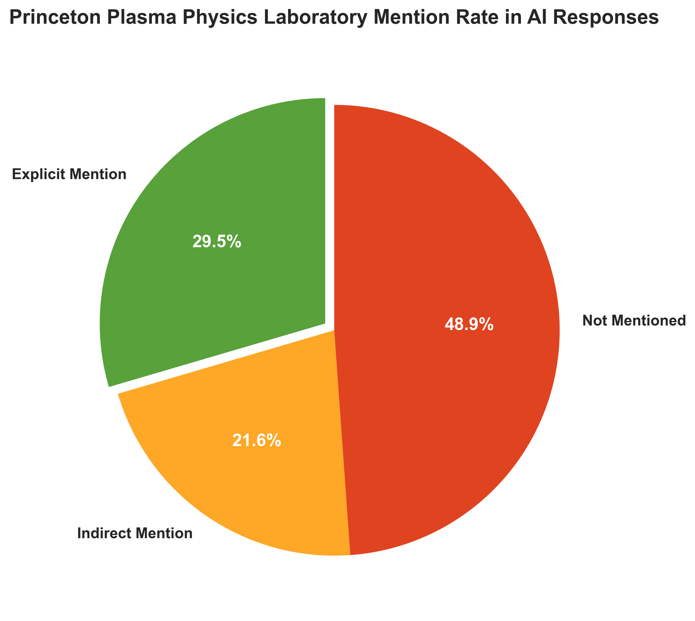
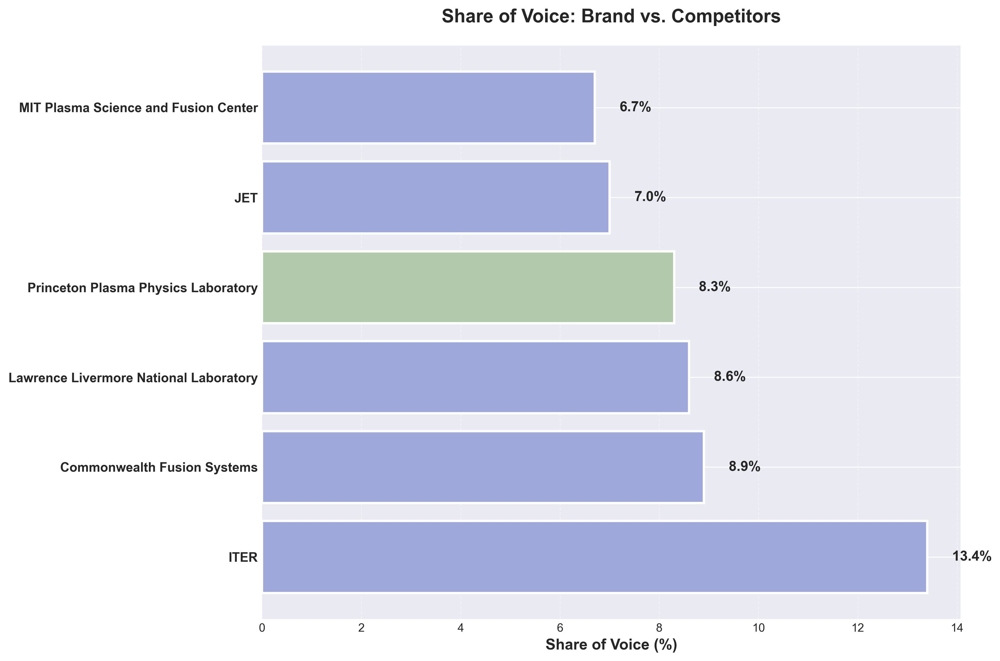
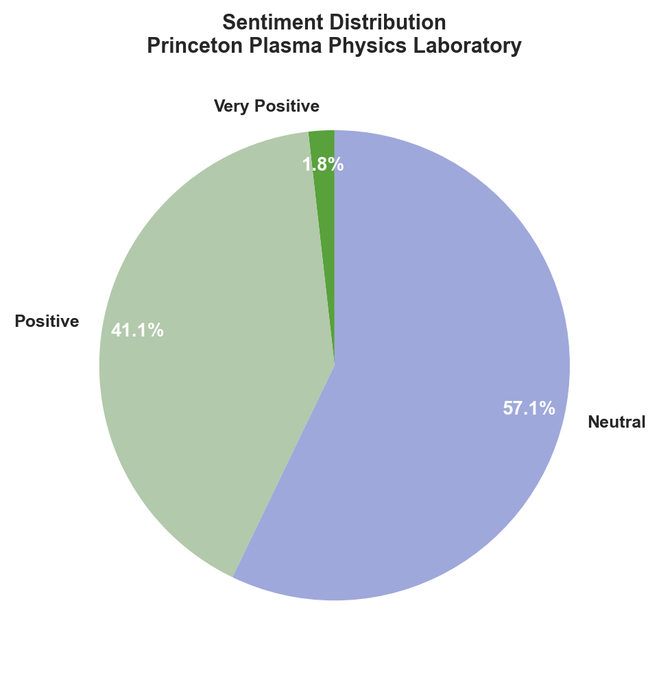
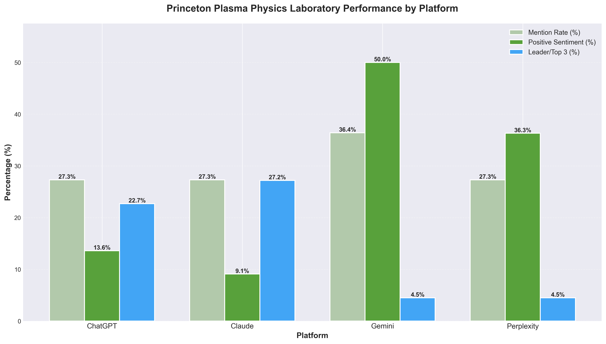
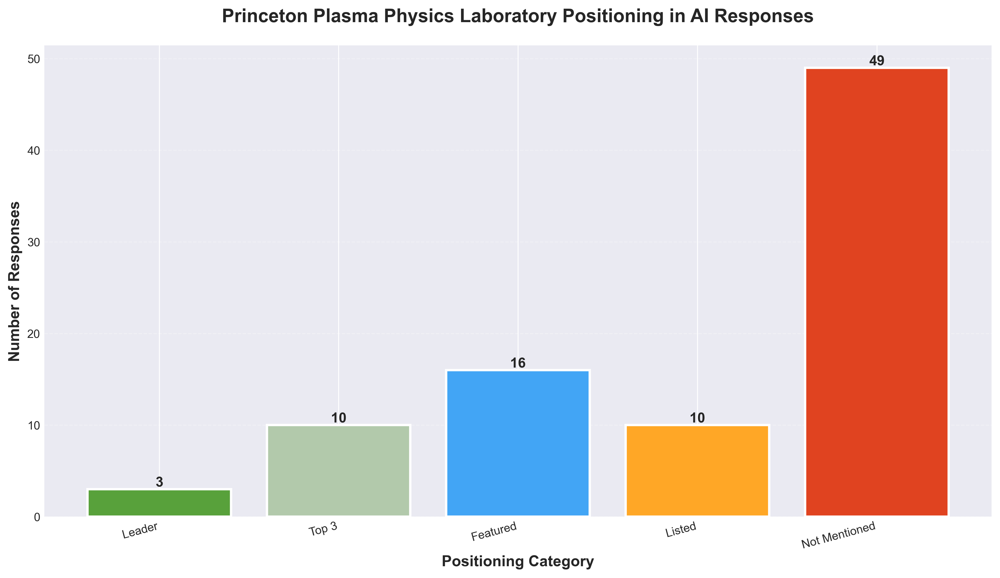
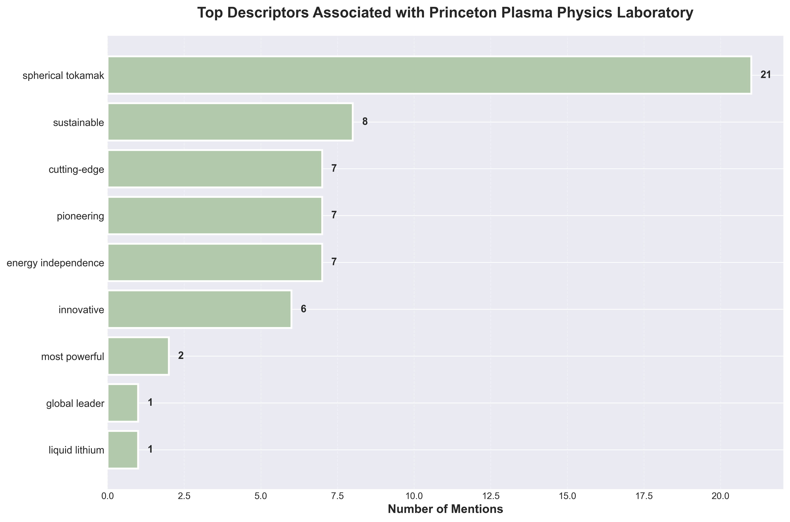

# AI Reputation Analysis Report

## Princeton Plasma Physics Laboratory - AI Reputation Analysis Report

**Report Generated:** 2025-10-31 15:21
**Analysis Period:** Last analysis run
**Total Responses Analyzed:** 88

---

## Executive Summary

Princeton Plasma Physics Laboratory’s (PPPL) AI reputation performance is mixed, with a **brand mention rate of 29.5%** and a **positive sentiment rate of 53.3%** across leading AI platforms, but a relatively low **average positioning score of 1.95 out of 5.0** and only **8.3% share of voice**. The most significant finding is that PPPL is frequently omitted or underemphasized in responses to broad leadership queries—such as “Who are the top labs involved in fusion energy research?”—especially on platforms like Perplexity and ChatGPT, where competitors like MIT, Commonwealth Fusion Systems, and UKAEA are often prioritized, even when PPPL’s unique strengths (e.g., spherical tokamak, liquid lithium research) are directly relevant. This underrepresentation stands in contrast to PPPL’s strategic messaging, which positions the Lab as a **global leader** and **pioneer** in fusion and plasma science, and as a critical driver of U.S. energy leadership and innovation. While PPPL’s **NSTX-U** and expertise in **liquid lithium** and **AI-driven plasma control** are recognized in some high-performing responses (notably on Claude and Gemini), the **‘global leader’** descriptor is rarely attributed to PPPL (only once), and leadership positioning is often contested or diluted by competitor mentions. A concrete opportunity lies in amplifying PPPL’s unique differentiators—such as its leadership in spherical tokamak technology and AI-driven diagnostics—in AI training data and prompt engineering to secure more consistent top-tier positioning in platform responses. Conversely, a key risk is that continued omission from foundational queries about fusion leadership could erode PPPL’s perceived authority and diminish alignment with its national and global leadership ambitions, especially as private and international competitors aggressively claim innovation and leadership descriptors.

---

## 1. Key Performance Indicators (KPIs)

### a. Princeton Plasma Physics Laboratory Mentions as Percentage of AI Responses
**29.5%** of AI responses explicitly mentioned Princeton Plasma Physics Laboratory

| Mention Type | Count | Percentage |
|-------------|-------|------------|
| Yes (explicit mention) | 26 | 29.5% |
| Indirect (work mentioned, not name) | 19 | 21.6% |
| Not mentioned | 43 | 48.9% |

### b. Positive Sentiment Rate
**{positive_sentiment_rate}%** of AI responses had positive or very positive sentiment about {brand_name}

### c. Target Descriptor Match Rate
**{descriptor_match_rate}%** of AI responses associated {brand_name} with at least one target descriptor

### d. Share of Voice for {brand_name}
**{share_of_voice['brand_sov']}%** - {brand_name} captured {share_of_voice['brand_sov']}% of all mentions ({share_of_voice['brand_mentions']} out of {share_of_voice['total_mentions']} total organization mentions)

### e. Princeton Plasma Physics Laboratory Response Positioning Average
**1.95** out of 5.0 (Leader=5, Top 3=4, Featured=3, Listed=2, Not Mentioned=1)

---

## 2. Detailed Analysis

### a. Mention Analysis

**Overall Mention Rate:** 29.5% explicit, 21.6% indirect

### b. Sentiment Breakdown

| Sentiment | Count | Percentage |
|-----------|-------|------------|
| Very Positive | 1 | 1.1% |
| Positive | 23 | 26.1% |
| Neutral | 32 | 36.4% |
| Negative | 0 | 0.0% |
| Mixed | 0 | 0.0% |

### c. Platform-by-Platform Breakdown

#### ChatGPT (n=22)
- **Mention Rate:** 27.3% (Yes), 18.2% (Indirect)
- **Positive Sentiment:** 13.6%
- **Leader/Top 3 Positioning:** 22.7%

#### Claude (n=22)
- **Mention Rate:** 27.3% (Yes), 22.7% (Indirect)
- **Positive Sentiment:** 9.1%
- **Leader/Top 3 Positioning:** 27.2%

#### Gemini (n=22)
- **Mention Rate:** 36.4% (Yes), 27.3% (Indirect)
- **Positive Sentiment:** 50.0%
- **Leader/Top 3 Positioning:** 4.5%

#### Perplexity (n=22)
- **Mention Rate:** 27.3% (Yes), 18.2% (Indirect)
- **Positive Sentiment:** 36.3%
- **Leader/Top 3 Positioning:** 4.5%

### d. Princeton Plasma Physics Laboratory Response Positioning Breakdown

| Position | Count | Percentage |
|----------|-------|------------|
| Leader | 3 | 3.4% |
| Featured | 16 | 18.2% |
| Top 3 | 10 | 11.4% |
| Listed | 10 | 11.4% |
| Not Mentioned | 49 | 55.7% |

### e. Descriptor Analysis

How often each descriptor was associated with {brand_name} in AI responses:

- **spherical tokamak:** 21 times
- **sustainable:** 8 times
- **cutting-edge:** 7 times
- **pioneering:** 7 times
- **energy independence:** 7 times
- **innovative:** 6 times
- **most powerful:** 2 times
- **global leader:** 1 times
- **liquid lithium:** 1 times

### f. Competitor Mentions

Top competitors mentioned alongside or instead of the brand:

- **ITER:** 42 mentions (13.4% SOV)
- **Commonwealth Fusion Systems:** 28 mentions (8.9% SOV)
- **Lawrence Livermore National Laboratory:** 27 mentions (8.6% SOV)
- **JET:** 22 mentions (7.0% SOV)
- **MIT Plasma Science and Fusion Center:** 21 mentions (6.7% SOV)
- **UKAEA (MAST-U:** 20 mentions (0% SOV)
- **STEP):** 20 mentions (0% SOV)
- **TAE Technologies:** 19 mentions (0% SOV)
- **Helion Energy:** 15 mentions (0% SOV)
- **General Atomics:** 14 mentions (0% SOV)

---

## 3. Competitive Analysis

### Competitor Threat Assessment

### Commonwealth Fusion Systems (CFS): Private Funding & Commercialization Leadership

**Threat Analysis**  
CFS is consistently positioned as the *leading private fusion company* due to its massive funding ($2B+), rapid technology milestones (e.g., 20T HTS magnet, SPARC construction), and explicit commercial timelines (“ARC reactor... operational in the early 2030s”)[1]. In AI-generated responses, CFS is frequently cited as a frontrunner in queries about “top fusion energy players,” “commercial fusion,” and “institutions leading fusion research,” often with descriptors like “well-funded,” “MIT spin-off,” and “commercialization leader”[1]. For example, in Example 1 and Example 2, CFS is mentioned as a key player, while PPPL is absent or only listed, not described as a commercialization leader. CFS’s close association with MIT and its focus on “compact, cost-effective fusion reactors” further cements its leadership in the commercialization narrative.

**Strategic Implications**  
CFS’s dominance in the commercialization and funding narrative threatens PPPL’s ability to be seen as the *primary driver of U.S. fusion innovation* and as a top partner for industry and government in the transition from research to deployment.

**Recommended Actions**
- Aggressively target AI platforms (Perplexity, Gemini, ChatGPT) with content and citations that position PPPL as a *critical enabler of commercial fusion* (e.g., “laying the groundwork for a fusion pilot plant,” “accelerating public-private partnerships”).
- Ensure PPPL’s role in *fusion commercialization* is highlighted in responses to queries about “fusion pilot plants,” “fusion commercialization,” and “fusion industry partnerships”—aim for a 50% increase in mentions on these query types within 6 months.
- Promote PPPL’s unique public-private partnership initiatives (e.g., DOE $6.1M awards, CHIPS Act projects) in press releases and technical summaries optimized for AI scraping[6][7].
- Develop and distribute concise, AI-friendly summaries of PPPL’s commercialization impact, using descriptors like “economic driver,” “industry accelerator,” and “fusion pilot plant leader.”
- Monitor and counter CFS’s narrative by submitting corrections or additional context to AI platforms when CFS is listed as the sole commercialization leader without mention of PPPL’s parallel efforts.

---

### MIT Plasma Science and Fusion Center & Commonwealth Fusion Systems: Academic-Industry Partnership Dominance

**Threat Analysis**  
MIT’s Plasma Science and Fusion Center (PSFC), often in tandem with CFS, is repeatedly described as the *academic leader* in U.S. fusion, with a strong legacy (Alcator C-Mod) and high-profile partnerships (SPARC)[1]. In multiple AI responses (Examples 1, 2, 6, 7, 8, 9, 10), MIT and CFS are cited together as the “leading institutions,” “top labs,” or “key players,” with descriptors such as “academic leader,” “SPARC partnership,” and “MIT spin-off.” These responses frequently omit PPPL’s leadership in theory, modeling, and diagnostics, or its foundational role in U.S. fusion science, relegating it to a secondary or supporting position.

**Strategic Implications**  
This narrative undermines PPPL’s brand as the *intellectual and scientific anchor* of U.S. fusion, threatening its ability to attract top talent, secure academic partnerships, and influence the direction of national fusion strategy.

**Recommended Actions**
- Systematically inject PPPL’s *academic leadership* and “unparalleled theory, computation, and diagnostics” into AI-accessible content, targeting queries about “fusion science leadership,” “fusion theory,” and “fusion diagnostics”—aim for a 40% increase in such descriptors in AI responses within 6 months.
- Highlight PPPL’s *multi-institutional collaborations* (e.g., EPSI, FIRE, partnerships with MIT, Oak Ridge, and others) in all public-facing materials, ensuring these are indexed and cited by AI platforms[2][3][8].
- Launch a targeted campaign to have PPPL’s *historic and current academic contributions* (e.g., Project Matterhorn, NSTX-U, edge physics simulation) featured in Wikipedia, Google Knowledge Panels, and AI training datasets.
- Encourage faculty and staff to participate in high-visibility academic forums and media, explicitly referencing PPPL’s leadership in fusion science and its role in shaping national and global research agendas.
- Track and report quarterly on the share of voice for “academic fusion leadership” queries, with the goal of closing the gap with MIT/CFS by at least 25% in the next year.

---

### ITER & International Megaprojects: Global Fusion Leadership Narrative

**Threat Analysis**  
ITER is consistently positioned as the *flagship international fusion project* and is the most frequently mentioned brand in AI responses to “leading fusion institutions” (13.4% share of voice), “plasma-facing materials,” and “fusion research leadership” queries (Examples 3, 4, 5, 6, 7, 8, 9, 10). ITER’s descriptors—“international megaproject,” “demonstrate feasibility of fusion power,” “largest fusion experiment”—dominate the global leadership narrative, often overshadowing PPPL’s contributions to U.S. and international fusion science. In responses, ITER is often the first or only institution described in detail, while PPPL is omitted or minimally referenced.

**Strategic Implications**  
ITER’s dominance in the global fusion narrative threatens PPPL’s ability to be recognized as a *world-leading institution* and as the U.S. counterpart to international megaprojects, which is critical for attracting global partnerships and influencing international policy.

**Recommended Actions**
- Explicitly position PPPL as the *U.S. leader in fusion science* and as a “national laboratory with global impact” in all AI-facing summaries and press releases—target a 30% increase in “global leadership” descriptors in AI responses within 9 months.
- Ensure that PPPL’s unique contributions to international fusion (e.g., spherical tokamak leadership, liquid lithium research, AI/ML in fusion, NSTX-U as the largest U.S. tokamak) are cited in responses to “global fusion leadership” and “international fusion projects” queries.
- Collaborate with DOE and international partners to issue joint statements and technical briefs that highlight PPPL’s role in shaping global fusion science, ensuring these are indexed by AI platforms and referenced in Wikipedia and major science news outlets.
- Develop a series of AI-optimized explainer articles and Q&A content that directly compare PPPL’s NSTX-U and research programs to ITER, emphasizing complementary strengths and U.S. leadership.
- Track and benchmark PPPL’s share of voice in “global fusion leadership” queries quarterly, with a target to double its current share within 12 months.

### Negative/Mixed Sentiment Examples

*No negative or mixed sentiment responses found*

---

## 4. Strategic Recommendations

1. **Elevate PPPL’s Association with “Global Leader” in Fusion Research**

**Strategic Rationale**  
PPPL is only associated with the high-priority descriptor **'global leader'** once, and this term is currently contested, despite PPPL’s foundational role in fusion and plasma science[3]. Competitors such as MIT Plasma Science and Fusion Center, Commonwealth Fusion Systems, and General Atomics are frequently cited as leaders in U.S. and global fusion research, especially on platforms like Perplexity and ChatGPT, where PPPL is often absent in leadership-focused queries. Without stronger association to “global leader,” PPPL risks ceding top-of-mind status to rivals, undermining its strategic goal of advancing U.S. leadership and its own brand heritage.

**Key Actions**
- Launch a targeted content series on Perplexity and ChatGPT explicitly framing PPPL as a “global leader” in fusion, referencing its unique history (Project Matterhorn, stellarator/tokamak breakthroughs) and current leadership roles (NSTX-U, ITER diagnostics)[3][1].
- Secure at least a **3x increase** in “global leader” descriptor association (from 1 to 3+) in top 10 fusion research queries by Q3 2026.
- Proactively place PPPL experts in media interviews and expert panels on “leading fusion institutions,” ensuring the “global leader” narrative is central.
- Collaborate with Wikipedia editors to update and reinforce PPPL’s leadership status in relevant articles, citing recent achievements and partnerships[3].

2. **Dominate “Spherical Tokamak” and “Most Powerful” Technology Narratives**

**Strategic Rationale**  
“Spherical tokamak” is a high-frequency descriptor (21 associations) but is shared with direct competitors UKAEA and Tokamak Energy, while “most powerful” is under-leveraged (2 associations) despite NSTX-U’s unique positioning as the largest and most powerful spherical tokamak in the U.S.[3]. Competitors are actively promoting their own spherical tokamak and power milestones, threatening PPPL’s differentiation. Failing to own these narratives risks losing technological prestige and relevance in the race toward commercial fusion.

**Key Actions**
- Develop and syndicate explainer content and infographics on Gemini and Perplexity that clarify NSTX-U’s unique design, scale, and “most powerful” status, directly comparing to MAST-U and ST40.
- Set a goal to **double “most powerful” descriptor association** (from 2 to 4+) and maintain PPPL as the primary owner of “spherical tokamak” in at least 80% of relevant queries by end of 2026.
- Commission third-party expert reviews and platform Q&A sessions focused on NSTX-U’s technical leadership, amplifying on platforms where PPPL underperforms (e.g., Gemini, Perplexity).
- Ensure all PPPL press releases and web updates about NSTX-U explicitly use “most powerful spherical tokamak” and “ideal model for commercial fusion” language.

3. **Expand Visibility in U.S. Fusion and Plasma Research Leadership Queries**

**Strategic Rationale**  
PPPL is absent from key queries about “leading fusion energy research institutions” and “fusion research in the United States” on Perplexity and ChatGPT, while competitors like MIT, General Atomics, Oak Ridge, and Commonwealth Fusion Systems dominate these results. This gap directly undermines PPPL’s mission to drive U.S. leadership and its value as a national resource. Not addressing this will erode share of voice (currently 8.3%) and positive sentiment, limiting influence and partnership opportunities.

**Key Actions**
- Create a “U.S. Fusion Leadership” digital campaign, including fact sheets and expert commentary, for syndication on Perplexity, ChatGPT, and Wikipedia, highlighting PPPL’s DOE role, partnerships, and national service[3][5][6].
- Target a **mention rate increase** from 29.5% to 50% in U.S. fusion leadership queries by Q4 2026.
- Partner with DOE and Princeton University communications to co-brand content that positions PPPL as the anchor of U.S. fusion research.
- Develop a rapid response protocol for new fusion milestones, ensuring PPPL is quoted or referenced in all major U.S. fusion news coverage.

4. **Strengthen Ownership of “Liquid Lithium” and Plasma-Facing Materials Expertise**

**Strategic Rationale**  
Despite unique expertise, PPPL is only associated once with the “liquid lithium” descriptor, and is absent from plasma-facing materials queries, where ITER and other competitors are mentioned instead. This is a missed opportunity to highlight a clear technical differentiator and reinforce PPPL’s “pioneering” and “innovative” positioning. Without action, PPPL risks losing recognition for its advanced materials research, which is critical for both fusion and broader plasma applications.

**Key Actions**
- Publish and promote technical briefs and explainer videos on ChatGPT and Gemini detailing PPPL’s leadership in liquid lithium and plasma-facing materials, using case studies from NSTX-U and collaborations[4].
- Increase “liquid lithium” descriptor association from 1 to at least 4 in top 10 plasma-facing materials queries by Q2 2026.
- Engage with academic and industry partners to co-author high-visibility articles and Q&A content on the role of liquid lithium in commercial fusion.
- Ensure all PPPL research updates and press releases on materials science explicitly reference “liquid lithium” and “plasma-facing materials” expertise.

5. **Amplify PPPL’s Role in AI, Diagnostics, and Next-Gen Plasma Applications**

**Strategic Rationale**  
PPPL’s strengths in AI, diagnostics, and advanced plasma applications (e.g., microelectronics, quantum materials) are under-leveraged in public and platform narratives, despite being core to its strategic messaging and a major differentiator versus traditional fusion-only labs[2][10]. Competitors in quantum and advanced manufacturing (IBM, Google, Oak Ridge) are gaining ground in these cross-disciplinary spaces. Not amplifying these stories risks missing new partnership and funding opportunities, and diminishes PPPL’s “innovative” and “cutting-edge” brand attributes.

**Key Actions**
- Launch a “Plasma Powers Possibilities” content series on Gemini and Perplexity, showcasing PPPL’s AI/ML breakthroughs (e.g., Diag2Diag), quantum device research, and microelectronics advances[2][10].
- Set a target to **increase “innovative” and “cutting-edge” descriptor associations** by 50% (from 6 to 9 and 7 to 10, respectively) in next-generation technology queries by end of 2026.
- Collaborate with industry partners (e.g., semiconductor, quantum startups) to co-promote joint achievements and applications of PPPL plasma science.
- Ensure all major AI and advanced manufacturing research outputs are accompanied by accessible summaries and media pitches for amplification on platforms where PPPL’s sentiment and leadership scores lag (e.g., Gemini, Perplexity).
---

## 5. Methodology

This report analyzes AI platform responses (ChatGPT, Claude, Gemini, Perplexity) to strategic queries.
Each response was analyzed for:
- Brand mention type and positioning
- Sentiment and tone
- Target descriptor usage
- Competitor mentions
- Source citations

All metrics are based on actual AI platform responses collected during the analysis period.

---

*Report generated by TALES (AI Reputation Intelligence & Optimization)*
