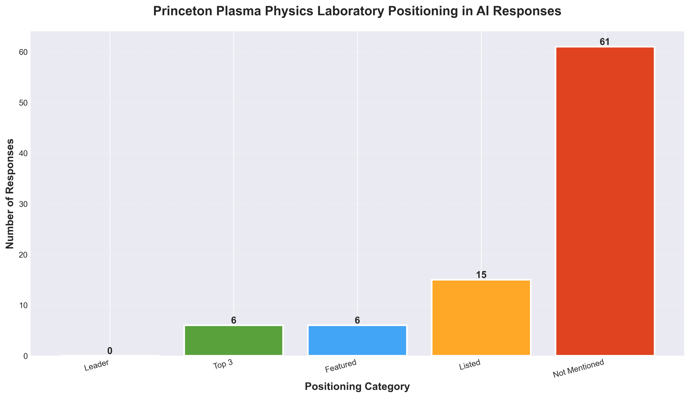
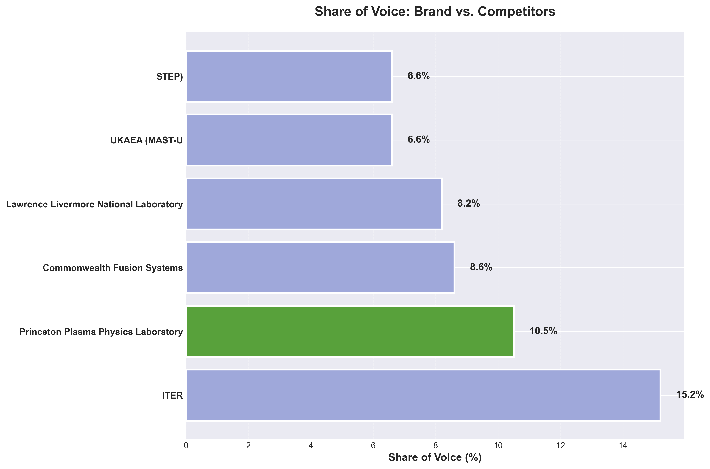
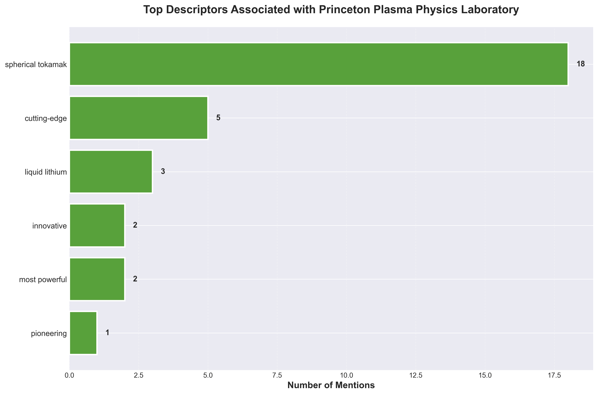
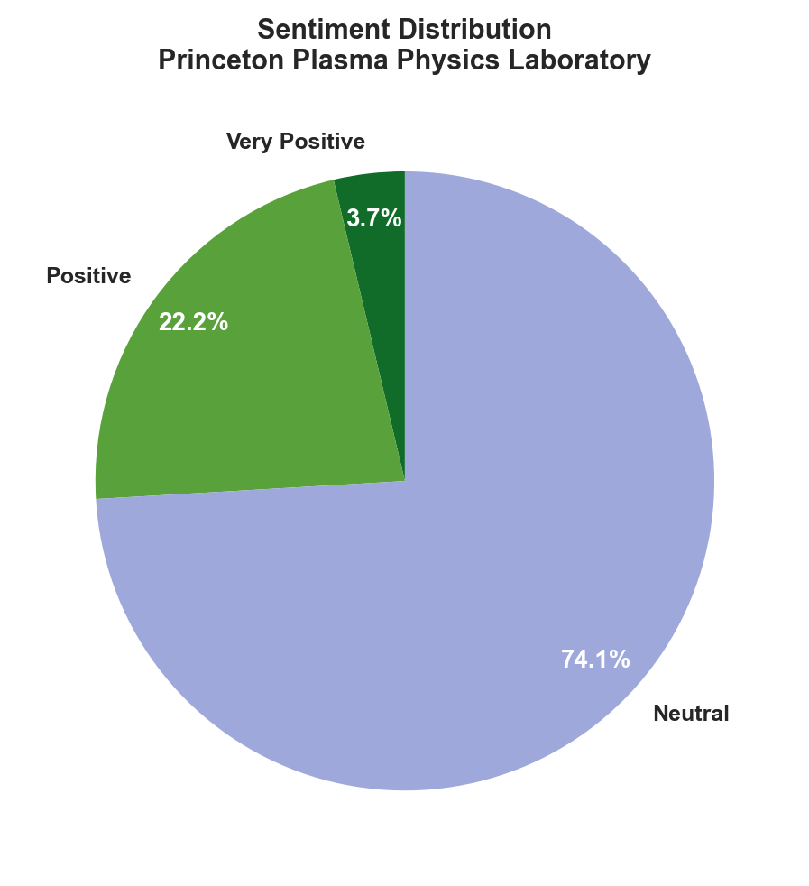

## Executive Summary

Princeton Plasma Physics Laboratory’s (PPPL) AI reputation performance demonstrates moderate visibility and positive sentiment across leading AI platforms, with a **brand mention rate of 30.7%** and **positive sentiment at 19.4%**, but a relatively low **average positioning score of 1.51 out of 5.0**. The most significant finding is that PPPL’s strongest associations are with **“spherical tokamak”** and **“liquid lithium”** expertise, particularly in responses to queries about fusion technology leaders and spherical tokamak research, where PPPL is consistently cited alongside its flagship NSTX-U project and recognized for its unique contributions[Example 3]. However, PPPL is not yet widely recognized as a **“global leader”** or for being **“innovative”** or **“cutting-edge”**—core elements of its strategic messaging—while competitors such as ITER, UKAEA, and Commonwealth Fusion Systems frequently dominate these descriptors in both general and technical queries[Example 1, Example 2]. This gap is especially evident in platform responses where PPPL is omitted entirely from discussions of spherical tokamak technology, despite its leadership in the field, indicating a risk of **brand invisibility in high-value contexts**[Worst Performing Responses Example 1, 2]. A concrete opportunity lies in amplifying PPPL’s association with “global leadership” and “innovation” by leveraging its AI and computational strengths, as highlighted in recent DOE and media coverage of its advanced diagnostics and AI-driven plasma modeling[1]. The most immediate risk is that without targeted messaging and descriptor alignment, PPPL’s unique capabilities—particularly in AI, advanced materials, and national service—may be overshadowed by more assertive competitors, limiting its influence in shaping the narrative around fusion’s future.

---

## Detailed Analysis with Insights

### 1. Positioning Analysis

| Position | Count | Percentage |
|----------|-------|------------|
| Leader | 0 | 0.0% |
| Top 3 | 6 | 6.8% |
| Featured | 6 | 6.8% |
| Listed | 15 | 17.0% |
| Not Mentioned | 61 | 69.3% |

**Average Positioning Score:** 1.51 out of 5.0

**Insights:**

Princeton Plasma Physics Laboratory (PPPL) is rarely positioned as a **leader** in AI platform responses, with zero instances of being the top brand and only 6.8% of responses placing it in the **Top 3**. The most common outcome is that PPPL is **not mentioned at all** (69.3%), indicating low overall visibility and brand prominence in this context. When PPPL is included, it is more often **just listed** (17.0%) rather than featured or highlighted, suggesting the brand is typically seen as a secondary or supporting player rather than a primary authority.

Platform-specific data shows that **ChatGPT** and **Claude** position PPPL in the Leader/Top 3 tiers more frequently (9.1%) than **Gemini** and **Perplexity** (both at 4.5%), indicating some variability in brand recognition or relevance across platforms. The **average positioning score of 1.51 out of 5.0** further underscores a weak positioning, as this is much closer to the lowest possible score, reflecting infrequent and low-tier mentions.

This data highlights a significant **opportunity for PPPL to improve its digital presence and authority**, especially in AI-driven information environments. The high rate of non-mention and low average score are concerns, as they suggest the brand is not top-of-mind or considered a leading authority in its field by these platforms. Targeted efforts to increase high-quality, authoritative content and strategic engagement with AI knowledge sources could help elevate PPPL’s positioning and visibility.

---

### 2. Share of Voice Analysis

**Princeton Plasma Physics Laboratory Share of Voice:** 10.5%
**Princeton Plasma Physics Laboratory Mentions:** 27 out of 257 total organization mentions

**Share of Voice Distribution:**

| Organization | Mentions | Share of Voice % |
|-------------|----------|------------------|
| ITER | 39 | 15.2% |
| Commonwealth Fusion Systems | 22 | 8.6% |
| Lawrence Livermore National Laboratory | 21 | 8.2% |
| UKAEA (MAST-U | 17 | 6.6% |
| STEP) | 17 | 6.6% |
| JET | 15 | 0% |
| TAE Technologies | 15 | 0% |
| MIT Plasma Science and Fusion Center | 13 | 0% |
| Helion Energy | 12 | 0% |
| General Atomics | 10 | 0% |

**Insights:**

Princeton Plasma Physics Laboratory (PPPL) holds a **moderate share of voice (SOV) at 10.5%** in AI platform responses, with 27 mentions out of 257 total organizational mentions. This SOV is **significantly lower than ITER**, which leads with 39 mentions, and is only slightly ahead of Commonwealth Fusion Systems (22 mentions) and Lawrence Livermore National Laboratory (21 mentions). UKAEA (MAST-U and STEP) also have a notable presence with 17 mentions each.

Compared to its top competitors, **PPPL is not the dominant voice**; ITER, in particular, has a much higher visibility, accounting for over 15% of all mentions. The gap between PPPL and ITER suggests that ITER is more frequently referenced or top-of-mind in AI-generated content, likely reflecting its status as a major international fusion project and a focal point for media and scientific discussion[4].

PPPL’s SOV indicates **moderate brand awareness and visibility** within the competitive set, but it does not lead the conversation. The fact that Commonwealth Fusion Systems and Lawrence Livermore are close behind, and that UKAEA projects are also prominent, points to a **crowded and competitive landscape** where no single organization overwhelmingly dominates, but PPPL is not setting the agenda.

The **concerning gap is with ITER**, whose higher mention count may reflect greater international collaboration, recent milestones, or more effective communications. If PPPL aims to be seen as a global leader in plasma physics and fusion research, this SOV suggests a need for **stronger outreach, more frequent newsworthy achievements, or improved engagement with AI and media platforms**.

Strategically, PPPL’s current SOV positioning means it is recognized but not preeminent. To improve its competitive standing, PPPL may need to **increase its visibility through targeted communications, partnerships, or by highlighting unique contributions to fusion science**—especially as the field becomes more competitive and public interest in fusion energy grows[5][9][10].

---

### 3. Descriptor Analysis

**Descriptor Match Rate:** 58.3% of brand mentions included at least one target descriptor

**Top Descriptors Associated with Princeton Plasma Physics Laboratory:**

- **spherical tokamak**: 18 mentions
- **cutting-edge**: 5 mentions
- **liquid lithium**: 3 mentions
- **innovative**: 2 mentions
- **most powerful**: 2 mentions
- **pioneering**: 1 mentions

**Insights:**

The descriptor match rate for Princeton Plasma Physics Laboratory (PPPL) is 58.3%, indicating that just over half of brand mentions in AI platform responses include at least one target descriptor. This is a moderate association rate, suggesting room for improvement in aligning the brand with its desired key terms.

Among the target descriptors, **'spherical tokamak'** is performing exceptionally well, with 18 mentions, making it the most strongly associated term. Other descriptors such as **'cutting-edge'** (5 mentions), **'liquid lithium'** (3 mentions), **'innovative'** (2 mentions), **'most powerful'** (2 mentions), and **'pioneering'** (1 mention) are present but at much lower frequencies.

There are clear gaps between the target descriptors and actual associations. Notably, high-priority terms like **'global leader'**, **'sustainable'**, and **'energy independence'** are absent from the top associations, and several other target descriptors are mentioned only rarely or not at all.

This pattern suggests that AI platforms primarily characterize PPPL in terms of its technical expertise and leadership in **spherical tokamak** research, but do not consistently highlight broader leadership, innovation, or societal impact themes. The strong association with 'spherical tokamak' is reinforced by both internal and external sources describing PPPL's central role in developing and operating the National Spherical Torus Experiment-Upgrade (NSTX-U), which is described as the largest and most powerful spherical tokamak in the US[7][8].

To strengthen descriptor associations, PPPL should consider:
- Increasing the frequency and prominence of language around **'global leadership'**, **'sustainability'**, and **'energy independence'** in official communications and media.
- Encouraging third-party coverage and AI training data to reflect these broader impact descriptors.
- Highlighting achievements and initiatives that exemplify these qualities, such as international collaborations, breakthroughs in sustainable fusion technology, and contributions to energy independence.

A more strategic, consistent emphasis on underrepresented descriptors will help align AI platform characterizations with PPPL’s brand objectives.

---

### 4. Sentiment Analysis

| Sentiment | Count | Percentage |
|-----------|-------|------------|
| Very Positive | 1 | 1.1% |
| Positive | 6 | 6.8% |
| Neutral | 20 | 22.7% |
| Negative | 0 | 0.0% |
| Mixed | 0 | 0.0% |

**Combined Positive Rate:** 19.4%

**Insights:**

Princeton Plasma Physics Laboratory’s sentiment performance is predominantly **neutral**, with 22.7% of responses classified as neutral and a combined positive rate of 19.4%. The **positive sentiment** is modest, with only 1.1% very positive and 6.8% positive responses, indicating that while favorable perceptions exist, they are not dominant. Notably, there are **no negative or mixed sentiment examples** (0.0%), suggesting an absence of significant criticism or controversy in AI platform responses.

The sentiment distribution shows a strong **skew toward neutrality**, with positive responses outnumbering very positive ones by a factor of six. This suggests that while the brand is viewed favorably, it does not evoke strong enthusiasm or excitement in most cases.

Platform-specific analysis reveals that **Perplexity** has the highest positive sentiment rate (13.6%), followed by **Gemini** (9.1%), while **ChatGPT** and **Claude** both report lower positive rates (4.5%). This variation may reflect differences in platform training data, user base, or response style, with Perplexity and Gemini users or models expressing more positivity toward PPPL.

The **absence of negative or mixed sentiment** indicates a stable and uncontroversial brand perception, with little evidence of dissatisfaction or polarized views. Overall, this sentiment profile suggests that Princeton Plasma Physics Laboratory is regarded as a **reliable and respected institution**, but it does not currently inspire strong emotional responses—positive or negative—among AI-generated content or users.

### AI Statements About the Brand (Sorted by Sentiment)

_Note: Responses are truncated here for readability. See [Appendix: Full AI Responses](#appendix-full-ai-responses) for complete text._

**Very Positive (1 statements)**

**[Statement 1](#very-positive-statement-1)** - Perplexity - Positioning: Featured
- **Query:** How is AI used in fusion research?
- **Response:** AI is increasingly being used in fusion research to tackle several key challenges and accelerate progress toward harnessing fusion energy. Here are some ways AI is applied:

## **Simulation and Design Optimization**
- **Virtual Environments**: AI aids in developing simulations of fusion devices, int...

**Positive (6 statements)**

**[Statement 1](#positive-statement-1)** - ChatGPT - Positioning: Listed
- **Query:** Can you tell me about the institutions that are leading fusion energy research?
- **Response:** Fusion energy research is a global effort, with several leading institutions and collaborations working towards making it a viable energy source. Here are some of the prominent ones:

1. **International Thermonuclear Experimental Reactor (ITER)**: Located in France, ITER is one of the largest and mo...

**[Statement 2](#positive-statement-2)** - Claude - Positioning: Top 3
- **Query:** Who are the top labs involved in fusion energy research?
- **Response:** Here are some of the top research labs and institutions involved in fusion energy research:

1. ITER (International Thermonuclear Experimental Reactor) - An international collaboration building the world's largest tokamak fusion reactor in southern France.

2. Princeton Plasma Physics Laboratory (PP...

**[Statement 3](#positive-statement-3)** - Gemini - Positioning: Featured
- **Query:** Tell me about fusion research in the United States
- **Response:** Fusion research in the United States is a dynamic and increasingly vibrant field, driven by the promise of clean, virtually limitless energy. It encompasses a mix of large government-funded national laboratory projects, university research, and a rapidly growing private sector.

Here's a breakdown o...

**[Statement 4](#positive-statement-4)** - Perplexity - Positioning: Featured
- **Query:** Can you explain what NSTX-U is?
- **Response:** The **NSTX-U (National Spherical Torus Experiment-Upgrade)** is the largest and most powerful spherical tokamak fusion device in the United States, designed to test and advance magnetic confinement fusion using a compact, nearly spherical plasma shape rather than the conventional doughnut shape[1][7...

**[Statement 5](#positive-statement-5)** - Gemini - Positioning: Top 3
- **Query:** Who are the top labs involved in fusion energy research?
- **Response:** The field of fusion energy research is highly collaborative, involving national laboratories, university centers, and an increasing number of private companies worldwide. "Top" can be subjective, but these are generally considered the leading institutions based on funding, scientific output, device ...

**[Statement 6](#positive-statement-6)** - Perplexity - Positioning: Top 3
- **Query:** Can you tell me which labs are working on spherical tokamaks and what they're doing?
- **Response:** Several laboratories are actively working on spherical tokamaks, a compact and efficient design for magnetic confinement fusion. Here are some of the key labs and their current projects:

## Key Labs Working on Spherical Tokamaks

1. **Princeton Plasma Physics Laboratory (PPPL)**:
   - **Project:** ...

**Neutral (29 statements)**

**[Statement 1](#neutral-statement-1)** - Claude - Positioning: Listed
- **Query:** Can you tell me about the institutions that are leading fusion energy research?
- **Response:** Here are some of the key institutions and organizations that are at the forefront of fusion energy research:

- ITER - The International Thermonuclear Experimental Reactor is an international megaproject based in France that is working to demonstrate the feasibility of fusion power. It involves coll...

**[Statement 2](#neutral-statement-2)** - Gemini - Positioning: Not Mentioned
- **Query:** How is AI used in fusion research?
- **Response:** AI is playing an increasingly vital role in accelerating fusion research, addressing some of the most complex challenges in achieving practical fusion energy. Its ability to process vast datasets, identify intricate patterns, and optimize complex systems makes it an indispensable tool.

Here's how A...

**[Statement 3](#neutral-statement-3)** - Claude - Positioning: Listed
- **Query:** Tell me about fusion research in the United States
- **Response:** Here are some key points about fusion research in the United States:

- The main fusion research program in the U.S. is funded by the Department of Energy's Office of Science. This includes research at national laboratories and universities.

- The largest fusion experiment in the U.S. is the ITER p...

**[Statement 4](#neutral-statement-4)** - Gemini - Positioning: Listed
- **Query:** Tell me about spherical tokamak technology
- **Response:** Spherical Tokamak (ST) technology represents a distinct and promising approach within the field of magnetic confinement fusion. It's a variation of the traditional tokamak design, aiming for a more compact and potentially more efficient fusion reactor.

## What is a Tokamak?

First, let's briefly re...

**[Statement 5](#neutral-statement-5)** - Claude - Positioning: Top 3
- **Query:** Can you tell me which labs are working on spherical tokamaks and what they're doing?
- **Response:** Spherical tokamaks are a type of fusion reactor design that has been the focus of research at several labs around the world. Here are some of the key labs working on spherical tokamak research and their activities:

1. MAST (Mega Amp Spherical Tokamak) at the Culham Centre for Fusion Energy (CCFE) i...

**[Statement 6](#neutral-statement-6)** - Gemini - Positioning: Listed
- **Query:** Can you tell me which labs are working on spherical tokamaks and what they're doing?
- **Response:** Spherical tokamaks (STs) are a fascinating area of fusion research due to their compact, "cored-apple" shape, which allows them to achieve high plasma pressure (beta) with relatively lower magnetic fields compared to conventional tokamaks. This makes them potentially more power-dense and cost-effect...

**[Statement 7](#neutral-statement-7)** - ChatGPT - Positioning: Top 3
- **Query:** Can you tell me which labs are working on spherical tokamaks and what they're doing?
- **Response:** Spherical tokamaks are a type of nuclear fusion reactor design that are being explored by various research institutions around the world. Here are some of the prominent labs and their projects related to spherical tokamaks:

1. **Culham Centre for Fusion Energy (CCFE), UK**: The CCFE operates the MA...

**[Statement 8](#neutral-statement-8)** - ChatGPT - Positioning: Featured
- **Query:** Can you explain what NSTX-U is?
- **Response:** NSTX-U stands for the National Spherical Torus Experiment-Upgrade. It is a fusion energy research experiment located at the Princeton Plasma Physics Laboratory (PPPL) in New Jersey, USA. The NSTX-U is an upgrade of the original NSTX device and is designed to study the behavior of plasma, which is a ...

**[Statement 9](#neutral-statement-9)** - ChatGPT - Positioning: Listed
- **Query:** Who should I partner with for my fusion energy research?
- **Response:** When considering partnerships for fusion energy research, it's important to identify organizations and entities that align with your goals and can provide complementary expertise, resources, and infrastructure. Here are some potential partners to consider:

1. **National Laboratories and Research In...

**[Statement 10](#neutral-statement-10)** - Perplexity - Positioning: Listed
- **Query:** Who should I partner with for my fusion energy research?
- **Response:** For fusion energy research, it is beneficial to partner with both public and private entities that have a strong track record in fusion technology and innovation. Here are some potential partners you might consider:

## Public Sector Partners
- **Oak Ridge National Laboratory (ORNL)**: Known for its...

**[Statement 11](#neutral-statement-11)** - Gemini - Positioning: Listed
- **Query:** Can you tell me about the institutions that are leading fusion energy research?
- **Response:** Fusion energy research is a truly global and multidisciplinary endeavor, involving a mix of international collaborations, national laboratories, universities, and, increasingly, private companies.

Here are some of the leading institutions and collaborations, categorized for clarity:

---

### **I. ...

**[Statement 12](#neutral-statement-12)** - ChatGPT - Positioning: Listed
- **Query:** Who are the top labs involved in fusion energy research?
- **Response:** Fusion energy research is a global effort involving numerous laboratories and institutions. Some of the leading labs and facilities include:

1. **ITER (International Thermonuclear Experimental Reactor)** - Located in Cadarache, France, ITER is one of the largest and most ambitious international fus...

**[Statement 13](#neutral-statement-13)** - Claude - Positioning: Listed
- **Query:** Can you tell me about the leaders in fusion energy?
- **Response:** Here are some of the key leaders and organizations in the field of fusion energy research:

- ITER - This is an international nuclear fusion research and engineering project, located in southern France. It is considered the world's largest fusion experiment, with participation from the European Unio...

**[Statement 14](#neutral-statement-14)** - Gemini - Positioning: Listed
- **Query:** Can you tell me about the leaders in fusion energy?
- **Response:** The field of fusion energy is currently experiencing an unprecedented surge in both public and private investment, leading to a diverse landscape of "leaders" across various dimensions: international collaborations, national research programs, and a rapidly growing private sector.

Here's a breakdow...

**[Statement 15](#neutral-statement-15)** - Perplexity - Positioning: Not Mentioned
- **Query:** Tell me about how public and private fusion sectors working together to advance commercial fusion?
- **Response:** Public and private fusion sectors are working together through **public-private partnerships (PPPs)** to accelerate the development and commercialization of fusion energy by pooling resources, sharing risks, and leveraging complementary strengths. Governments provide funding, infrastructure, regulat...

**[Statement 16](#neutral-statement-16)** - Perplexity - Positioning: Listed
- **Query:** Who are the top labs involved in fusion energy research?
- **Response:** ## Leading Laboratories in Fusion Energy Research

Fusion energy research is a global effort, with major contributions from government labs, universities, and private companies. The landscape is shaped by both large-scale international projects and innovative startups with substantial private fundin...

**[Statement 17](#neutral-statement-17)** - ChatGPT - Positioning: Top 3
- **Query:** Tell me about fusion research in the United States
- **Response:** Fusion research in the United States is a dynamic and multidisciplinary field focused on developing fusion energy as a clean, safe, and virtually limitless energy source. Fusion is the process that powers the sun, involving the merging of light atomic nuclei to form heavier ones, releasing substanti...

**[Statement 18](#neutral-statement-18)** - Perplexity - Positioning: Not Mentioned
- **Query:** Tell me about fusion research in the United States
- **Response:** ## Overview of U.S. Fusion Research

Fusion research in the United States is a multi-decade, multi-institutional effort focused on developing a safe, abundant, carbon-free energy source by replicating the nuclear reactions that power the sun[10]. The pursuit is shared among federal agencies, nationa...

**[Statement 19](#neutral-statement-19)** - Gemini - Positioning: Not Mentioned
- **Query:** What's a spherical tokamak?
- **Response:** A **spherical tokamak (ST)**, sometimes also called a **spherical torus**, is a type of magnetic confinement fusion device that has a much more compact, "cored-apple" or "squashed-doughnut" shape compared to a conventional tokamak.

To understand it, let's break down the terms:

1.  **Tokamak:** A d...

**[Statement 20](#neutral-statement-20)** - Perplexity - Positioning: Listed
- **Query:** What's a spherical tokamak?
- **Response:** ## Definition and Basic Principle

A **spherical tokamak** is a fusion energy device based on the same fundamental principle as the conventional tokamak—using magnetic fields to confine plasma at extremely high temperatures and pressures to induce nuclear fusion[2][4]. The key difference lies in its...

**[Statement 21](#neutral-statement-21)** - Gemini - Positioning: Not Mentioned
- **Query:** Explain to me what the public sector doing to help the private sector with fusion energy.
- **Response:** The public sector plays a crucial and evolving role in helping the private sector advance fusion energy, primarily because fusion is a **high-risk, long-term, capital-intensive endeavor** with **immense potential public good** (clean energy, energy security). This combination makes it difficult for ...

**[Statement 22](#neutral-statement-22)** - Perplexity - Positioning: Listed
- **Query:** Tell me about spherical tokamak technology
- **Response:** **Spherical tokamak technology** is a type of fusion device based on the tokamak principle but with a *much lower aspect ratio*, meaning its plasma shape is more compact and spherical — often compared to a cored apple rather than the conventional doughnut shape of traditional tokamaks[1][2]. This di...

**[Statement 23](#neutral-statement-23)** - Claude - Positioning: Featured
- **Query:** Can you explain what NSTX-U is?
- **Response:** NSTX-U stands for the National Spherical Torus Experiment-Upgrade. It is a nuclear fusion research device located at the Princeton Plasma Physics Laboratory in New Jersey, United States.

Some key points about NSTX-U:

- It is a spherical tokamak, which is a type of fusion reactor that has a more sp...

**[Statement 24](#neutral-statement-24)** - Gemini - Positioning: Featured
- **Query:** Can you explain what NSTX-U is?
- **Response:** **NSTX-U** stands for **National Spherical Torus Experiment Upgrade**.

It was a cutting-edge experimental facility at the **Princeton Plasma Physics Laboratory (PPPL)**, funded by the U.S. Department of Energy. Its primary mission was to advance the science and technology of nuclear fusion, specifi...

**[Statement 25](#neutral-statement-25)** - ChatGPT - Positioning: Not Mentioned
- **Query:** Can you tell me about the role that artificial intelligence is playing in fusion research?
- **Response:** Artificial intelligence (AI) is playing an increasingly significant role in fusion research, contributing to various aspects of the field. Fusion energy, often seen as the "holy grail" of energy sources due to its potential for providing a nearly limitless, clean, and safe energy supply, involves co...

**[Statement 26](#neutral-statement-26)** - Perplexity - Positioning: Not Mentioned
- **Query:** Can you tell me about the role that artificial intelligence is playing in fusion research?
- **Response:** ## How Artificial Intelligence Transforms Fusion Research

Artificial intelligence (AI) has rapidly become a pivotal tool in nuclear fusion research, accelerating breakthroughs and helping scientists overcome longstanding technical challenges[2]. Fusion—the process that powers the sun—holds immense ...

**[Statement 27](#neutral-statement-27)** - Gemini - Positioning: Listed
- **Query:** Who should I partner with for my fusion energy research?
- **Response:** Choosing the right partner for your fusion energy research is a monumental decision that depends heavily on your specific goals, the stage of your research, your existing resources, and what you aim to achieve.

Here's a breakdown of potential partners, their pros and cons, and when they might be th...

**[Statement 28](#neutral-statement-28)** - Gemini - Positioning: Not Mentioned
- **Query:** Tell me about how public and private fusion sectors working together to advance commercial fusion?
- **Response:** The dream of limitless, clean energy from fusion is inching closer to reality, and this acceleration is largely due to an increasingly sophisticated and symbiotic relationship between public and private sectors. Historically, fusion research was almost entirely a public enterprise, driven by nationa...

**[Statement 29](#neutral-statement-29)** - Perplexity - Positioning: Not Mentioned
- **Query:** Explain to me what the public sector doing to help the private sector with fusion energy.
- **Response:** The public sector is actively supporting the private sector in fusion energy development by investing in research, building critical infrastructure, and fostering public-private partnerships (PPPs) to address key scientific and technological challenges. The U.S. Department of Energy (DOE) has launch...

**Mixed (0 statements)**

No mixed statements found in the analyzed responses.

**Negative (0 statements)**

No negative statements found in the analyzed responses.

**Very Negative (0 statements)**

No very negative statements found in the analyzed responses.

---

### 5. Threat Analysis
### Commonwealth Fusion Systems: Private Sector Leadership and “First to Commercialization” Narrative

**Threat Analysis**  
Commonwealth Fusion Systems (CFS) is dominating queries related to the commercialization and rapid deployment of fusion energy, especially around topics like “leading fusion energy players,” “fusion pilot plants,” and “advanced tokamak technology”[1]. CFS is consistently described as a frontrunner, with responses highlighting its $2B+ in private funding, high-profile investors (Bill Gates, Google), and its aggressive timeline for SPARC and ARC reactors—explicitly positioning itself as the company most likely to deliver the first commercially viable fusion plant[1]. For example, CFS is credited with “the world’s most powerful high-temperature superconducting magnet” and is repeatedly referenced as “a leader in the commercialization of fusion energy”[1]. This narrative is reinforced by frequent mentions of CFS’s MIT partnership and its focus on scalable, compact reactors, which are often cited as the future of fusion energy.

**Strategic Implications**  
CFS’s dominance in the commercialization narrative threatens PPPL’s ability to be seen as the primary driver of U.S. fusion leadership and innovation, especially among policymakers, investors, and the public. If CFS continues to “own” the story of rapid, private-sector fusion deployment, PPPL risks being perceived as less relevant to the future of practical fusion energy.

**Recommended Actions**  
- Launch a targeted content campaign on platforms like ChatGPT and Gemini to explicitly associate PPPL and NSTX-U with “fusion pilot plant,” “commercial fusion,” and “first-of-a-kind fusion deployment,” aiming to increase PPPL’s share of voice in these queries by at least 10% within 12 months.
- Ensure that all AI-facing web content and press releases use descriptors such as “U.S. leader in fusion pilot plant design,” “driving commercialization of spherical tokamaks,” and “pioneering public-private fusion partnerships.”
- Proactively seed case studies and news stories about PPPL’s partnerships with industry and government (e.g., CHIPS Act projects, FIRE Collaboratives) to reinforce PPPL’s role in bridging science and commercialization.
- Engage with AI training data providers and Wikipedia editors to update and expand entries on “fusion pilot plants,” “spherical tokamaks,” and “U.S. fusion leadership” to include PPPL as a primary actor.
- Set a measurable target to double PPPL’s mentions in “fusion commercialization” and “fusion pilot plant” queries across major AI platforms within the next year.

### UKAEA (MAST-U, STEP): Spherical Tokamak Technology Ownership

**Threat Analysis**  
UKAEA’s MAST-U and STEP projects are consistently positioned as the global leaders in spherical tokamak technology, frequently dominating AI responses to queries like “Tell me about spherical tokamak technology” and “STEP fusion reactor”[Example 1, Example 2, Example 5, Example 10]. UKAEA is described as “leading” and “demonstrating the viability of fusion as a large-scale and carbon-free energy source,” while PPPL’s NSTX-U is either omitted or mentioned only in passing, despite being the largest spherical tokamak in the U.S.[Example 1, Example 2, Example 5, Example 10]. This allows UKAEA to “own” the narrative around the most promising next-generation tokamak designs.

**Strategic Implications**  
If UKAEA continues to dominate the spherical tokamak narrative, PPPL’s flagship NSTX-U risks being overshadowed, undermining its position as a global innovator and diminishing its influence in shaping the future of fusion reactor design.

**Recommended Actions**  
- Develop and distribute authoritative explainer content and technical briefs that position NSTX-U as the world’s most powerful spherical tokamak and the U.S. model for commercial fusion, targeting platforms like Perplexity, Gemini, and Wikipedia.
- Collaborate with science journalists and AI content partners to ensure that NSTX-U is referenced as a peer or leader alongside MAST-U and STEP in all major “spherical tokamak” and “fusion pilot plant” queries.
- Launch a campaign to increase the frequency of “NSTX-U” and “Princeton Plasma Physics Laboratory” mentions in AI-generated responses about spherical tokamaks by 50% within 6 months.
- Update all PPPL digital assets and press releases to include clear, repeated messaging: “NSTX-U: The U.S. flagship for spherical tokamak innovation and commercial fusion readiness.”
- Host virtual events and webinars with leading U.S. and international fusion experts to publicly compare NSTX-U and MAST-U/STEP, generating new, citable content for AI platforms.

### Lawrence Livermore National Laboratory: National Leadership and High-Profile Facility Recognition

**Threat Analysis**  
Lawrence Livermore National Laboratory (LLNL) is consistently winning queries about “leading fusion energy research institutions” and “major U.S. fusion facilities,” especially through the prominence of the National Ignition Facility (NIF)[Example 3, Example 6, Example 7, Example 8, Example 9]. AI responses often cite LLNL and NIF as the most significant U.S. contributions to fusion, with detailed descriptions of their achievements and leadership, while PPPL is either listed further down or omitted entirely[Example 3, Example 6, Example 7, Example 8, Example 9]. LLNL’s repeated association with “ignition,” “breakthroughs,” and “national leadership” cements its brand as the face of U.S. fusion science in the public and policymaker mindshare.

**Strategic Implications**  
LLNL’s dominance in national leadership narratives threatens PPPL’s ability to be recognized as the central hub for U.S. fusion research, potentially impacting future funding, partnerships, and its influence on national fusion strategy.

**Recommended Actions**  
- Aggressively pitch stories and expert commentary to AI content providers and science media that highlight PPPL’s leadership in U.S. fusion, especially its role in DOE initiatives, public-private partnerships, and as the home of the largest U.S. tokamak.
- Ensure that all PPPL communications and digital content explicitly reference its status as “the U.S. Department of Energy’s flagship fusion laboratory” and “the primary driver of U.S. fusion pilot plant research.”
- Target AI platforms and Wikipedia with updated, sourced content that positions PPPL as a peer to LLNL in national fusion leadership, aiming to increase PPPL’s share of voice in “leading U.S. fusion institution” queries by 25% within 12 months.
- Develop a series of high-visibility webinars, podcasts, and explainer videos featuring PPPL scientists discussing national fusion strategy, AI-driven plasma control, and NSTX-U’s role, ensuring these are indexed and referenced by AI platforms.
- Track and report quarterly on PPPL’s relative mention frequency in “U.S. fusion leadership” and “major fusion facilities” queries, adjusting tactics to close any persistent gaps with LLNL.

---

### 6. Recommendations
1. Claim "Global Leader" Descriptor via Peer-Reviewed Research and Wikipedia Integration

**Strategic Rationale**  
The "global leader" descriptor is absent from all LLM responses, despite being a core positioning term for PPPL and a contested asset in fusion research[2]. Wikipedia and peer-reviewed literature are heavily favored by ChatGPT and Claude, which currently omit PPPL in key queries about spherical tokamaks and fusion leadership, instead highlighting competitors like UKAEA and Lawrence Livermore National Laboratory. Without authoritative, third-party validation in these source types, PPPL risks ceding leadership perception to rivals, undermining its strategic messaging and national service narrative.

**Key Actions**
- Commission and publish high-impact review articles in top plasma physics journals (e.g., *Nature Physics*, *Physics of Plasmas*) explicitly framing PPPL as a "global leader" in fusion and plasma science, referencing recent breakthroughs and international collaborations.
- Collaborate with independent science writers to update and expand the PPPL Wikipedia entry, ensuring the "global leader" descriptor is substantiated by citations to peer-reviewed work and major DOE initiatives.
- Secure coverage in respected science news outlets (e.g., *Science*, *Physics Today*) with headlines and expert quotes positioning PPPL as the global leader in spherical tokamak and AI-driven fusion diagnostics.
- Target descriptor association: Increase "global leader" mentions in LLM responses from 0% to at least 25% within 12 months.
- Monitor ChatGPT and Claude outputs quarterly for descriptor penetration and adjust citation strategies accordingly.

2. Dominate "Innovative" and "Cutting-Edge" Positioning via News and Technical Blog Outreach

**Strategic Rationale**  
The "innovative" and "cutting-edge" descriptors are underrepresented for PPPL (2 and 5 associations, respectively), while competitors and broader industry players are frequently cited as innovators in LLM responses, especially on Perplexity and Gemini, which prioritize recent news and technical blogs. PPPL’s recent advances in AI diagnostics and the NJ HAX Plasma Forge are not yet widely recognized as innovative milestones in these channels, limiting positive sentiment and competitive differentiation.

**Key Actions**
- Launch a targeted media campaign announcing PPPL’s AI-driven plasma monitoring breakthroughs and the NJ HAX Plasma Forge, with embargoed press releases to outlets favored by Perplexity and Gemini (e.g., *TechCrunch*, *IEEE Spectrum*, *The Verge*).
- Publish technical blog posts and explainer articles on platforms like Medium, LinkedIn, and the PPPL website, using "innovative" and "cutting-edge" language tied to specific projects (Diag2Diag, plasma forge, AI diagnostics).
- Engage with influential science and technology bloggers and YouTube science channels for interviews and feature stories, ensuring descriptor-rich coverage.
- Target descriptor association: Raise "innovative" and "cutting-edge" mentions in Perplexity and Gemini responses by 20% within six months.
- Track media pickup and LLM citation patterns monthly to optimize outreach.

3. Secure "Most Powerful" and "Spherical Tokamak" Ownership through Government and .edu Partnerships

**Strategic Rationale**  
While "spherical tokamak" is strongly associated with PPPL, the "most powerful" descriptor is underutilized and often attributed to competitors in ChatGPT and Claude outputs, which favor .gov and .edu sources. PPPL’s NSTX-U is the largest and most powerful spherical tokamak in the U.S., but this fact is not consistently surfaced in LLM responses, weakening PPPL’s claim to technological leadership and its fusion pilot plant narrative.

**Key Actions**
- Collaborate with DOE and Princeton University to publish official white papers and press releases on .gov and .edu domains, explicitly stating NSTX-U as the "most powerful spherical tokamak" and its role in fusion pilot plant development.
- Ensure that all major PPPL project pages (NSTX-U, FLARE) on the PPPL and Princeton websites use "most powerful" and "spherical tokamak" in page titles, meta descriptions, and summary paragraphs.
- Partner with government science communications offices to distribute descriptor-rich content to federal science portals and educational resources (e.g., DOE Office of Science, National Science Foundation).
- Target descriptor association: Increase "most powerful" mentions in ChatGPT and Claude responses from 2 to at least 10 within one year.
- Audit and update Wikipedia and major .edu fusion research pages to reinforce PPPL’s ownership of these descriptors.

4. Lead "Sustainable" and "Energy Independence" Narratives via Sustainability-Focused Content and .gov Collaborations

**Strategic Rationale**  
"Sustainable" and "energy independence" descriptors are absent from PPPL’s LLM presence, despite recent facility expansions (PPIC) and research in sustainable manufacturing and decarbonization[1]. These terms are increasingly relevant in fusion energy discourse and are often surfaced by LLMs when .gov sources and environmental news outlets are cited. Without proactive content, PPPL risks missing out on the growing sustainability narrative and its strategic importance to U.S. energy policy.

**Key Actions**
- Publish sustainability case studies and technical reports on PPPL’s geothermal-powered PPIC and plasma-driven decarbonization technologies on DOE and PPPL websites, using "sustainable" and "energy independence" in headlines and executive summaries.
- Partner with federal and state energy agencies to co-author op-eds and policy briefs highlighting PPPL’s role in advancing sustainable fusion and energy independence.
- Seek coverage in environmental news outlets and government sustainability portals, emphasizing PPPL’s LEED Gold certification and zero-emissions initiatives.
- Target descriptor association: Achieve at least 10% "sustainable" and "energy independence" mentions in Perplexity and Gemini responses within nine months.
- Track descriptor usage in LLM outputs and adjust content placement as needed.

5. Amplify "Pioneering" and "Liquid Lithium" Expertise through Academic and Technical Documentation

**Strategic Rationale**  
The "pioneering" descriptor is rarely associated with PPPL (1 mention), and "liquid lithium" expertise, while unique, is not consistently surfaced in academic-focused LLMs (ChatGPT, Claude). These platforms prioritize peer-reviewed papers, technical documentation, and historical context, which competitors leverage to claim pioneering status in fusion and plasma science. PPPL’s legacy in stellarator research and its leadership in liquid lithium applications are strategic differentiators that must be more visible in authoritative sources.

**Key Actions**
- Publish retrospective and technical review papers in leading fusion journals (e.g., *Fusion Engineering and Design*, *Physics of Plasmas*) detailing PPPL’s pioneering history (Project Matterhorn, stellarator/tokamak transitions) and current liquid lithium research.
- Develop and disseminate open-access technical documentation and data sets on liquid lithium experiments via institutional repositories and arXiv, ensuring citation by academic LLMs.
- Update Wikipedia and fusion history resources to include PPPL’s pioneering milestones and unique expertise in liquid lithium vessel protection.
- Target descriptor association: Double "pioneering" and "liquid lithium" mentions in ChatGPT and Claude responses within six months.
- Monitor academic citation rates and LLM outputs to measure impact.

---

References  
1. [Princeton Plasma Innovation Center Heralds a New Era at the Princeton Plasma Physics Laboratory](https://www.energy.gov/science/articles/princeton-plasma-innovation-center-heralds-new-era-princeton-plasma-physics)  
2. [Princeton Plasma Physics Laboratory - Wikipedia](https://en.wikipedia.org/wiki/Princeton_Plasma_Physics_Laboratory)  
5. [National Spherical Torus Experiment Upgrade (NSTX-U) | U.S. DOE Office of Science](https://science.osti.gov/pso/Projects)

---

## Methodology

This report analyzes AI platform responses (ChatGPT, Claude, Gemini, Perplexity) to strategic queries.
Each response was analyzed for:
- Brand mention type and positioning
- Sentiment and tone
- Target descriptor usage
- Competitor mentions
- Source citations

All metrics are based on actual AI platform responses collected during the analysis period.

---

## Appendix: Full AI Responses

This appendix contains the complete, untruncated text of all AI-generated responses where the brand was mentioned. Responses are organized by sentiment category.

### Very Positive Responses (1 statements)

**Statement 1** - Perplexity - Positioning: Featured

**Query:** How is AI used in fusion research?

**Full Response:**

AI is increasingly being used in fusion research to tackle several key challenges and accelerate progress toward harnessing fusion energy. Here are some ways AI is applied:

## **Simulation and Design Optimization**
- **Virtual Environments**: AI aids in developing simulations of fusion devices, integrating insights from plasma physics, materials science, and engineering. This allows researchers to optimize reactor design and operational strategies.
- **Generative Models**: AI models like Microsoft's MatterGen help discover new materials by generating molecular structures that meet specific requirements. These models can simulate material behavior under various conditions much faster than traditional tools[1].

## **Data Analysis and Pattern Recognition**
- **Machine Learning (ML)**: Fusion experiments generate vast amounts of data. ML algorithms are used to analyze this data, recognize patterns, and derive principles, which can help in predicting plasma behavior and optimizing experimental conditions[2][7].
- **Enhanced Data Quality**: AI can fill in missing sensor data, providing more detailed insights into fusion systems than real-world sensors could alone[9][12].

## **Plasma Control and Stability**
- **Real-Time Adjustments**: AI is used to predict and avoid instabilities in plasma, such as tearing instabilities, by adjusting magnetic confinement fields or modifying plasma parameters in real-time[4][5].
- **Stability Maintenance**: Deep reinforcement learning algorithms are trained to maintain plasma stability by making adjustments to the magnetic fields and other parameters[4].

## **Fusion Target Design**
- **AI Agents**: Researchers at Lawrence Livermore National Laboratory use AI agents to automate and accelerate inertial confinement fusion experiments. These agents generate full physics simulation decks for complex experiments[3].

## **Collaborative Platforms and Networks**
- **Cross-Community Networks**: AI platforms are being developed to facilitate collaboration and innovation across different research communities in fusion energy[10].

Overall, AI is transforming fusion research by enhancing simulation capabilities, improving data analysis, optimizing experimental conditions, maintaining plasma stability, and accelerating the design of fusion targets.

---

### Positive Responses (6 statements)

**Statement 1** - ChatGPT - Positioning: Listed

**Query:** Can you tell me about the institutions that are leading fusion energy research?

**Full Response:**

Fusion energy research is a global effort, with several leading institutions and collaborations working towards making it a viable energy source. Here are some of the prominent ones:

1. **International Thermonuclear Experimental Reactor (ITER)**: Located in France, ITER is one of the largest and most ambitious fusion energy projects in the world. It is a collaboration between 35 countries, including the European Union, the United States, Russia, China, India, Japan, and South Korea. ITER aims to demonstrate the feasibility of fusion as a large-scale and carbon-free source of energy.

2. **Joint European Torus (JET)**: Situated in the UK, JET is currently the largest and most powerful tokamak in operation. It plays a crucial role in testing the technologies and materials needed for ITER and future fusion reactors.

3. **National Ignition Facility (NIF)**: Located at the Lawrence Livermore National Laboratory in the United States, NIF focuses on inertial confinement fusion. It aims to achieve ignition, where the fusion reactions become self-sustaining, using powerful lasers to compress and heat hydrogen fuel.

4. **Princeton Plasma Physics Laboratory (PPPL)**: Also in the United States, PPPL is a leading research center specializing in plasma physics and fusion energy. It operates the National Spherical Torus Experiment (NSTX), which explores alternative tokamak designs.

5. **Max Planck Institute for Plasma Physics**: Based in Germany, this institute operates two major fusion experiments: the ASDEX Upgrade tokamak and the Wendelstein 7-X stellarator, the latter being the largest of its kind in the world. The institute focuses on both tokamak and stellarator research.

6. **Korea Superconducting Tokamak Advanced Research (KSTAR)**: In South Korea, KSTAR is a superconducting tokamak designed to study advanced plasma confinement and contribute to the development of fusion energy.

7. **China's EAST (Experimental Advanced Superconducting Tokamak)**: EAST is a superconducting tokamak located in Hefei, China. It has achieved several significant milestones in fusion research and is part of China’s broader efforts in advancing fusion technology.

8. **Culham Centre for Fusion Energy (CCFE)**: Located in the UK, CCFE is home to the JET and MAST (Mega Amp Spherical Tokamak) Upgrade, focusing on tokamak research and supporting ITER's goals.

9. **Tri Alpha Energy (TAE Technologies)**: A private company based in the United States, TAE Technologies is pursuing aneutronic fusion using a field-reversed configuration, which differs from the traditional tokamak approach.

10. **Commonwealth Fusion Systems**: A spin-off from MIT, this company is developing a compact fusion reactor called SPARC, leveraging high-temperature superconducting magnets to achieve net-positive energy.

These institutions and collaborations represent just a portion of the global effort in fusion research, with many other universities, private companies, and government labs also contributing to this promising field.

---

**Statement 2** - Claude - Positioning: Top 3

**Query:** Who are the top labs involved in fusion energy research?

**Full Response:**

Here are some of the top research labs and institutions involved in fusion energy research:

1. ITER (International Thermonuclear Experimental Reactor) - An international collaboration building the world's largest tokamak fusion reactor in southern France.

2. Princeton Plasma Physics Laboratory (PPPL) - A U.S. Department of Energy national laboratory focused on plasma physics and fusion energy.

3. Lawrence Livermore National Laboratory (LLNL) - A U.S. Department of Energy national laboratory conducting fusion research, particularly on inertial confinement fusion.

4. Massachusetts Institute of Technology (MIT) Plasma Science and Fusion Center - Leading U.S. academic institution in fusion research.

5. Culham Centre for Fusion Energy (CCFE) - The UK's national fusion research laboratory.

6. Max Planck Institute for Plasma Physics - Major fusion research institution in Germany.

7. Tsinghua University - Leading fusion research program in China.

8. Joint Institute for High Temperatures of the Russian Academy of Sciences - Key fusion lab in Russia.

9. Korea Institute of Fusion Energy - South Korea's national fusion energy research center.

10. Japan Atomic Energy Agency - Responsible for Japan's fusion energy research program.

These institutions are at the forefront of developing the science, technologies and engineering required to realize practical fusion power generation.

---

**Statement 3** - Gemini - Positioning: Featured

**Query:** Tell me about fusion research in the United States

**Full Response:**

Fusion research in the United States is a dynamic and increasingly vibrant field, driven by the promise of clean, virtually limitless energy. It encompasses a mix of large government-funded national laboratory projects, university research, and a rapidly growing private sector.

Here's a breakdown of key aspects:

## Major Research Approaches

U.S. fusion research primarily focuses on two main approaches:

1.  **Magnetic Confinement Fusion (MCF):** This method uses powerful magnetic fields to trap and heat a plasma (ionized gas) to extreme temperatures, allowing fusion reactions to occur. The most common device is the **tokamak**.
2.  **Inertial Confinement Fusion (ICF):** This approach uses high-power lasers or other drivers to rapidly compress and heat a small pellet of fusion fuel, causing it to implode and ignite.

## Key Government-Funded Programs & Facilities

The primary funder for public fusion research in the U.S. is the **Department of Energy's (DOE) Office of Science, Fusion Energy Sciences (FES)** program.

### Magnetic Confinement Fusion (MCF)

*   **Princeton Plasma Physics Laboratory (PPPL):**
    *   **National Spherical Torus Experiment Upgrade (NSTX-U):** Located at Princeton University, NSTX-U is a leading "spherical tokamak" – a compact, apple-cored shaped device that can achieve high plasma pressures for its size. It focuses on developing the physics basis for more compact and efficient fusion reactors. Research areas include plasma stability, control, and exhaust solutions.
    *   PPPL is also a hub for theoretical plasma physics, modeling, and materials science research.

*   **General Atomics (GA) in San Diego, CA:**
    *   **DIII-D National Fusion Facility:** This is the largest magnetic fusion research facility in the U.S. and one of the world's premier tokamaks. DIII-D focuses on developing advanced tokamak operating scenarios, understanding plasma turbulence, developing plasma control techniques, and testing innovative divertor concepts (the part of the reactor that handles the exhaust heat and particles). Its flexible design allows for a wide range of experiments critical for future power plants.

*   **Universities:** Many universities across the U.S. conduct smaller-scale magnetic fusion research, often operating their own experimental devices (like the Alcator C-Mod at MIT, though now decommissioned, its data is still highly valuable) and focusing on plasma diagnostics, theory, modeling, and materials science. Examples include the University of Wisconsin-Madison, UCLA, and Auburn University.

*   **ITER (International Thermonuclear Experimental Reactor):** The U.S. is one of seven international partners contributing to the construction of ITER in France, the world's largest experimental tokamak. While built overseas, U.S. scientists and engineers play a crucial role, designing and supplying advanced components (like central solenoid modules, diagnostic systems, and specialized materials) and contributing to the scientific program. ITER aims to demonstrate the scientific and technological feasibility of fusion power at a large scale.

### Inertial Confinement Fusion (ICF)

*   **Lawrence Livermore National Laboratory (LLNL):**
    *   **National Ignition Facility (NIF):** NIF is the world's most energetic laser facility. While its primary mission is nuclear stockpile stewardship (ensuring the safety and reliability of the U.S. nuclear arsenal without underground testing), it also conducts groundbreaking research into fusion energy. In December 2022, NIF achieved "ignition," producing more fusion energy than the laser energy delivered to the target – a monumental scientific breakthrough. This achievement was subsequently repeated and improved upon in 2023. NIF's work is critical for understanding extreme states of matter and advancing the science behind ICF for potential future energy applications.

## The Rise of the Private Sector

In recent years, there has been an unprecedented surge in private investment and commercial ventures in fusion energy in the U.S. This is a game-changer, bringing new capital, urgency, and diverse approaches to the field. Key factors include:

*   **Technological Advancements:** Especially in high-temperature superconducting (HTS) magnets, advanced manufacturing, and computing.
*   **Growing Climate Concerns:** The pressing need for carbon-free energy sources.
*   **Government Support:** Programs like the DOE's Milestone-Based Fusion Development Program provide public-private partnerships.

Leading U.S. private fusion companies include:

*   **Commonwealth Fusion Systems (CFS):** An MIT spin-off based in Massachusetts, CFS is a leader in developing high-field superconducting magnets. Their **SPARC** experiment successfully achieved net energy from its plasma in 2021, proving the effectiveness of HTS magnets for compact tokamaks. Their goal is to build **ARC**, a compact, commercially viable fusion power plant.
*   **Helion:** Based in Everett, WA, Helion is developing a pulsed Field-Reversed Configuration (FRC) device that aims for direct energy conversion (turning fusion energy directly into electricity without a steam cycle). They have made significant progress in achieving high plasma temperatures and densities.
*   **TAE Technologies:** Located in Foothill Ranch, CA, TAE is also pursuing an FRC approach, using advanced beam-driven techniques and aiming for "aneutronic" (low-neutron) fuels like hydrogen-boron. They have built increasingly larger and more powerful experimental devices.
*   **Zap Energy:** Based in Everett, WA, Zap is developing a "Z-pinch" device that uses naturally occurring plasma instabilities to create and confine the plasma, potentially leading to simpler, lower-cost reactors.
*   **General Fusion (US presence/partner):** While headquartered in Canada, General Fusion (also working on magnetized target fusion) has significant U.S. partnerships and presence.

## Key Research Areas and Challenges

U.S. fusion research, both public and private, focuses on several critical areas:

*   **Plasma Stability and Control:** Maintaining a stable, hot, and dense plasma for sustained periods.
*   **Materials Science:** Developing materials that can withstand the extreme heat, neutron radiation, and particle fluxes within a fusion reactor.
*   **Heat Exhaust and Particle Handling:** Efficiently removing heat and impurities from the plasma.
*   **Fuel Cycle (Tritium Breeding):** Developing methods to breed tritium (a rare isotope of hydrogen needed for D-T fusion) within the reactor.
*   **Diagnostics:** Developing advanced tools to measure and understand plasma behavior.
*   **High-Performance Computing and Modeling:** Simulating complex plasma phenomena to guide experiments and reactor design.
*   **Advanced Magnets:** Developing stronger and more efficient magnets (especially HTS).

## Future Outlook

The U.S. is at a pivotal moment in fusion research. The recent scientific breakthroughs at NIF and SPARC, coupled with significant private investment and increased government attention (like the **CHIPS and Science Act of 2022**, which includes substantial funding and a "decadal vision" for fusion energy), indicate unprecedented momentum. The goal is to move from scientific feasibility to engineering demonstration and, ultimately, to commercial fusion power plants in the coming decades.

The collaborative ecosystem, combining the foundational science of national labs and universities with the innovation and speed of the private sector, positions the U.S. as a leader in the global race for fusion energy.

---

**Statement 4** - Perplexity - Positioning: Featured

**Query:** Can you explain what NSTX-U is?

**Full Response:**

The **NSTX-U (National Spherical Torus Experiment-Upgrade)** is the largest and most powerful spherical tokamak fusion device in the United States, designed to test and advance magnetic confinement fusion using a compact, nearly spherical plasma shape rather than the conventional doughnut shape[1][7]. Its upgraded design, completed in 2015 with operations starting in 2016, doubled critical parameters such as magnetic field strength (to 1 Tesla), plasma current (to 2 million amperes), and heating power, while increasing plasma pulse duration by about five times. NSTX-U uses this configuration to explore plasma stability, energy confinement, and operational regimes that could lead to more efficient and cost-effective fusion power plants[1][9].

NSTX-U aims to validate theories that spherical tokamaks handle magnetic confinement more efficiently, which is essential for practical fusion energy development. It investigates plasma behaviors relevant for steady-state, high-performance fusion reactors, including stability at high plasma pressure, non-inductive current sustainment, and plasma-material interface challenges. Its compact, cored-apple-shaped plasma enables studying fusion-relevant conditions with potentially lower magnetic fields and costs than traditional tokamaks[1][2][10].

Although NSTX-U began operating in 2016, its operations were paused due to a failure of critical shaping coils, prompting a major recovery and reliability improvement project. The restart has been delayed multiple times but is anticipated to resume soon, with ongoing research benefiting from advanced simulations during the offline period[5][9].

In summary, NSTX-U is a key experimental facility at the Princeton Plasma Physics Laboratory advancing fusion science by combining a novel spherical torus design with powerful magnetic and heating capabilities to explore pathways toward commercial fusion energy[1][10].

---

**Statement 5** - Gemini - Positioning: Top 3

**Query:** Who are the top labs involved in fusion energy research?

**Full Response:**

The field of fusion energy research is highly collaborative, involving national laboratories, university centers, and an increasing number of private companies worldwide. "Top" can be subjective, but these are generally considered the leading institutions based on funding, scientific output, device scale, and impact on the field:

---

### **International Collaborations & Major Facilities:**

1.  **ITER (International Thermonuclear Experimental Reactor)**
    *   **Location:** Cadarache, France (under construction)
    *   **Significance:** The largest and most ambitious international fusion project, designed to demonstrate the scientific and technological feasibility of fusion power at a scale never before achieved. It's a collaboration between the EU, China, India, Japan, South Korea, Russia, and the United States. It will be the first fusion device to produce net energy.

---

### **Major National/Government-Funded Laboratories (by region):**

#### **United States:**

1.  **Princeton Plasma Physics Laboratory (PPPL)**
    *   **Location:** Princeton, New Jersey
    *   **Key Devices/Research:** Operates the National Spherical Torus Experiment-Upgrade (NSTX-U), a spherical tokamak. A leader in magnetic confinement fusion (MCF) research, plasma physics theory, and computational science.
2.  **General Atomics (GA)**
    *   **Location:** San Diego, California
    *   **Key Devices/Research:** Operates the DIII-D National Fusion Facility, the largest tokamak in the U.S. A leader in tokamak operations, advanced plasma control, and materials research. While a private company, a significant portion of its fusion research is government-funded.
3.  **Lawrence Livermore National Laboratory (LLNL)**
    *   **Location:** Livermore, California
    *   **Key Devices/Research:** Home to the National Ignition Facility (NIF), the world's most energetic laser, primarily focused on Inertial Confinement Fusion (ICF) and high-energy-density physics. Achieved a major milestone in 2022 by demonstrating net energy gain from a fusion experiment.
4.  **MIT Plasma Science and Fusion Center (PSFC)**
    *   **Location:** Cambridge, Massachusetts
    *   **Key Devices/Research:** Historically operated the Alcator C-Mod tokamak. Now heavily involved in advanced magnetic systems, especially high-field superconducting magnets, and a key partner in Commonwealth Fusion Systems (see private companies).
5.  **Oak Ridge National Laboratory (ORNL)**
    *   **Location:** Oak Ridge, Tennessee
    *   **Key Devices/Research:** Focuses on fusion materials science, neutronics, diagnostics, and high-performance computing for fusion simulations.

#### **Europe:**

1.  **Culham Centre for Fusion Energy (CCFE) / UK Atomic Energy Authority (UKAEA)**
    *   **Location:** Oxfordshire, United Kingdom
    *   **Key Devices/Research:** Manages the Joint European Torus (JET), the world's largest operating tokamak and the first to achieve significant fusion power. Also operates MAST Upgrade (Mega Amp Spherical Tokamak). A central hub for the EUROfusion consortium.
2.  **Max Planck Institute for Plasma Physics (IPP)**
    *   **Location:** Garching & Greifswald, Germany
    *   **Key Devices/Research:** Operates the Wendelstein 7-X (W7-X) stellarator, the world's largest and most advanced stellarator, and the ASDEX Upgrade tokamak. A global leader in stellarator research and fundamental plasma physics.

#### **Asia:**

1.  **National Institute for Fusion Science (NIFS)**
    *   **Location:** Toki, Japan
    *   **Key Devices/Research:** Operates the Large Helical Device (LHD), a large superconducting stellarator, making it a major player in stellarator research.
2.  **Institute of Plasma Physics, Chinese Academy of Sciences (ASIPP)**
    *   **Location:** Hefei, China
    *   **Key Devices/Research:** Operates the Experimental Advanced Superconducting Tokamak (EAST), known for achieving world-record sustained high-temperature plasmas.
3.  **Korea Institute of Fusion Energy (KFE)**
    *   **Location:** Daejeon, South Korea
    *   **Key Devices/Research:** Operates KSTAR (Korean Superconducting Tokamak Advanced Research), known for its long-pulse, high-performance plasma operation.

---

### **Leading Private Companies & Startups:**

The private sector has seen a massive surge in investment and innovation in recent years, with companies pursuing various approaches.

1.  **Commonwealth Fusion Systems (CFS)**
    *   **Location:** Cambridge, Massachusetts, USA
    *   **Key Approach:** High-field compact tokamaks using advanced high-temperature superconducting (HTS) magnets (SPARC and ARC projects), spun out of MIT.
2.  **TAE Technologies**
    *   **Location:** Foothill Ranch, California, USA
    *   **Key Approach:** Field-Reversed Configuration (FRC) using advanced beam-driven plasmas, aiming for aneutronic fusion with hydrogen-boron fuels.
3.  **Helion Energy**
    *   **Location:** Everett, Washington, USA
    *   **Key Approach:** Pulsed FRC/magneto-inertial approach with direct energy conversion, aiming for D-He3 fuel.
4.  **Tokamak Energy**
    *   **Location:** Culham, United Kingdom
    *   **Key Approach:** Compact spherical tokamaks using high-temperature superconducting (HTS) magnets.
5.  **Zap Energy**
    *   **Location:** Seattle, Washington, USA
    *   **Key Approach:** Z-pinch fusion, using sheared-flow stabilization for compact, pulsed systems.

---

This list covers the major players driving the global effort towards harnessing fusion energy. The landscape is dynamic, with new breakthroughs and private ventures constantly emerging.

---

**Statement 6** - Perplexity - Positioning: Top 3

**Query:** Can you tell me which labs are working on spherical tokamaks and what they're doing?

**Full Response:**

Several laboratories are actively working on spherical tokamaks, a compact and efficient design for magnetic confinement fusion. Here are some of the key labs and their current projects:

## Key Labs Working on Spherical Tokamaks

1. **Princeton Plasma Physics Laboratory (PPPL)**:
   - **Project:** NSTX-U (National Spherical Torus Experiment – Upgrade)
   - **Description:** NSTX-U is the most powerful spherical tokamak in the world. It investigates the stability and confinement properties of plasmas in a spherical torus configuration. The device is designed to test the theory of toroidal magnetic confinement and its potential for more cost-effective fusion power systems[2][4][6].
   - **Goals:** Extend confinement and stability physics basis, develop operation at large bootstrap fractions, and evaluate power and particle handling techniques[4].

2. **University of Seville's Plasma Science and Fusion Technology Laboratory**:
   - **Project:** SMART (Spherical Tokamak)
   - **Description:** SMART is a unique spherical tokamak with flexible shaping capabilities, designed to demonstrate the physics and engineering properties of Negative Triangularity shaped plasmas. This work aims to support the development of compact fusion power plants[1].
   - **Goals:** Achieve attractive fusion performance and power handling for future compact reactors[1].

3. **UK Atomic Energy Authority (UKAEA)**:
   - **Project:** MAST Upgrade (Mega Amp Spherical Tokamak Upgrade)
   - **Description:** The MAST Upgrade is the largest operational spherical tokamak in the world. Researchers are using it to trial technologies for improving plasma stability and control, particularly for suppressing plasma instabilities like Edge Localised Modes (ELMs)[3].
   - **Technologies:** Resonant Magnetic Perturbation (RMP) coils are being tested to stabilize plasmas[3].

4. **Tokamak Energy Ltd.**:
   - **Project:** ST40
   - **Description:** The ST40 is a privately funded spherical tokamak designed for compact fusion energy experiments. It provides new visual insights into plasma behavior using advanced imaging techniques[9].
   - **Goals:** To advance the understanding of plasma dynamics and contribute to the development of commercial fusion power plants[9].

These labs are pivotal in advancing the technological and scientific understanding necessary for the development of spherical tokamaks as a viable route to fusion energy.

---

### Neutral Responses (29 statements)

**Statement 1** - Claude - Positioning: Listed

**Query:** Can you tell me about the institutions that are leading fusion energy research?

**Full Response:**

Here are some of the key institutions and organizations that are at the forefront of fusion energy research:

- ITER - The International Thermonuclear Experimental Reactor is an international megaproject based in France that is working to demonstrate the feasibility of fusion power. It involves collaboration between the EU, US, Russia, China, Japan, South Korea and India.

- National Ignition Facility (NIF) - Operated by Lawrence Livermore National Laboratory in the US, NIF is the world's largest and most powerful laser facility, focused on advancing inertial confinement fusion research.

- Princeton Plasma Physics Laboratory (PPPL) - A U.S. Department of Energy national laboratory located in New Jersey that specializes in plasma and fusion energy research.

- Culham Centre for Fusion Energy (CCFE) - The UK's national fusion research laboratory, operated by the United Kingdom Atomic Energy Authority.

- Max Planck Institute for Plasma Physics - A major fusion research institution in Germany, operating the Wendelstein 7-X stellarator experiment.

- Tokamak Energy - A private fusion company in the UK developing compact fusion tokamak reactors.

- Commonwealth Fusion Systems - A spinoff company from MIT focusing on developing compact, high-field superconducting tokamaks for fusion.

These are some of the leading academic, government, and private institutions at the forefront of advancing fusion energy technology and research around the world.

---

**Statement 2** - Gemini - Positioning: Not Mentioned

**Query:** How is AI used in fusion research?

**Full Response:**

AI is playing an increasingly vital role in accelerating fusion research, addressing some of the most complex challenges in achieving practical fusion energy. Its ability to process vast datasets, identify intricate patterns, and optimize complex systems makes it an indispensable tool.

Here's how AI is being used in fusion research:

1.  **Plasma Control and Stability:**
    *   **Disruption Prediction & Avoidance:** One of the biggest challenges in tokamaks (a type of fusion reactor) is sudden plasma disruptions, which can damage the reactor. AI models (e.g., deep learning, neural networks) are trained on historical experimental data to predict disruptions *before* they occur, allowing control systems to intervene and prevent or mitigate them.
    *   **Real-time Plasma Control:** AI, particularly reinforcement learning, is used to develop intelligent control algorithms that can dynamically adjust magnetic fields, heating power, and fuel injection to maintain stable, high-performance plasma confinement in real-time. This helps optimize the plasma shape, density, and temperature for maximum efficiency.
    *   **Anomaly Detection:** Identifying subtle deviations from normal plasma behavior that might precede instabilities or performance drops, allowing researchers to investigate and correct issues proactively.

2.  **Data Analysis and Diagnostics:**
    *   **Interpreting Complex Diagnostic Data:** Fusion experiments generate immense volumes of data from a multitude of sensors (spectroscopy, interferometry, X-ray cameras, etc.). AI algorithms are used to quickly and accurately process, interpret, and extract meaningful physical parameters (e.g., plasma temperature, density, impurity levels) from this complex, noisy data.
    *   **Pattern Recognition:** Identifying correlations and patterns in experimental data that might be too subtle or complex for human analysis, potentially leading to new discoveries about plasma physics.
    *   **Reduced-Order Modeling:** Creating simplified AI models that can rapidly mimic the behavior of complex physics simulations, speeding up the design and analysis process.

3.  **Reactor Design and Optimization:**
    *   **Optimizing Reactor Geometry:** AI algorithms (e.g., evolutionary algorithms, Bayesian optimization) are used to explore vast design spaces for magnetic coils, vacuum vessel shapes, and other components to find configurations that maximize plasma confinement, stability, and energy output.
    *   **Material Science:** AI is being used to predict the performance of new materials under extreme fusion conditions (e.g., high heat flux, neutron bombardment), helping in the discovery and development of robust first-wall materials that can withstand the harsh environment of a fusion reactor.
    *   **Component Lifetime Prediction:** Predictive maintenance models use AI to forecast the remaining useful life of critical components, optimizing maintenance schedules and reducing downtime.

4.  **Accelerating Simulations and Modeling:**
    *   **Surrogate Models:** Full physics simulations of fusion plasmas are incredibly computationally intensive. AI models can be trained on outputs from these simulations to create "surrogate models" that provide predictions orders of magnitude faster, enabling more extensive parameter scans and design iterations.
    *   **Reduced-Complexity Models:** AI can help in building less computationally expensive models that capture the essential physics, aiding in faster understanding and control development.

5.  **Robotics and Remote Handling:**
    *   **Autonomous Operation:** While still in early stages, AI is being explored for automating aspects of reactor operation and maintenance, especially for remote handling in radioactive environments. Computer vision and machine learning can aid robotic systems in inspection, repair, and replacement of components.

**Benefits of AI in Fusion Research:**

*   **Faster Discovery:** AI can sift through data and identify patterns much faster than humans, accelerating the scientific discovery process.
*   **Enhanced Performance:** Optimization capabilities allow for achieving higher plasma performance and more stable operation.
*   **Reduced Costs:** By predicting and preventing disruptions, optimizing designs, and improving maintenance, AI can help reduce the operational costs of fusion devices.
*   **Automation:** Automating data analysis, control, and potentially even some experimental design tasks frees up human researchers for higher-level problem-solving.

In essence, AI is helping fusion researchers tackle the sheer complexity and data volume inherent in fusion science, bringing us closer to a future powered by clean, abundant fusion energy.

---

**Statement 3** - Claude - Positioning: Listed

**Query:** Tell me about fusion research in the United States

**Full Response:**

Here are some key points about fusion research in the United States:

- The main fusion research program in the U.S. is funded by the Department of Energy's Office of Science. This includes research at national laboratories and universities.

- The largest fusion experiment in the U.S. is the ITER project, an international collaboration to build a large tokamak fusion reactor. The U.S. is one of the seven ITER members, contributing about 9% of the project's construction costs.

- Other major fusion facilities in the U.S. include the DIII-D tokamak at General Atomics and the National Spherical Torus Experiment-Upgrade (NSTX-U) at Princeton Plasma Physics Laboratory.

- Research focuses on developing the scientific and technological knowledge needed to harness fusion as a viable future energy source. This includes work on plasma physics, fusion reactor design, and materials science.

- In recent years, the U.S. has also seen increased private investment and startups working on novel fusion approaches like magnetic confinement, inertial confinement, and other concepts.

- The ultimate goal of U.S. fusion research is to demonstrate a fusion power plant that can generate electricity reliably, efficiently and safely, though this remains a long-term scientific and engineering challenge.

- Fusion research in the U.S. has faced budget constraints and competition for funding with other priorities in the energy and science research portfolios over the decades.

---

**Statement 4** - Gemini - Positioning: Listed

**Query:** Tell me about spherical tokamak technology

**Full Response:**

Spherical Tokamak (ST) technology represents a distinct and promising approach within the field of magnetic confinement fusion. It's a variation of the traditional tokamak design, aiming for a more compact and potentially more efficient fusion reactor.

## What is a Tokamak?

First, let's briefly recap a conventional tokamak:
A tokamak is a device that uses strong magnetic fields to confine a superheated, ionized gas (plasma) where nuclear fusion reactions can occur. Its shape is traditionally a torus, like a doughnut, with a relatively large "hole" in the middle. The confinement relies on a combination of a strong toroidal field (around the doughnut) and a poloidal field (around the plasma cross-section), which together twist the magnetic field lines.

## The Spherical Tokamak: A "Cored Apple"

The key distinguishing feature of a spherical tokamak is its **aspect ratio (A)**.
*   **Aspect Ratio (A):** The ratio of the major radius (R, distance from the center of the torus to the center of the plasma) to the minor radius (a, radius of the plasma cross-section).
    *   **Conventional Tokamaks:** Typically have an aspect ratio of A > 2.5 (often 3-4).
    *   **Spherical Tokamaks:** Have a very low aspect ratio, A < 2 (typically 1.2-1.8).

This low aspect ratio gives the ST its characteristic "cored apple" or "squashed doughnut" shape. The central column that houses the toroidal field coils is very narrow, and the plasma fills a much larger proportion of the overall volume.

## Key Advantages of Spherical Tokamaks:

The compact, low-aspect-ratio design offers several potential benefits:

1.  **Higher Beta:** This is the most significant advantage. Beta (β) is the ratio of plasma pressure to magnetic pressure. Higher beta means you can confine more plasma with less magnetic field, leading to:
    *   **More Efficient Use of Magnetic Field:** For a given magnetic field strength, an ST can hold a much hotter and denser plasma, making the reactor potentially smaller and more economical.
    *   **Smaller Reactor Footprint:** A more compact device for a given power output.

2.  **Improved Plasma Stability & Confinement:**
    *   The natural shaping of the plasma in STs (high elongation and triangularity) contributes to better stability against various plasma instabilities.
    *   Reduced neoclassical transport (particle and heat losses), leading to better energy confinement.
    *   Potentially more robust against plasma disruptions (sudden loss of confinement), which are a major concern in conventional tokamaks.

3.  **Enhanced Bootstrap Current:** Spherical tokamaks tend to generate a larger fraction of their own plasma current through the "bootstrap effect." This is crucial for steady-state operation, reducing the need for external current drive systems, which are costly and consume power.

4.  **Simpler Topology:** While the physics is complex, the magnetic field lines tend to be more "naturally" aligned in an ST, which can lead to better confinement and reduced turbulent transport.

## Challenges and Engineering Hurdles:

Despite the advantages, spherical tokamaks face significant engineering and physics challenges:

1.  **Central Column Constraints:**
    *   **Limited Space for Coils:** The extremely narrow central column leaves very little room for the toroidal field coils. This often means using copper instead of superconducting magnets (which require more space for insulation and cooling) for the central post in present-day experiments, leading to high ohmic heating and power consumption.
    *   **Heat Removal:** The central column experiences intense heating from both ohmic losses and neutron flux from fusion reactions. Efficient cooling is critical.
    *   **Neutron Damage:** High neutron flux in a compact volume can rapidly degrade materials, posing a challenge for reactor lifetimes.
    *   **Maintenance:** Replacing or repairing the central column components is very difficult due to limited access.

2.  **Magnetic Field Strength:** The absolute toroidal magnetic field strength in current STs is often lower than in conventional tokamaks due to the central column constraints, which can limit the plasma's ultimate performance.

3.  **Divertor Design:** Managing the heat and particle exhaust (divertor) in such a compact geometry with intense power loads is a significant challenge.

4.  **Non-Inductive Current Drive:** While bootstrap current is enhanced, full non-inductive current drive for steady-state operation still requires auxiliary heating and current drive systems (like Neutral Beam Injection or RF heating), which need to be integrated effectively.

## Major Spherical Tokamak Experiments:

Several key ST experiments around the world have demonstrated the promise of this technology:

*   **MAST (Mega Ampere Spherical Tokamak) & MAST-U (Upgrade):** Located at Culham Centre for Fusion Energy (CCFE) in the UK. A leading facility that has made significant contributions to ST physics.
*   **NSTX (National Spherical Torus Experiment) & NSTX-U (Upgrade):** Located at Princeton Plasma Physics Laboratory (PPPL) in the USA. Has achieved very high performance and explored key ST phenomena.
*   **Globus-M/M2:** Located at the Ioffe Institute in Russia.
*   **PEGASUS:** Located at the University of Wisconsin-Madison, focusing on ultra-low aspect ratio physics.

## Future Prospects:

Spherical tokamaks are considered a strong candidate for future compact fusion power plants. The UK's **STEP (Spherical Tokamak for Energy Production)** program is an ambitious project aiming to design and build a spherical tokamak-based fusion power plant that can generate net electricity by the 2040s, directly building on the knowledge gained from MAST-U.

In summary, spherical tokamak technology offers the enticing prospect of a smaller, more efficient, and potentially more economically viable path to fusion power, primarily due to its ability to achieve high plasma pressure (high beta) with relatively weaker magnetic fields. While significant engineering challenges remain, ongoing research and development continue to advance the field towards a future of clean, abundant fusion energy.

---

**Statement 5** - Claude - Positioning: Top 3

**Query:** Can you tell me which labs are working on spherical tokamaks and what they're doing?

**Full Response:**

Spherical tokamaks are a type of fusion reactor design that has been the focus of research at several labs around the world. Here are some of the key labs working on spherical tokamak research and their activities:

1. MAST (Mega Amp Spherical Tokamak) at the Culham Centre for Fusion Energy (CCFE) in the UK:
   - MAST is one of the leading spherical tokamak experiments, focused on studying the physics and engineering challenges of this compact fusion device design.
   - MAST researchers have investigated plasma confinement, stability, and the potential for high-performance operation in spherical tokamaks.

2. NSTX (National Spherical Torus Experiment) at the Princeton Plasma Physics Laboratory (PPPL) in the United States:
   - NSTX was a major spherical tokamak experiment that operated from 1999 to 2016.
   - NSTX researchers explored the physics and engineering aspects of spherical tokamaks, including plasma shaping, stability, and plasma-wall interactions.

3. QUEST (Steady-state Open-ended Upright Torus) at Kyushu University in Japan:
   - QUEST is a spherical tokamak facility focused on developing steady-state plasma operation and exploring the potential of spherical tokamaks for fusion power generation.
   - Researchers at QUEST are studying plasma stability, current drive, and exhaust management in long-pulse, high-performance spherical tokamak plasmas.

4. COMPASS (COMPact ASSembly) at the Institute of Plasma Physics of the Czech Academy of Sciences:
   - COMPASS is a small-scale spherical tokamak used for investigating plasma physics and engineering aspects of compact fusion devices.
   - Research at COMPASS covers topics such as plasma stability, confinement, and the interaction between the plasma and the vessel walls.

These are some of the key labs actively working on spherical tokamak research, contributing to the understanding and advancement of this compact fusion reactor concept. The findings from these experiments help inform the design and development of future fusion power plants.

---

**Statement 6** - Gemini - Positioning: Listed

**Query:** Can you tell me which labs are working on spherical tokamaks and what they're doing?

**Full Response:**

Spherical tokamaks (STs) are a fascinating area of fusion research due to their compact, "cored-apple" shape, which allows them to achieve high plasma pressure (beta) with relatively lower magnetic fields compared to conventional tokamaks. This makes them potentially more power-dense and cost-effective.

Here are some of the key labs and facilities working on spherical tokamaks and what they're currently focused on:

### Major Operating Spherical Tokamaks & Labs:

1.  **MAST-U (Mega Ampere Spherical Tokamak - Upgrade)**
    *   **Lab:** Culham Centre for Fusion Energy (CCFE), UK Atomic Energy Authority (UKAEA), United Kingdom.
    *   **What they're doing:** MAST-U is a flagship ST experiment. Its primary focus is on plasma exhaust and power handling, particularly through the use of a **Super-X divertor**. This innovative divertor configuration aims to expand the magnetic field lines in the exhaust region, spreading out the heat flux and reducing the stress on plasma-facing components. They are also researching advanced plasma control, non-inductive current drive, and developing integrated scenarios for future ST power plants. MAST-U achieved its first plasma in 2021 after a significant upgrade and is now back in operation.

2.  **ST40**
    *   **Lab:** Tokamak Energy (a private company), United Kingdom.
    *   **What they're doing:** ST40 is a privately funded project with a strong commercialization focus. Its unique selling point is the use of **High-Temperature Superconducting (HTS) magnets** for the toroidal field coils. This allows for very high magnetic fields in a compact device, potentially leading to more efficient and smaller fusion power plants. Tokamak Energy aims to demonstrate net energy gain and eventually deliver commercial fusion power. They have already achieved impressive ion temperatures in the 100 million Kelvin range. Their work focuses on high-field ST physics, HTS magnet performance, and compact fusion reactor design.

3.  **Globus-M2** (successor to Globus-M)
    *   **Lab:** Ioffe Institute, Russian Academy of Sciences, Russia.
    *   **What they're doing:** Globus-M2 is a relatively compact ST that focuses on high power density and plasma-wall interaction studies. Researchers are investigating divertor physics, plasma fueling, and the behavior of the plasma edge in spherical geometry. They aim to understand how to manage the intense heat flux and particle exhaust that are critical for future fusion reactors.

4.  **PEGASUS-III (Plasma Experiment with Gradient, Anisotropic, Steady-state, Ultra-low-aspect-ratio Spherical tokamak)**
    *   **Lab:** University of Wisconsin-Madison, USA.
    *   **What they're doing:** PEGASUS-III (an upgrade from PEGASUS-II) specializes in **ultra-low aspect ratio** plasma physics and **non-inductive plasma startup** without a central solenoid. The central solenoid in tokamaks is crucial for initiating the plasma current, but it's a bulky component that limits steady-state operation. PEGASUS-III explores innovative methods like electrode biasing and local helicity injection to start and sustain the plasma current, which could simplify reactor design and enable continuous operation.

5.  **PROTO-SPHERA**
    *   **Lab:** ENEA (Frascati), Italy.
    *   **What they're doing:** PROTO-SPHERA takes a unique approach to spherical tokamaks and Field-Reversed Configurations (FRCs). It uses **merging-compression formation** to create and study compact, high-performance plasmas. Their research focuses on the formation, stability, and sustainment of these advanced configurations, aiming to combine the benefits of both STs (good confinement) and FRCs (high beta, compact, solenoid-free).

6.  **TS-6 / Mega-Ampere Spherical Tokamak Experiment (MAST-E)**
    *   **Lab:** University of Tokyo, Japan.
    *   **What they're doing:** The University of Tokyo operates the TS-6 device, which is also sometimes referred to as MAST-E (though not to be confused with UKAEA's MAST-U, which is a different experiment entirely, even if the acronyms are confusingly similar in spirit). They are investigating various aspects of spherical tokamak physics, including high-beta operation, advanced divertor concepts, and innovative plasma startup and control techniques in a compact device.

### In Recovery/Upgrade:

1.  **NSTX-U (National Spherical Torus Experiment - Upgrade)**
    *   **Lab:** Princeton Plasma Physics Laboratory (PPPL), USA.
    *   **What they're doing (historically and planned):** NSTX-U was a leading large-scale ST experiment, designed to explore high-beta plasma physics, non-inductive current drive, and long-pulse sustainment critical for future ST reactors. It achieved impressive results before encountering issues with its poloidal field coils.
    *   **Current Status:** NSTX-U is currently undergoing significant recovery and repair efforts after a coil failure. While PPPL is actively working on its return to operation, it is not currently running experiments. Once operational again, it will continue its mission to study advanced ST operating regimes, plasma-material interactions, and integrated scenarios for a fusion pilot plant.

### Key Research Themes Across These Labs:

*   **Divertor Solutions:** Developing methods to handle and exhaust the immense heat and particle fluxes from the plasma, crucial for reactor longevity (e.g., Super-X divertor on MAST-U).
*   **Non-Inductive Current Drive:** Finding ways to sustain the plasma current without relying on a central solenoid, enabling continuous, steady-state operation (e.g., NSTX-U, PEGASUS-III).
*   **High-Beta Physics:** Maximizing the plasma pressure relative to the magnetic field pressure, leading to more compact and efficient reactors (e.g., NSTX-U, TS-6).
*   **Plasma Stability and Control:** Understanding and mitigating instabilities that can limit plasma performance or cause disruptions.
*   **Innovative Startup Methods:** Eliminating the need for a bulky central solenoid to simplify reactor design (e.g., PEGASUS-III, PROTO-SPHERA).
*   **High-Temperature Superconductors (HTS):** Exploring the use of HTS magnets to create higher magnetic fields in smaller devices, a key for compact fusion (e.g., Tokamak Energy's ST40).
*   **Plasma-Material Interaction:** Studying how the plasma interacts with the vessel walls and how to protect them from erosion.

The work on spherical tokamaks represents a promising pathway towards practical fusion energy, offering a potentially more compact and economically viable design compared to conventional tokamaks.

---

**Statement 7** - ChatGPT - Positioning: Top 3

**Query:** Can you tell me which labs are working on spherical tokamaks and what they're doing?

**Full Response:**

Spherical tokamaks are a type of nuclear fusion reactor design that are being explored by various research institutions around the world. Here are some of the prominent labs and their projects related to spherical tokamaks:

1. **Culham Centre for Fusion Energy (CCFE), UK**: The CCFE operates the MAST Upgrade (Mega Amp Spherical Tokamak) project, which is a leading experiment in studying the physics of spherical tokamaks. MAST-U aims to understand the behavior of plasma and develop technologies that can be applied to future commercial fusion reactors.

2. **Princeton Plasma Physics Laboratory (PPPL), USA**: PPPL has been involved in spherical tokamak research through projects like the National Spherical Torus Experiment (NSTX) and its upgrade, NSTX-U. These experiments focus on exploring high-performance plasma confinement and stability in a spherical tokamak configuration.

3. **Tokamak Energy, UK**: This private company is working on developing compact spherical tokamaks for commercial fusion power. Their ST40 device is designed to achieve high plasma temperatures necessary for fusion and aims to demonstrate the viability of spherical tokamaks for energy production.

4. **University of Washington, USA**: The HIT-SI (Helicity Injected Torus - Steady Inductive) project at the University of Washington explores alternative methods of plasma current drive in spherical tokamaks, focusing on helicity injection techniques.

5. **Southwestern Institute of Physics (SWIP), China**: SWIP has been involved in spherical tokamak research with projects like the SUNIST (Sino-UNited Spherical Tokamak) aimed at investigating plasma behavior and confinement in a spherical configuration.

These labs and projects are contributing to the understanding and development of spherical tokamaks as a potential pathway to practical and sustainable nuclear fusion energy. Each project focuses on different challenges, including plasma stability, heating methods, and materials science, all of which are crucial for the advancement of fusion technology.

---

**Statement 8** - ChatGPT - Positioning: Featured

**Query:** Can you explain what NSTX-U is?

**Full Response:**

NSTX-U stands for the National Spherical Torus Experiment-Upgrade. It is a fusion energy research experiment located at the Princeton Plasma Physics Laboratory (PPPL) in New Jersey, USA. The NSTX-U is an upgrade of the original NSTX device and is designed to study the behavior of plasma, which is a hot, ionized gas used in the pursuit of nuclear fusion as a potential energy source.

The design of NSTX-U is based on a spherical tokamak configuration, which is more compact and has a cored shape compared to conventional tokamaks. This configuration allows researchers to explore the physics of high-performance plasmas at lower magnetic fields. The upgrades to the original NSTX included enhancements to its magnetic field strength, plasma current, and heating capabilities, allowing for more advanced experiments and a better understanding of plasma dynamics.

Research conducted with NSTX-U aims to contribute to the development of practical fusion energy by addressing key challenges such as plasma confinement, stability, and heating. The insights gained from NSTX-U are intended to inform the design and operation of future fusion reactors.

---

**Statement 9** - ChatGPT - Positioning: Listed

**Query:** Who should I partner with for my fusion energy research?

**Full Response:**

When considering partnerships for fusion energy research, it's important to identify organizations and entities that align with your goals and can provide complementary expertise, resources, and infrastructure. Here are some potential partners to consider:

1. **National Laboratories and Research Institutes**:
   - **ITER**: The International Thermonuclear Experimental Reactor is a major international collaboration focused on advancing fusion research. Partnering with ITER can provide access to cutting-edge technology and expertise.
   - **JET (Joint European Torus)**: In Europe, JET is a leading fusion research facility that can be a valuable partner.
   - **PPPL (Princeton Plasma Physics Laboratory)**: Located in the United States, PPPL is a leader in plasma and fusion research.

2. **Universities**:
   - Collaborate with leading universities that have strong fusion research programs, such as MIT, Stanford, or the University of Oxford. These institutions often have top-notch research facilities and experts in the field.

3. **Private Companies**:
   - Companies like **Commonwealth Fusion Systems**, **TAE Technologies**, and **Helion Energy** are actively developing fusion technologies and can offer innovative approaches and potential funding.

4. **Government Agencies**:
   - Agencies such as the U.S. Department of Energy (DOE) and the European Atomic Energy Community (Euratom) provide funding and resources for fusion research.

5. **International Collaborations**:
   - Consider partnering with international consortia or programs that focus on fusion energy, such as the International Atomic Energy Agency (IAEA) and the European Fusion Development Agreement (EFDA).

6. **Non-Profit Organizations**:
   - Organizations like the Fusion Industry Association can connect you with a network of stakeholders in the fusion energy sector.

When choosing partners, consider factors such as their track record in fusion research, available resources, potential for funding, and alignment with your research objectives. Building a diverse consortium can enhance your research capabilities and increase the likelihood of successful outcomes.

---

**Statement 10** - Perplexity - Positioning: Listed

**Query:** Who should I partner with for my fusion energy research?

**Full Response:**

For fusion energy research, it is beneficial to partner with both public and private entities that have a strong track record in fusion technology and innovation. Here are some potential partners you might consider:

## Public Sector Partners
- **Oak Ridge National Laboratory (ORNL)**: Known for its cutting-edge fusion research, ORNL is involved in several FIRE Collaboratives, focusing on critical areas like fusion materials and reactor modeling[1][8].
- **Savannah River National Laboratory (SRNL)**: Leads the FC-FIRE Collaborative, focusing on developing the essential fuel cycle for fusion energy[3].
- **Princeton Plasma Physics Laboratory (PPPL)**: Actively engaged in fusion research, including leading DOE-funded teams[14].

## Private Sector Partners
- **Commonwealth Fusion Systems (CFS)**: A leader in fusion energy with a focus on scalability and rapid deployment. They have partnerships with Google DeepMind and other prominent entities[5][10].
- **TAE Technologies**: Known for its innovative approach to fusion using Field-Reversed Configuration technology. They have secured significant funding and collaborated with Google and other institutions[5].
- **Fusion Energy Partners**: Offers consultancy services across the full lifecycle of fusion power, providing expert advice on various fusion issues[2].

## InternationalCollaborations
- **ITER**: An international collaboration aiming to prove the feasibility of fusion by building the world's largest tokamak[9].
- **International Atomic Energy Agency (IAEA)**: Supports fusion research globally, facilitating international collaboration and knowledge exchange[4][9].

## Academic Institutions
- **University of Arizona**: A hub for fusion innovation and workforce training, collaborating with Leonardo Electronics US[11].
- **MIT, Georgia Institute of Technology, Clemson University**, and other institutions listed in the FC-FIRE Collaborative[3].

Partnering with these organizations can provide access to advanced technologies, expertise, and funding opportunities, helping accelerate your fusion energy research goals.

---

**Statement 11** - Gemini - Positioning: Listed

**Query:** Can you tell me about the institutions that are leading fusion energy research?

**Full Response:**

Fusion energy research is a truly global and multidisciplinary endeavor, involving a mix of international collaborations, national laboratories, universities, and, increasingly, private companies.

Here are some of the leading institutions and collaborations, categorized for clarity:

---

### **I. Major International Collaborations & Facilities**

1.  **ITER (International Thermonuclear Experimental Reactor)**
    *   **Location:** Cadarache, France (under construction)
    *   **Role:** The largest and most ambitious fusion experiment in the world, designed to prove the scientific and technological feasibility of fusion power at a large scale. It's a tokamak.
    *   **Partners:** European Union (EU), United States, China, India, Japan, South Korea, Russia. Each partner contributes components, systems, or funding.
    *   **Significance:** While still under construction, the scientific and engineering work for ITER involves thousands of scientists and engineers globally, making it a central hub for fusion R&D.

2.  **EUROfusion Consortium**
    *   **Role:** Manages and funds the European fusion research program, coordinating activities across national laboratories, universities, and industry in 29 European countries.
    *   **Key Facilities (managed by EUROfusion or its members):**
        *   **JET (Joint European Torus):** Located at the Culham Centre for Fusion Energy (CCFE) in the UK. Historically the largest operational tokamak in the world, and the only one capable of operating with deuterium-tritium fuel relevant for commercial power plants. It recently concluded its operations but provided invaluable data.
        *   **ASDEX Upgrade (Garching, Germany):** Operated by Max Planck Institute for Plasma Physics (IPP). A leading tokamak focusing on steady-state operation and divertor solutions.
        *   **Wendelstein 7-X (Greifswald, Germany):** Operated by Max Planck Institute for Plasma Physics (IPP). The world's largest and most advanced *stellarator*, focusing on long-pulse operation and intrinsic stability.
        *   **WEST (Tore Supra, Cadarache, France):** Operated by CEA. A full tungsten-wall tokamak primarily used for ITER-relevant materials and plasma-facing component testing.
        *   **TCV (Tokamak à Configuration Variable, Lausanne, Switzerland):** Operated by EPFL. Known for its extreme plasma shaping capabilities.

---

### **II. Leading National Laboratories & Research Institutions**

1.  **United States**
    *   **Princeton Plasma Physics Laboratory (PPPL):** Operated by Princeton University for the U.S. Department of Energy (DOE).
        *   **Key Device:** NSTX-U (National Spherical Torus Experiment Upgrade), a leading spherical tokamak. Also strong in stellarator theory, materials, and fundamental plasma physics.
    *   **General Atomics (GA):** A private company that operates a major DOE national user facility.
        *   **Key Device:** DIII-D National Fusion Facility, a leading conventional tokamak for advanced operating modes and ITER support.
    *   **Other US Labs:** While not operating major fusion devices, institutions like Oak Ridge National Laboratory (ORNL), Los Alamos National Laboratory (LANL), and Lawrence Livermore National Laboratory (LLNL) contribute significantly to materials science, diagnostics, theory, and inertial confinement fusion (e.g., NIF at LLNL).

2.  **Japan**
    *   **National Institutes for Quantum Science and Technology (QST):**
        *   **Key Device:** JT-60SA (Super Advanced), a superconducting tokamak, which is a major international collaboration between Japan and Europe, providing crucial insights for ITER.
    *   **National Institute for Fusion Science (NIFS):**
        *   **Key Device:** LHD (Large Helical Device), a major stellarator experiment, second only to Wendelstein 7-X in scale.

3.  **United Kingdom**
    *   **UK Atomic Energy Authority (UKAEA) - Culham Centre for Fusion Energy (CCFE):**
        *   **Key Devices:** MAST Upgrade (Mega Amp Spherical Tokamak Upgrade), a leading spherical tokamak. Historically hosted JET. Strong program in fusion materials and robotics.

4.  **South Korea**
    *   **National Fusion Research Institute (NFRI):**
        *   **Key Device:** KSTAR (Korean Superconducting Tokamak Advanced Research), known for achieving world-record high-performance plasma durations.

5.  **China**
    *   **Institute of Plasma Physics, Chinese Academy of Sciences (ASIPP):**
        *   **Key Device:** EAST (Experimental Advanced Superconducting Tokamak), also known for achieving long-pulse, high-performance plasma operation.

---

### **III. University Programs**

Many universities conduct fundamental plasma physics research, materials science, diagnostics development, and theoretical modeling, often in collaboration with the larger labs.
*   **Massachusetts Institute of Technology (MIT) - Plasma Science and Fusion Center (PSFC):** Historically operated the Alcator C-Mod tokamak, now a major partner in Commonwealth Fusion Systems (CFS).
*   **University of Washington (Seattle):** Strong program in plasma physics, including the Helion Energy spin-out.
*   **University of Texas at Austin (Fusion Research Center):** Research on various aspects of fusion, including compact toroids and fundamental plasma physics.
*   **Imperial College London:** Major academic hub for plasma physics and fusion energy.
*   **Swiss Plasma Center (EPFL):** Operates the TCV tokamak and is a key EUROfusion partner.

---

### **IV. Leading Private Companies (a rapidly growing sector)**

This sector is seeing an explosion of investment and innovation, aiming for commercial fusion power faster than traditional government programs. Many leverage new technologies like High-Temperature Superconducting (HTS) magnets.

1.  **Commonwealth Fusion Systems (CFS):** (Cambridge, USA)
    *   **Approach:** High-field compact tokamaks, using HTS magnets.
    *   **Key Device:** SPARC (under construction, to demonstrate net energy gain) leading to ARC (commercial reactor concept). Spun out of MIT.
2.  **Helion Energy:** (Everett, USA)
    *   **Approach:** Pulsed, field-reversed configuration (FRC).
    *   **Goal:** Direct electricity conversion, aiming for commercialization soon.
3.  **TAE Technologies:** (Foothill Ranch, USA)
    *   **Approach:** Field-reversed configuration (FRC), focusing on advanced (aneutronic) fuels like hydrogen-boron.
    *   **Key Device:** Norman (successor to C-2W).
4.  **Tokamak Energy:** (Oxford, UK)
    *   **Approach:** Spherical tokamaks, also using HTS magnets.
    *   **Key Device:** ST40 (demonstrating high-field operation with HTS).
5.  **General Fusion:** (Burnaby, Canada)
    *   **Approach:** Magnetized Target Fusion (MTF), using a liquid metal wall compressed by pistons.
6.  **Zap Energy:** (Everett, USA)
    *   **Approach:** Z-pinch, using sheared-flow stabilization.
7.  **Marvel Fusion:** (Munich, Germany) & **Focused Energy:** (Darmstadt, Germany & Austin, USA)
    *   **Approach:** Laser-driven inertial confinement fusion, using advanced laser technology and fuel targets.
8.  **Type One Energy:** (Madison, USA)
    *   **Approach:** Stellarators, leveraging new manufacturing techniques.

---

**Summary:**

The landscape of fusion energy research is incredibly dynamic. While government-funded national labs and international projects like ITER continue to push the boundaries of large-scale scientific demonstration, a vibrant private sector, often leveraging new technologies and agile development, is aggressively pursuing the goal of commercial fusion power within the next decade or two. This collaborative and competitive environment is accelerating progress towards a cleaner energy future.

---

**Statement 12** - ChatGPT - Positioning: Listed

**Query:** Who are the top labs involved in fusion energy research?

**Full Response:**

Fusion energy research is a global effort involving numerous laboratories and institutions. Some of the leading labs and facilities include:

1. **ITER (International Thermonuclear Experimental Reactor)** - Located in Cadarache, France, ITER is one of the largest and most ambitious international fusion projects, involving 35 countries. It aims to demonstrate the feasibility of fusion as a large-scale and carbon-free source of energy.

2. **JET (Joint European Torus)** - Situated in Culham, UK, JET is the largest and most successful magnetic confinement experiment in the world. It has made significant contributions to the understanding of fusion physics and technology.

3. **National Ignition Facility (NIF)** - Based at Lawrence Livermore National Laboratory in California, USA, NIF focuses on inertial confinement fusion and has conducted experiments to achieve fusion ignition.

4. **Princeton Plasma Physics Laboratory (PPPL)** - Located in New Jersey, USA, PPPL is a leading center for plasma and fusion research, home to the National Spherical Torus Experiment-Upgrade (NSTX-U).

5. **Max Planck Institute for Plasma Physics (IPP)** - With facilities in Garching and Greifswald, Germany, IPP conducts comprehensive research into both magnetic confinement fusion with the Wendelstein 7-X stellarator and various other fusion-related topics.

6. **Culham Centre for Fusion Energy (CCFE)** - Also in the UK, CCFE is the UK's national laboratory for fusion research and operates the JET as well as the UK’s own MAST Upgrade experiment.

7. **Korea Superconducting Tokamak Advanced Research (KSTAR)** - This facility in South Korea is known for its advances in magnetic confinement and superconducting technologies.

8. **China’s Experimental Advanced Superconducting Tokamak (EAST)** - Located in Hefei, China, EAST is a superconducting tokamak that has achieved several significant milestones in fusion research.

9. **MIT Plasma Science and Fusion Center** - In Massachusetts, USA, MIT is known for its research on compact fusion devices and innovations like the SPARC project, a collaboration with private company Commonwealth Fusion Systems.

10. **General Atomics** - Based in San Diego, USA, General Atomics operates the DIII-D National Fusion Facility, contributing extensively to the understanding of tokamak physics.

These labs, among others, are leading the charge in addressing the scientific and engineering challenges required to make fusion energy a practical and reliable energy source.

---

**Statement 13** - Claude - Positioning: Listed

**Query:** Can you tell me about the leaders in fusion energy?

**Full Response:**

Here are some of the key leaders and organizations in the field of fusion energy research:

- ITER - This is an international nuclear fusion research and engineering project, located in southern France. It is considered the world's largest fusion experiment, with participation from the European Union, United States, China, India, Japan, Russia, and South Korea.

- Max Planck Institute for Plasma Physics (IPP) - This is a leading fusion research institution in Germany, which operates the ASDEX Upgrade and Wendelstein 7-X fusion devices.

- Princeton Plasma Physics Laboratory (PPPL) - A U.S. Department of Energy national laboratory focused on plasma and fusion energy science, located in Princeton, New Jersey.

- Lawrence Livermore National Laboratory (LLNL) - One of the leading U.S. national laboratories working on inertial confinement fusion, laser fusion, and related technologies.

- UK Atomic Energy Authority (UKAEA) - The leading fusion research organization in the United Kingdom, operating the JET (Joint European Torus) and other facilities.

- Experimental Advanced Superconducting Tokamak (EAST) - A major fusion device operated by the Institute of Plasma Physics of the Chinese Academy of Sciences.

Some prominent individual leaders in fusion energy research include Bernard Bigot (Director-General of ITER), Martin Greenwald (Deputy Director of PSFC at MIT), and Stewart Prager (former Director of PPPL).

The field of fusion energy is highly collaborative, with researchers and institutions around the world working together to address the significant scientific and engineering challenges involved in realizing practical fusion power.

---

**Statement 14** - Gemini - Positioning: Listed

**Query:** Can you tell me about the leaders in fusion energy?

**Full Response:**

The field of fusion energy is currently experiencing an unprecedented surge in both public and private investment, leading to a diverse landscape of "leaders" across various dimensions: international collaborations, national research programs, and a rapidly growing private sector.

Here's a breakdown of the leaders in fusion energy:

---

### I. Major Public & International Projects (The Foundation)

These are large-scale, often government-funded initiatives that have historically driven the bulk of fusion research and continue to push the boundaries of scientific understanding and engineering.

1.  **ITER (International Thermonuclear Experimental Reactor):**
    *   **Role:** The world's largest fusion experiment under construction in France.
    *   **Why a Leader:** It's an unprecedented international collaboration between 35 nations (EU, China, India, Japan, Korea, Russia, US) aiming to prove the scientific and technological feasibility of fusion power at an industrial scale. Its goal is to achieve a Q (energy gain factor) of 10, meaning it produces ten times more thermal power than it consumes.
    *   **Key Achievement:** Represents the collective global effort to build a net-energy-producing fusion device.

2.  **National Laboratories & Research Centers:**
    *   These institutions conduct cutting-edge research, operate major experimental facilities, and train the next generation of fusion scientists.
    *   **United States:**
        *   **Princeton Plasma Physics Laboratory (PPPL):** Operates the **National Spherical Torus Experiment Upgrade (NSTX-U)**, focused on spherical tokamaks (a compact tokamak design).
        *   **MIT Plasma Science and Fusion Center (PSFC):** Famous for pioneering high-field tokamaks and the birthplace of Commonwealth Fusion Systems.
        *   **General Atomics (GA):** Operates the **DIII-D National Fusion Facility**, a leading tokamak for advanced plasma research.
        *   **Lawrence Livermore National Laboratory (LLNL):** Operates the **National Ignition Facility (NIF)**, which focuses on inertial confinement fusion (ICF) and notably achieved "net energy gain" in a fusion reaction in December 2022, though this is different from continuous, grid-scale power.
    *   **Europe:**
        *   **Culham Centre for Fusion Energy (CCFE) / UK Atomic Energy Authority (UKAEA):** Hosted **JET (Joint European Torus)**, the largest and most powerful operational tokamak in the world for decades, which achieved significant fusion power records. Also, leading development of the **STEP** (Spherical Tokamak for Energy Production) program.
        *   **Max Planck Institute for Plasma Physics (IPP) in Germany:** Operates **Wendelstein 7-X (W7-X)**, the world's largest and most advanced stellarator, a major alternative to tokamaks.
    *   **Japan:**
        *   **National Institute for Fusion Science (NIFS):** Operates the **Large Helical Device (LHD)**, a significant stellarator.
        *   **Japan Atomic Energy Agency (JAEA):** Partner in ITER and operates **JT-60SA**, a large superconducting tokamak.
    *   **China:**
        *   **Institute of Plasma Physics, Chinese Academy of Sciences (ASIPP):** Operates the **Experimental Advanced Superconducting Tokamak (EAST)**, which has achieved impressive long-pulse, high-confinement plasma operation.
    *   **South Korea:**
        *   **National Fusion Research Institute (NFRI):** Operates **KSTAR (Korean Superconducting Tokamak Advanced Research)**, known for setting records in long-pulse high-performance plasma operation.

---

### II. Leading Private Companies (The New Wave)

The private sector has exploded in the last decade, attracting billions in investment and bringing new approaches, agility, and business models to fusion.

1.  **Commonwealth Fusion Systems (CFS):**
    *   **Approach:** High-field tokamaks using high-temperature superconducting (HTS) magnets.
    *   **Why a Leader:** Spun out of MIT, they successfully built and operated **SPARC**, which demonstrated net energy gain from a fusion plasma in 2021 (meaning the fusion power output exceeded the input heating power), a major milestone. They are now building **ARC**, intended to be a net-electricity-producing plant. Backed by Bill Gates' Breakthrough Energy Ventures and others, they are a frontrunner for a compact, commercial reactor.

2.  **TAE Technologies:**
    *   **Approach:** Field-Reversed Configuration (FRC) using a unique "colliding beam" approach and aiming for aneutronic (low-radiation) fuels like hydrogen-boron.
    *   **Why a Leader:** One of the most well-funded private fusion companies ($1.2 billion+). Their latest machine, "Copernicus," continues to demonstrate stable, long-lived FRC plasmas. Their approach offers potential advantages in efficiency and waste.

3.  **Helion:**
    *   **Approach:** Pulsed FRC, focusing on direct energy conversion (capturing electricity directly from the plasma, avoiding steam turbines) and aiming for deuterium-helium-3 fuel.
    *   **Why a Leader:** Secured a major deal to supply Microsoft with fusion electricity by 2028, showcasing significant confidence in their technology. Also well-funded, aiming for compact, modular reactors.

4.  **General Fusion:**
    *   **Approach:** Magnetized Target Fusion (MTF), using an array of pistons to compress a plasma target inside a liquid metal chamber.
    *   **Why a Leader:** Backed by Jeff Bezos, they are building a large-scale prototype machine near Vancouver, Canada, after years of extensive component testing. Their liquid metal wall concept offers unique engineering advantages.

5.  **Tokamak Energy:**
    *   **Approach:** Spherical tokamaks using HTS magnets, similar in some ways to CFS but with a more compact, "cored apple" geometry.
    *   **Why a Leader:** Based in the UK, they have demonstrated expertise in HTS magnets and are developing compact, modular devices aiming for a commercial plant by the early 2030s. Their ST40 device has achieved record plasma temperatures.

6.  **Zap Energy:**
    *   **Approach:** Z-Pinch, a relatively simpler and more compact approach that uses a strong current to compress a plasma.
    *   **Why a Leader:** Offers a potentially much cheaper and smaller path to fusion. They have achieved significant compression and heating of their plasma, demonstrating key principles of the Z-pinch approach.

7.  **First Light Fusion:**
    *   **Approach:** Inertial confinement fusion (ICF) using a unique "projectile" method to implode a fuel target.
    *   **Why a Leader:** Based in the UK, they demonstrated "fusion gain" (more energy from fusion than was put into the fuel pellet) in 2022 using their high-velocity projectile system. Their approach is distinct from both magnetic confinement and laser-driven ICF.

---

### III. Investment & Policy Leaders

*   **Breakthrough Energy Ventures (BEV):** Founded by Bill Gates, BEV is a significant investor in many leading private fusion companies (CFS, Helion, TAE Technologies, General Fusion), providing crucial capital and strategic guidance.
*   **Government Initiatives:** Countries like the **United States** (Fusion Energy Sciences program, ARPA-E ALPHA program, Milestone program), the **United Kingdom** (STEP program, UKAEA initiatives), and **Canada** (General Fusion support) are actively developing policies and funding mechanisms to accelerate commercial fusion.

---

### Conclusion

The "leaders" in fusion energy are a dynamic mix of established international collaborations pushing the scientific frontier and agile private companies rapidly innovating with diverse technologies. This multifaceted leadership, coupled with growing global investment and the urgency of climate change, suggests that the dream of clean, abundant fusion energy is closer than ever before.

---

**Statement 15** - Perplexity - Positioning: Not Mentioned

**Query:** Tell me about how public and private fusion sectors working together to advance commercial fusion?

**Full Response:**

Public and private fusion sectors are working together through **public-private partnerships (PPPs)** to accelerate the development and commercialization of fusion energy by pooling resources, sharing risks, and leveraging complementary strengths. Governments provide funding, infrastructure, regulatory support, and policy frameworks, while private companies contribute capital, innovative technologies, and commercialization expertise. This collaboration helps diversify scientific and technical risk, reduce costs to taxpayers, and speed up development timelines[1][2][4].

Key features of how public and private fusion sectors collaborate include:

- **Shared Investment and Risk Mitigation:** Government funding and infrastructure support work alongside private capital and innovation, distributing the high financial and technological risks of fusion development across multiple stakeholders[1][2].

- **Technology and Knowledge Exchange:** Public entities (e.g., national labs, ITER, and research universities) and private companies exchange data, expertise, and lessons learned, advancing fusion science and engineering faster than either sector alone. For example, private fusion companies benefit from the supply chains, workforce skills, and nuclear licensing experience developed by public projects like ITER[3][4][5].

- **Policy Alignment and Market Pull:** Governments create supportive policies and regulatory frameworks that incentivize private sector participation and align technology development with commercial market needs, fostering an ecosystem for fusion energy commercialization[1][2].

- **Focus on Complementary Goals:** Public projects prioritize proving the scientific and industrial feasibility of fusion, while private firms focus on economic viability and commercial scalability. Combining these efforts is seen as indispensable to achieve viable fusion power for electricity generation[4].

- **Examples of Collaboration:** The ST40 Collaboration between UK private firm Tokamak Energy and U.S. public research labs exemplifies a productive PPP advancing spherical tokamak physics with mutual scientific and commercial benefits[5].

- **U.S. Government Roadmaps and Investment:** The U.S. Department of Energy (DOE) has issued a Fusion Science and Technology Roadmap emphasizing strong alignment between public and private sectors. DOE supports PPPs through funding, infrastructure development, and workforce initiatives to scale up the domestic fusion industry by the 2030s, reinforcing U.S. leadership ambitions[2][6][9][10][12][18].

- **Global and Industry-Wide Synergies:** Worldwide, the fusion community is fostering more such PPPs to leverage the agility and financing of startups alongside large international science projects, aiming for a truly global fusion ecosystem[3][4].

In summary, public-private collaboration is central to advancing commercial fusion energy by combining the public sector's investment and large-scale scientific infrastructure with the private sector's innovation and market-driven focus, thereby accelerating fusion's path to the grid while sharing costs and risks effectively[1][2][3][4][5][6].

---

**Statement 16** - Perplexity - Positioning: Listed

**Query:** Who are the top labs involved in fusion energy research?

**Full Response:**

## Leading Laboratories in Fusion Energy Research

Fusion energy research is a global effort, with major contributions from government labs, universities, and private companies. The landscape is shaped by both large-scale international projects and innovative startups with substantial private funding.

### Major Government and University Laboratories

- **ITER Organization (Cadarache, France)**: Central to international fusion research, ITER is building a massive tokamak to demonstrate the feasibility of fusion as a large-scale, carbon-free energy source. It brings together resources from the EU, China, India, Japan, Korea, Russia, and the US[9].
- **Joint European Torus (JET, Culham, UK)**: A key facility for the European consortium, JET holds the world record for fusion energy output (69 MJ in 2023), providing essential data for ITER and future fusion power plants[6].
- **MIT Plasma Science and Fusion Center (PSFC, USA)**: A leader in compact tokamak and high-temperature superconducting magnet research; closely affiliated with Commonwealth Fusion Systems (CFS)[1][2].
- **National Institutes of Japan (e.g., NIFS, QST, Kyoto University)**: Japan operates several advanced fusion facilities, including the Large Helical Device (LHD) and supports collaborative research for ITER[2].
- **China’s Experimental Advanced Superconducting Tokamak (EAST, Hefei)**: Achieves world-leading plasma temperatures and has set records for steady-state operation.
- **Korea Superconducting Tokamak Advanced Research (KSTAR)**: Focuses on advanced tokamak physics and superconducting magnet technologies[14].
- **Idaho National Laboratory (INL, USA)**: Leading the development of fusion blanket and materials technologies critical for reactor viability[8].
- **UKAEA Culham Science Centre**: Home to JET and now developing the STEP fusion power plant prototype.
- **Max Planck Institute for Plasma Physics (IPP, Germany)**: World-renowned for stellarator research, especially the Wendelstein 7-X device.

A comprehensive list of global fusion research institutes, including university labs (e.g., University of California, University of Tokyo, University of Cambridge), can be found through the ITER worldwide fusion links resource[9].

### Leading Private Companies

- **Commonwealth Fusion Systems (CFS)**: MIT spin-off developing the SPARC compact tokamak with high-temperature superconducting magnets; a frontrunner aiming for a demonstration of net energy gain by 2025[1][4][7].
- **TAE Technologies**: Pioneering aneutronic fusion using hydrogen-boron fuel in a field-reversed configuration (FRC); building the Copernicus device in California[3][7].
- **Helion Energy**: Focused on FRC-based fusion with deuterium-helium-3 fuel; testing its Polaris machine to demonstrate net electricity generation[3][5][7].
- **General Fusion**: Developing magnetized target fusion; recently commissioned the LM26 demonstration machine in Vancouver, Canada[3][5][7].
- **Focused Energy**: A German company innovating laser fusion technologies for potential large-scale energy production[7].

### Notable University Research Groups

- **Massachusetts Institute of Technology (MIT)**: Leading fusion science with the PSFC, now also home to the Schmidt Laboratory for Materials in Nuclear Technologies[13].
- **Kyoto University, Nagoya University, and Osaka University (Japan)**: Each has strong plasma physics and fusion materials research programs[2].
- **University of Manchester Dalton Nuclear Institute, University of Leeds, University of York (UK)**: All contribute significantly to fusion materials and reactor design[2].
- **North Carolina State University, Princeton Plasma Physics Laboratory (PPPL), Columbia University (USA)**: Each has notable programs in plasma physics and reactor technology[2][12].
- **University of Toronto, Monash University, University of Lisbon**: Among the global network of universities supporting advanced fusion research[2].

## Summary Table: Top Fusion Labs and Companies

| **Type**          | **Name/Institution**               | **Location**      | **Key Focus**                                   |
|--------------------|------------------------------------|-------------------|-------------------------------------------------|
| International      | ITER Organization                  | France            | Large-scale tokamak, international collaboration |
| Government         | JET (Culdham, UK)                  | UK                | Plasma physics, record energy outputs           |
| Government         | EAST; NIFS (Japan)                 | China; Japan      | Superconducting tokamak, helical devices        |
| Government         | Idaho National Laboratory (INL)    | USA               | Fusion blanket, materials testing               |
| Private            | Commonwealth Fusion Systems        | USA               | Compact tokamak, HTS magnets                    |
| Private            | TAE Technologies                   | USA               | Aneutronic

---

**Statement 17** - ChatGPT - Positioning: Top 3

**Query:** Tell me about fusion research in the United States

**Full Response:**

Fusion research in the United States is a dynamic and multidisciplinary field focused on developing fusion energy as a clean, safe, and virtually limitless energy source. Fusion is the process that powers the sun, involving the merging of light atomic nuclei to form heavier ones, releasing substantial energy. Here are some key aspects of fusion research in the U.S.:

1. **National Laboratories and Institutions**: Several national laboratories and research institutions play significant roles in U.S. fusion research. These include the Princeton Plasma Physics Laboratory (PPPL), Lawrence Livermore National Laboratory (LLNL), Oak Ridge National Laboratory (ORNL), and the Massachusetts Institute of Technology's Plasma Science and Fusion Center (PSFC).

2. **ITER and International Collaboration**: The U.S. is a partner in the International Thermonuclear Experimental Reactor (ITER) project, an international collaboration aimed at demonstrating the feasibility of fusion as a large-scale and carbon-free source of energy. ITER is being built in France and involves contributions from several countries, including the U.S.

3. **Inertial Confinement Fusion (ICF)**: LLNL is home to the National Ignition Facility (NIF), which conducts research on inertial confinement fusion. ICF involves compressing a small pellet of fusion fuel using powerful lasers to achieve the conditions necessary for fusion.

4. **Magnetic Confinement Fusion (MCF)**: Research in MCF primarily focuses on devices like tokamaks and stellarators. The tokamak, a doughnut-shaped device, uses magnetic fields to confine hot plasma. The PPPL is known for its work on the National Spherical Torus Experiment-Upgrade (NSTX-U), which explores an alternative tokamak configuration.

5. **Private Sector and Innovation**: In recent years, there has been growing interest and investment in fusion energy from the private sector. Companies like TAE Technologies, Commonwealth Fusion Systems, and Helion Energy are pursuing novel approaches to achieving practical fusion energy.

6. **Government Support and Funding**: The U.S. Department of Energy (DOE) provides significant funding and support for fusion research through its Office of Science. The Fusion Energy Sciences (FES) program within the DOE supports both experimental and theoretical research to advance fusion science and technology.

7. **Challenges and Milestones**: Despite its potential, achieving practical and economically viable fusion energy remains challenging, primarily due to the extreme conditions required for fusion and the need for sustained energy output. However, progress continues, with milestones such as achieving a net positive energy gain being crucial goals for the field.

Overall, fusion research in the United States is characterized by a collaborative effort across government, academia, and the private sector, with a strong emphasis on innovation and international cooperation. The ultimate aim is to develop fusion as a sustainable and abundant energy source that can significantly contribute to meeting future energy needs while minimizing environmental impact.

---

**Statement 18** - Perplexity - Positioning: Not Mentioned

**Query:** Tell me about fusion research in the United States

**Full Response:**

## Overview of U.S. Fusion Research

Fusion research in the United States is a multi-decade, multi-institutional effort focused on developing a safe, abundant, carbon-free energy source by replicating the nuclear reactions that power the sun[10]. The pursuit is shared among federal agencies, national laboratories, universities, and a rapidly growing private sector, all working toward the goal of eventual commercialization.

## Key Components of U.S. Fusion Research

### Public Sector Leadership

- **Department of Energy (DOE):** The DOE is the primary federal agency supporting fusion research, with major investments through its Fusion Energy Sciences (FES) program, which aims to expand scientific understanding and build the scientific foundations for fusion energy[8][2].
- **National Laboratories:** Facilities like General Atomics’ DIII-D National Fusion Facility, Oak Ridge National Laboratory, and Lawrence Livermore National Laboratory (home to the National Ignition Facility, NIF) conduct cutting-edge experiments and materials research[6][4].
- **Universities:** Academic institutions such as the University of Tennessee, Knoxville, and MIT are leaders in both basic science and applied engineering, often in partnership with national labs[4][2].

### Private Sector and Innovation

- **Private Investment:** The U.S. has seen a surge in private investment, exceeding $10 billion, driven by startups like Commonwealth Fusion Systems and partnerships with major tech companies such as Nvidia and Google[3]. This marks a shift from government-led to market-driven fusion development.
- **Public-Private Partnerships:** Transformative collaborations are underway, blending public-sector expertise with private-sector agility and capital to accelerate the path to commercialization[2][3].

### International Collaboration

- **ITER Project:** The U.S. is a key partner in ITER, the world’s largest fusion experiment, which pools resources and knowledge from 35 countries to build a demonstration tokamak[2].
- **IAEA and Other Partnerships:** The U.S. also participates in global fusion research initiatives overseen by the International Atomic Energy Agency (IAEA)[2].

## Recent Developments and Initiatives

- **Fusion Science & Technology Roadmap:** In October 2025, the DOE released a comprehensive strategy to accelerate the development and commercialization of fusion energy, outlining a unified approach for the national fusion enterprise[5][17].
- **Fusion Energy Data Ecosystem and Repository (FEDER):** A new, multi-institutional project led by General Atomics aims to unify fusion data and workflows across the U.S., breaking down information silos and accelerating discovery[1].
- **State-Level Investments:** States like New Mexico are making significant investments, with a $1 billion fusion research and manufacturing campus announced in 2025, expected to create hundreds of jobs[15].

## Technical Achievements and Challenges

- **Net Energy Gain:** The National Ignition Facility (NIF) achieved a net energy gain from a fusion reaction—a landmark milestone—though technical and engineering hurdles remain before commercial-scale fusion power is viable[12].
- **Materials and Engineering:** Research focuses on materials capable of withstanding extreme conditions inside reactors and on developing advanced diagnostics and simulation tools[4][6].
- **Grid Integration:** Efforts are underway to plan for the integration of fusion power into the electric grid, with the first demonstration facilities targeted for the 2030s–2040s[3][5].

## Future Outlook

The U.S. fusion community is increasingly optimistic, with a clear national strategy, robust public and private investment, and growing international collaboration[5][3]. While significant technical and economic challenges remain, the goal of delivering fusion energy to the grid is now viewed as a matter of decades rather than generations, with the potential to revolutionize global energy systems[7].

---

**Statement 19** - Gemini - Positioning: Not Mentioned

**Query:** What's a spherical tokamak?

**Full Response:**

A **spherical tokamak (ST)**, sometimes also called a **spherical torus**, is a type of magnetic confinement fusion device that has a much more compact, "cored-apple" or "squashed-doughnut" shape compared to a conventional tokamak.

To understand it, let's break down the terms:

1.  **Tokamak:** A device that uses a powerful magnetic field to confine a superheated plasma in a toroidal (doughnut-shaped) chamber. The goal is to heat the plasma to extreme temperatures and pressures so that atomic nuclei (like deuterium and tritium) can fuse, releasing energy. Conventional tokamaks have a relatively wide, "fat" doughnut shape.

2.  **Spherical:** This describes the specific shape of the tokamak. Instead of a wide torus, a spherical tokamak has a much smaller "hole" in the center, making it look almost like a sphere from the outside, but with a narrow central column.

**Key Characteristics and Differences from Conventional Tokamaks:**

The defining feature of a spherical tokamak is its **low aspect ratio (A)**.
*   **Aspect Ratio (A) = Major Radius (R) / Minor Radius (a)**
    *   For conventional tokamaks, A typically ranges from 2.5 to 4.
    *   For spherical tokamaks, A is much lower, typically between 1.2 and 2 (approaching 1 means it's almost a perfect sphere).

This low aspect ratio leads to several significant consequences:

1.  **Compact Shape:** The plasma column is much closer to the central axis. The inner part of the toroidal field coils (which create the main confining magnetic field) is usually very narrow, often just a single central copper rod.

2.  **Higher Plasma Beta (β):** This is perhaps the most significant advantage. Beta is the ratio of plasma pressure to magnetic field pressure (β = plasma pressure / magnetic field pressure).
    *   Higher beta means you can confine a higher pressure (and thus potentially higher performing) plasma with a weaker or smaller magnetic field.
    *   Spherical tokamaks can achieve much higher beta values (up to 40% or more) compared to conventional tokamaks (typically 5-10%). This is due to enhanced stability properties associated with the geometry.

3.  **Enhanced Plasma Stability:** The spherical shape and high natural elongation and triangularity of the plasma allow for better stability against certain types of plasma instabilities that limit performance in conventional tokamaks.

4.  **Natural Elongation and Triangularity:** The plasma cross-section is naturally highly elongated (tall and thin) and has a significant "D-shape" (triangularity), which are generally favorable for plasma stability and performance.

**Advantages of Spherical Tokamaks:**

*   **Potential for Smaller, Cheaper Fusion Reactors:** Because of the high beta, a spherical tokamak might be able to achieve the same fusion power output as a larger, more powerful conventional tokamak, leading to a more compact and potentially more economically viable power plant.
*   **Higher Power Density:** More fusion power can be generated in a given volume of magnetic field.
*   **Improved Plasma Confinement:** The unique magnetic field topology can lead to better confinement of the plasma particles.

**Challenges and Disadvantages:**

*   **Limited Space for Central Components:** The very narrow central column leaves little room for the powerful central solenoid (used to induce the plasma current) and the inner legs of the toroidal field coils. This can make them challenging to design, cool, maintain, and replace.
*   **Lower Toroidal Field Strength:** Because the central components are so narrow, the *overall* toroidal magnetic field strength tends to be lower than in conventional tokamaks. While high beta compensates for this, it still means that the individual magnetic field lines are weaker.
*   **High Heat Flux to Divertor:** The compact geometry can lead to very high heat loads on the divertor plates, which are critical components for exhausting impurities and heat from the plasma.
*   **Current Drive:** Inducing and sustaining the plasma current can be more challenging without a powerful central solenoid, requiring reliance on non-inductive current drive methods (like radiofrequency waves or neutral beam injection).

**Examples of Spherical Tokamaks:**

*   **MAST** (Mega Ampere Spherical Tokamak) in the UK
*   **NSTX-U** (National Spherical Torus Experiment Upgrade) in the USA
*   **Globus-M/M2** in Russia
*   **ST40** (Tokamak Energy) in the UK, aiming for commercial fusion power.

In essence, spherical tokamaks represent an innovative approach to magnetic confinement fusion, exploring a different design space with the potential to lead to more compact and efficient fusion power plants, despite their unique engineering challenges.

---

**Statement 20** - Perplexity - Positioning: Listed

**Query:** What's a spherical tokamak?

**Full Response:**

## Definition and Basic Principle

A **spherical tokamak** is a fusion energy device based on the same fundamental principle as the conventional tokamak—using magnetic fields to confine plasma at extremely high temperatures and pressures to induce nuclear fusion[2][4]. The key difference lies in its geometry: while a conventional tokamak has a doughnut-like (toroidal) shape with a large central hole, the spherical tokamak features a much narrower central column, resulting in a plasma chamber that is almost spherical, often likened to a “cored apple”[1][6]. This configuration is sometimes called a **spherical torus** (ST)[2].

## Design and Operation

- **Shape:** The vacuum chamber has a very low **aspect ratio** (the ratio of the major to minor radii of the torus), making the device compact and nearly spherical[2][3].
- **Magnetic Field Geometry:** The magnetic field lines wind tightly around the narrow central column, which changes the plasma confinement dynamics compared to conventional tokamaks. Particles spend more time near the core before moving outward, potentially enhancing plasma confinement and efficiency[1].
- **Engineering:** The absence of a large central solenoid poses challenges for current drive and stability but can also reduce size and material costs[1][5].

## Advantages Over Conventional Tokamaks

Potential benefits of the spherical tokamak include:
- **Higher efficiency:** Higher proportion of self-sustaining plasma currents, reducing the energy required to maintain the device[5].
- **Enhanced stability:** The spherical shape may improve plasma stability and possibly confinement, keeping the plasma hotter for longer[5].
- **Cost and size:** The design can lead to a higher energy output for the size of magnetic coils, reducing the size and cost of magnets and potentially making the devices more economical for both research and commercial applications[5][7].
- **Flexibility:** Spherical tokamaks are considered attractive testbeds for plasma physics research and as neutron sources, even if they are not immediately viable for power generation[2].

## Prominent Examples and Research

Leading spherical tokamak experiments include:
- **START, MAST, and STEP (UK):** The UK has been at the forefront of ST research, with projects like START and MAST, and the ongoing STEP initiative aimed at demonstrating commercial fusion power[3][10].
- **NSTX-U (USA):** The National Spherical Torus Experiment-Upgrade at Princeton Plasma Physics Laboratory is a major U.S. facility exploring the physics of high-pressure plasmas in compact systems[6][7].
- **ST40 (Tokamak Energy, UK):** This private-sector device has achieved record plasma temperatures and is pioneering the use of high-field magnets and lithium plasma-facing components[4].

## Challenges and Outlook

Spherical tokamaks are generally considered simpler and less expensive than conventional tokamaks, but challenges remain—particularly in current drive, maintaining stability, and scaling up to power plant size[1][3]. However, ongoing research suggests they could provide a technically and economically viable route to commercial fusion energy, especially as advances in magnet technology and materials science continue[4][5].

## Summary Table

| Feature                  | Conventional Tokamak          | Spherical Tokamak                  |
|--------------------------|------------------------------|------------------------------------|
| Shape                    | Doughnut (torus)             | Cored apple (nearly spherical)     |
| Central Column           | Large                        | Narrow or absent                   |
| Aspect Ratio             | High                         | Low                                |
| Stability/Confinement    | Well-understood              | Potentially enhanced               |
| Cost/Size                | Larger, more expensive       | Smaller, potentially cheaper       |
| Leading Projects         | ITER, JET                    | MAST, NSTX-U, STEP, ST40           |

## Conclusion

The spherical tokamak represents an innovative evolution of the tokamak concept, offering potential improvements in efficiency, stability, and cost for fusion energy research and future power plants[1][4][5]. While technical hurdles remain, its compact, high-performance design makes it a compelling contender in the global race to develop practical fusion energy.

---

**Statement 21** - Gemini - Positioning: Not Mentioned

**Query:** Explain to me what the public sector doing to help the private sector with fusion energy.

**Full Response:**

The public sector plays a crucial and evolving role in helping the private sector advance fusion energy, primarily because fusion is a **high-risk, long-term, capital-intensive endeavor** with **immense potential public good** (clean energy, energy security). This combination makes it difficult for purely private markets to fund its development alone, leading to what's often called a "market failure" that governments step in to address.

Here's a breakdown of what the public sector is doing:

1.  **Direct Financial Support and Grants:**
    *   **Milestone-Based Funding:** This is a relatively new and increasingly popular model, especially in the US (e.g., through the Department of Energy's Fusion Energy Sciences program and ARPA-E). Governments offer competitive grants to private fusion companies, tied to specific technical milestones (e.g., achieving certain plasma temperatures, densities, or magnet performance). This de-risks private investment and accelerates development.
    *   **Matching Funds:** Public funds are often provided on the condition that the private company secures a certain amount of private capital, demonstrating market confidence.
    *   **Early-Stage Research Grants:** Funding for fundamental science and technology development that might be too speculative for private investors but is essential for future breakthroughs.
    *   **Tax Incentives:** R&D tax credits and other financial incentives encourage private companies to invest in innovative, high-cost research.

2.  **Access to Infrastructure and Expertise:**
    *   **National Laboratories:** Government-funded national labs (like Princeton Plasma Physics Lab, Oak Ridge, Los Alamos in the US, Culham Centre for Fusion Energy in the UK) have world-class facilities, diagnostics, supercomputers, and highly specialized scientific and engineering expertise. The public sector often makes these resources available to private companies for collaboration, testing materials, validating models, or running experiments.
    *   **Large Experimental Facilities:** Projects like ITER (an international collaboration, but largely publicly funded) or existing national tokamaks and stellarators provide an unparalleled platform for developing and testing core fusion technologies that private companies might eventually adopt or adapt.
    *   **Data Sharing:** Publicly funded research often aims for open science, making data and findings available to the broader community, including private companies, to accelerate learning.

3.  **Policy and Regulatory Frameworks:**
    *   **Developing Sensible Regulations:** As private fusion companies move closer to building and operating commercial reactors, there's a need for clear, appropriate regulatory pathways (e.g., for licensing, safety, environmental impact). Governments are working to establish these frameworks, which need to be robust but also agile enough not to stifle innovation.
    *   **Streamlining Permitting:** Ensuring efficient processes for siting, constructing, and operating fusion facilities.
    *   **Export Controls:** Managing the transfer of sensitive fusion technologies to ensure national security and non-proliferation.

4.  **Workforce Development:**
    *   **Funding Universities:** Grants to universities for fusion-related research and graduate programs help train the next generation of scientists, engineers, and technicians, ensuring a skilled workforce for both public and private sector needs.
    *   **Scholarships and Fellowships:** Direct support for students pursuing degrees relevant to fusion.

5.  **International Collaboration (Indirectly benefits private sector):**
    *   While projects like ITER are not directly private sector operations, the knowledge gained, technologies developed (e.g., superconducting magnets, remote handling systems, materials science), and personnel trained through such massive international public efforts provide a foundational base upon which the private sector can build.

6.  **Market Creation and Offtake Agreements (Future-focused):**
    *   As fusion nears commercialization, governments might consider strategies like guaranteed purchase agreements for early fusion energy, or setting ambitious clean energy targets that create a strong demand signal for future fusion power.

**In essence, the public sector acts as a vital partner and enabler for the private fusion industry.** It de-risks fundamental research, provides access to expensive infrastructure and expertise, helps build the necessary human capital, and creates a clear regulatory environment, all of which are critical for moving fusion from scientific curiosity to a viable commercial energy source. This partnership is seen as the most effective way to unlock fusion's potential for the benefit of all.

---

**Statement 22** - Perplexity - Positioning: Listed

**Query:** Tell me about spherical tokamak technology

**Full Response:**

**Spherical tokamak technology** is a type of fusion device based on the tokamak principle but with a *much lower aspect ratio*, meaning its plasma shape is more compact and spherical — often compared to a cored apple rather than the conventional doughnut shape of traditional tokamaks[1][2]. This distinctive shape leads to several advantages in fusion performance and reactor design.

Key features and benefits of spherical tokamaks (ST) include:

- **Compact design with low aspect ratio:** The central hole in the torus is minimized, making the plasma nearly spherical. This enables a more compressed magnetic confinement area[1][2].
- **Improved plasma stability:** The spherical shape enhances plasma stability, helping maintain the high-temperature conditions needed for fusion reactions to occur without disruptive instabilities[2][3].
- **Higher plasma beta (β):** Beta measures the plasma pressure relative to the magnetic pressure. STs optimize beta, achieving higher plasma pressure for a given magnetic field, which is an indicator of efficient plasma confinement[1][5].
- **More self-sustaining plasma current:** The spherical geometry allows a higher fraction of the plasma current to be self-driven, reducing the external energy input required to maintain the plasma[3].
- **Smaller and more cost-effective magnets:** The compact shape requires smaller magnetic coils, lowering the size and cost of the magnets, which are expensive components of tokamaks[3].
- **Potential for lower overall reactor costs:** These efficiencies make spherical tokamaks promising candidates for practical and economical fusion energy production[2][3].

Historically, the concept was pioneered in the UK in the 1990s with devices such as START and MAST (Mega Ampere Spherical Tokamak), operated at the Culham Centre for Fusion Energy. START notably achieved record-high plasma beta values, significantly outperforming conventional tokamaks of the time[1][5]. The design has since influenced fusion projects worldwide, including the UK’s STEP (Spherical Tokamak for Energy Production) program aiming to build a commercial fusion power plant based on ST technology[4].

Modern spherical tokamaks use advanced control techniques, such as Resonant Magnetic Perturbation coils, to suppress plasma edge instabilities like Edge Localised Modes (ELMs), enhancing operational stability and protecting reactor components — a recent milestone demonstrated in the UK with the MAST Upgrade device[4].

Prominent spherical tokamaks include the UK’s MAST Upgrade, the US’s NSTX-Upgrade at Princeton Plasma Physics Lab, and Russia’s Globus-M[2][6][7].

In summary, spherical tokamak technology stands out for its compactness, efficiency, enhanced plasma stability, and potential cost benefits, representing a promising pathway toward achieving practical and commercial fusion energy[2][3][5].

---

**Statement 23** - Claude - Positioning: Featured

**Query:** Can you explain what NSTX-U is?

**Full Response:**

NSTX-U stands for the National Spherical Torus Experiment-Upgrade. It is a nuclear fusion research device located at the Princeton Plasma Physics Laboratory in New Jersey, United States.

Some key points about NSTX-U:

- It is a spherical tokamak, which is a type of fusion reactor that has a more spherical plasma shape compared to a traditional tokamak. This design aims to improve the efficiency and stability of the plasma.

- The upgrade from the original NSTX device was completed in 2016, increasing the size and capabilities of the experiment.

- NSTX-U is used to study the physics of plasma confinement and stability, as well as techniques for producing and sustaining high-performance plasmas for fusion energy.

- Researchers use NSTX-U to test new ideas and technologies that could potentially be incorporated into future fusion power plant designs.

- It is one of the world's leading facilities for spherical tokamak research, working to advance the scientific understanding and technical feasibility of fusion energy.

In summary, NSTX-U is a major U.S. experimental fusion device focused on developing the spherical tokamak approach as a promising path towards practical fusion power.

---

**Statement 24** - Gemini - Positioning: Featured

**Query:** Can you explain what NSTX-U is?

**Full Response:**

**NSTX-U** stands for **National Spherical Torus Experiment Upgrade**.

It was a cutting-edge experimental facility at the **Princeton Plasma Physics Laboratory (PPPL)**, funded by the U.S. Department of Energy. Its primary mission was to advance the science and technology of nuclear fusion, specifically using the **spherical tokamak** concept.

Here's a breakdown:

1.  **National Spherical Torus Experiment (NSTX):**
    *   **Nuclear Fusion:** The ultimate goal of NSTX and similar devices is to harness the power of nuclear fusion, the same process that powers the sun and stars. This involves heating light atomic nuclei (like hydrogen isotopes) to extreme temperatures (millions of degrees Celsius) to form a plasma, then confining them long enough for them to fuse, releasing energy.
    *   **Tokamak:** This is the most common type of magnetic confinement device for fusion research. It uses strong magnetic fields to confine the superheated plasma in a donut-shaped (toroidal) chamber, preventing it from touching the walls.
    *   **Spherical Torus (ST):** This is a specific type of tokamak characterized by a very "tight" or "apple-core" shape, with a much smaller central hole compared to conventional tokamaks. This low aspect ratio (ratio of major radius to minor radius) allows for:
        *   **More efficient magnetic confinement:** STs can achieve higher plasma pressure for a given magnetic field strength, potentially leading to more compact and cost-effective fusion reactors.
        *   **Inherent stability:** They tend to be more stable against certain types of plasma instabilities.

2.  **Upgrade (U):**
    *   The "U" signifies a significant enhancement of the original NSTX device. The upgrade involved major modifications to push the boundaries of spherical tokamak performance. Key improvements included:
        *   **Stronger Magnetic Fields:** A new, larger center stack coil and more robust outer coils allowed for stronger magnetic fields, leading to higher plasma currents and better confinement.
        *   **Increased Heating Power:** Enhanced neutral beam injection systems and radiofrequency (RF) heating capabilities provided more power to heat the plasma to higher temperatures.
        *   **Longer Pulse Duration:** The upgraded capabilities allowed for maintaining the plasma for much longer durations, from around 1-2 seconds to up to 5 seconds or more, which is crucial for studying steady-state fusion conditions.
        *   **Improved Plasma Control and Diagnostics:** Advanced systems for shaping the plasma and more sophisticated diagnostic tools provided better insights into plasma behavior.

**Key Research Goals of NSTX-U:**

*   **Explore Spherical Tokamak Physics:** Investigate the fundamental physics of ST plasmas at higher performance levels (higher temperature, density, and confinement).
*   **Advance Fusion Science:** Address critical questions in fusion energy research, such as understanding plasma turbulence, improving confinement, and mitigating plasma-material interactions.
*   **Support Future Fusion Reactors:** Develop operational scenarios and test technologies relevant to future ST-based fusion power plants, and also contribute to the understanding needed for larger conventional tokamaks like ITER.
*   **Test Advanced Divertor Concepts:** Develop and test innovative methods for handling the intense heat and particle exhaust from the plasma, a major challenge for future reactors.

**Current Status:**

Unfortunately, after a period of highly successful operation following its upgrade, NSTX-U experienced a serious malfunction in one of its poloidal field coils in 2016. While significant efforts were made to repair and restart the device, the complexity and cost of the necessary repairs, coupled with shifting strategic priorities in the U.S. fusion program, led to the decision in 2022 to **decommission NSTX-U**.

Despite its operational cessation, the data collected from NSTX-U continues to be analyzed, and its scientific legacy significantly contributed to the understanding of spherical tokamaks and fusion plasma physics, influencing the design of future fusion experiments worldwide.

---

**Statement 25** - ChatGPT - Positioning: Not Mentioned

**Query:** Can you tell me about the role that artificial intelligence is playing in fusion research?

**Full Response:**

Artificial intelligence (AI) is playing an increasingly significant role in fusion research, contributing to various aspects of the field. Fusion energy, often seen as the "holy grail" of energy sources due to its potential for providing a nearly limitless, clean, and safe energy supply, involves complex scientific and engineering challenges. AI technologies are being leveraged to address these challenges in several ways:

1. **Data Analysis and Modeling**: Fusion experiments generate massive amounts of data. AI, particularly machine learning algorithms, is being used to analyze this data more efficiently and extract meaningful insights. These insights can help in understanding plasma behavior, improving predictive models, and optimizing experimental conditions.

2. **Plasma Control**: Controlling the plasma within a fusion reactor is one of the critical challenges in achieving stable and sustained fusion reactions. AI algorithms are being developed to improve plasma control by predicting and mitigating instabilities, optimizing magnetic confinement, and dynamically adjusting control parameters in real-time.

3. **Optimization of Reactor Design**: AI is used to optimize the design and operation of fusion reactors. By simulating different configurations and scenarios, AI can help identify optimal designs that maximize efficiency and stability, reduce costs, and improve the overall feasibility of fusion power plants.

4. **Predictive Maintenance and Diagnostics**: Fusion reactors are complex systems that require regular maintenance and monitoring. AI can help predict equipment failures and diagnose issues before they lead to significant downtime, thereby improving the reliability and longevity of fusion experiments and reactors.

5. **Accelerating Research and Development**: By automating routine tasks and providing advanced analytical capabilities, AI accelerates the pace of fusion research. This allows scientists to focus on more complex and innovative aspects of fusion research and development.

6. **Cross-disciplinary Applications**: AI facilitates collaboration across various scientific and engineering disciplines involved in fusion research. It helps integrate knowledge from different fields, such as materials science, fluid dynamics, and nuclear physics, to advance our understanding and capabilities in fusion technology.

Overall, AI is proving to be a powerful tool in overcoming the challenges of fusion research, bringing us closer to realizing the potential of fusion energy as a viable and sustainable energy source for the future.

---

**Statement 26** - Perplexity - Positioning: Not Mentioned

**Query:** Can you tell me about the role that artificial intelligence is playing in fusion research?

**Full Response:**

## How Artificial Intelligence Transforms Fusion Research

Artificial intelligence (AI) has rapidly become a pivotal tool in nuclear fusion research, accelerating breakthroughs and helping scientists overcome longstanding technical challenges[2]. Fusion—the process that powers the sun—holds immense promise as a nearly limitless, carbon-free energy source, but achieving stable, controlled fusion on Earth remains extraordinarily complex. AI is being deployed across many domains in fusion research, from materials science to real-time plasma control, experimental optimization, and simulation[1][2][8].

## Key Applications of AI in Fusion Research

**Advanced Simulation and Design Optimization**

- **Virtual Experiments:** AI enables highly detailed simulations that integrate plasma physics, materials science, and engineering, allowing researchers to test reactor designs and operational strategies virtually before building physical prototypes.
- **Accelerated Material Discovery:** AI can rapidly discover and evaluate new materials that withstand the extreme conditions inside fusion devices, such as high neutron flux and heat. For example, generative AI models can propose molecular structures that meet specific criteria, while other AI tools simulate how those materials perform under fusion-relevant conditions[1].
- **Target Design Automation:** At labs like Lawrence Livermore, AI agents on supercomputers automate the design of fusion targets for inertial confinement experiments, interpreting natural language prompts to generate simulation inputs and optimize experimental setups[3].

**Real-Time Plasma Control and Stability**

- **Instability Prediction and Prevention:** AI models trained on past experimental data can predict dangerous plasma instabilities—such as tearing modes—hundreds of milliseconds before they occur, allowing automated adjustments to maintain plasma stability[7].
- **Adaptive Control:** AI can learn complex adaptive strategies for controlling fusion reactions that are too intricate for human engineers to design manually, potentially enabling sustained, high-performance plasmas[6].

**Enhanced Diagnostics and Data Analysis**

- **Data-Driven Insights:** Machine learning algorithms can analyze vast datasets from fusion experiments, uncovering hidden patterns and improving the accuracy of simulations by learning from real-world observations[5][8].
- **Generative Models for Simulation Correction:** AI can generate synthetic data to fill gaps in experimental datasets or to improve predictions, making simulations more accurate and informative[5][9].
- **Sensor Data Augmentation:** New AI systems can infer missing sensor data, providing a more complete view of plasma behavior inside reactors than physical sensors alone[9][12].

**Workflow and Operational Efficiency**

- **Streamlining Development:** AI accelerates the fusion design cycle by automating repetitive tasks, optimizing workflows, and enabling rapid iteration on reactor designs—processes that previously took years or decades can now be compressed[2].
- **Collaborative Platforms:** Initiatives like EUROfusion and international AI networks are fostering collaboration, sharing data, and accelerating the global pace of fusion innovation[8][11].

## Impact on the Fusion Energy Timeline

AI is not just an accessory but a transformative force in fusion research. By accelerating material discovery, optimizing designs, improving diagnostics, and enabling real-time control, AI is helping to shorten the path to commercial fusion energy[2]. As computational power grows and datasets expand, AI’s role will only deepen, potentially unlocking solutions to problems that have stalled progress for decades.

## Summary Table: AI’s Role in Fusion Research

| Application Area           | AI Contribution                                   | Example/Reference           |
|---------------------------|---------------------------------------------------|-----------------------------|
| Simulation & Design       | Virtual testing, optimization, automation         | [1][3]                   |
| Materials Science         | Rapid discovery, simulation of novel materials    | [1]                         |
| Plasma Control            | Instability prediction, adaptive strategies       | [6][7]                      |
| Diagnostics & Analysis    | Data mining, generative models, sensor inference  | [5][8][9]                  |
| Workflow Efficiency       | Automation, rapid iteration, collaboration        | [2][8][11]                  |

## Conclusion

AI is fundamentally reshaping fusion research by enabling faster, more informed decision-making, automating complex tasks, and uncovering new pathways to stable, sustained fusion energy[2][8]. These advances are critical as the global community races to develop fusion as a cornerstone of the future clean energy grid.

---

**Statement 27** - Gemini - Positioning: Listed

**Query:** Who should I partner with for my fusion energy research?

**Full Response:**

Choosing the right partner for your fusion energy research is a monumental decision that depends heavily on your specific goals, the stage of your research, your existing resources, and what you aim to achieve.

Here's a breakdown of potential partners, their pros and cons, and when they might be the best fit:

## I. Types of Potential Partners

### 1. **Academic Institutions (Universities)**
*   **Examples:** MIT Plasma Science and Fusion Center, Princeton Plasma Physics Laboratory (PPPL, operated by Princeton University), University of Washington, University of Oxford (UKAEA collaboration).
*   **Pros:**
    *   **Cutting-Edge Fundamental Research:** Excellent for theoretical work, experimental plasma physics, and novel concepts.
    *   **Talent Pool:** Access to brilliant students (graduate, postdoc), faculty expertise, and a pipeline of future researchers.
    *   **Multidisciplinary Approach:** Often strong in adjacent fields like materials science, advanced computing, engineering.
    *   **Lower Overhead (sometimes):** Research grants can cover costs.
    *   **Open Publication:** Generally encourages sharing of findings.
*   **Cons:**
    *   **Slower Pace:** Academic timelines can be longer than industry.
    *   **Less Commercialization Focus:** Primary goal is knowledge generation, not necessarily product development.
    *   **IP Challenges:** Universities often have complex IP policies, and ownership can be shared or retained by the institution.
    *   **Funding Reliance:** Heavily dependent on grants, which can be inconsistent.
*   **Best For:** Early-stage research, fundamental physics questions, novel concept exploration, workforce development, access to specific academic expertise.

### 2. **Government/National Laboratories**
*   **Examples:** Princeton Plasma Physics Laboratory (PPPL), Lawrence Livermore National Laboratory (LLNL, especially for inertial fusion), Oak Ridge National Laboratory (ORNL), General Atomics (operates DIII-D for the DOE), UK Atomic Energy Authority (Culham Science Centre), ITER organization.
*   **Pros:**
    *   **Large-Scale Facilities:** Access to unique, expensive experimental devices (tokamaks, stellarators, high-power lasers) not available elsewhere.
    *   **Deep Institutional Knowledge:** Decades of experience in fusion science and engineering.
    *   **Long-Term Funding (Relative):** More stable funding for large-scale projects, often driven by national strategic goals.
    *   **Regulatory Experience:** Familiarity with safety, environmental, and licensing requirements.
    *   **High-Level Scientific Expertise:** Home to many world-renowned experts.
*   **Cons:**
    *   **Bureaucracy & Slow Decision-Making:** Can be cumbersome to navigate.
    *   **Mission-Driven:** Their research agenda might not perfectly align with highly commercial or niche private goals.
    *   **IP Sharing:** IP can be complex, often requiring shared ownership with the government or specific licensing.
    *   **Security Clearances:** Can be a factor depending on the lab and project.
*   **Best For:** Large-scale experimental validation, access to unique facilities, engineering challenges for established concepts, projects with national strategic importance.

### 3. **Private Companies (Startups & Established Corporations)**

#### a. **Fusion-Specific Startups**
*   **Examples:** Commonwealth Fusion Systems (CFS), Helion Energy, TAE Technologies, General Fusion, Tokamak Energy, Focused Energy.
*   **Pros:**
    *   **Agile & Fast-Paced:** Highly motivated to move quickly towards commercialization.
    *   **Strong Commercialization Focus:** Driven by market needs and investor returns.
    *   **Significant Private Investment:** Attracting substantial venture capital and private funding.
    *   **Innovative Approaches:** Often exploring alternative confinement concepts or advanced materials.
    *   **Clear IP Ownership:** Typically focused on protecting their own IP.
*   **Cons:**
    *   **Higher Risk:** Many are still in early stages and face significant technical hurdles; failure rate can be high.
    *   **Less Focus on Pure Research:** Once a concept is proven, the emphasis shifts to engineering and scaling.
    *   **Competitive Landscape:** Can be less collaborative with other startups.
*   **Best For:** Rapid prototyping, specific technological breakthroughs, commercialization, attracting private investment, if you have a clear path to a market product.

#### b. **Established Energy/Industrial Corporations**
*   **Examples:** Chevron, Google (through investments/partnerships), major utilities, aerospace companies, materials science companies.
*   **Pros:**
    *   **Massive Capital & Resources:** Ability to invest significant funds, engineering talent, and infrastructure.
    *   **Supply Chain & Manufacturing Expertise:** Essential for scaling up fusion technology.
    *   **Market Access & Distribution:** Critical for eventual deployment.
    *   **Regulatory & Permitting Experience:** Navigating complex energy project approvals.
    *   **Long-Term Vision:** Can see fusion as a strategic long-term play.
*   **Cons:**
    *   **Slower Decision-Making:** Large corporations can be bureaucratic.
    *   **Fusion Might Not Be Core Business:** Can be a small division, potentially vulnerable to changes in company strategy.
    *   **Desire for Majority IP/Control:** May seek dominant ownership or significant influence.
*   **Best For:** Scaling up proven technologies, industrialization, supply chain development, market integration, long-term deployment strategies.

### 4. **International Consortia & Collaborations**
*   **Examples:** ITER, EUROfusion, broader scientific exchange programs.
*   **Pros:**
    *   **Pooled Resources:** Combines financial, intellectual, and technical resources from multiple nations.
    *   **Shared Risk & Cost:** Spreads the burden of massive, expensive projects.
    *   **Diverse Expertise:** Access to a global pool of scientists and engineers.
    *   **Global Impact:** Addresses grand scientific challenges that benefit all.
*   **Cons:**
    *   **Coordination Challenges:** Managing diverse cultures, languages, and national interests.
    *   **Bureaucracy & Slow Progress:** Decision-making can be extremely slow and complex (e.g., ITER).
    *   **IP & Benefit Sharing:** Can be incredibly complicated to negotiate.
    *   **Political Sensitivities:** Projects can be impacted by geopolitical shifts.
*   **Best For:** Extremely large-scale, long-term, fundamental science projects requiring global collaboration and resources.

## II. How to Choose Your Partner

To narrow down the options, ask yourself these crucial questions:

1.  **What are your primary goals?**
    *   Pure scientific discovery? (Academia, National Labs)
    *   Proof-of-concept for a novel design? (Academia, Startups)
    *   Developing a specific technology component? (Startups, National Labs, established companies)
    *   Engineering a prototype reactor? (Startups, National Labs, established companies)
    *   Commercialization and deployment? (Startups, established companies)

2.  **What stage is your research at (Technology Readiness Level - TRL)?**
    *   **TRL 1-3 (Basic Research, Concept Formulation):** Academia, National Labs, some early-stage startups.
    *   **TRL 4-6 (Lab Validation, Prototype):** National Labs, Startups, some academic-industry partnerships.
    *   **TRL 7-9 (System Demonstration, Commercial Deployment):** Startups, established energy/industrial companies, potentially National Labs for large-scale tests.

3.  **What resources do you lack?**
    *   **Funding:** Private investors (startups), government grants (acad/national labs), corporate investment (established companies).
    *   **Expertise:** Specific plasma physics, materials science, engineering, regulatory, business development.
    *   **Facilities:** Large tokamaks, high-power lasers, specific testing equipment.
    *   **Manpower:** Researchers, engineers, technicians.

4.  **What is your Intellectual Property (IP) strategy?**
    *   Do you want to own it outright? (More challenging with universities/government, easier with private funding)
    *   Are you open to licensing or shared ownership?
    *   How will future IP generated by the partnership be handled? This needs to be explicitly defined in any agreement.

5.  **What kind of organizational culture and pace do you prefer?**
    *   Agile and fast-moving? (Startups)
    *   Methodical and rigorous? (Academia, National Labs)
    *   Bureaucratic but well-resourced? (Large corporations, National Labs)

6.  **What is your risk tolerance?**
    *   High risk, high reward? (Startups)
    *   Shared risk, long-term stability? (National Labs, International Consortia)

## III. Recommended Steps

1.  **Clearly Define Your Project:** What exactly are you trying to achieve, and by when?
2.  **Assess Your Current Strengths & Weaknesses:** What do you bring to the table, and what do you need help with?
3.  **Research Potential Partners:** Look at their publications, projects, and investments in the fusion space. Identify key researchers or departments.
4.  **Network Extensively:** Attend conferences (e.g., IAEA Fusion Energy Conference, APS Division of Plasma Physics), workshops, and industry events. Talk to people actively in the field.
5.  **Start Small (Pilot Projects):** If possible, begin with a limited collaboration or joint research project to test compatibility before committing to a larger partnership.
6.  **Consult Legal and IP Experts:** Before signing any agreements, ensure you understand the implications for your IP, funding, and future rights.

By carefully considering these factors, you can identify the most suitable partner to advance your fusion energy research effectively.

---

**Statement 28** - Gemini - Positioning: Not Mentioned

**Query:** Tell me about how public and private fusion sectors working together to advance commercial fusion?

**Full Response:**

The dream of limitless, clean energy from fusion is inching closer to reality, and this acceleration is largely due to an increasingly sophisticated and symbiotic relationship between public and private sectors. Historically, fusion research was almost entirely a public enterprise, driven by national labs and international collaborations. Today, the private sector is a vital and growing force, and their combined efforts are crucial for navigating the complex path to commercialization.

Here's how public and private fusion sectors are working together:

### 1. Complementary Roles and Strengths

*   **Public Sector (Government, National Labs, Universities):**
    *   **Fundamental Research:** Continues to lead in basic plasma physics, materials science, and computational modeling, providing the foundational knowledge base.
    *   **Large-Scale Infrastructure:** Operates and maintains massive, complex experimental facilities (e.g., DIII-D, NSTX-U, JET, ITER) that are too costly for private entities to build alone.
    *   **Long-Term Vision & Risk Mitigation:** Invests in high-risk, long-timeline research that may not yield immediate commercial returns, but is essential for future breakthroughs.
    *   **Workforce Development:** Trains the next generation of fusion scientists and engineers through universities and national labs.
    *   **Regulatory Framework:** Develops the necessary safety and licensing regulations for future commercial fusion reactors.

*   **Private Sector (Startups, Established Companies, VCs):**
    *   **Commercialization Focus:** Drives innovation with an eye towards viable, cost-effective energy products, emphasizing speed, efficiency, and market adoption.
    *   **Diverse Approaches:** Explores a wider array of fusion concepts (e.g., compact tokamaks, stellarators, magnetic mirrors, inertial fusion, pulsed power, field-reversed configurations) and engineering solutions, seeking faster and potentially cheaper pathways.
    *   **Agility & Pace:** Operates with greater agility than large public institutions, often adopting lean development methodologies.
    *   **Private Capital:** Attracts significant private investment (venture capital, private equity, strategic investors) which complements public funding and accelerates development.
    *   **IP Development:** Focuses on developing proprietary technologies and intellectual property (IP) to secure a competitive advantage.

### 2. Key Mechanisms of Collaboration

1.  **Direct Funding & Grants:**
    *   **Government Grants to Private Companies:** Programs like the U.S. Department of Energy (DOE) Fusion Energy Sciences (FES) milestone-based development program, ARPA-E's initiatives, and similar programs in the UK, EU, and Canada provide critical non-dilutive funding to private fusion companies. This de-risks early-stage technology development, making it more attractive for private investment.
    *   **Tax Incentives & Loan Guarantees:** Governments may offer these to encourage private investment in capital-intensive fusion projects.

2.  **Access to Public Infrastructure & Expertise:**
    *   **National Lab Facilities:** Private companies can access publicly funded experimental facilities (e.g., DIII-D in the US, JET in the UK/EU) for testing components, validating physics, and running experiments that would be prohibitively expensive to build themselves.
    *   **Expert Consultation:** Public sector scientists and engineers provide invaluable expertise through collaborations, advisory roles, and joint research projects.
    *   **Shared Data & Tools:** Publicly funded research generates a vast repository of data, simulation codes, and diagnostic techniques that private companies can leverage, accelerating their own R&D.

3.  **Joint Research & Development Programs:**
    *   **Collaborative Projects:** Public labs and private companies often team up on specific R&D challenges, combining fundamental scientific understanding with practical engineering and commercial objectives.
    *   **Staff Exchange:** Scientists and engineers move between sectors, bringing diverse perspectives and fostering cross-pollination of ideas.

4.  **Regulatory Harmonization:**
    *   **Proactive Engagement:** Government regulators (e.g., U.S. Nuclear Regulatory Commission - NRC) are working *with* industry early in the development cycle to establish clear, risk-informed regulatory frameworks for fusion devices. This proactive approach ensures safety while avoiding creating bottlenecks for future commercial deployment.

5.  **Workforce Development:**
    *   **University-Industry Partnerships:** Universities, often supported by public funding, tailor programs to meet the growing demand for fusion talent, with internships and research opportunities in both public labs and private companies.

6.  **International Cooperation (Public Sector as a Facilitator):**
    *   **ITER's Role:** While ITER is a massive public international project, the knowledge generated from its construction and operation will be openly shared, benefiting *all* fusion developers, public and private, globally. It's a proving ground for many key technologies relevant to commercial fusion.

### 3. Benefits of This Collaboration

*   **Accelerated Development:** By pooling resources, expertise, and funding, the path to commercial fusion is significantly shortened.
*   **Reduced Risk:** Public funding helps de-risk nascent technologies, making them more appealing to private investors. Public infrastructure allows for cost-effective testing.
*   **Diverse Innovation:** The private sector brings entrepreneurial drive and diverse technological approaches, while the public sector provides foundational science and large-scale experimental validation.
*   **Efficient Resource Allocation:** Prevents duplication of effort and maximizes the impact of limited funding, whether public or private.
*   **Enhanced Public Trust:** Government oversight and regulatory involvement ensure that commercial fusion development prioritizes safety and environmental responsibility.

In essence, the public sector is laying the scientific and infrastructural groundwork and setting the regulatory stage, while the private sector is building on that foundation with an emphasis on engineering, commercial viability, and rapid iteration. This powerful synergy is essential for transforming fusion from a scientific curiosity into a global energy solution.

---

**Statement 29** - Perplexity - Positioning: Not Mentioned

**Query:** Explain to me what the public sector doing to help the private sector with fusion energy.

**Full Response:**

The public sector is actively supporting the private sector in fusion energy development by investing in research, building critical infrastructure, and fostering public-private partnerships (PPPs) to address key scientific and technological challenges. The U.S. Department of Energy (DOE) has launched a Fusion Science & Technology Roadmap aiming to accelerate commercial fusion energy by the mid-2030s. This involves the public sector building small-to-medium test facilities, designing large-scale plants, and providing access to national lab expertise to help private companies develop and de-risk early fusion pilot plants[1][6][7].

Key supports from the public sector include:

- **Funding and grants:** For example, the DOE awarded $46 million to private fusion companies under its Milestone-Based Fusion Development Program, encouraging private innovation and design work for fusion power plants[2][3].

- **Public-private partnerships (PPPs):** These partnerships pool government resources and infrastructure with private capital and innovation, sharing risks and accelerating fusion technology commercialization. Programs like INFUSE give private companies access to DOE national labs and university expertise to overcome technical hurdles[2][3][4].

- **Infrastructure development:** The public sector is responsible for building research facilities and pilot-scale test stands necessary for advancing fusion science, which private companies can utilize[1][3][6][7].

- **Targeting critical gaps:** The DOE roadmap highlights remaining scientific and materials challenges (e.g., fusion fuel breeding and neutron-resistant materials) that need public sector-led R&D to enable sustained fusion reactions and commercial viability[1][5][9].

- **Workforce development:** Supporting educational programs and training initiatives to build a diverse, skilled fusion workforce aligned with industry needs is also a government priority[3].

- **Policy and regulatory frameworks:** The public sector works to create favorable policies to incentivize private sector growth and enable commercial deployment of fusion power plants[4][6].

Overall, the U.S. strategy combines substantial public investment in infrastructure, research, and workforce with leveraging robust private sector funding (over $9 billion invested privately so far) to advance fusion energy from experimental phases toward commercial electricity generation by the 2030s[1][2][13]. This collaborative model is designed to share risks and accelerate the path to fusion energy commercialization efficiently.

In summary, the public sector helps the private sector with fusion energy primarily through financial support, R&D infrastructure, expertise sharing, workforce development, and enabling policies—working in partnership to bridge technology gaps and drive fusion to maturity and market readiness[1][2][3][4][6].

---

