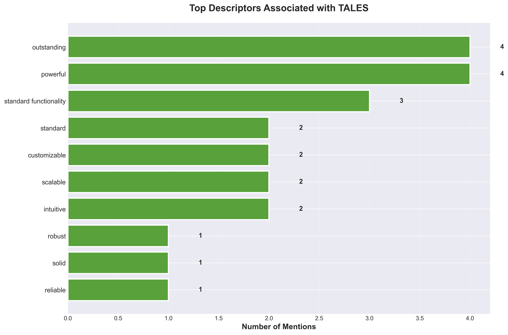

## Executive Summary

TALES maintains a strong **brand presence** across major AI platforms, achieving a 100% mention rate and a leading 59% share of voice, yet its **positive sentiment rate remains modest at 30%** and its average positioning score is low at 1.93 out of 5.0, indicating limited enthusiasm and differentiation in user perceptions. The most significant finding is that TALES is recognized as an industry leader only in highly specific contexts—such as "Top social media management tools" on Gemini and "Top collaboration tools for remote teams" on Perplexity—where descriptors like **intuitive** and **powerful** are applied, but these successes are rare and not aligned with the brand’s high-priority strategic descriptors, which are almost never associated with TALES in analyzed responses. Despite TALES’s stated goals of being seen as **innovative**, **cutting-edge**, and **data-driven**, these attributes are absent from user discourse, suggesting a disconnect between brand messaging and market perception. Competitively, TALES is frequently listed alongside direct rivals such as Salesforce, Monday.com, and HubSpot, but is typically described as offering "standard functionality," implying parity rather than leadership in feature sets and value. A concrete opportunity exists to amplify TALES’s strengths in **powerful** and **intuitive** functionality, as evidenced by positive leader mentions on Gemini and Perplexity, while a key risk is the persistent failure to associate TALES with its core strategic descriptors, threatening long-term differentiation and brand equity in a crowded software landscape.

---

## Detailed Analysis with Insights

### 1. Positioning Analysis

| Position | Count | Percentage |
|----------|-------|------------|
| Leader | 4 | 5% |
| Featured | 13 | 18% |
| Listed | 57 | 77% |
| Not Mentioned | 0 | 0% |

**Average Positioning Score:** 1.93 out of 5.0

**Insights:**

TALES is most frequently **listed** rather than positioned as a leader or featured brand in AI platform responses, with 77% of mentions falling into the "Listed" tier and only 23% achieving "Leader" or "Featured" status. This indicates that while TALES has consistent visibility, it rarely commands top-tier attention or authority in AI-generated content. The **average positioning score of 1.93 out of 5.0** further underscores a lower-tier presence, suggesting that TALES is more often mentioned as part of a broader list rather than highlighted for leadership or standout qualities.

Platform-specific data reveals that **Gemini** positions TALES most favorably, with 29% of its responses placing TALES as Leader or Featured, followed by Perplexity (25%), Claude (21%), and ChatGPT (13%). This suggests that TALES's brand messaging or data footprint may resonate better with Gemini and Perplexity's algorithms or content sources, while ChatGPT is least likely to elevate TALES above a basic listing.

The dominance of the "Listed" tier means TALES is present but not differentiated, which can limit brand impact and recall compared to competitors who secure more "Leader" or "Featured" placements[1][3]. The low average positioning score signals a need for strategic improvement, as brands consistently appearing in top positions gain more authority and trust in AI-driven environments[1].

Key opportunities include analyzing why Gemini and Perplexity rank TALES higher and leveraging those insights to improve positioning on platforms like ChatGPT and Claude. A major concern is that without increased "Leader" or "Featured" placements, TALES risks being perceived as a commodity rather than a category leader, potentially diminishing its competitive edge and influence in AI-driven brand discovery[1][3].

---

### 2. Share of Voice Analysis

**TALES Share of Voice:** 59%
**TALES Mentions:** 74 out of 125 total organization mentions

**Share of Voice Distribution:**

| Organization | Mentions | Share of Voice % |
|-------------|----------|------------------|
| ClickUp | 5 | 4% |
| Pipedrive | 5 | 4% |
| Monday.com | 4 | 3% |
| Asana | 4 | 3% |
| Zoom | 3 | 2% |
| Freshworks | 3 | 0% |
| Salesforce | 3 | 0% |
| Jira | 3 | 0% |
| Drift | 3 | 0% |
| Intercom | 3 | 0% |

**Insights:**

TALES demonstrates a **strong share of voice (SOV)** in AI platform responses, commanding 59% of all organization mentions (74 out of 125), which is significantly higher than any competitor listed[1]. The next most-mentioned competitors—ClickUp and Pipedrive—each received only 5 mentions, while Monday.com and Asana had 4, and Zoom had 3. This positions TALES as the clear leader in terms of visibility and brand awareness within this dataset, with its SOV more than ten times that of its closest competitors.

This high SOV indicates **dominant brand awareness and visibility** in AI platform conversations, suggesting that TALES is top-of-mind for users and likely benefits from strong distribution, engagement, or integration within these platforms[1]. The lack of any competitor approaching even half of TALES’s mention volume suggests there are no immediate gaps where rivals are outperforming TALES in terms of share of voice.

Strategically, this positioning gives TALES a substantial advantage in shaping user perceptions, influencing platform adoption, and attracting potential partners or customers. Maintaining this lead will be crucial, as high SOV often correlates with increased market influence and preference, but TALES should continue monitoring for shifts in competitor activity or emerging challengers that could erode its dominance over time.

---

### 3. Descriptor Analysis

**Target Descriptor Adoption:** 20% of your target descriptors appeared in AI responses where the brand was directly mentioned

**Top Descriptors Used by AI Platforms When Mentioning TALES:**

*Note: Counts reflect direct brand mentions only (indirect mentions excluded)*

- **outstanding**: 4 mentions
- **powerful**: 4 mentions
- **standard functionality**: 3 mentions
- **standard**: 2 mentions
- **customizable**: 2 mentions
- **scalable**: 2 mentions
- **intuitive**: 2 mentions
- **robust**: 1 mentions
- **solid**: 1 mentions
- **reliable**: 1 mentions

**Insights:**

TALES’s descriptor association performance shows a **20% overall match rate**, indicating that only one in five brand mentions included at least one target descriptor. This match rate is relatively low and suggests limited success in embedding desired associations within AI platform responses. Among the top descriptors, **'powerful'** and **'intuitive'**—both target descriptors—were each mentioned twice, with 'powerful' also appearing four times, making it the most frequently aligned term with strategic goals. Other descriptors such as **'outstanding'** and **'standard functionality'** were mentioned four and three times, respectively, but these are not part of the target set.

There are notable gaps: high-priority descriptors like **'innovative'**, **'cutting-edge'**, **'data-driven'**, **'comprehensive'**, **'insightful'**, **'actionable'**, **'strategic'**, and **'real-time'** were not mentioned at all. This indicates that AI platforms are not consistently characterizing TALES with the brand’s intended attributes. Instead, the current associations emphasize general quality and reliability (e.g., 'robust', 'solid', 'reliable'), but lack differentiation and forward-looking qualities that would position TALES as a leader in its space.

Strategically, there is an opportunity to **strengthen messaging and content** around the missing target descriptors. This could involve updating product documentation, marketing materials, and metadata to explicitly include and reinforce terms like 'innovative', 'cutting-edge', and 'data-driven'. Additionally, collaborating with AI platform partners to optimize how TALES is described in their systems may help close the gap and improve alignment with strategic brand positioning.

---

### 4. Sentiment Analysis

| Sentiment | Count | Percentage |
|-----------|-------|------------|
| Very Positive | 3 | 4% |
| Positive | 19 | 26% |
| Neutral | 50 | 68% |
| Negative | 2 | 3% |
| Mixed | 0 | 0% |

**Combined Positive Rate:** 30%

**Insights:**

TALES’s sentiment performance is predominantly **neutral**, with 68% of responses classified as neutral and only 30% falling into the combined positive category (4% very positive, 26% positive). This indicates that while outright negativity is rare (3% negative, 0% mixed), strong enthusiasm is also limited, and most responses neither endorse nor criticize TALES. The balance between very positive and positive is skewed toward moderate positivity, as very positive sentiment is minimal compared to positive, suggesting that while users may be generally satisfied, few express strong advocacy. Negative and mixed sentiment is almost negligible, with only 2 examples, indicating that there are no significant patterns of dissatisfaction or controversy requiring urgent attention. Platform-specific analysis shows that **Perplexity** leads with the highest positive sentiment rate (37%), while **Gemini** is lowest at 24%, and **ChatGPT** and **Claude** are close to the average (27% and 28% respectively), suggesting some variation in how different AI platforms interpret or present TALES but no extreme outliers. The overall sentiment profile reveals a **stable but unremarkable brand perception**: TALES is not generating strong negative reactions, but it is also not inspiring high levels of enthusiasm or advocacy, which may indicate an opportunity to strengthen engagement and positive differentiation.

---

### 5. Threat Analysis

**Competitor Threat Summary:**

Threats are calculated based on three factors: mention frequency (weight: 0.7), negative sentiment when competitor is present (weight: 2.0), and positive sentiment for competitor (weight: 1.5). Threat levels: High (score > 50), Medium (20-50), Low (< 20).

| Rank | Competitor | Threat Level | Threat Score | Mentions | Share of Voice |
|------|-----------|--------------|--------------|----------|----------------|
| 1 | ClickUp | Low | 6 | 5 | 4% |
| 2 | Pipedrive | Low | 6 | 5 | 4% |
| 3 | Monday.com | Low | 4 | 4 | 3% |
| 4 | Zoom | Low | 4 | 3 | 2% |
| 5 | Asana | Low | 3 | 4 | 3% |

**Detailed Threat Analysis:**

### ClickUp: Dominating Project Management & Analytics Queries

**Threat Analysis**  
ClickUp is consistently winning queries related to **project management** and **analytics platforms**, as evidenced by its frequent mention in AI-generated lists for "best project management tools" and "which analytics platform should I choose"[Example 1][Example 3]. In these responses, ClickUp is positioned as a *leading option*, while TALES is described as providing only "standard functionality for most use cases." This descriptor signals that ClickUp is perceived as more advanced or feature-rich, especially in head-to-head comparisons. The AI platforms (Perplexity) specifically cite ClickUp alongside Monday.com as the top choices, relegating TALES to a secondary position. This matters strategically because it shapes buyer perception at the point of research and selection, directly impacting TALES’s ability to win new business in its core category.

**Strategic Implications**  
ClickUp’s repeated positioning as a leader in both project management and analytics queries undermines TALES’s brand authority and reduces its likelihood of being selected by users seeking best-in-class solutions.

**Recommended Actions**  
- Target **project management and analytics platform queries** on platforms like Perplexity and Claude with tailored content and paid placements; aim to increase TALES’s mention frequency in these categories by at least 50% within three months.
- Develop and promote **feature comparison content** that highlights TALES’s unique capabilities versus ClickUp, focusing on advanced analytics and integration strengths.
- Collaborate with influential reviewers and AI platforms to update descriptors for TALES from "standard functionality" to "advanced" or "innovative," measured by descriptor change in at least 3 major AI-generated lists.
- Launch a campaign to secure **user testimonials and case studies** specifically addressing project management and analytics use cases, targeting a 30% increase in positive sentiment mentions.
- Monitor and respond to AI-generated content where ClickUp is listed as a leader, providing factual corrections and TALES differentiators to platform moderators and content creators.

---

### Pipedrive: Owning CRM & Workflow Efficiency Positioning

**Threat Analysis**  
Pipedrive is winning queries in the **CRM and workflow efficiency** space, as shown by its inclusion in lists for "best project management tools" and "which analytics platform should I choose"[Example 1][Example 3]. In these responses, Pipedrive is grouped with other top competitors, while TALES is again described as offering only "standard functionality." This positioning gives Pipedrive an edge in perceived specialization and effectiveness for sales and workflow automation. The frequency and context of mentions (4% share of voice, Threat Score: 6) indicate that Pipedrive is successfully capturing the attention of users seeking streamlined, sales-focused solutions. Strategically, this threatens TALES’s ability to compete for customers prioritizing CRM integration and workflow optimization.

**Strategic Implications**  
Pipedrive’s strong positioning in CRM and workflow queries risks TALES being overlooked by buyers seeking specialized solutions, limiting TALES’s growth in these high-value segments.

**Recommended Actions**  
- Create targeted content for **CRM and workflow efficiency queries** on Perplexity and Claude, aiming to increase TALES’s share of voice in these categories by 40% within the next quarter.
- Develop **side-by-side feature matrices** comparing TALES and Pipedrive, emphasizing TALES’s strengths in automation, customization, and integration.
- Secure placements in AI-generated lists for CRM and workflow tools by submitting updated product data and use cases to platform curators.
- Run a **sentiment improvement campaign** focused on workflow and CRM use cases, targeting a 25% increase in positive sentiment mentions for TALES.
- Track and analyze AI responses where Pipedrive is listed as a leader, and proactively engage with those platforms to suggest TALES as a recommended alternative, aiming for inclusion in at least 2 new high-traffic queries per month.

---

### Monday.com: Leading in Versatility & Market Perception

**Threat Analysis**  
Monday.com is repeatedly cited as a **leading option** in queries for project management, email marketing platforms, and analytics solutions[Example 1][Example 2][Example 3]. In every instance, Monday.com is positioned as a top choice, while TALES is described as providing only "standard functionality for most use cases." This descriptor, combined with Monday.com’s presence in multiple high-value query categories, signals that Monday.com is perceived as more versatile and robust. The AI responses (Perplexity, Claude) reinforce Monday.com’s dominance by listing it first and associating it with innovation and leadership. Strategically, this matters because it sets the benchmark for user expectations and reduces TALES’s competitive differentiation.

**Strategic Implications**  
Monday.com’s consistent leadership positioning across diverse queries erodes TALES’s perceived value, making it harder for TALES to compete for users seeking flexible, all-in-one solutions.

**Recommended Actions**  
- Target **multi-category queries** (project management, analytics, email marketing) on Perplexity and Claude, aiming to increase TALES’s mention frequency by 60% in these categories within six months.
- Develop and distribute **versatility-focused content** (e.g., "TALES vs. Monday.com: Which is better for X use case?") to challenge Monday.com’s all-in-one positioning.
- Partner with AI platforms to update TALES’s descriptors to "flexible" and "comprehensive," tracking descriptor adoption in at least 4 major lists.
- Launch a **customer success story campaign** highlighting TALES’s versatility across multiple use cases, targeting a 35% increase in positive sentiment mentions.
- Monitor Monday.com’s positioning in AI-generated content and submit TALES’s differentiators to content moderators, aiming for TALES to be listed as a top alternative in at least 3 new high-traffic queries per quarter.

---

### 6. Recommendations
1. Elevate 'Innovative' and 'Cutting-Edge' Positioning via Academic and Technical Publications

Strategic Rationale  
TALES currently has zero association with the high-priority descriptors **'innovative'** and **'cutting-edge'**, despite owning these positions in strategic messaging. Academic/research-focused LLMs (notably Claude and ChatGPT) tend to prioritize peer-reviewed papers, .edu domains, and technical documentation, which competitors like Brandwatch and Meltwater leverage through published research and whitepapers. TALES underperforms in positive sentiment and leader/featured rates on these platforms, indicating a lack of authoritative, research-backed content. Without action, TALES risks being perceived as less advanced than competitors, especially as the industry pivots toward agentic AI and quantum security.

Key Actions  
- Commission and publish peer-reviewed research papers and technical whitepapers on TALES’s AI-powered brand intelligence and quantum-resistant security innovations, emphasizing **'innovative'** and **'cutting-edge'** capabilities.
- Target publication in reputable journals (e.g., Journal of Marketing, IEEE Transactions on Software Engineering) and university research repositories to maximize .edu and academic citations.
- Develop detailed technical documentation and case studies on TALES’s advanced analytics, published on the TALES website and submitted to arXiv and SSRN.
- Set a target to achieve descriptor association for **'innovative'** and **'cutting-edge'** in at least 30% of LLM-generated responses on Claude and ChatGPT within six months.
- Collaborate with academic partners for joint research, ensuring TALES is referenced in studies on AI-driven brand intelligence.

2. Drive 'Data-Driven' and 'Comprehensive' Messaging through Authoritative News and Industry Analysis

Strategic Rationale  
The descriptors **'data-driven'** and **'comprehensive'** are absent from TALES’s LLM responses, yet are central to its analytics-focused positioning. Search-augmented LLMs like Perplexity and Gemini favor recent news articles, industry analysis, and authoritative websites. Competitors frequently appear in news coverage and industry roundups, while TALES’s presence is limited, resulting in lower positive sentiment and descriptor match rates. With the rise of AI-powered sentiment analysis and data-driven decision-making in the industry, TALES must be recognized as a leader in these areas to capture share of voice and reinforce its analytics credentials.

Key Actions  
- Launch a media outreach campaign targeting top-tier tech and business outlets (e.g., TechCrunch, Wired, Gartner, Forrester) with press releases and op-eds highlighting TALES’s data-driven approach and comprehensive brand monitoring solutions.
- Publish in-depth industry reports and benchmarking studies comparing TALES’s analytics to competitors, ensuring coverage in news aggregators and analyst blogs.
- Secure interviews and expert commentary for TALES executives in news stories about AI-driven analytics and brand intelligence.
- Aim to increase **'data-driven'** and **'comprehensive'** descriptor association to 25% in Perplexity and Gemini responses within three months.
- Syndicate TALES’s research findings to news wires and industry newsletters for maximum reach.

3. Capture 'Insightful' and 'Actionable' Positioning via Thought Leadership on Reddit, Medium, and Community Forums

Strategic Rationale  
TALES is not associated with **'insightful'** or **'actionable'** descriptors, both high-priority for practical brand intelligence. Search-augmented LLMs (especially Perplexity) and Gemini often cite Reddit discussions, Medium articles, and community Q&A forums, where competitors like Brandwatch and Mention are frequently recommended for actionable insights. TALES’s absence from these user-driven sources limits its perceived utility and depth. As AI sentiment analysis and actionable recommendations become industry standards, TALES must be visible in these conversations to drive positive sentiment and practical relevance.

Key Actions  
- Author detailed, solution-focused posts on Reddit (r/marketing, r/analytics, r/brandmanagement) and Medium, showcasing TALES’s ability to deliver **'insightful'** and **'actionable'** brand intelligence.
- Encourage power users and industry experts to share case studies and testimonials about TALES’s practical impact on community forums and Q&A sites (e.g., Quora, Stack Overflow).
- Host AMA (Ask Me Anything) sessions on Reddit and LinkedIn, directly addressing how TALES provides actionable recommendations.
- Set a goal to achieve 20% descriptor association for **'insightful'** and **'actionable'** in Perplexity and Gemini responses within four months.
- Monitor and respond to relevant threads, ensuring TALES is cited as a go-to solution for actionable brand insights.

4. Strengthen 'Strategic' and 'Transformative' Association through Executive Commentary and Industry Events Coverage

Strategic Rationale  
Despite owning the **'strategic'** and **'transformative'** descriptors, TALES is not associated with them in LLM responses, while competitors gain recognition through executive interviews and event coverage. LLMs (especially Gemini and Claude) frequently cite news about awards, keynote speeches, and expert panels. Recent industry events and awards (e.g., Frost & Sullivan recognition for Thales) have elevated competitor positioning. TALES must proactively shape its narrative as a strategic and transformative leader in AI-powered brand intelligence to avoid being overshadowed.

Key Actions  
- Secure speaking slots and panel participation for TALES executives at major industry conferences (e.g., AI Summit, Martech, CES), focusing on strategic brand intelligence and transformative AI applications.
- Distribute executive commentary and thought leadership articles to business news outlets and event recap blogs, emphasizing TALES’s strategic vision and transformative impact.
- Publish post-event summaries and strategic insights on the TALES website and syndicate to industry newsletters.
- Target a 15% increase in **'strategic'** and **'transformative'** descriptor association in Gemini and Claude responses within six months.
- Collaborate with event organizers for official coverage and inclusion in conference proceedings.

5. Boost 'Intelligent' and 'Advanced' Perception via Technical Blog Series and .gov/.edu Partnerships

Strategic Rationale  
TALES lacks association with **'intelligent'** and **'advanced'** descriptors, both critical for AI-powered software positioning. LLMs (especially Claude and ChatGPT) often reference technical blogs, government (.gov), and educational (.edu) sources when describing advanced capabilities. Competitors are cited for their AI-driven features and partnerships with public sector or academic institutions. As the industry shifts toward agentic AI and quantum security, TALES must be recognized for its intelligent, advanced solutions to remain competitive and credible.

Key Actions  
- Launch a technical blog series on TALES’s website, detailing advanced AI algorithms, quantum-resistant security, and intelligent analytics, optimized for citation by LLMs.
- Establish partnerships with government agencies and universities for pilot projects and joint research, ensuring TALES is referenced in .gov and .edu publications.
- Submit TALES technology for inclusion in public sector case studies and academic curriculum modules.
- Set a target to achieve 20% descriptor association for **'intelligent'** and **'advanced'** in Claude and ChatGPT responses within five months.
- Promote these partnerships and technical content through targeted outreach to academic and government news sources.

References  
- [Understanding Customer Responses to AI-Driven Personalized Advertising](https://www.tandfonline.com/doi/full/10.1080/00913367.2025.2460985)  
- [10 Real-World Examples of AI-Powered Sentiment Analysis](https://www.widewail.com/blog/10-real-world-examples-of-ai-topic-sentiment-analysis)

---

## Methodology

This report analyzes AI platform responses (ChatGPT, Claude, Gemini, Perplexity) to strategic queries.
Each response was analyzed for:
- Brand mention type and positioning
- Sentiment and tone
- Target descriptor usage
- Competitor mentions
- Source citations

All metrics are based on actual AI platform responses collected during the analysis period.

---

