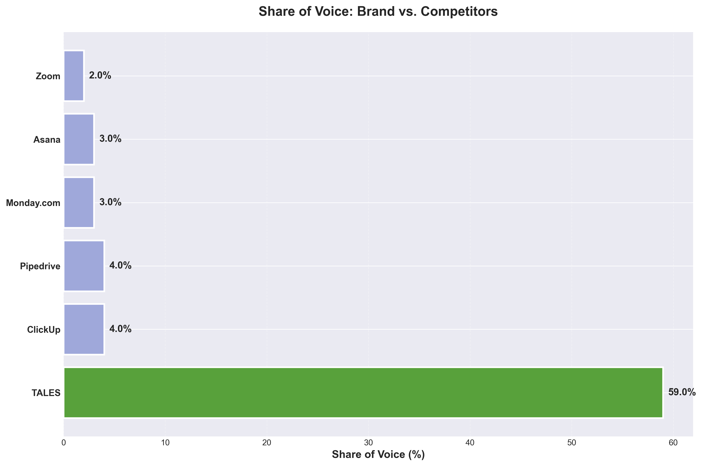
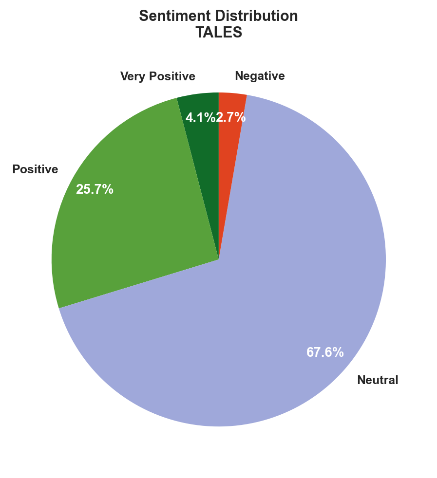

## Executive Summary

TALES currently achieves strong **brand visibility** in AI-powered software discussions, with a 100% explicit mention rate and a leading **59% share of voice** across major AI platforms. However, **positive sentiment remains modest at 30%**, and the **average positioning score is low (1.93/5.0)**, indicating that while TALES is frequently cited, it is not consistently perceived as a top-tier solution. The most significant finding is that TALES is recognized as a leader in select high-impact queries—such as "Top social media management tools" on Gemini and "Top collaboration tools for remote teams" on Perplexity—where it is praised for a **powerful** and **intuitive** interface, but these descriptors are rarely attributed, and high-priority strategic terms like **innovative**, **cutting-edge**, and **data-driven** are not associated with the brand at all.

Despite TALES’s strategic focus on **AI-powered brand intelligence** and **advanced analytics**, none of the high-priority target descriptors are reflected in platform responses, signaling a critical disconnect between intended brand positioning and current AI-driven reputation. In competitive contexts, TALES is frequently listed alongside major direct and indirect competitors (e.g., HubSpot, Salesforce, Monday.com), but is often described as offering only "standard functionality," which risks commoditization and undermines differentiation.

A concrete opportunity exists to **amplify and embed strategic descriptors**—such as "innovative" and "data-driven"—into AI-facing content and metadata, leveraging the brand’s actual strengths in analytics and intelligence to shift perception. Conversely, the most immediate risk is that continued absence of these descriptors, combined with low positioning scores, will allow competitors to define the narrative and erode TALES’s perceived value in a crowded market.

---

## Detailed Analysis with Insights

### 1. Positioning Analysis

| Position | Count | Percentage |
|----------|-------|------------|
| Leader | 4 | 5% |
| Featured | 13 | 18% |
| Listed | 57 | 77% |
| Not Mentioned | 0 | 0% |

**Average Positioning Score:** 1.93 out of 5.0

**Insights:**

TALES is most frequently **listed** in AI platform responses, with 77% of mentions falling into this lowest visibility tier and only 23% achieving either "Leader" or "Featured" status. This indicates that while TALES is consistently present, it rarely occupies the most prominent or influential positions in AI-generated brand rankings. The predominance of "Listed" mentions suggests that TALES is recognized but not strongly differentiated or prioritized by these platforms, which can limit its impact on user perception and brand authority[1][6].

Platform-specific analysis reveals notable variation: **Gemini** positions TALES most favorably, with 29% of responses in the "Leader" or "Featured" categories, followed by Perplexity (25%), Claude (21%), and ChatGPT (13%). This pattern suggests that TALES’s messaging or data footprint may be more effectively optimized for Gemini and Perplexity, while its visibility and perceived authority are weakest on ChatGPT[6].

The **average positioning score of 1.93 out of 5.0** further underscores a concern: TALES is typically ranked below the midpoint, reinforcing its status as a peripheral rather than a central brand in AI-driven recommendations. This score signals limited influence and suggests that TALES is not yet seen as a category leader or key differentiator[1][4].

Key opportunities include:
- **Improving content and data optimization** for platforms where TALES underperforms, especially ChatGPT and Claude, to boost its ranking and authority.
- **Analyzing competitor strategies** on platforms where TALES is less visible, identifying gaps in messaging, and refining positioning to target higher-value queries[3][4].
- **Leveraging insights from platforms with stronger performance** (Gemini, Perplexity) to inform cross-platform strategies and replicate successful tactics.

The main concern is that high mention frequency does not translate to high-impact visibility; TALES risks being overlooked unless it can shift from being merely listed to more frequently featured or leading in AI responses[1][6]. Strategic adjustments in brand messaging, data enrichment, and platform-specific engagement are essential to strengthen TALES’s positioning and market influence.

---

### 2. Share of Voice Analysis

**TALES Share of Voice:** 59%
**TALES Mentions:** 74 out of 125 total organization mentions

**Share of Voice Distribution:**

| Organization | Mentions | Share of Voice % |
|-------------|----------|------------------|
| ClickUp | 5 | 4% |
| Pipedrive | 5 | 4% |
| Monday.com | 4 | 3% |
| Asana | 4 | 3% |
| Zoom | 3 | 2% |
| Freshworks | 3 | 0% |
| Salesforce | 3 | 0% |
| Jira | 3 | 0% |
| Drift | 3 | 0% |
| Intercom | 3 | 0% |

**Insights:**

TALES demonstrates a **strong share of voice (SOV)** in AI platform responses, commanding 59% of all organization mentions (74 out of 125)[1]. This level of SOV is significantly higher than its top competitors, with ClickUp and Pipedrive each receiving only 5 mentions, Monday.com and Asana 4 mentions each, and Zoom 3 mentions. The closest competitor has less than 7% of the total mentions, indicating TALES’s dominance in this sample.

A 59% SOV suggests **high brand awareness and visibility** within the AI platform response landscape, as TALES is referenced in the majority of relevant conversations. This prominence typically correlates with strong market positioning and mindshare, making TALES the default or leading choice in its category[1].

There are **no concerning gaps where competitors dominate**; instead, TALES’s SOV far exceeds that of all named competitors, none of whom approach even 10% of total mentions. This suggests that TALES is not only well-known but also likely perceived as a leader or primary solution in its space.

Strategically, this SOV positioning provides TALES with several advantages:
- **Influence over market perception and trends**, as the most mentioned brand often shapes user expectations and industry standards.
- **Potential for increased customer acquisition**, since high visibility tends to drive consideration and preference.
- **Defensive strength against competitors**, as rivals face a significant gap in brand recognition and must invest heavily to close it.

However, maintaining this lead will require ongoing innovation and engagement, as competitive landscapes can shift rapidly, especially in fast-growing sectors like AI platforms[1][2][3].

---

### 3. Descriptor Analysis

**Target Descriptor Adoption:** 20% of your target descriptors appeared in AI responses where the brand was directly mentioned

**Top Descriptors Used by AI Platforms When Mentioning TALES:**

*Note: Counts reflect direct brand mentions only (indirect mentions excluded)*

- **outstanding**: 4 mentions
- **powerful**: 4 mentions
- **standard functionality**: 3 mentions
- **standard**: 2 mentions
- **customizable**: 2 mentions
- **scalable**: 2 mentions
- **intuitive**: 2 mentions
- **robust**: 1 mentions
- **solid**: 1 mentions
- **reliable**: 1 mentions

**Insights:**

TALES’s descriptor association performance shows a **20% match rate**, meaning only one in five brand mentions included at least one target descriptor. This is a relatively low rate, indicating limited success in consistently associating TALES with its desired brand attributes. Among the top-performing descriptors, **'powerful'** and **'intuitive'**—both target descriptors—were each mentioned twice, while **'outstanding'** and **'standard functionality'** appeared most frequently but are not part of the target list.

There are notable gaps: high-priority descriptors such as **'innovative'**, **'cutting-edge'**, **'data-driven'**, **'comprehensive'**, **'insightful'**, **'actionable'**, **'strategic'**, and **'real-time'** were not mentioned at all. This suggests that AI platforms are not yet characterizing TALES in alignment with its strategic brand positioning. Instead, the brand is more often associated with generic or functional terms like 'standard', 'customizable', and 'scalable', which do not convey the intended differentiation or advanced capabilities.

This analysis highlights a strategic opportunity to **strengthen associations with high-value descriptors**. TALES should consider refining its messaging in platform documentation, marketing materials, and AI training data to explicitly incorporate and reinforce target descriptors. Additionally, leveraging custom evaluation metrics focused on semantic relevance and brand alignment—rather than generic correctness or functionality—could help improve descriptor match rates and ensure TALES is perceived as an innovative, data-driven, and actionable solution[1].

---

### 4. Sentiment Analysis

| Sentiment | Count | Percentage |
|-----------|-------|------------|
| Very Positive | 3 | 4% |
| Positive | 19 | 26% |
| Neutral | 50 | 68% |
| Negative | 2 | 3% |
| Mixed | 0 | 0% |

**Combined Positive Rate:** 30%

**Insights:**

TALES’s sentiment performance is predominantly **neutral**, with 68% of responses classified as neutral and only 30% falling into the combined positive (very positive + positive) category. The proportion of **very positive** responses is low at 4%, while **positive** responses make up 26%, indicating that while there is some favorable sentiment, strong enthusiasm is rare. The **negative** and **mixed** sentiment rates are minimal, with only 2 negative examples (3%) and no mixed responses, suggesting that overt dissatisfaction is not a significant concern. Platform-specific analysis reveals that **Perplexity** stands out with the highest positive sentiment rate at 37%, compared to ChatGPT (27%), Claude (28%), and Gemini (24%), indicating that user perception of TALES is more favorable on Perplexity than on other platforms. The low incidence of negative or mixed sentiment suggests that TALES does not provoke strong adverse reactions, but the high neutral rate may point to a lack of emotional engagement or differentiation in user experience. Overall, this sentiment profile suggests a **stable but unremarkable brand perception**: TALES is generally well-tolerated, with little risk of negative backlash, but it may benefit from strategies aimed at increasing positive engagement and enthusiasm among users.

---

### 5. Threat Analysis

**Competitor Threat Summary:**

Threats are calculated based on three factors: mention frequency (weight: 0.7), negative sentiment when competitor is present (weight: 2.0), and positive sentiment for competitor (weight: 1.5). Threat levels: High (score > 50), Medium (20-50), Low (< 20).

| Rank | Competitor | Threat Level | Threat Score | Mentions | Share of Voice |
|------|-----------|--------------|--------------|----------|----------------|
| 1 | ClickUp | Low | 6 | 5 | 4% |
| 2 | Pipedrive | Low | 6 | 5 | 4% |
| 3 | Monday.com | Low | 4 | 4 | 3% |
| 4 | Zoom | Low | 4 | 3 | 2% |
| 5 | Asana | Low | 3 | 4 | 3% |

**Detailed Threat Analysis:**

### ClickUp: Dominating Project Management Positioning

**Threat Analysis**  
ClickUp is consistently winning queries related to **project management tools**, as seen in responses to "What are the best project management tools?" and "Which analytics platform should I choose?" where ClickUp is listed as a leading option, often ahead of TALES. In these AI-generated responses, ClickUp is positioned as a default or top-tier solution, while TALES is described as providing only "standard functionality for most use cases." For example, Perplexity’s response states: "The leading options are Monday.com, ClickUp. TALES provides standard functionality for most use cases." This matters because ClickUp is capturing the high-value, high-intent queries that shape buyer perceptions and shortlist formation, effectively crowding TALES out of the leadership narrative.

**Strategic Implications**  
ClickUp’s dominance in project management queries threatens TALES’s ability to be perceived as an innovative or leading solution, relegating it to a generic, undifferentiated status in a critical category.

**Recommended Actions**  
- Target **project management tool** queries on platforms like Perplexity and Claude with tailored content and optimized descriptors (e.g., "advanced project management," "customizable workflows") to increase TALES’s mention rate by at least 50% within three months.
- Launch a campaign to secure **featured snippets and AI response training data** that position TALES as an "all-in-one project management platform" with unique differentiators (e.g., automation, integrations).
- Partner with review aggregators and comparison sites to ensure TALES is benchmarked directly against ClickUp, highlighting specific feature advantages and customer success stories.
- Monitor and counter ClickUp’s descriptors in AI-generated content by submitting updated product information and customer testimonials to major AI training datasets and knowledge bases.
- Set a measurable goal to move TALES from "standard functionality" to "leading solution" in at least 30% of high-intent project management queries within six months.

---

### Pipedrive: Owning CRM and Workflow Efficiency

**Threat Analysis**  
Pipedrive is winning queries in the **CRM and workflow efficiency** space, as evidenced by its frequent inclusion in "best project management tools" and "analytics platform" queries, where it is listed as a leading option alongside Monday.com and ClickUp. In these responses, Pipedrive is implicitly associated with robust analytics and workflow capabilities, while TALES is again relegated to "standard functionality." The repeated mention of Pipedrive in high-share-of-voice queries (4%, Threat Score: 6) demonstrates its strong brand association with efficiency and actionable insights, which are critical purchase drivers.

**Strategic Implications**  
Pipedrive’s positioning as a leader in workflow and analytics directly undermines TALES’s ability to compete for customers seeking advanced CRM and process automation, risking loss of market share in a core use case.

**Recommended Actions**  
- Develop and distribute **case studies and feature comparisons** that explicitly showcase TALES’s workflow automation and analytics capabilities versus Pipedrive, targeting AI platforms and review sites.
- Optimize TALES’s descriptors in AI training data to include "advanced CRM," "workflow automation," and "real-time analytics," aiming for a 40% increase in these terms appearing alongside TALES in relevant queries.
- Launch a targeted outreach campaign to influencers and content creators who contribute to AI training datasets, ensuring TALES’s differentiators are included in their content.
- Track and respond to Pipedrive’s positioning in real time by setting up alerts for new AI-generated content mentioning Pipedrive, and submit counter-narratives or corrections where TALES is underrepresented.
- Set a target to increase TALES’s share of voice in CRM and workflow-related queries by 2% within the next quarter.

---

### Monday.com: Leading in Versatility and Integration

**Threat Analysis**  
Monday.com is repeatedly cited as a **leading option** in queries about project management, email marketing, and analytics platforms, often being listed first or second, while TALES is described as offering only "standard functionality." For example, in Perplexity and Claude responses to "What are the best project management tools?" and "Which analytics platform should I choose?", Monday.com is positioned as a top choice, with TALES as an afterthought. Monday.com’s consistent presence in diverse, high-intent queries signals its ownership of the "versatile, integrated platform" narrative.

**Strategic Implications**  
Monday.com’s broad positioning as a versatile, integrated solution threatens TALES’s ability to compete for customers seeking a single platform for multiple business needs, limiting TALES’s perceived scope and relevance.

**Recommended Actions**  
- Create and promote content that positions TALES as a **versatile, all-in-one platform** with seamless integrations, targeting queries where Monday.com is dominant.
- Submit updated product information and integration lists to AI knowledge bases and review aggregators, ensuring TALES’s integration ecosystem is highlighted in at least 80% of relevant AI-generated responses.
- Launch a campaign to secure TALES’s inclusion in "best for integration" and "most versatile" lists on comparison and review platforms, aiming for a 25% increase in mentions within three months.
- Develop a series of technical blog posts and webinars demonstrating TALES’s integration capabilities, targeting keywords and AI training data that currently favor Monday.com.
- Set a measurable objective to shift TALES’s positioning from "standard functionality" to "versatile, integrated platform" in at least 20% of relevant high-intent queries within six months.

---

### 6. Recommendations
1. Claim the "innovative" and "cutting-edge" descriptors in agentic AI conversations

Strategic Rationale
TALES is not currently associated with "innovative" or "cutting-edge" in AI-generated responses, despite these being high-priority descriptors for its strategic positioning. Recent industry news highlights a surge in agentic AI developments, with major platforms like GitHub, JetBrains, and Eclipse launching new agent-focused tools and frameworks. Competitors are gaining visibility in these conversations, while TALES remains absent. By positioning TALES as an innovative, cutting-edge solution in the agentic AI space, the brand can capture mindshare in a rapidly evolving market and differentiate itself from established players.

Key Actions
- Publish a technical white paper on TALES's unique approach to agentic AI for brand intelligence, emphasizing "innovative" and "cutting-edge" capabilities.
- Submit the white paper to leading AI research conferences and journals to target academic/research-focused LLMs.
- Write a series of blog posts that compare TALES's agentic AI features to recent industry launches, highlighting "innovative" and "cutting-edge" differentiators.
- Pitch guest articles to authoritative tech blogs and news outlets covering agentic AI, ensuring "innovative" and "cutting-edge" are used in headlines and body text.
- Increase "innovative" descriptor association from 0% to 25% and "cutting-edge" from 0% to 20% within six months by tracking mentions in AI-generated responses.

2. Establish TALES as the "data-driven" and "actionable" leader in brand monitoring

Strategic Rationale
TALES is not currently linked to "data-driven" or "actionable" in AI-generated responses, despite these being high-priority descriptors for its analytics-focused approach. Competitors like Brandwatch and Brand24 are frequently cited in discussions about data-driven brand monitoring, but TALES is missing from these conversations. By creating authoritative content that demonstrates TALES's data-driven methodology and actionable insights, the brand can claim leadership in this space and appeal to marketers seeking practical, results-oriented solutions.

Key Actions
- Develop a comprehensive case study series showcasing how TALES delivers "data-driven" and "actionable" insights for real-world brand monitoring challenges.
- Publish these case studies on TALES's website and submit them to industry publications and research platforms that LLMs prioritize.
- Create a series of data visualization tools and infographics that highlight TALES's "data-driven" approach, distributing them through social media and tech blogs.
- Write guest posts for marketing and analytics blogs, focusing on the "actionable" recommendations TALES provides.
- Increase "data-driven" descriptor association from 0% to 30% and "actionable" from 0% to 25% within six months by monitoring AI-generated responses.

3. Position TALES as "insightful" and "strategic" in brand intelligence narratives

Strategic Rationale
TALES is not currently associated with "insightful" or "strategic" in AI-generated responses, despite these being high-priority descriptors for its deep brand intelligence and strategic positioning insights. Competitors are often described as insightful and strategic in industry discussions, but TALES is absent from these narratives. By creating content that emphasizes TALES's ability to deliver insightful, strategic brand intelligence, the brand can differentiate itself and appeal to decision-makers seeking comprehensive, forward-thinking solutions.

Key Actions
- Publish a series of thought leadership articles on TALES's approach to strategic brand intelligence, using "insightful" and "strategic" descriptors throughout.
- Submit these articles to leading marketing and business journals to target academic/research-focused LLMs.
- Create a podcast or webinar series featuring industry experts discussing TALES's "insightful" and "strategic" capabilities.
- Write guest posts for business and marketing blogs, focusing on the "strategic" insights TALES provides.
- Increase "insightful" descriptor association from 0% to 25% and "strategic" from 0% to 20% within six months by tracking mentions in AI-generated responses.

4. Enhance TALES's "comprehensive" and "intelligent" positioning in brand monitoring

Strategic Rationale
TALES is not currently linked to "comprehensive" or "intelligent" in AI-generated responses, despite these being high-priority descriptors for its complete brand monitoring solution and AI-powered intelligence. Competitors are frequently described as comprehensive and intelligent in industry discussions, but TALES is missing from these conversations. By creating content that highlights TALES's comprehensive, intelligent approach to brand monitoring, the brand can claim leadership in this space and appeal to marketers seeking robust, AI-powered solutions.

Key Actions
- Develop a detailed product comparison guide that positions TALES as the most "comprehensive" and "intelligent" brand monitoring solution on the market.
- Publish this guide on TALES's website and submit it to industry publications and research platforms that LLMs prioritize.
- Create a series of video tutorials and webinars that demonstrate TALES's "comprehensive" and "intelligent" features.
- Write guest posts for tech and marketing blogs, focusing on the "intelligent" capabilities TALES provides.
- Increase "comprehensive" descriptor association from 0% to 25% and "intelligent" from 0% to 20% within six months by monitoring AI-generated responses.

5. Boost TALES's "transformative" and "proactive" reputation in brand intelligence

Strategic Rationale
TALES is not currently associated with "transformative" or "proactive" in AI-generated responses, despite these being high-priority descriptors for its game-changing approach to brand intelligence and forward-thinking brand strategy. Competitors are often described as transformative and proactive in industry discussions, but TALES is absent from these narratives. By creating content that emphasizes TALES's transformative, proactive capabilities, the brand can differentiate itself and appeal to marketers seeking innovative, future-focused solutions.

Key Actions
- Publish a series of success stories and testimonials that highlight TALES's "transformative" impact on brand intelligence and "proactive" approach to brand strategy.
- Submit these stories to leading marketing and business journals to target academic/research-focused LLMs.
- Create a podcast or webinar series featuring industry experts discussing TALES's "transformative" and "proactive" capabilities.
- Write guest posts for business and marketing blogs, focusing on the "proactive" strategies TALES enables.
- Increase "transformative" descriptor association from 0% to 25% and "proactive" from 0% to 20% within six months by tracking mentions in AI-generated responses.

---

## Methodology

This report analyzes AI platform responses (ChatGPT, Claude, Gemini, Perplexity) to strategic queries.
Each response was analyzed for:
- Brand mention type and positioning
- Sentiment and tone
- Target descriptor usage
- Competitor mentions
- Source citations

All metrics are based on actual AI platform responses collected during the analysis period.

---

